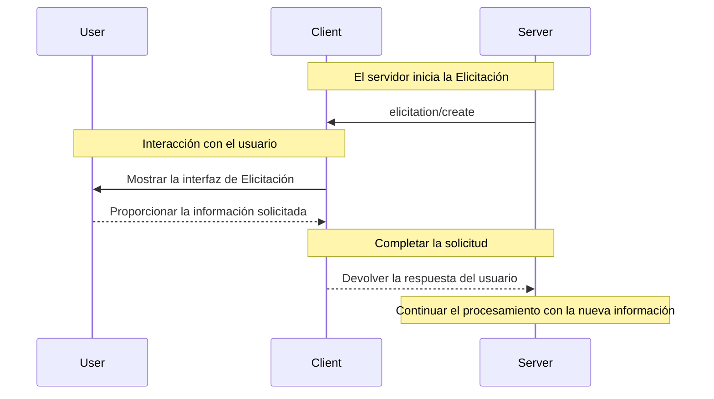

La elicitación es una potente función de MCP que permite a los servidores solicitar información adicional a los usuarios durante las interacciones. Esto habilita flujos de trabajo dinámicos, en los que los servidores pueden recopilar los datos necesarios bajo demanda, manteniendo el control y la privacidad del usuario.

<Info>
  La elicitación se introdujo recientemente en la especificación de MCP [revisión
  2025-06-18](/es/specification/2025-06-18/client/elicitation).
</Info>

<div id="what-is-elicitation">
  ## ¿Qué es la Elicitación?
</div>

La Elicitación proporciona una forma estandarizada para que los Servidores MCP soliciten información estructurada a los usuarios a través del Cliente MCP. En lugar de requerir toda la información por adelantado, los servidores pueden pedir datos específicos justo cuando se necesitan, lo que permite interacciones más naturales y flexibles.

Por ejemplo, un servidor podría:

* Solicitar un nombre de usuario al conectarse a un servicio
* Pedir preferencias de configuración durante la puesta en marcha
* Recopilar detalles del proyecto al crear nuevos recursos

<div id="how-elicitation-works">
  ## Cómo funciona la Elicitación
</div>

El flujo de elicitación es sencillo:

1. El servidor envía una solicitud de elicitación con un mensaje y la estructura de datos esperada
2. El Cliente MCP presenta la solicitud al usuario con una interfaz adecuada
3. El usuario acepta, rechaza o cancela la solicitud
4. El Cliente MCP valida y devuelve la respuesta al servidor
5. El servidor continúa el procesamiento con la información proporcionada

<div id="request-structure">
  ## Estructura de la solicitud
</div>

Las solicitudes de Elicitación incluyen dos componentes clave:

<div id="message">
  ### Mensaje
</div>

Una explicación clara y comprensible para las personas sobre qué información se necesita y por qué.

<div id="schema">
  ### Esquema
</div>

Un esquema JSON que define la estructura esperada de la respuesta. El esquema se limita intencionalmente a objetos planos con tipos primitivos para simplificar la implementación del cliente.

Ejemplo de solicitud:

```json
{
  "message": "Please provide your GitHub username",
  "requestedSchema": {
    "type": "object",
    "properties": {
      "username": {
        "type": "string",
        "title": "GitHub Username",
        "description": "Your GitHub username (e.g., octocat)"
      }
    },
    "required": ["username"]
  }
}
```

<div id="supported-data-types">
  ## Tipos de datos compatibles
</div>

La Elicitación admite estos tipos primitivos:

<div id="text-input">
  ### Entrada de texto
</div>

```json
{
  "type": "string",
  "title": "Nombre del proyecto",
  "description": "Nombre para tu nuevo proyecto",
  "minLength": 3,
  "maxLength": 50,
  "default": "mi-proyecto"
}
```

<div id="numbers">
  ### Números
</div>

```json
{
  "type": "number",
  "title": "Número de puerto",
  "description": "Puerto en el que se ejecutará el servidor",
  "minimum": 1024,
  "maximum": 65535,
  "default": 3000
}
```

<div id="boolean-choices">
  ### Opciones booleanas
</div>

```json
{
  "type": "boolean",
  "title": "Habilitar analítica",
  "description": "Enviar estadísticas de uso anónimas",
  "default": false
}
```

<div id="selection-lists">
  ### Listas de selección
</div>

```json
{
  "type": "string",
  "title": "Environment",
  "enum": ["development", "staging", "production"],
  "enumNames": ["Development", "Staging", "Production"],
  "default": "development"
}
```

<div id="user-response-actions">
  ## Acciones de respuesta del usuario
</div>

Los usuarios pueden responder a solicitudes de Elicitación de tres maneras:

1. **Aceptar**: El usuario proporciona la información solicitada
2. **Rechazar**: El usuario se niega explícitamente a proporcionar información
3. **Cancelar**: El usuario descarta la solicitud sin tomar una decisión (p. ej., cierra el cuadro de diálogo)

Los servidores deben manejar cada respuesta de manera adecuada:

* Aceptar → Procesar los datos proporcionados
* Rechazar → Ofrecer alternativas o ajustar el flujo de trabajo
* Cancelar → Considerar reintentar más tarde o usar valores predeterminados

<div id="best-practices">
  ## Mejores prácticas
</div>

Al implementar la Elicitación:

<div id="for-servers">
  ### Para servidores
</div>

1. **Sé claro**: Escribe mensajes descriptivos que expliquen por qué se necesita la información
2. **Sé minimalista**: Solicita solo la información esencial
3. **Sé flexible**: Prevé alternativas para solicitudes rechazadas o canceladas
4. **Sé oportuno**: Solicita la información cuando realmente se necesite, no de forma preventiva
5. **Sé respetuoso**: Nunca solicites información sensible como contraseñas o tokens

<div id="for-clients">
  ### Para clientes
</div>

1. **Sea transparente**: Muestre claramente qué servidor solicita información
2. **Sea protector**: Permita que los usuarios revisen y modifiquen las respuestas
3. **Sea riguroso**: Verifique las respuestas según el esquema proporcionado
4. **Empodere al usuario**: Haga que las opciones de rechazar y cancelar sean destacadas
5. **Aplique límites**: Implemente limitación de tasa para prevenir spam

<div id="common-use-cases">
  ## Casos de uso comunes
</div>

La Elicitación destaca en escenarios como:

* **Configuración inicial**: Recopilar la configuración durante la primera configuración
* **Flujos de trabajo dinámicos**: Solicitar información específica del contexto
* **Preferencias del usuario**: Recopilar ajustes y preferencias opcionales
* **Detalles del proyecto**: Recopilar metadatos sobre los recursos que se están creando
* **Integración de servicios**: Solicitar nombres de usuario o identificadores para servicios externos

<div id="example-workflow">
  ## Flujo de trabajo de ejemplo
</div>

Esta es una interacción típica de Elicitación:



<div id="security-considerations">
  ## Consideraciones de seguridad
</div>

<Warning>
  Los servidores nunca deben usar la Elicitación para solicitar contraseñas, claves de API, tokens u
  otras credenciales confidenciales. Utilice en su lugar flujos de autenticación adecuados.
</Warning>

Pautas clave de seguridad:

1. Los servidores solo deben solicitar información no confidencial
2. Los clientes deben indicar claramente qué servidor está solicitando los datos
3. Los usuarios siempre deben tener la opción de rechazar
4. Las respuestas deben validarse conforme al esquema
5. El limitador de velocidad debe prevenir la avalancha de solicitudes

<div id="implementation-example">
  ## Ejemplo de implementación
</div>

Así es como un servidor podría usar la Elicitación para recopilar información del proyecto:

```typescript
// El servidor solicita detalles del proyecto
const response = await client.request("elicitation/create", {
  message: "Configuremos tu nuevo proyecto",
  requestedSchema: {
    type: "object",
    properties: {
      name: {
        type: "string",
        title: "Nombre del proyecto",
        description: "Un nombre descriptivo para tu proyecto",
      },
      framework: {
        type: "string",
        title: "Framework",
        enum: ["react", "vue", "angular", "none"],
        enumNames: ["React", "Vue", "Angular", "Ninguno"],
      },
      useTypeScript: {
        type: "boolean",
        title: "Usar TypeScript",
        default: true,
      },
      port: {
        type: "number",
        title: "Puerto de desarrollo",
        description: "Número de puerto para el servidor de desarrollo",
        default: 3000,
      },
    },
    required: ["name", "framework"],
  },
});

// Manejar la respuesta
if (response.action === "accept") {
  // Crear el proyecto con los detalles proporcionados
  await createProject(response.content);
} else if (response.action === "decline") {
  // Usar valores predeterminados u ofrecer alternativas
  await createDefaultProject();
} else {
  // El usuario canceló: quizá intenta más tarde
  console.log("Creación del proyecto cancelada");
}
```

Este enfoque ofrece una experiencia fluida e interactiva, respetando el control y la privacidad del usuario.