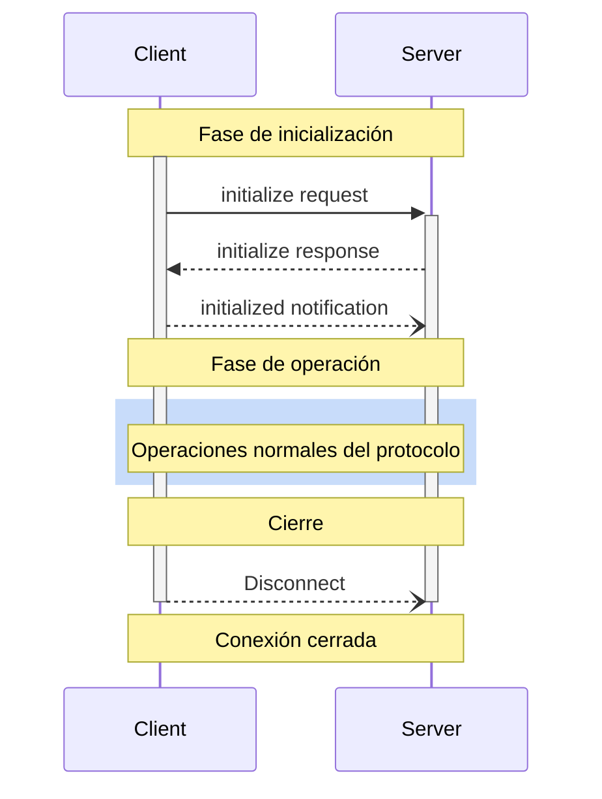

<Info>**Revisión del protocolo**: 2024-11-05</Info>

El Protocolo de Contexto de Modelo (MCP) define un ciclo de vida riguroso para las conexiones cliente-servidor que garantiza una negociación adecuada de capacidades y una gestión correcta del estado.

1. **Inicialización**: Negociación de capacidades y acuerdo sobre la versión del protocolo
2. **Operación**: Comunicación normal del protocolo
3. **Cierre**: Terminación ordenada de la conexión



<div id="lifecycle-phases">
  ## Fases del ciclo de vida
</div>

<div id="initialization">
  ### Inicialización
</div>

La fase de inicialización **DEBE** ser la primera interacción entre el cliente y el servidor.
Durante esta fase, el cliente y el servidor:

* Establecen la compatibilidad de la versión del protocolo
* Intercambian y negocian capacidades
* Comparten detalles de implementación

El cliente **DEBE** iniciar esta fase enviando una solicitud `initialize` que incluya:

* Versión de protocolo admitida
* Capacidades del cliente
* Información de la implementación del cliente

```json
{
  "jsonrpc": "2.0",
  "id": 1,
  "method": "initialize",
  "params": {
    "protocolVersion": "2024-11-05",
    "capabilities": {
      "roots": {
        "listChanged": true
      },
      "sampling": {}
    },
    "clientInfo": {
      "name": "ExampleClient",
      "version": "1.0.0"
    }
  }
}
```

El servidor **DEBE** responder con sus propias capacidades e información:

```json
{
  "jsonrpc": "2.0",
  "id": 1,
  "result": {
    "protocolVersion": "2024-11-05",
    "capabilities": {
      "logging": {},
      "prompts": {
        "listChanged": true
      },
      "resources": {
        "subscribe": true,
        "listChanged": true
      },
      "tools": {
        "listChanged": true
      }
    },
    "serverInfo": {
      "name": "ExampleServer",
      "version": "1.0.0"
    }
  }
}
```

Tras una inicialización exitosa, el cliente **DEBE** enviar una notificación `initialized`
para indicar que está listo para comenzar las operaciones normales:

```json
{
  "jsonrpc": "2.0",
  "method": "notifications/initialized"
}
```

* El cliente **NO DEBERÍA** enviar solicitudes distintas de
  [pings](/es/specification/2024-11-05/basic/utilities/ping) antes de que el servidor
  haya respondido a la solicitud `initialize`.
* El servidor **NO DEBERÍA** enviar solicitudes distintas de
  [pings](/es/specification/2024-11-05/basic/utilities/ping) y
  [logging](/es/specification/2024-11-05/server/utilities/logging) antes de
  recibir la notificación `initialized`.

<div id="version-negotiation">
  #### Negociación de versión
</div>

En la solicitud `initialize`, el cliente **DEBE** enviar una versión del protocolo que sea compatible.
Esta **DEBERÍA** ser la versión *más reciente* compatible con el cliente.

Si el servidor es compatible con la versión de protocolo solicitada, **DEBE** responder con la misma
versión. De lo contrario, el servidor **DEBE** responder con otra versión del protocolo que
admita. Esta **DEBERÍA** ser la versión *más reciente* compatible con el servidor.

Si el cliente no es compatible con la versión indicada en la respuesta del servidor, **DEBERÍA**
desconectarse.

<div id="capability-negotiation">
  #### Negociación de capacidades
</div>

Las capacidades del cliente y del servidor determinan qué funciones opcionales del protocolo estarán disponibles durante la sesión.

Las capacidades clave incluyen:

| Categoría | Capacidad     | Descripción                                                                          |
| --------- | -------------- | ------------------------------------------------------------------------------------ |
| Cliente   | `roots`        | Capacidad de proporcionar [Raíces](/es/specification/2024-11-05/client/roots) del sistema de archivos |
| Cliente   | `sampling`     | Compatibilidad con solicitudes de [Muestreo](/es/specification/2024-11-05/client/sampling) de LLM |
| Cliente   | `experimental` | Describe la compatibilidad con funciones experimentales no estándar                 |
| Servidor  | `prompts`      | Ofrece [plantillas de Indicaciones](/es/specification/2024-11-05/server/prompts)       |
| Servidor  | `resources`    | Proporciona [Recursos](/es/specification/2024-11-05/server/resources) legibles         |
| Servidor  | `tools`        | Expone [Herramientas](/es/specification/2024-11-05/server/tools) invocables            |
| Servidor  | `logging`      | Emite [mensajes estructurados de registro](/es/specification/2024-11-05/server/utilities/logging) |
| Servidor  | `experimental` | Describe la compatibilidad con funciones experimentales no estándar                 |

Los objetos de capacidad pueden describir subcapacidades como:

* `listChanged`: Compatibilidad con notificaciones de cambios en listas (para Indicaciones, Recursos y Herramientas)
* `subscribe`: Compatibilidad con suscripción a cambios de elementos individuales (solo Recursos)

<div id="operation">
  ### Operación
</div>

Durante la fase de operación, el cliente y el servidor intercambian mensajes conforme a las
capacidades acordadas.

Ambas partes **DEBERÍAN**:

* Respetar la versión de protocolo acordada
* Usar únicamente las capacidades que se hayan negociado correctamente

<div id="shutdown">
  ### Apagado
</div>

Durante la fase de apagado, una de las partes (generalmente el cliente) finaliza de forma limpia la conexión del protocolo. No se definen mensajes de apagado específicos; en su lugar, se debe usar el mecanismo de transporte subyacente para indicar la finalización de la conexión:

<div id="stdio">
  #### stdio
</div>

Para el [transporte](/es/specification/2024-11-05/basic/transports) stdio, el
cliente **DEBERÍA** iniciar el apagado de la siguiente manera:

1. Primero, cerrando el flujo de entrada al proceso hijo (el servidor)
2. Esperando a que el servidor finalice o enviando `SIGTERM` si el servidor no finaliza
   dentro de un tiempo razonable
3. Enviando `SIGKILL` si el servidor no finaliza dentro de un tiempo razonable después de `SIGTERM`

El servidor **PUEDE** iniciar el apagado cerrando su flujo de salida hacia el cliente y
terminando su ejecución.

<div id="http">
  #### HTTP
</div>

Para los [transportes](/es/specification/2024-11-05/basic/transports) HTTP, la finalización
se indica cerrando las conexiones HTTP asociadas.
---MDX_CONTENTEND---

<div id="error-handling">
  ## Manejo de errores
</div>

Las implementaciones **DEBERÍAN** estar preparadas para manejar estos casos de error:

* Desfase de versión del protocolo
* Fallo al negociar las capacidades requeridas
* Tiempo de espera de la solicitud de inicialización
* Tiempo de espera de apagado

Las implementaciones **DEBERÍAN** configurar tiempos de espera apropiados para todas las solicitudes, para evitar
conexiones bloqueadas y agotamiento de recursos.

Ejemplo de error de inicialización:

```json
{
  "jsonrpc": "2.0",
  "id": 1,
  "error": {
    "code": -32602,
    "message": "Unsupported protocol version",
    "data": {
      "supported": ["2024-11-05"],
      "requested": "1.0.0"
    }
  }
}
```