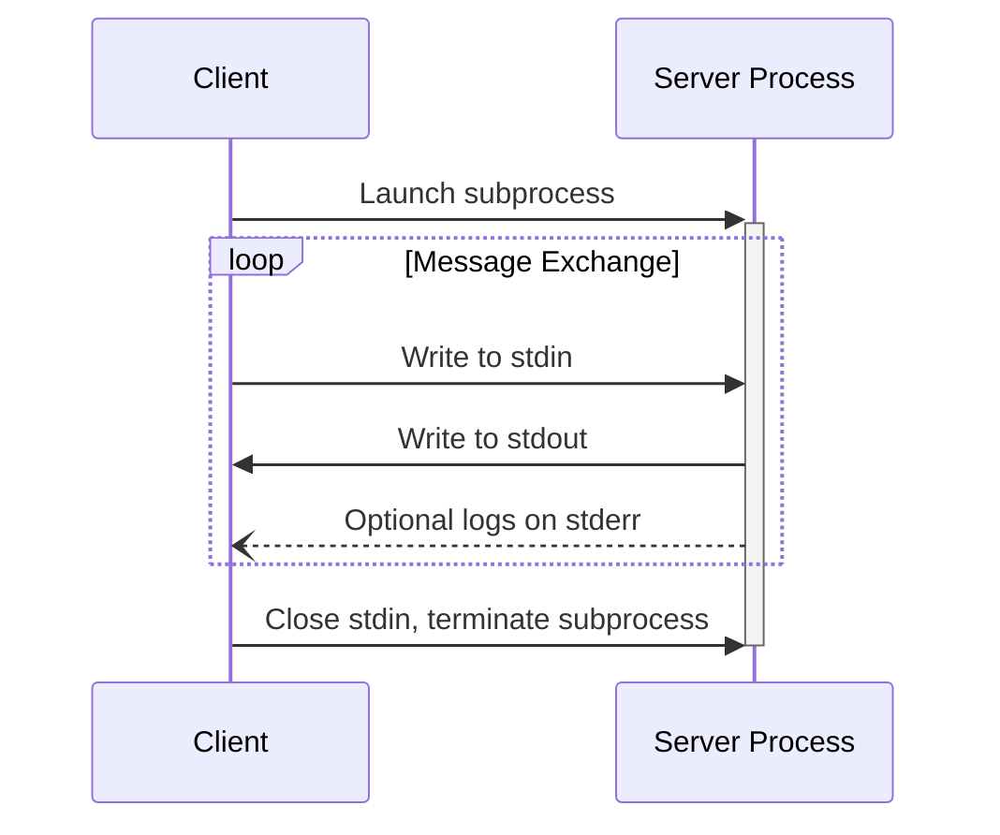
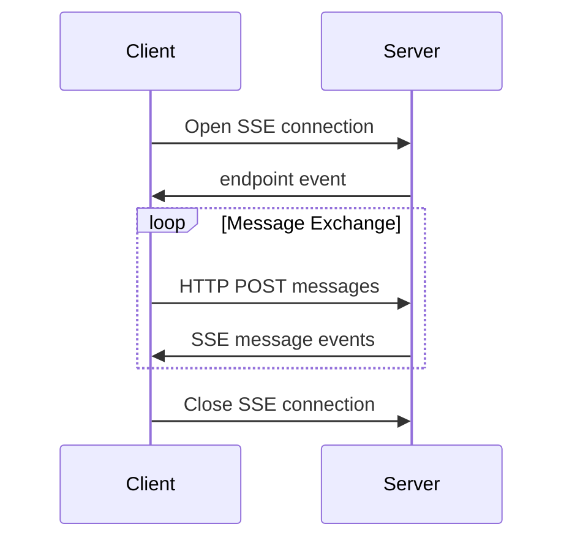

<Info>**Revisión del protocolo**: 2024-11-05</Info>

MCP define actualmente dos mecanismos de transporte estándar para la comunicación cliente-servidor:

1. [stdio](#stdio), comunicación a través de la entrada y salida estándar
2. [HTTP con eventos enviados por el servidor](#http-with-sse) (SSE)

Los clientes **DEBERÍAN** admitir stdio siempre que sea posible.

También es posible que clientes y servidores implementen
[transportes personalizados](#custom-transports) de forma modular.

  ## stdio

En el transporte **stdio**:

- El cliente inicia el Servidor MCP como un subproceso.
- El servidor recibe mensajes JSON-RPC en su entrada estándar (`stdin`) y escribe
  las respuestas en su salida estándar (`stdout`).
- Los mensajes están delimitados por saltos de línea y **NO DEBEN** contener saltos de línea incrustados.
- El servidor **PUEDE** escribir cadenas UTF-8 en su error estándar (`stderr`) con fines de
  registro. Los clientes **PUEDEN** capturar, reenviar o ignorar estos registros.
- El servidor **NO DEBE** escribir nada en `stdout` que no sea un mensaje MCP válido.
- El cliente **NO DEBE** escribir nada en el `stdin` del servidor que no sea un mensaje MCP
  válido.

  ## HTTP con SSE

En el transporte **SSE**, el servidor funciona como un proceso independiente que puede gestionar
múltiples conexiones de clientes.

  #### Advertencia de seguridad

Al implementar HTTP con transporte SSE:

1. Los servidores **DEBEN** validar el encabezado `Origin` en todas las conexiones entrantes para prevenir ataques de DNS rebinding.
2. Al ejecutarse localmente, los servidores **DEBERÍAN** vincularse solo a localhost (127.0.0.1) en lugar de a todas las interfaces de red (0.0.0.0).
3. Los servidores **DEBERÍAN** implementar una autenticación adecuada para todas las conexiones.

Sin estas protecciones, atacantes podrían usar DNS rebinding para interactuar con servidores MCP locales desde sitios web remotos.

El servidor **DEBE** proporcionar dos endpoints:

1. Un endpoint SSE, para que los clientes establezcan una conexión y reciban mensajes del
   servidor.
2. Un endpoint HTTP POST normal para que los clientes envíen mensajes al servidor.

Cuando un cliente se conecta, el servidor **DEBE** enviar un evento `endpoint` que contenga un URI para
que el cliente lo use al enviar mensajes. Todos los mensajes posteriores del cliente **DEBEN** enviarse
como solicitudes HTTP POST a este endpoint.

Los mensajes del servidor se envían como eventos `message` de SSE, con el contenido del mensaje codificado como
JSON en los datos del evento.

  ## Transportes personalizados

Los clientes y los servidores **PUEDEN** implementar mecanismos de transporte personalizados adicionales para satisfacer sus necesidades específicas. El protocolo es independiente del transporte y puede implementarse sobre cualquier canal de comunicación que admita el intercambio bidireccional de mensajes.

Quienes decidan admitir transportes personalizados **DEBEN** asegurarse de preservar el formato de mensajes y los requisitos del ciclo de vida de JSON-RPC 2.0 definidos por el Protocolo de Contexto de Modelo (MCP). Los transportes personalizados **DEBERÍAN** documentar sus patrones específicos de establecimiento de conexión e intercambio de mensajes para favorecer la interoperabilidad.