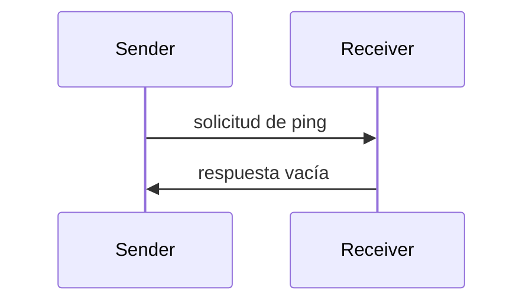

<Info>**Revisión del protocolo**: 2024-11-05</Info>

El Protocolo de Contexto del Modelo incluye un mecanismo de ping opcional que permite a cualquiera de las partes verificar que su contraparte sigue siendo receptiva y que la conexión está activa.

<div id="overview">
  ## Descripción general
</div>

La funcionalidad de ping se implementa mediante un patrón simple de petición-respuesta. Tanto el cliente como el servidor pueden iniciar un ping enviando una solicitud `ping`.

<div id="message-format">
  ## Formato del mensaje
</div>

Una solicitud de ping es una solicitud estándar de JSON-RPC sin parámetros:

```json
{
  "jsonrpc": "2.0",
  "id": "123",
  "method": "ping"
}
```

<div id="behavior-requirements">
  ## Requisitos de comportamiento
</div>

1. El receptor **DEBE** responder de inmediato con una respuesta vacía:

```json
{
  "jsonrpc": "2.0",
  "id": "123",
  "result": {}
}
```

2. Si no se recibe una respuesta dentro de un período de tiempo razonable, el remitente **PUEDE**:
   - Considerar que la conexión quedó inactiva
   - Finalizar la conexión
   - Intentar procedimientos de reconexión

<div id="usage-patterns">
  ## Patrones de uso
</div>



<div id="implementation-considerations">
  ## Consideraciones de implementación
</div>

- Las implementaciones **DEBERÍAN** enviar pings periódicamente para verificar el estado de la conexión
- La frecuencia de los pings **DEBERÍA** ser configurable
- Los tiempos de espera **DEBERÍAN** ser adecuados para el entorno de red
- Se **DEBERÍA** evitar el envío excesivo de pings para reducir la sobrecarga de la red

<div id="error-handling">
  ## Manejo de errores
</div>

- Los tiempos de espera **DEBERÍAN** tratarse como errores de conexión
- Varios pings fallidos **PUEDEN** provocar el restablecimiento de la conexión
- Las implementaciones **DEBERÍAN** registrar los fallos de ping para fines de diagnóstico