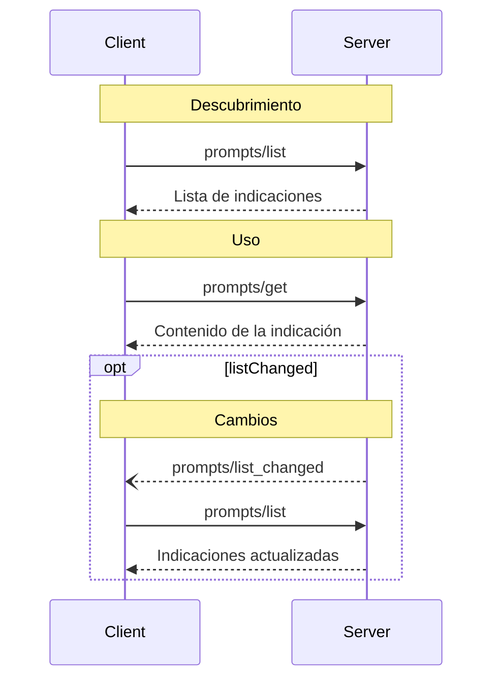

<Info>**Revisión del protocolo**: 2024-11-05</Info>

El Protocolo de Contexto de Modelo (MCP) ofrece una forma estandarizada para que los servidores expongan plantillas de indicaciones a los clientes. Las indicaciones permiten a los servidores proporcionar mensajes e instrucciones estructurados para interactuar con modelos de lenguaje. Los clientes pueden descubrir las indicaciones disponibles, obtener su contenido y proporcionar argumentos para personalizarlas.

<div id="user-interaction-model">
  ## Modelo de interacción con el usuario
</div>

Las indicaciones están diseñadas para ser **controladas por el usuario**, lo que significa que se exponen desde los servidores a
los clientes con la intención de que el usuario pueda seleccionarlas explícitamente para usarlas.

Por lo general, las indicaciones se activarían mediante comandos iniciados por el usuario en la interfaz
de usuario, lo que permite a los usuarios descubrir e invocar de forma natural las indicaciones disponibles.

Por ejemplo, como comandos de barra diagonal:


No obstante, los implementadores son libres de exponer las indicaciones mediante cualquier patrón de interfaz que se ajuste
a sus necesidades; el protocolo en sí no impone ningún modelo de interacción con el usuario específico.

<div id="capabilities">
  ## Capacidades
</div>

Los servidores que admitan indicaciones **DEBEN** declarar la capacidad `prompts` durante la
[inicialización](/es/specification/2024-11-05/basic/lifecycle#initialization):

```json
{
  "capabilities": {
    "prompts": {
      "listChanged": true
    }
  }
}
```

`listChanged` indica si el servidor enviará notificaciones cuando cambie la lista de
indicaciones disponibles.

<div id="protocol-messages">
  ## Mensajes del protocolo
</div>

<div id="listing-prompts">
  ### Listado de Indicaciones
</div>

Para obtener las indicaciones disponibles, los clientes envían una solicitud `prompts/list`. Esta operación
admite
[paginación](/es/specification/2024-11-05/server/utilities/pagination).

**Solicitud:**

```json
{
  "jsonrpc": "2.0",
  "id": 1,
  "method": "prompts/list",
  "params": {
    "cursor": "optional-cursor-value"
  }
}
```

**Respuesta:**

```json
{
  "jsonrpc": "2.0",
  "id": 1,
  "result": {
    "prompts": [
      {
        "name": "code_review",
        "description": "Solicita al LLM analizar la calidad del código y sugerir mejoras",
        "arguments": [
          {
            "name": "code",
            "description": "El código a revisar",
            "required": true
          }
        ]
      }
    ],
    "nextCursor": "next-page-cursor"
  }
}
```

<div id="getting-a-prompt">
  ### Obtener una indicación
</div>

Para recuperar una indicación específica, los clientes envían una solicitud `prompts/get`. Los argumentos pueden
autocompletarse mediante [la API de autocompletado](/es/specification/2024-11-05/server/utilities/completion).

**Solicitud:**

```json
{
  "jsonrpc": "2.0",
  "id": 2,
  "method": "prompts/get",
  "params": {
    "name": "code_review",
    "arguments": {
      "code": "def hello():\n    print('world')"
    }
  }
}
```

**Respuesta:**

```json
{
  "jsonrpc": "2.0",
  "id": 2,
  "result": {
    "description": "Indicacion de revisión de código",
    "messages": [
      {
        "role": "user",
        "content": {
          "type": "text",
          "text": "Por favor, revisa este código de Python:\ndef hello():\n    print('world')"
        }
      }
    ]
  }
}
```

<div id="list-changed-notification">
  ### Notificación de cambio en la lista
</div>

Cuando cambie la lista de Indicaciones disponibles, los servidores que hayan declarado la capacidad `listChanged` **DEBERÍAN** enviar una notificación:

```json
{
  "jsonrpc": "2.0",
  "method": "notifications/prompts/list_changed"
}
```

<div id="message-flow">
  ## Flujo de mensajes
</div>



<div id="data-types">
  ## Tipos de datos
</div>

<div id="prompt">
  ### Indicación
</div>

Una definición de indicación incluye:

* `name`: Identificador único de la indicación
* `description`: Descripción opcional en lenguaje natural
* `arguments`: Lista opcional de argumentos para la personalización

<div id="promptmessage">
  ### PromptMessage
</div>

Los mensajes en una indicación pueden incluir:

* `role`: &quot;user&quot; o &quot;assistant&quot; para indicar quién habla
* `content`: Uno de los siguientes tipos de contenido:

<div id="text-content">
  #### Contenido de texto
</div>

El contenido de texto representa mensajes de texto sin formato:

```json
{
  "type": "text",
  "text": "El contenido de texto del mensaje"
}
```

Este es el tipo de contenido más común para las interacciones en lenguaje natural.

<div id="image-content">
  #### Contenido de imagen
</div>

El contenido de imagen permite incluir información visual en los mensajes:

```json
{
  "type": "image",
  "data": "base64-encoded-image-data",
  "mimeType": "image/png"
}
```

Los datos de la imagen **DEBEN** estar codificados en base64 e incluir un tipo MIME válido. Esto permite
interacciones multimodales donde el contexto visual es importante.

<div id="embedded-resources">
  #### Recursos incrustados
</div>

Los recursos incrustados permiten referenciar directamente recursos del servidor en los mensajes:

```json
{
  "type": "resource",
  "resource": {
    "uri": "resource://example",
    "mimeType": "text/plain",
    "text": "Resource content"
  }
}
```

Los recursos pueden contener texto o datos binarios (blob) y **DEBEN** incluir:

* Un URI de recurso válido
* El tipo MIME correspondiente
* Contenido de texto o datos blob codificados en base64

Los recursos incrustados permiten que las Indicaciones incorporen sin fricción contenido administrado por el servidor, como
documentación, ejemplos de código u otros materiales de referencia, directamente en el flujo de
conversación.

<div id="error-handling">
  ## Manejo de errores
</div>

Los servidores **DEBERÍAN** devolver errores estándar de JSON-RPC para casos de falla comunes:

* Nombre de indicación no válido: `-32602` (Parámetros no válidos)
* Falta de argumentos obligatorios: `-32602` (Parámetros no válidos)
* Errores internos: `-32603` (Error interno)

<div id="implementation-considerations">
  ## Consideraciones de implementación
</div>

1. Los servidores **DEBERÍAN** validar los argumentos de las indicaciones antes de procesarlos
2. Los clientes **DEBERÍAN** gestionar la paginación para listas grandes de indicaciones
3. Ambas partes **DEBERÍAN** respetar la negociación de capacidades

<div id="security">
  ## Seguridad
</div>

Las implementaciones **DEBEN** validar cuidadosamente todas las entradas y salidas de las indicaciones para evitar ataques de inyección o accesos no autorizados a los recursos.