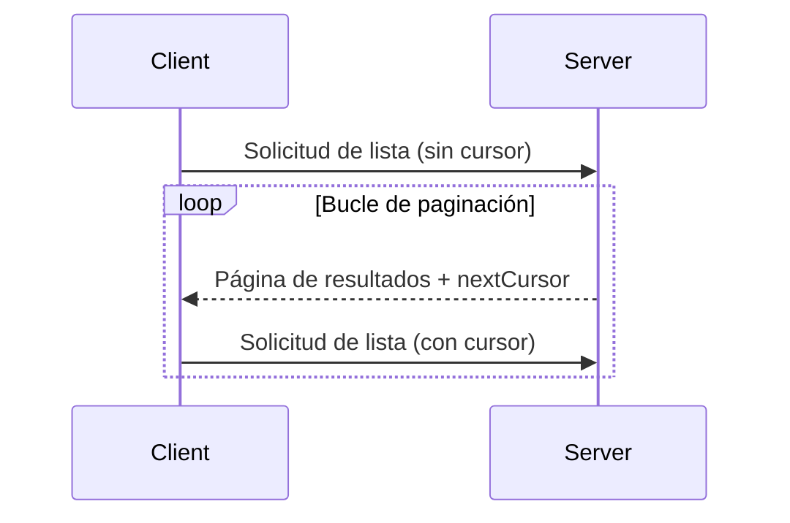

<Info>**Revisión del protocolo**: 2024-11-05</Info>

El Protocolo de Contexto del Modelo (MCP) admite la paginación de operaciones de listado que pueden devolver conjuntos de resultados grandes. La paginación permite que los servidores ofrezcan resultados en bloques más pequeños en lugar de todos a la vez.

La paginación es especialmente importante al conectarse a servicios externos por internet, pero también resulta útil en integraciones locales para evitar problemas de rendimiento con conjuntos de datos grandes.

<div id="pagination-model">
  ## Modelo de paginación
</div>

La paginación en el MCP utiliza un enfoque opaco basado en cursores, en lugar de páginas numeradas.

- El **cursor** es un token de cadena opaco que representa una posición en el conjunto de resultados
- El **tamaño de página** lo determina el servidor, y los clientes **NO DEBEN** asumir un tamaño de página fijo

<div id="response-format">
  ## Formato de respuesta
</div>

La paginación comienza cuando el servidor envía una **respuesta** que incluye:

- La página actual de resultados
- Un campo opcional `nextCursor` si hay más resultados

```json
{
  "jsonrpc": "2.0",
  "id": "123",
  "result": {
    "resources": [...],
    "nextCursor": "eyJwYWdlIjogM30="
  }
}
```

<div id="request-format">
  ## Formato de la solicitud
</div>

Tras recibir un cursor, el cliente puede _continuar_ paginando enviando una solicitud
que incluya ese cursor:

```json
{
  "jsonrpc": "2.0",
  "method": "resources/list",
  "params": {
    "cursor": "eyJwYWdlIjogMn0="
  }
}
```

<div id="pagination-flow">
  ## Flujo de paginación
</div>



<div id="operations-supporting-pagination">
  ## Operaciones con compatibilidad de paginación
</div>

Las siguientes operaciones del MCP admiten paginación:

- `resources/list` - Listar recursos disponibles
- `resources/templates/list` - Listar plantillas de recursos
- `prompts/list` - Listar indicaciones disponibles
- `tools/list` - Listar herramientas disponibles

<div id="implementation-guidelines">
  ## Pautas de implementación
</div>

1. Los servidores **DEBERÍAN**:
   - Proporcionar cursores estables
   - Manejar los cursores inválidos de forma adecuada

2. Los clientes **DEBERÍAN**:
   - Tratar la ausencia de `nextCursor` como el fin de los resultados
   - Admitir flujos paginados y no paginados

3. Los clientes **DEBEN** tratar los cursores como tokens opacos:
   - No hacer suposiciones sobre el formato del cursor
   - No intentar analizar ni modificar los cursores
   - No conservar los cursores entre sesiones

<div id="error-handling">
  ## Manejo de errores
</div>

Los cursores no válidos **DEBERÍAN** generar un error con el código -32602 (Parámetros no válidos).