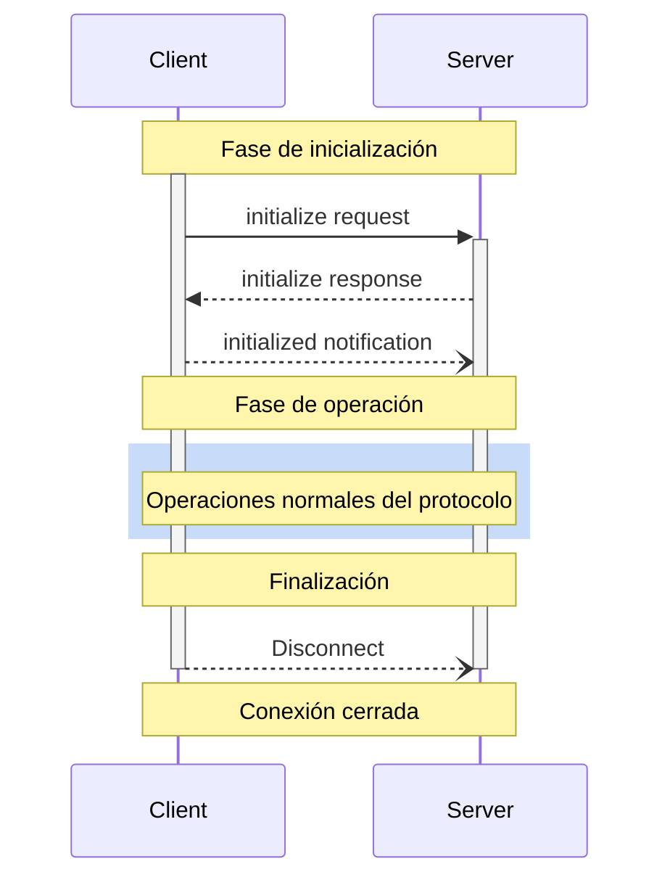

<Info>**Revisión del protocolo**: 2025-03-26</Info>

El Protocolo de Contexto del Modelo (MCP) define un ciclo de vida riguroso para las conexiones cliente-servidor que garantiza una negociación de capacidades y una gestión del estado adecuadas.

1. **Inicialización**: Negociación de capacidades y acuerdo sobre la versión del protocolo
2. **Operación**: Comunicación normal del protocolo
3. **Finalización**: Terminación ordenada de la conexión



<div id="lifecycle-phases">
  ## Fases del ciclo de vida
</div>

<div id="initialization">
  ### Inicialización
</div>

La fase de inicialización **DEBE** ser la primera interacción entre cliente y servidor.
Durante esta fase, el cliente y el servidor:

* Establecen la compatibilidad de la versión del protocolo
* Intercambian y negocian capacidades
* Comparten detalles de implementación

El cliente **DEBE** iniciar esta fase enviando una solicitud `initialize` que contenga:

* Versión del protocolo compatible
* Capacidades del cliente
* Información sobre la implementación del cliente

```json
{
  "jsonrpc": "2.0",
  "id": 1,
  "method": "initialize",
  "params": {
    "protocolVersion": "2025-03-26",
    "capabilities": {
      "roots": {
        "listChanged": true
      },
      "sampling": {}
    },
    "clientInfo": {
      "name": "ExampleClient",
      "version": "1.0.0"
    }
  }
}
```

La solicitud `initialize` **NO DEBE** formar parte de un
[batch](https://www.jsonrpc.org/specification#batch) de JSON-RPC, ya que otras solicitudes y notificaciones
no son posibles hasta que se complete la inicialización. Esto también permite compatibilidad
retrocompatible con versiones anteriores del protocolo que no admiten explícitamente
lotes de JSON-RPC.

El servidor **DEBE** responder con sus propias capacidades e información:

```json
{
  "jsonrpc": "2.0",
  "id": 1,
  "result": {
    "protocolVersion": "2025-03-26",
    "capabilities": {
      "logging": {},
      "prompts": {
        "listChanged": true
      },
      "resources": {
        "subscribe": true,
        "listChanged": true
      },
      "tools": {
        "listChanged": true
      }
    },
    "serverInfo": {
      "name": "ExampleServer",
      "version": "1.0.0"
    },
    "instructions": "Instrucciones opcionales para el cliente"
  }
}
```

Tras una inicialización correcta, el cliente **DEBE** enviar una notificación `initialized`
para indicar que está listo para comenzar las operaciones normales:

```json
{
  "jsonrpc": "2.0",
  "method": "notifications/initialized"
}
```

* El cliente **NO DEBERÍA** enviar solicitudes distintas de
  [pings](/es/specification/2025-03-26/basic/utilities/ping) antes de que el servidor haya respondido a la
  solicitud `initialize`.
* El servidor **NO DEBERÍA** enviar solicitudes distintas de
  [pings](/es/specification/2025-03-26/basic/utilities/ping) y
  [logging](/es/specification/2025-03-26/server/utilities/logging) antes de recibir la notificación
  `initialized`.

<div id="version-negotiation">
  #### Negociación de versiones
</div>

En la solicitud `initialize`, el cliente **DEBE** enviar una versión del protocolo que sea compatible.
Esta **DEBERÍA** ser la *más reciente* que el cliente soporte.

Si el servidor admite la versión de protocolo solicitada, **DEBE** responder con la misma
versión. De lo contrario, el servidor **DEBE** responder con otra versión del protocolo que
admita. Esta **DEBERÍA** ser la *más reciente* que el servidor soporte.

Si el cliente no es compatible con la versión indicada en la respuesta del servidor, **DEBERÍA**
desconectarse.

<div id="capability-negotiation">
  #### Negociación de capacidades
</div>

Las capacidades del cliente y del servidor determinan qué funcionalidades opcionales del protocolo estarán disponibles durante la sesión.

Las capacidades clave incluyen:

| Categoría | Capacidad      | Descripción                                                                                 |
| --------- | -------------- | ------------------------------------------------------------------------------------------- |
| Cliente   | `roots`        | Capacidad para proporcionar [Raíces](/es/specification/2025-03-26/client/roots) del sistema de archivos |
| Cliente   | `sampling`     | Compatibilidad con solicitudes de [Muestreo](/es/specification/2025-03-26/client/sampling) de LLM |
| Cliente   | `experimental` | Describe la compatibilidad con funcionalidades experimentales no estándar                   |
| Servidor  | `prompts`      | Ofrece [plantillas de Indicaciones](/es/specification/2025-03-26/server/prompts)               |
| Servidor  | `resources`    | Proporciona [Recursos](/es/specification/2025-03-26/server/resources) legibles                 |
| Servidor  | `tools`        | Expone [Herramientas](/es/specification/2025-03-26/server/tools) invocables                    |
| Servidor  | `logging`      | Emite [mensajes de registro](/es/specification/2025-03-26/server/utilities/logging) estructurados |
| Servidor  | `completions`  | Admite [autocompletado](/es/specification/2025-03-26/server/utilities/completion) de argumentos |
| Servidor  | `experimental` | Describe la compatibilidad con funcionalidades experimentales no estándar                   |

Los objetos de capacidades pueden describir subcapacidades como:

* `listChanged`: Compatibilidad con notificaciones de cambios en listas (para Indicaciones, Recursos y
  Herramientas)
* `subscribe`: Compatibilidad con suscribirse a cambios de elementos individuales (solo Recursos)

<div id="operation">
  ### Operación
</div>

Durante la fase de operación, el cliente y el servidor intercambian mensajes según las
capacidades negociadas.

Ambas partes **DEBERÍAN**:

* Respetar la versión del protocolo acordada
* Utilizar únicamente las capacidades negociadas con éxito

<div id="shutdown">
  ### Apagado
</div>

Durante la fase de apagado, una de las partes (generalmente el cliente) finaliza de forma limpia la conexión del protocolo. No se definen mensajes específicos de apagado; en su lugar, se debe utilizar el mecanismo de transporte subyacente para indicar la terminación de la conexión:

<div id="stdio">
  #### stdio
</div>

Para el [transporte](/es/specification/2025-03-26/basic/transports) stdio, el cliente **DEBERÍA** iniciar
la detención mediante:

1. Primero, cerrar el flujo de entrada al proceso hijo (el servidor)
2. Esperar a que el servidor termine, o enviar `SIGTERM` si el servidor no finaliza
   dentro de un tiempo razonable
3. Enviar `SIGKILL` si el servidor no finaliza dentro de un tiempo razonable después de `SIGTERM`

El servidor **PUEDE** iniciar la detención cerrando su flujo de salida hacia el cliente y
finalizando.

<div id="http">
  #### HTTP
</div>

Para los [transportes](/es/specification/2025-03-26/basic/transports) HTTP, la finalización se indica cerrando las conexiones HTTP asociadas.

<div id="timeouts">
  ## Tiempos de espera
</div>

Las implementaciones **DEBERÍAN** establecer tiempos de espera para todas las solicitudes enviadas, para prevenir conexiones bloqueadas y el agotamiento de recursos. Cuando la solicitud no haya recibido una respuesta de éxito o de error dentro del período de tiempo de espera, el remitente **DEBERÍA** emitir una [notificación de cancelación](/es/specification/2025-03-26/basic/utilities/cancellation) para esa solicitud y dejar de esperar una respuesta.

Los SDK y otros middleware **DEBERÍAN** permitir que estos tiempos de espera se configuren por solicitud.

Las implementaciones **PUEDEN** optar por reiniciar el temporizador del tiempo de espera al recibir una [notificación de progreso](/es/specification/2025-03-26/basic/utilities/progress) correspondiente a la solicitud, ya que esto implica que efectivamente se está realizando trabajo. Sin embargo, las implementaciones **DEBERÍAN** aplicar siempre un tiempo de espera máximo, independientemente de las notificaciones de progreso, para limitar el impacto de un cliente o servidor con comportamiento anómalo.

<div id="error-handling">
  ## Manejo de errores
</div>

Las implementaciones **DEBERÍAN** estar preparadas para manejar estos casos de error:

* Desajuste de versión del protocolo
* Error al negociar las capacidades requeridas
* [Tiempos de espera](#timeouts) de la solicitud

Ejemplo de error de inicialización:

```json
{
  "jsonrpc": "2.0",
  "id": 1,
  "error": {
    "code": -32602,
    "message": "Unsupported protocol version",
    "data": {
      "supported": ["2024-11-05"],
      "requested": "1.0.0"
    }
  }
}
```