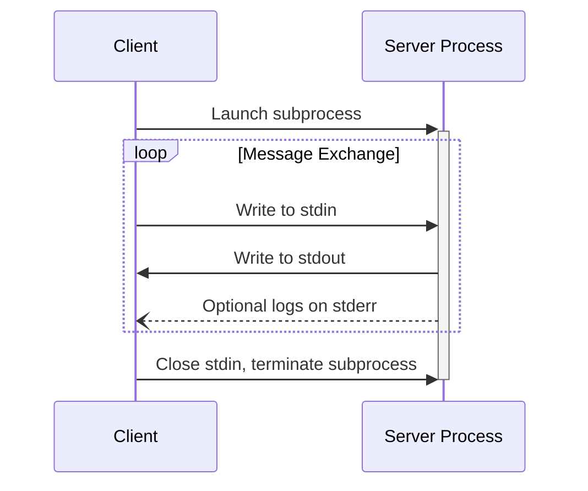
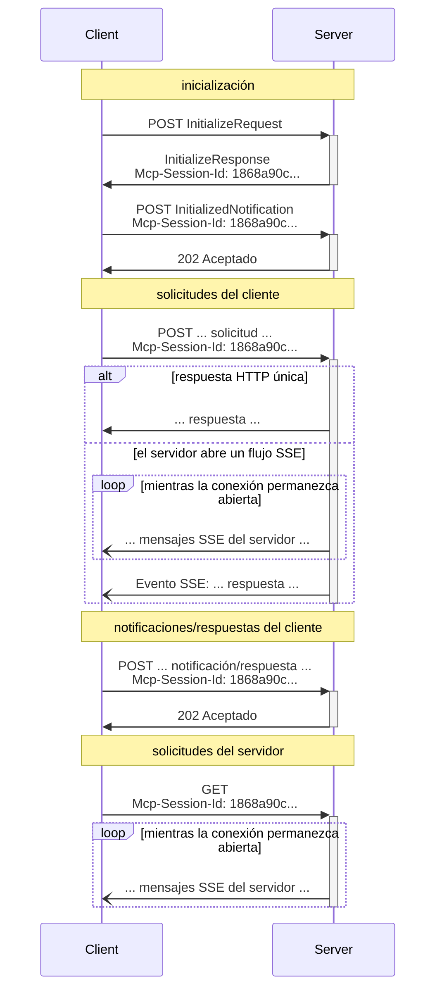

<Info>**Revisión del protocolo**: 2025-03-26</Info>

MCP utiliza JSON-RPC para codificar mensajes. Los mensajes JSON-RPC **DEBEN** codificarse en UTF-8.

El protocolo actualmente define dos mecanismos de transporte estándar para la comunicación entre cliente y servidor:

1. [stdio](#stdio), comunicación por la entrada estándar y la salida estándar
2. [HTTP transmitible](#streamable-http)

Los clientes **DEBERÍAN** admitir stdio siempre que sea posible.

También es posible que clientes y servidores implementen
[transportes personalizados](#custom-transports) de forma conectable.

  ## stdio

En el transporte **stdio**:

* El cliente lanza el Servidor MCP como un subproceso.
* El servidor lee mensajes JSON-RPC desde su entrada estándar (`stdin`) y envía mensajes
  a su salida estándar (`stdout`).
* Los mensajes pueden ser solicitudes, notificaciones o respuestas JSON-RPC, o un
  [lote](https://www.jsonrpc.org/specification#batch) JSON-RPC que contenga una o más solicitudes
  y/o notificaciones.
* Los mensajes están delimitados por saltos de línea y **NO DEBEN** contener saltos de línea incrustados.
* El servidor **PUEDE** escribir cadenas UTF-8 en su salida de error estándar (`stderr`) con fines de registro.
  Los clientes **PUEDEN** capturar, reenviar o ignorar estos registros.
* El servidor **NO DEBE** escribir nada en su `stdout` que no sea un mensaje MCP válido.
* El cliente **NO DEBE** escribir nada en el `stdin` del servidor que no sea un mensaje MCP
  válido.

  ## HTTP transmitible

<Info>
  Esto reemplaza el [transporte HTTP+SSE](/es/specification/2024-11-05/basic/transports#http-with-sse) de la versión del protocolo 2024-11-05. Consulta la guía de [compatibilidad retroactiva](#backwards-compatibility) a continuación.
</Info>

En el transporte **HTTP transmitible**, el servidor opera como un proceso independiente que puede manejar múltiples conexiones de clientes. Este transporte utiliza solicitudes HTTP POST y GET. El servidor puede usar opcionalmente [Eventos enviados por el servidor](https://en.wikipedia.org/wiki/Server-sent_events) (SSE) para transmitir múltiples mensajes del servidor. Esto habilita servidores MCP básicos, así como servidores más avanzados que admiten transmisión y notificaciones y solicitudes de servidor a cliente.

El servidor **DEBE** proporcionar una única ruta de endpoint HTTP (en adelante, el **endpoint MCP**) que admita los métodos POST y GET. Por ejemplo, podría ser una URL como `https://example.com/mcp`.

  #### Advertencia de seguridad

Al implementar el transporte HTTP transmitible:

1. Los servidores **DEBEN** validar el encabezado `Origin` en todas las conexiones entrantes para prevenir ataques de DNS rebinding
2. Al ejecutarse localmente, los servidores **DEBERÍAN** vincularse solo a localhost (127.0.0.1) en lugar de a todas las interfaces de red (0.0.0.0)
3. Los servidores **DEBERÍAN** implementar una autenticación adecuada para todas las conexiones

Sin estas protecciones, los atacantes podrían usar DNS rebinding para interactuar con servidores MCP locales desde sitios web remotos.

  ### Envío de mensajes al servidor

Cada mensaje JSON-RPC enviado desde el cliente **DEBE** ser una nueva solicitud HTTP POST al
punto de conexión MCP.

1. El cliente **DEBE** usar HTTP POST para enviar mensajes JSON-RPC al punto de conexión MCP.
2. El cliente **DEBE** incluir un encabezado `Accept`, que enumere tanto `application/json` como
   `text/event-stream` como tipos de contenido admitidos.
3. El cuerpo de la solicitud POST **DEBE** ser uno de los siguientes:
   * Una sola *solicitud*, *notificación* o *respuesta* JSON-RPC
   * Un arreglo que [agrupe](https://www.jsonrpc.org/specification#batch) una o más
     *solicitudes y/o notificaciones*
   * Un arreglo que [agrupe](https://www.jsonrpc.org/specification#batch) una o más
     *respuestas*
4. Si la entrada consiste únicamente en (cualquier cantidad de) *respuestas* o
   *notificaciones* JSON-RPC:
   * Si el servidor acepta la entrada, el servidor **DEBE** devolver el código de estado HTTP 202
     Accepted sin cuerpo.
   * Si el servidor no puede aceptar la entrada, **DEBE** devolver un código de estado de error HTTP
     (p. ej., 400 Bad Request). El cuerpo de la respuesta HTTP **PUEDE** contener una *respuesta
     de error* JSON-RPC que no tenga `id`.
5. Si la entrada contiene cualquier cantidad de *solicitudes* JSON-RPC, el servidor **DEBE** o bien
   devolver `Content-Type: text/event-stream`, para iniciar un flujo SSE, o
   `Content-Type: application/json`, para devolver un objeto JSON. El cliente **DEBE**
   admitir ambos casos.
6. Si el servidor inicia un flujo SSE:
   * El flujo SSE **DEBERÍA** eventualmente incluir una *respuesta* JSON-RPC por cada
     *solicitud* JSON-RPC enviada en el cuerpo del POST. Estas *respuestas* **PUEDEN** estar
     [agrupadas](https://www.jsonrpc.org/specification#batch).
   * El servidor **PUEDE** enviar *solicitudes* y *notificaciones* JSON-RPC antes de enviar una
     *respuesta* JSON-RPC. Estos mensajes **DEBERÍAN** estar relacionados con la *solicitud*
     del cliente originante. Estas *solicitudes* y *notificaciones* **PUEDEN** estar
     [agrupadas](https://www.jsonrpc.org/specification#batch).
   * El servidor **NO DEBERÍA** cerrar el flujo SSE antes de enviar una *respuesta* JSON-RPC
     por cada *solicitud* JSON-RPC recibida, a menos que la [sesión](#session-management)
     expire.
   * Después de que se hayan enviado todas las *respuestas* JSON-RPC, el servidor **DEBERÍA** cerrar el flujo SSE.
   * La desconexión **PUEDE** ocurrir en cualquier momento (p. ej., debido a condiciones de red).
     Por lo tanto:
     * La desconexión **NO DEBERÍA** interpretarse como que el cliente canceló su solicitud.
     * Para cancelar, el cliente **DEBERÍA** enviar explícitamente una `CancelledNotification` de MCP.
     * Para evitar la pérdida de mensajes debido a la desconexión, el servidor **PUEDE** hacer que el flujo
       sea [reanudable](#resumability-and-redelivery).

  ### Escucha de mensajes del servidor

1. El cliente **PUEDE** realizar una solicitud HTTP GET al endpoint de MCP. Esto puede usarse para abrir un
   flujo SSE, permitiendo que el servidor se comunique con el cliente sin que este primero
   envíe datos mediante HTTP POST.
2. El cliente **DEBE** incluir un encabezado `Accept`, indicando `text/event-stream` como
   tipo de contenido admitido.
3. El servidor **DEBE** devolver `Content-Type: text/event-stream` en respuesta a
   ese HTTP GET, o bien devolver HTTP 405 Method Not Allowed, indicando que el servidor
   no ofrece un flujo SSE en ese endpoint.
4. Si el servidor inicia un flujo SSE:
   * El servidor **PUEDE** enviar *solicitudes* y *notificaciones* JSON-RPC en el flujo. Estas
     *solicitudes* y *notificaciones* **PUEDEN** estar
     [agrupadas](https://www.jsonrpc.org/specification#batch).
   * Estos mensajes **DEBERÍAN** ser independientes de cualquier *solicitud* JSON-RPC que se esté
     ejecutando simultáneamente del lado del cliente.
   * El servidor **NO DEBE** enviar una *respuesta* JSON-RPC en el flujo **a menos que**
     esté [reanudando](#resumability-and-redelivery) un flujo asociado con una solicitud previa
     del cliente.
   * El servidor **PUEDE** cerrar el flujo SSE en cualquier momento.
   * El cliente **PUEDE** cerrar el flujo SSE en cualquier momento.

  ### Conexiones múltiples

1. El cliente **PUEDE** permanecer conectado a varios flujos SSE simultáneamente.
2. El servidor **DEBE** enviar cada uno de sus mensajes JSON-RPC por solo uno de los flujos conectados; es decir, **NO DEBE** difundir el mismo mensaje a través de varios flujos.
   * El riesgo de pérdida de mensajes **PUEDE** mitigarse haciendo que el flujo sea
     [reanudable](#resumability-and-redelivery).

  ### Reanudación y reenvío

Para admitir la reanudación de conexiones interrumpidas y el reenvío de mensajes que de otro modo podrían perderse:

1. Los servidores **PUEDEN** adjuntar un campo `id` a sus eventos SSE, como se describe en el
   [estándar SSE](https://html.spec.whatwg.org/multipage/server-sent-events.html#event-stream-interpretation).
   * Si está presente, el ID **DEBE** ser globalmente único en todos los streams dentro de esa
     [sesión](#session-management), o en todos los streams con ese cliente específico si no se usa la gestión de sesiones.
2. Si el cliente desea reanudar tras una conexión interrumpida, **DEBERÍA** realizar un HTTP
   GET al endpoint de MCP e incluir la cabecera
   [`Last-Event-ID`](https://html.spec.whatwg.org/multipage/server-sent-events.html#the-last-event-id-header)
   para indicar el último ID de evento que recibió.
   * El servidor **PUEDE** usar esta cabecera para volver a reproducir los mensajes que se habrían enviado
     después del último ID de evento, *en el stream que se desconectó*, y reanudar el
     stream desde ese punto.
   * El servidor **NO DEBE** volver a reproducir mensajes que se habrían entregado en un
     stream diferente.

En otras palabras, estos IDs de evento deben ser asignados por los servidores *por stream*, para actuar como un cursor dentro de ese stream en particular.

  ### Gestión de sesiones

Una &quot;sesión&quot; de MCP consiste en interacciones lógicamente relacionadas entre un cliente y un
servidor, que comienzan con la [fase de inicialización](/es/specification/2025-03-26/basic/lifecycle). Para admitir
servidores que desean establecer sesiones con estado:

1. Un servidor que use el transporte HTTP transmitible **PUEDE** asignar un ID de sesión en
   el momento de la inicialización, incluyéndolo en un encabezado `Mcp-Session-Id` de la respuesta
   HTTP que contiene el `InitializeResult`.
   * El ID de sesión **DEBERÍA** ser globalmente único y criptográficamente seguro (p. ej., un
     UUID generado de forma segura, un JWT o un hash criptográfico).
   * El ID de sesión **DEBE** contener únicamente caracteres ASCII visibles (en el rango de 0x21 a
     0x7E).
2. Si el servidor devuelve un `Mcp-Session-Id` durante la inicialización, los clientes que usen
   el transporte HTTP transmitible **DEBEN** incluirlo en el encabezado `Mcp-Session-Id` en
   todas sus solicitudes HTTP posteriores.
   * Los servidores que requieren un ID de sesión **DEBERÍAN** responder a solicitudes sin el
     encabezado `Mcp-Session-Id` (que no sean de inicialización) con HTTP 400 Solicitud incorrecta.
3. El servidor **PUEDE** finalizar la sesión en cualquier momento; a partir de entonces **DEBE** responder
   a las solicitudes que contengan ese ID de sesión con HTTP 404 No encontrado.
4. Cuando un cliente reciba HTTP 404 en respuesta a una solicitud que contenga un
   `Mcp-Session-Id`, **DEBE** iniciar una nueva sesión enviando un nuevo `InitializeRequest`
   sin adjuntar un ID de sesión.
5. Los clientes que ya no necesiten una sesión en particular (p. ej., porque el usuario está saliendo
   de la aplicación cliente) **DEBERÍAN** enviar un HTTP DELETE al endpoint de MCP con el
   encabezado `Mcp-Session-Id`, para finalizar explícitamente la sesión.
   * El servidor **PUEDE** responder a esta solicitud con HTTP 405 Método no permitido,
     lo que indica que el servidor no permite que los clientes finalicen sesiones.

  ### Diagrama de secuencia

  ### Compatibilidad con versiones anteriores

Los clientes y servidores pueden mantener compatibilidad con el [transporte HTTP+SSE
obsoleto](/es/specification/2024-11-05/basic/transports#http-with-sse) (desde la
versión del protocolo 2024-11-05) de la siguiente manera:

**Servidores** que quieran admitir clientes antiguos deberían:

* Seguir ofreciendo tanto los endpoints SSE como POST del transporte antiguo, junto con el
  nuevo &quot;endpoint MCP&quot; definido para el transporte HTTP transmitible.
  * También es posible combinar el endpoint POST antiguo y el nuevo endpoint MCP, pero
    esto puede añadir complejidad innecesaria.

**Clientes** que quieran admitir servidores antiguos deberían:

1. Aceptar una URL de Servidor MCP proporcionada por el usuario, que puede apuntar a un servidor que use
   el transporte antiguo o el nuevo.
2. Intentar enviar mediante POST una `InitializeRequest` a la URL del servidor, con un encabezado `Accept` como
   se definió arriba:
   * Si tiene éxito, el cliente puede asumir que se trata de un servidor que admite el nuevo transporte
     HTTP transmitible.
   * Si falla con un código de estado HTTP 4xx (p. ej., 405 Method Not Allowed o 404 Not
     Found):
     * Realizar una solicitud GET a la URL del servidor, esperando que esto abra un flujo SSE
       y devuelva un evento `endpoint` como primer evento.
     * Cuando llegue el evento `endpoint`, el cliente puede asumir que se trata de un servidor que ejecuta
       el transporte HTTP+SSE antiguo, y debe usar ese transporte para toda la comunicación
       posterior.

  ## Transportes personalizados

Los clientes y servidores **PUEDEN** implementar mecanismos de transporte personalizados adicionales para adaptarse a sus necesidades específicas. El protocolo es independiente del transporte y puede implementarse sobre cualquier canal de comunicación que admita intercambio bidireccional de mensajes.

Quienes decidan implementar transportes personalizados **DEBEN** asegurarse de preservar el formato de mensajes y los requisitos del ciclo de vida de JSON-RPC definidos por el MCP. Los transportes personalizados **DEBERÍAN** documentar sus patrones específicos de establecimiento de conexión e intercambio de mensajes para facilitar la interoperabilidad.