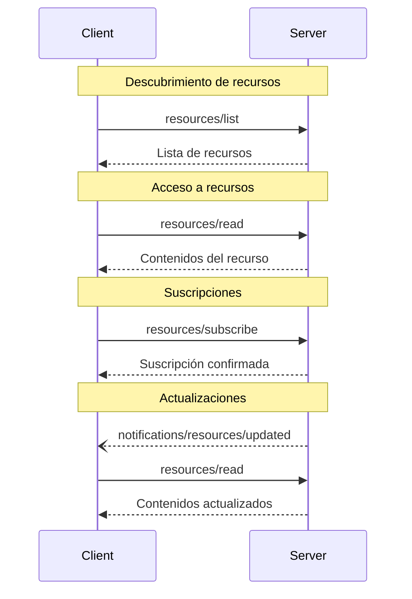

<Info>**Revisión del protocolo**: 2025-03-26</Info>

El Protocolo de Contexto de Modelo (MCP) proporciona una forma estandarizada para que los servidores expongan
recursos a los clientes. Los recursos permiten a los servidores compartir datos que aportan contexto a
los modelos de lenguaje, como archivos, esquemas de bases de datos o información específica de la aplicación.
Cada recurso se identifica de manera única mediante un
[URI](https://datatracker.ietf.org/doc/html/rfc3986).

<div id="user-interaction-model">
  ## Modelo de interacción con el usuario
</div>

Los recursos en MCP están diseñados para ser **impulsados por la aplicación**, y las aplicaciones anfitrionas
determinan cómo incorporar el contexto según sus necesidades.

Por ejemplo, las aplicaciones podrían:

* Exponer recursos mediante elementos de la interfaz para una selección explícita, en una vista en árbol o en lista
* Permitir que el usuario busque y filtre los recursos disponibles
* Implementar la inclusión automática de contexto, basada en heurísticas o en la selección del modelo de IA


Sin embargo, las implementaciones pueden exponer recursos mediante cualquier patrón de interfaz que
se ajuste a sus necesidades; el protocolo en sí no impone ningún modelo específico de
interacción con el usuario.

<div id="capabilities">
  ## Capacidades
</div>

Los servidores que admiten Recursos **DEBEN** declarar la capacidad `resources`:

```json
{
  "capabilities": {
    "resources": {
      "subscribe": true,
      "listChanged": true
    }
  }
}
```

Esta capacidad admite dos características opcionales:

* `subscribe`: indica si el Cliente puede suscribirse para recibir notificaciones de cambios en recursos individuales.
* `listChanged`: indica si el Servidor emitirá notificaciones cuando cambie la lista de Recursos disponibles.

Tanto `subscribe` como `listChanged` son opcionales; los servidores pueden no admitir ninguna,
una o ambas:

```json
{
  "capabilities": {
    "resources": {} // Neither feature supported
  }
}
```

```json
{
  "capabilities": {
    "resources": {
      "subscribe": true // Only subscriptions supported
    }
  }
}
```

```json
{
  "capabilities": {
    "resources": {
      "listChanged": true // Only list change notifications supported
    }
  }
}
```

<div id="protocol-messages">
  ## Mensajes del protocolo
</div>

<div id="listing-resources">
  ### Listado de recursos
</div>

Para descubrir los recursos disponibles, los clientes envían una solicitud `resources/list`. Esta operación
admite [paginación](/es/specification/2025-03-26/server/utilities/pagination).

**Solicitud:**

```json
{
  "jsonrpc": "2.0",
  "id": 1,
  "method": "resources/list",
  "params": {
    "cursor": "optional-cursor-value"
  }
}
```

**Respuesta:**

```json
{
  "jsonrpc": "2.0",
  "id": 1,
  "result": {
    "resources": [
      {
        "uri": "file:///project/src/main.rs",
        "name": "main.rs",
        "description": "Punto de entrada principal de la aplicación",
        "mimeType": "text/x-rust"
      }
    ],
    "nextCursor": "next-page-cursor"
  }
}
```

<div id="reading-resources">
  ### Lectura de Recursos
</div>

Para obtener el contenido de los recursos, los clientes envían una solicitud `resources/read`:

**Solicitud:**

```json
{
  "jsonrpc": "2.0",
  "id": 2,
  "method": "resources/read",
  "params": {
    "uri": "file:///project/src/main.rs"
  }
}
```

**Respuesta:**

```json
{
  "jsonrpc": "2.0",
  "id": 2,
  "result": {
    "contents": [
      {
        "uri": "file:///project/src/main.rs",
        "mimeType": "text/x-rust",
        "text": "fn main() {\n    println!(\"Hello world!\");\n}"
      }
    ]
  }
}
```

<div id="resource-templates">
  ### Plantillas de Recursos
</div>

Las plantillas de recursos permiten que los servidores expongan recursos parametrizados usando
[plantillas de URI](https://datatracker.ietf.org/doc/html/rfc6570). Los argumentos pueden
autocompletarse mediante [la API de autocompletado](/es/specification/2025-03-26/server/utilities/completion).

**Solicitud:**

```json
{
  "jsonrpc": "2.0",
  "id": 3,
  "method": "resources/templates/list"
}
```

**Respuesta:**

```json
{
  "jsonrpc": "2.0",
  "id": 3,
  "result": {
    "resourceTemplates": [
      {
        "uriTemplate": "file:///{path}",
        "name": "Project Files",
        "description": "Access files in the project directory",
        "mimeType": "application/octet-stream"
      }
    ]
  }
}
```

<div id="list-changed-notification">
  ### Notificación de cambio en la lista
</div>

Cuando cambie la lista de recursos disponibles, los servidores que hayan declarado la capacidad `listChanged` **DEBERÍAN** enviar una notificación:

```json
{
  "jsonrpc": "2.0",
  "method": "notifications/resources/list_changed"
}
```

<div id="subscriptions">
  ### Suscripciones
</div>

El protocolo admite suscripciones opcionales a cambios en los recursos. Los clientes pueden suscribirse
a recursos específicos y recibir notificaciones cuando estos cambien:

**Solicitud de suscripción:**

```json
{
  "jsonrpc": "2.0",
  "id": 4,
  "method": "resources/subscribe",
  "params": {
    "uri": "file:///project/src/main.rs"
  }
}
```

**Notificación de actualización:**

```json
{
  "jsonrpc": "2.0",
  "method": "notifications/resources/updated",
  "params": {
    "uri": "file:///project/src/main.rs"
  }
}
```

<div id="message-flow">
  ## Flujo de mensajes
</div>



<div id="data-types">
  ## Tipos de datos
</div>

<div id="resource">
  ### Recurso
</div>

Una definición de recurso incluye:

* `uri`: Identificador único del recurso
* `name`: Nombre legible para personas
* `description`: Descripción opcional
* `mimeType`: Tipo MIME opcional
* `size`: Tamaño opcional en bytes

<div id="resource-contents">
  ### Contenido de Recursos
</div>

Los Recursos pueden contener texto o datos binarios:

<div id="text-content">
  #### Contenido de texto
</div>

```json
{
  "uri": "file:///example.txt",
  "mimeType": "text/plain",
  "text": "Contenido del recurso"
}
```

<div id="binary-content">
  #### Contenido binario
</div>

```json
{
  "uri": "file:///example.png",
  "mimeType": "image/png",
  "blob": "datos codificados en base64"
}
```

<div id="common-uri-schemes">
  ## Esquemas URI comunes
</div>

El protocolo define varios esquemas URI estándar. Esta lista no es exhaustiva: las implementaciones siempre pueden usar esquemas URI adicionales y personalizados.

<div id="https">
  ### https://
</div>

Se utiliza para representar un recurso disponible en la web.

Los servidores **DEBERÍAN** usar este esquema solo cuando el cliente pueda obtener y cargar el
recurso directamente desde la web por su cuenta; es decir, no necesite leer el recurso
a través del Servidor MCP.

Para otros casos de uso, los servidores **DEBERÍAN** preferir utilizar otro esquema de URI, o definir uno
personalizado, incluso si el propio servidor descargará el contenido del recurso a través de
Internet.

<div id="file">
  ### file://
</div>

Se utiliza para identificar recursos que se comportan como un sistema de archivos. Sin embargo, los recursos no necesitan corresponder a un sistema de archivos físico real.

Los Servidores MCP **PUEDEN** identificar recursos file:// con un
[tipo MIME XDG](https://specifications.freedesktop.org/shared-mime-info-spec/0.14/ar01s02.html#id-1.3.14),
como `inode/directory`, para representar archivos no regulares (como directorios) que, de otro modo, no
tienen un tipo MIME estándar.

<div id="git">
  ### git://
</div>

Integración con el sistema de control de versiones Git.

<div id="error-handling">
  ## Manejo de errores
</div>

Los servidores **DEBERÍAN** devolver errores estándar de JSON-RPC para casos comunes de fallo:

* Recurso no encontrado: `-32002`
* Errores internos: `-32603`

Ejemplo de error:

```json
{
  "jsonrpc": "2.0",
  "id": 5,
  "error": {
    "code": -32002,
    "message": "Recurso no encontrado",
    "data": {
      "uri": "file:///nonexistent.txt"
    }
  }
}
```

<div id="security-considerations">
  ## Consideraciones de seguridad
</div>

1. Los servidores **DEBEN** validar todos los URI de recursos
2. Se **DEBERÍAN** implementar controles de acceso para los recursos sensibles
3. Los datos binarios **DEBEN** estar correctamente codificados
4. Se **DEBERÍAN** verificar los permisos de los recursos antes de realizar operaciones