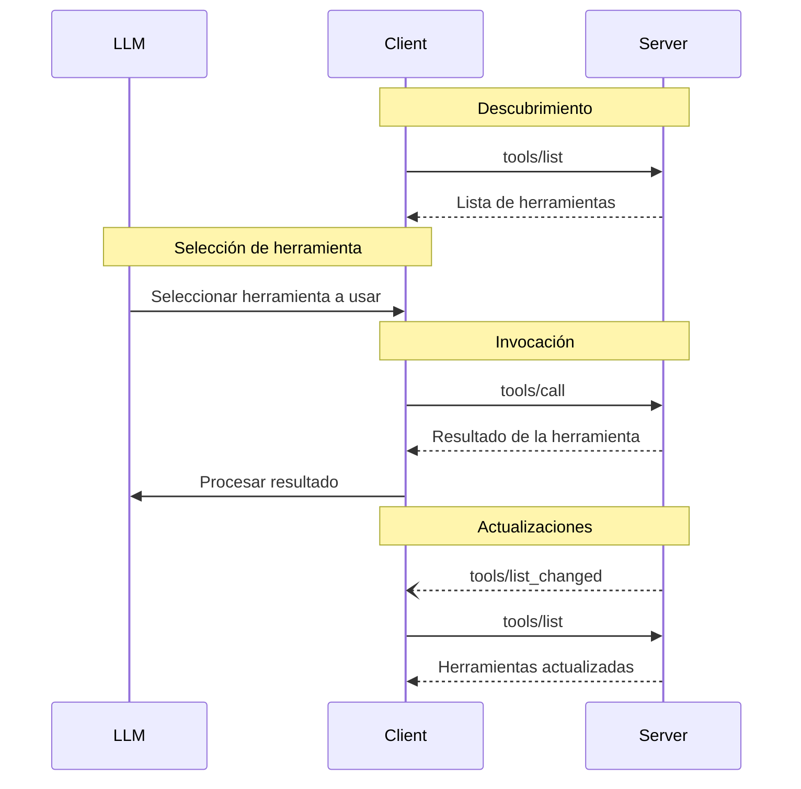

<Info>**Revisión del Protocolo**: 2025-03-26</Info>

El Protocolo de Contexto de Modelo (MCP) permite que los servidores expongan Herramientas que pueden ser invocadas por modelos de lenguaje. Las Herramientas permiten que los modelos interactúen con sistemas externos, como consultar bases de datos, llamar a API o realizar cálculos. Cada Herramienta está identificada de forma única por un nombre e incluye metadatos que describen su esquema.

<div id="user-interaction-model">
  ## Modelo de interacción con el usuario
</div>

Las Herramientas en el Protocolo de Contexto de Modelo (MCP) están diseñadas para ser **controladas por el modelo**, lo que significa que el modelo de lenguaje puede
descubrir e invocar herramientas automáticamente según su comprensión contextual y las
indicaciones del usuario.

Sin embargo, las implementaciones son libres de exponer herramientas mediante cualquier patrón de interfaz que
se adapte a sus necesidades—el protocolo en sí no impone ningún modelo específico de
interacción con el usuario.

<Warning>
  Por motivos de confianza y seguridad, **DEBERÍA** haber siempre
  una persona en el ciclo con la capacidad de denegar invocaciones de herramientas.

  Las aplicaciones **DEBERÍAN**:

  * Proporcionar una interfaz que deje claro qué herramientas se están exponiendo al modelo de IA
  * Insertar indicadores visuales claros cuando se invoquen herramientas
  * Presentar indicaciones de confirmación al usuario para las operaciones, para garantizar que haya una persona en el
    ciclo
</Warning>

<div id="capabilities">
  ## Capacidades
</div>

Los servidores que admiten Herramientas **DEBEN** declarar la capacidad `tools`:

```json
{
  "capabilities": {
    "tools": {
      "listChanged": true
    }
  }
}
```

`listChanged` indica si el servidor emitirá notificaciones cuando cambie la lista de Herramientas disponibles.

<div id="protocol-messages">
  ## Mensajes del protocolo
</div>

<div id="listing-tools">
  ### Listado de Herramientas
</div>

Para descubrir las Herramientas disponibles, los Clientes envían una solicitud `tools/list`. Esta operación admite la
[paginación](/es/specification/2025-03-26/server/utilities/pagination).

**Solicitud:**

```json
{
  "jsonrpc": "2.0",
  "id": 1,
  "method": "tools/list",
  "params": {
    "cursor": "optional-cursor-value"
  }
}
```

**Respuesta:**

```json
{
  "jsonrpc": "2.0",
  "id": 1,
  "result": {
    "tools": [
      {
        "name": "get_weather",
        "description": "Obtener la información meteorológica actual de una ubicación",
        "inputSchema": {
          "type": "object",
          "properties": {
            "location": {
              "type": "string",
              "description": "Nombre de la ciudad o código postal"
            }
          },
          "required": ["location"]
        }
      }
    ],
    "nextCursor": "next-page-cursor"
  }
}
```

<div id="calling-tools">
  ### Llamada a Herramientas
</div>

Para invocar una herramienta, los clientes envían una solicitud `tools/call`:

**Solicitud:**

```json
{
  "jsonrpc": "2.0",
  "id": 2,
  "method": "tools/call",
  "params": {
    "name": "get_weather",
    "arguments": {
      "location": "New York"
    }
  }
}
```

**Respuesta:**

```json
{
  "jsonrpc": "2.0",
  "id": 2,
  "result": {
    "content": [
      {
        "type": "text",
        "text": "Clima actual en New York:\nTemperatura: 72°F\nCondiciones: Parcialmente nublado"
      }
    ],
    "isError": false
  }
}
```

<div id="list-changed-notification">
  ### Notificación de cambio de lista
</div>

Cuando cambie la lista de Herramientas disponibles, los servidores que hayan declarado la capacidad `listChanged` **DEBERÍAN** enviar una notificación:

```json
{
  "jsonrpc": "2.0",
  "method": "notifications/tools/list_changed"
}
```

<div id="message-flow">
  ## Flujo de mensajes
</div>



<div id="data-types">
  ## Tipos de datos
</div>

<div id="tool">
  ### Herramienta
</div>

Una definición de herramienta incluye:

* `name`: Identificador único de la herramienta
* `description`: Descripción comprensible para personas de su funcionalidad
* `inputSchema`: JSON Schema que define los parámetros esperados
* `annotations`: Propiedades opcionales que describen el comportamiento de la herramienta

<Warning>
  Por motivos de confianza y seguridad, los clientes **DEBEN** considerar
  las Anotaciones de Herramientas como no confiables a menos que provengan de servidores de confianza.
</Warning>

<div id="tool-result">
  ### Resultado de la herramienta
</div>

Los resultados de la herramienta pueden incluir varios elementos de contenido de distintos tipos:

<div id="text-content">
  #### Contenido de texto
</div>

```json
{
  "type": "text",
  "text": "Texto de resultado de herramienta"
}
```

<div id="image-content">
  #### Contenido de la imagen
</div>

```json
{
  "type": "image",
  "data": "base64-encoded-data",
  "mimeType": "image/png"
}
```

<div id="audio-content">
  #### Contenido de audio
</div>

```json
{
  "type": "audio",
  "data": "base64-encoded-audio-data",
  "mimeType": "audio/wav"
}
```

<div id="embedded-resources">
  #### Recursos integrados
</div>

[Recursos](/es/specification/2025-03-26/server/resources) **PUEDEN** integrarse para proporcionar contexto adicional
o datos, detrás de un URI al que el cliente pueda suscribirse o volver a recuperar más tarde:

```json
{
  "type": "resource",
  "resource": {
    "uri": "resource://example",
    "mimeType": "text/plain",
    "text": "Resource content"
  }
}
```

<div id="error-handling">
  ## Manejo de errores
</div>

Las Herramientas usan dos mecanismos para informar errores:

1. **Errores de protocolo**: Errores estándar de JSON-RPC para problemas como:
   * Herramientas desconocidas
   * Argumentos no válidos
   * Errores del servidor

2. **Errores de ejecución de herramientas**: Informados en los resultados de las herramientas con `isError: true`:
   * Fallos de API
   * Datos de entrada no válidos
   * Errores de lógica empresarial

Ejemplo de error de protocolo:

```json
{
  "jsonrpc": "2.0",
  "id": 3,
  "error": {
    "code": -32602,
    "message": "Unknown tool: invalid_tool_name"
  }
}
```

Ejemplo de error de ejecución de herramienta:

```json
{
  "jsonrpc": "2.0",
  "id": 4,
  "result": {
    "content": [
      {
        "type": "text",
        "text": "Failed to fetch weather data: API rate limit exceeded"
      }
    ],
    "isError": true
  }
}
```

<div id="security-considerations">
  ## Consideraciones de seguridad
</div>

1. Los servidores **DEBEN**:
   * Validar todas las entradas de las Herramientas
   * Implementar controles de acceso adecuados
   * Limitar la frecuencia de invocaciones de Herramientas
   * Sanitizar las salidas de las Herramientas

2. Los Clientes **DEBERÍAN**:
   * Solicitar confirmación del usuario para operaciones sensibles
   * Mostrar las entradas de las Herramientas al usuario antes de llamar al servidor, para evitar la exfiltración de datos maliciosa o
     accidental
   * Validar los resultados de las Herramientas antes de pasarlos al LLM
   * Implementar tiempos de espera para las llamadas a Herramientas
   * Registrar el uso de las Herramientas para fines de auditoría