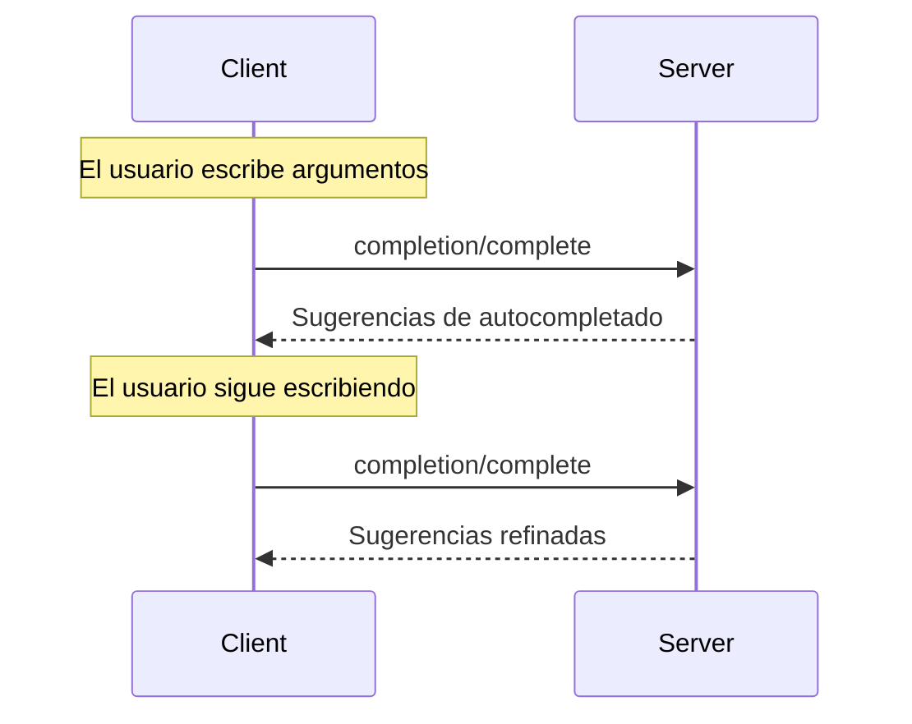

<Info>**Revisión del protocolo**: 2025-03-26</Info>

El Protocolo de Contexto del Modelo (MCP) proporciona una forma estandarizada para que los servidores ofrezcan sugerencias de autocompletado de argumentos para indicaciones y URI de recursos. Esto habilita experiencias ricas, similares a un IDE, en las que los usuarios reciben sugerencias contextuales mientras introducen valores de argumentos.

<div id="user-interaction-model">
  ## Modelo de interacción con el usuario
</div>

La función de autocompletado en MCP está diseñada para admitir experiencias de usuario interactivas similares al autocompletado de código en un IDE.

Por ejemplo, las aplicaciones pueden mostrar sugerencias de autocompletado en un menú desplegable o emergente mientras los usuarios escriben, con la posibilidad de filtrar y seleccionar entre las opciones disponibles.

No obstante, las implementaciones pueden exponer el autocompletado mediante cualquier patrón de interfaz que se ajuste a sus necesidades; el propio protocolo no impone ningún modelo específico de interacción con el usuario.

<div id="capabilities">
  ## Capacidades
</div>

Los servidores que admitan completions **DEBEN** declarar la capacidad `completions`:

```json
{
  "capabilities": {
    "completions": {}
  }
}
```

<div id="protocol-messages">
  ## Mensajes del protocolo
</div>

<div id="requesting-completions">
  ### Solicitud de completados
</div>

Para obtener sugerencias de autocompletado, los clientes envían una solicitud `completion/complete` especificando qué se está completando mediante un tipo de referencia:

**Solicitud:**

```json
{
  "jsonrpc": "2.0",
  "id": 1,
  "method": "completion/complete",
  "params": {
    "ref": {
      "type": "ref/prompt",
      "name": "code_review"
    },
    "argument": {
      "name": "language",
      "value": "py"
    }
  }
}
```

**Respuesta:**

```json
{
  "jsonrpc": "2.0",
  "id": 1,
  "result": {
    "completion": {
      "values": ["python", "pytorch", "pyside"],
      "total": 10,
      "hasMore": true
    }
  }
}
```

<div id="reference-types">
  ### Tipos de referencia
</div>

El protocolo admite dos tipos de referencias de finalización:

| Tipo           | Descripción                          | Ejemplo                                             |
| -------------- | ------------------------------------ | --------------------------------------------------- |
| `ref/prompt`   | Hace referencia a una indicación por nombre | `{"type": "ref/prompt", "name": "code_review"}`     |
| `ref/resource` | Hace referencia al URI de un recurso       | `{"type": "ref/resource", "uri": "file:///{path}"}` |

<div id="completion-results">
  ### Resultados de completado
</div>

Los servidores devuelven un arreglo de valores de completado ordenados por relevancia, con:

- Un máximo de 100 elementos por respuesta
- Número total opcional de coincidencias disponibles
- Un booleano que indica si existen resultados adicionales

<div id="message-flow">
  ## Flujo de mensajes
</div>



<div id="data-types">
  ## Tipos de datos
</div>

<div id="completerequest">
  ### CompleteRequest
</div>

- `ref`: Una `PromptReference` o `ResourceReference`
- `argument`: Objeto que contiene:
  - `name`: Nombre del argumento
  - `value`: Valor actual

<div id="completeresult">
  ### CompleteResult
</div>

- `completion`: Objeto que contiene:
  - `values`: Lista de sugerencias (máx. 100)
  - `total`: Total de coincidencias (opcional)
  - `hasMore`: Indicador de que hay más resultados

<div id="error-handling">
  ## Manejo de errores
</div>

Los servidores **DEBERÍAN** devolver errores estándar de JSON-RPC para casos de falla comunes:

- Método no encontrado: `-32601` (Capacidad no admitida)
- Nombre de indicación no válido: `-32602` (Parámetros no válidos)
- Falta de argumentos obligatorios: `-32602` (Parámetros no válidos)
- Errores internos: `-32603` (Error interno)

<div id="implementation-considerations">
  ## Consideraciones de implementación
</div>

1. Los servidores **DEBERÍAN**:
   - Devolver sugerencias ordenadas por relevancia
   - Implementar coincidencia difusa cuando corresponda
   - Limitar la frecuencia de las solicitudes de autocompletado
   - Validar todas las entradas

2. Los clientes **DEBERÍAN**:
   - Aplicar debounce a solicitudes de autocompletado rápidas
   - Almacenar en caché los resultados de autocompletado cuando corresponda
   - Manejar con solvencia los resultados faltantes o parciales

<div id="security">
  ## Seguridad
</div>

Las implementaciones **DEBEN**:

- Validar todas las entradas de completación
- Implementar una limitación de frecuencia adecuada
- Controlar el acceso a sugerencias sensibles
- Prevenir la divulgación de información a partir de completaciones