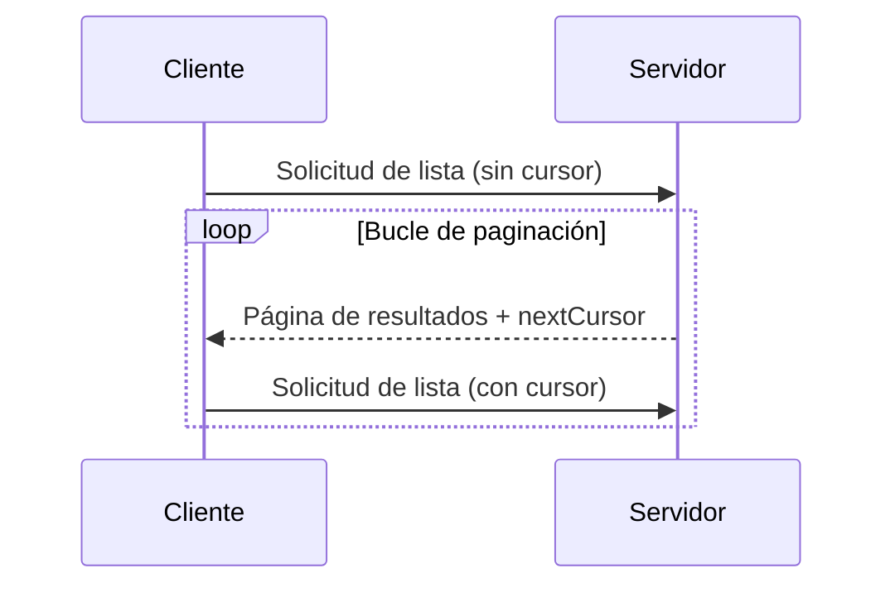

<Info>**Revisión del protocolo**: 2025-03-26</Info>

El Protocolo de Contexto del Modelo (MCP) admite la paginación de operaciones de listado que pueden devolver grandes conjuntos de resultados. La paginación permite que los servidores entreguen los resultados en bloques más pequeños, en lugar de todos de una vez.

La paginación es especialmente importante al conectarse a servicios externos a través de Internet, pero también es útil en integraciones locales para evitar problemas de rendimiento con conjuntos de datos voluminosos.

<div id="pagination-model">
  ## Modelo de paginación
</div>

La paginación en MCP utiliza un enfoque opaco basado en cursores, en lugar de páginas numeradas.

- El **cursor** es un token de cadena opaco que representa una posición en el conjunto de resultados
- El **tamaño de página** lo determina el servidor, y los clientes **NO DEBEN** asumir que es fijo

<div id="response-format">
  ## Formato de respuesta
</div>

La paginación comienza cuando el servidor envía una **respuesta** que incluye:

- La página actual de resultados
- Un campo opcional `nextCursor` si hay más resultados

```json
{
  "jsonrpc": "2.0",
  "id": "123",
  "result": {
    "resources": [...],
    "nextCursor": "eyJwYWdlIjogM30="
  }
}
```

<div id="request-format">
  ## Formato de la solicitud
</div>

Después de recibir un cursor, el cliente puede _continuar_ paginando enviando una solicitud
que incluya ese cursor:

```json
{
  "jsonrpc": "2.0",
  "method": "resources/list",
  "params": {
    "cursor": "eyJwYWdlIjogMn0="
  }
}
```

<div id="pagination-flow">
  ## Flujo de paginación
</div>



<div id="operations-supporting-pagination">
  ## Operaciones con soporte de paginación
</div>

Las siguientes operaciones del MCP admiten paginación:

- `resources/list` - Lista los recursos disponibles
- `resources/templates/list` - Lista las plantillas de recursos
- `prompts/list` - Lista las indicaciones disponibles
- `tools/list` - Lista las herramientas disponibles

<div id="implementation-guidelines">
  ## Directrices de implementación
</div>

1. Los servidores **DEBERÍAN**:
   - Proporcionar cursores estables
   - Gestionar adecuadamente los cursores no válidos

2. Los clientes **DEBERÍAN**:
   - Considerar la ausencia de `nextCursor` como el final de los resultados
   - Admitir flujos paginados y no paginados

3. Los clientes **DEBEN** tratar los cursoros como tokens opacos:
   - No hacer suposiciones sobre el formato del cursor
   - No intentar analizar ni modificar los cursores
   - No conservar los cursores entre sesiones

<div id="error-handling">
  ## Manejo de errores
</div>

Los cursores no válidos **DEBERÍAN** producir un error con el código -32602 (Parámetros no válidos).