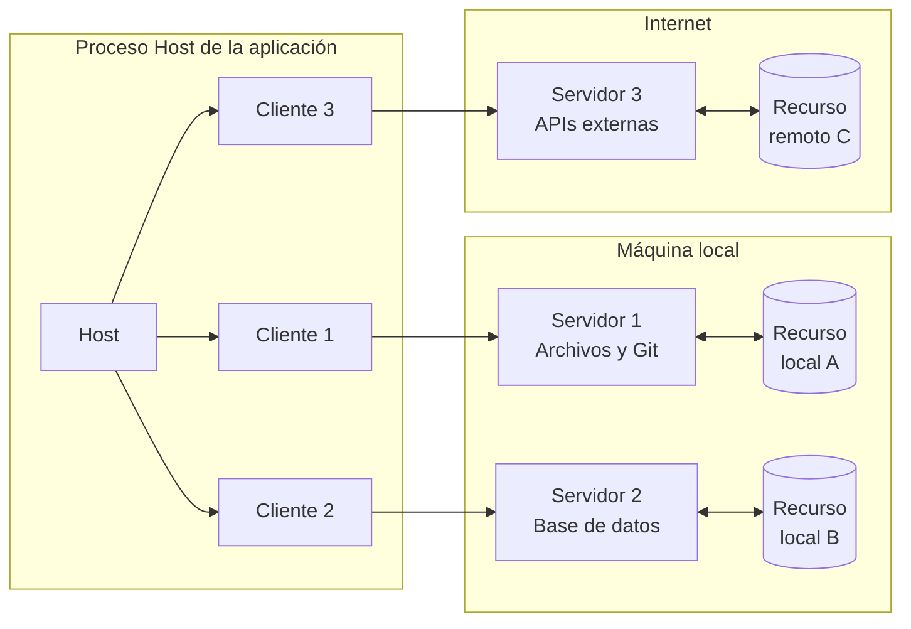
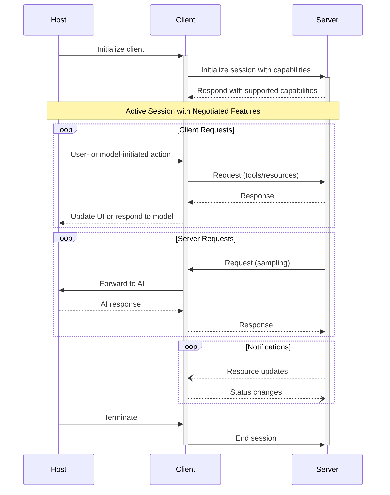

El Protocolo de Contexto de Modelo (MCP) sigue una arquitectura cliente-host-servidor, donde cada host puede ejecutar múltiples instancias de cliente. Esta arquitectura permite a los usuarios integrar capacidades de IA en diversas aplicaciones, manteniendo límites de seguridad claros y aislando responsabilidades. Basado en JSON-RPC 2.0, MCP proporciona un protocolo de sesión con estado, centrado en el intercambio de contexto y la coordinación del muestreo entre clientes y servidores.

  ## Componentes principales

  ### Host

El proceso host actúa como contenedor y coordinador:

* Crea y gestiona múltiples instancias de clientes
* Controla los permisos de conexión de los clientes y su ciclo de vida
* Aplica políticas de seguridad y requisitos de consentimiento
* Toma decisiones de autorización de usuarios
* Coordina la integración con IA/LLM y el muestreo
* Gestiona la agregación de contexto entre clientes

  ### Clientes

Cada cliente es creado por el Host de MCP y mantiene una conexión aislada con un servidor:

* Establece una sesión con estado por servidor
* Gestiona la negociación del protocolo y el intercambio de capacidades
* Enruta mensajes del protocolo en ambos sentidos
* Gestiona suscripciones y notificaciones
* Mantiene límites de seguridad entre servidores

Una aplicación host crea y gestiona múltiples clientes, y cada cliente tiene una relación 1:1
con un servidor concreto.

  ### Servidores

Los servidores proporcionan contexto y capacidades especializadas:

* Exponen recursos, herramientas e indicaciones mediante primitivas de MCP
* Operan de forma independiente con responsabilidades específicas
* Solicitan muestreo a través de interfaces del cliente
* Deben respetar las restricciones de seguridad
* Pueden ser procesos locales o servicios remotos

  ## Principios de diseño

MCP se basa en varios principios clave de diseño que guían su arquitectura e implementación:

1. **Los servidores deben ser extremadamente fáciles de crear**
   * Las aplicaciones host se encargan de la orquestación compleja
   * Los servidores se centran en capacidades específicas y bien definidas
   * Interfaces simples minimizan la carga de implementación
   * Una separación clara permite un código mantenible

2. **Los servidores deben ser altamente componibles**
   * Cada servidor ofrece funcionalidad enfocada de forma aislada
   * Se pueden combinar múltiples servidores sin fricciones
   * Un protocolo compartido habilita la interoperabilidad
   * El diseño modular facilita la extensibilidad

3. **Los servidores no deben poder leer toda la conversación ni “ver dentro” de otros servidores**
   * Los servidores reciben solo la información contextual necesaria
   * El historial completo de la conversación permanece con el host
   * Cada conexión de servidor mantiene el aislamiento
   * Las interacciones entre servidores están controladas por el host
   * El proceso del host aplica límites de seguridad

4. **Las funciones se pueden agregar a servidores y clientes de forma progresiva**
   * El protocolo base proporciona la funcionalidad mínima requerida
   * Las capacidades adicionales pueden negociarse según sea necesario
   * Servidores y clientes evolucionan de forma independiente
   * El protocolo está diseñado para la extensibilidad futura
   * Se mantiene la compatibilidad con versiones anteriores

  ## Negociación de Capacidades

El Protocolo de Contexto de Modelo (MCP) utiliza un sistema de negociación basado en capacidades en el que clientes y
servidores declaran explícitamente las funciones que admiten durante la inicialización. Las capacidades
determinan qué funciones y primitivas del protocolo están disponibles durante una sesión.

* Los servidores declaran capacidades como suscripciones a recursos, soporte de herramientas y plantillas de
  indicaciones
* Los clientes declaran capacidades como soporte de muestreo y manejo de notificaciones
* Ambas partes deben respetar las capacidades declaradas durante toda la sesión
* Se pueden negociar capacidades adicionales mediante extensiones del protocolo

Cada capacidad habilita funciones específicas del protocolo para su uso durante la sesión. Por
ejemplo:

* Las [funciones del servidor](/es/specification/2025-06-18/server) implementadas deben anunciarse en las
  capacidades del servidor
* Emitir notificaciones de suscripción a recursos requiere que el servidor declare
  soporte de suscripciones
* La invocación de herramientas requiere que el servidor declare capacidades de herramientas
* El [muestreo](/es/specification/2025-06-18/client) requiere que el cliente declare soporte en sus
  capacidades

Esta negociación de capacidades garantiza que clientes y servidores tengan un entendimiento claro de la
funcionalidad admitida, a la vez que mantiene la extensibilidad del protocolo.