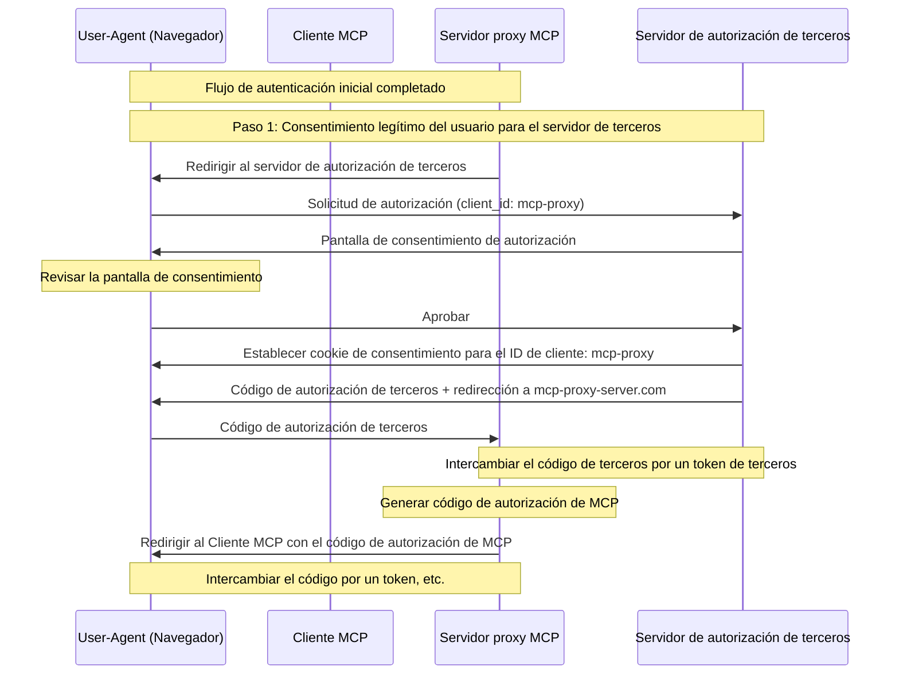
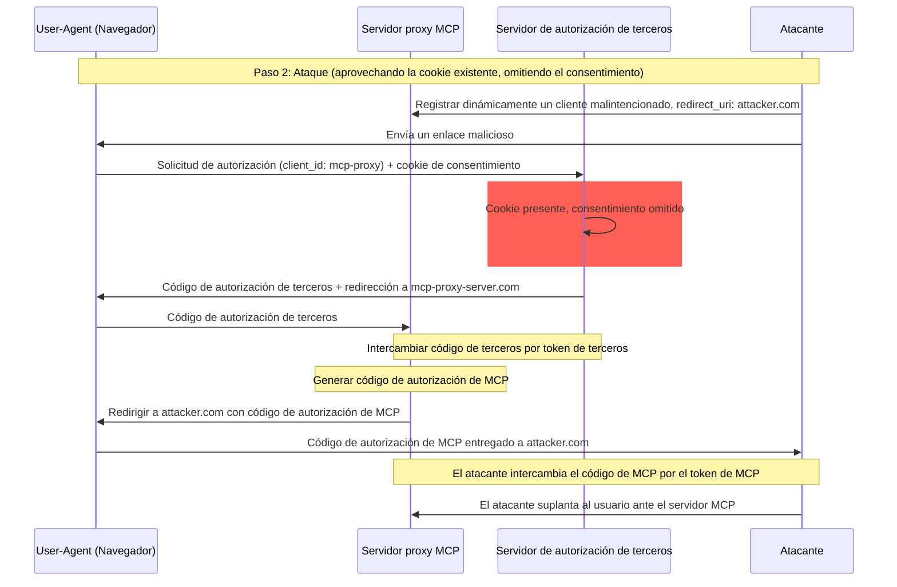
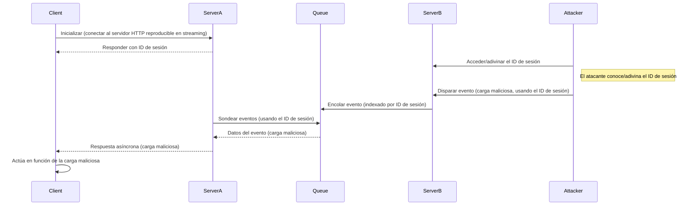
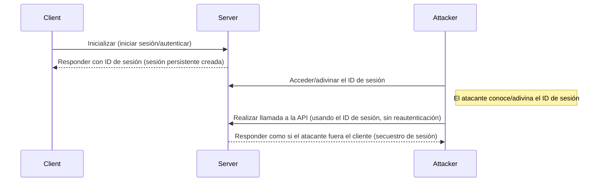

  ## Introducción

  ### Propósito y alcance

Este documento presenta consideraciones de seguridad para el Protocolo de Contexto de Modelo (MCP), y complementa la especificación de autorización de MCP. Identifica riesgos de seguridad, vectores de ataque y prácticas recomendadas específicas para implementaciones de MCP.

La audiencia principal de este documento incluye a los desarrolladores que implementan flujos de autorización de MCP, a los operadores de Servidor MCP y a los profesionales de seguridad que evalúan sistemas basados en MCP. Este documento debe leerse junto con la especificación de autorización de MCP y las [mejores prácticas de seguridad de OAuth 2.0](https://datatracker.ietf.org/doc/html/rfc9700).

  ## Ataques y mitigaciones

Esta sección ofrece una descripción detallada de los ataques a las implementaciones de MCP, junto con posibles contramedidas.

  ### Problema del delegado confundido

Los atacantes pueden explotar Servidores MCP que actúan como proxy de otros servidores de Recursos, creando vulnerabilidades de &quot;[delegado confundido](https://en.wikipedia.org/wiki/Confused_deputy_problem)&quot;.

  #### Terminología

**Servidor proxy MCP**
: Un servidor MCP que conecta clientes MCP con API de terceros, ofreciendo funciones MCP mientras delega operaciones y actuando como un único cliente OAuth ante el servidor de la API de terceros.

**Servidor de autorización de terceros**
: Servidor de autorización que protege la API de terceros. Puede carecer de compatibilidad con el registro dinámico de clientes, lo que obliga al proxy MCP a usar un ID de cliente estático para todas las solicitudes.

**API de terceros**
: El servidor de recursos protegido que proporciona la funcionalidad real de la API. El acceso a esta API requiere tokens emitidos por el servidor de autorización de terceros.

**ID de cliente estático**
: Identificador de cliente fijo de OAuth 2.0 utilizado por el servidor proxy MCP al comunicarse con el servidor de autorización de terceros. Este ID de cliente se refiere al servidor MCP cuando actúa como cliente de la API de terceros. Es el mismo valor para todas las interacciones del servidor MCP con la API de terceros, independientemente de qué cliente MCP inició la solicitud.

  #### Arquitectura y flujos de ataque

  ##### Uso normal de proxy OAuth (preserva el consentimiento del usuario)

  ##### Uso malintencionado de proxy OAuth (omite el consentimiento del usuario)

  #### Descripción del ataque

Cuando un servidor proxy MCP utiliza un ID de cliente estático para autenticarse ante un servidor de autorización de terceros que no admite el registro dinámico de clientes, se vuelve posible el siguiente ataque:

1. Un usuario se autentica normalmente a través del servidor proxy MCP para acceder a la API de terceros
2. Durante este flujo, el servidor de autorización de terceros establece una cookie en el agente de usuario
   que indica el consentimiento para el ID de cliente estático
3. Más tarde, un atacante envía al usuario un enlace malicioso que contiene una solicitud de autorización manipulada que incluye un URI de redirección malicioso junto con un nuevo ID de cliente registrado dinámicamente
4. Cuando el usuario hace clic en el enlace, su navegador aún conserva la cookie de consentimiento de la solicitud legítima anterior
5. El servidor de autorización de terceros detecta la cookie y omite la pantalla de consentimiento
6. El código de autorización MCP se redirige al servidor del atacante (especificado en el redirect&#95;uri manipulado durante el registro dinámico del cliente)
7. El atacante canjea el código de autorización robado por tokens de acceso para el servidor MCP sin la aprobación explícita del usuario
8. El atacante ahora tiene acceso a la API de terceros como si fuera el usuario comprometido

  #### Mitigación

Los servidores proxy de MCP que utilicen identificadores de cliente estáticos **DEBEN** obtener el consentimiento del usuario para cada cliente registrado dinámicamente antes de reenviar la solicitud a servidores de autorización de terceros (que pueden requerir consentimiento adicional).

  ### Transferencia de tokens

La &quot;transferencia de tokens&quot; es un antipatrón en el que un Servidor MCP acepta tokens de un Cliente MCP sin validar que dichos tokens fueron emitidos correctamente *para el Servidor MCP* y los &quot;pasa a través&quot; a la API aguas abajo.

  #### Riesgos

El traspaso de tokens está explícitamente prohibido en la [especificación de autorización](/es/specification/2025-06-18/basic/authorization) porque introduce varios riesgos de seguridad, entre ellos:

* **Evasión de controles de seguridad**
  * El Servidor MCP o las API posteriores (downstream) pueden implementar controles de seguridad importantes como limitación de tasa, validación de solicitudes o monitoreo de tráfico, que dependen de la audiencia del token u otras restricciones de credenciales. Si los clientes pueden obtener y usar tokens directamente con las API posteriores sin que el Servidor MCP los valide correctamente o garantice que los tokens se emiten para el servicio adecuado, se eluden estos controles.
* **Problemas de responsabilidad y trazabilidad**
  * El Servidor MCP no podrá identificar ni distinguir entre Clientes MCP cuando los clientes llamen con un token de acceso emitido por un sistema anterior (upstream) que puede ser opaco para el Servidor MCP.
  * Los registros del Servidor de Recursos posterior pueden mostrar solicitudes que parecen provenir de una fuente diferente, con otra identidad, en lugar del Servidor MCP que realmente está reenviando los tokens.
  * Ambos factores dificultan la investigación de incidentes, la aplicación de controles y la auditoría.
  * Si el Servidor MCP pasa tokens sin validar sus declaraciones (p. ej., roles, privilegios o audiencia) u otros metadatos, un actor malicioso en posesión de un token robado puede usar el servidor como proxy para exfiltrar datos.
* **Problemas con los límites de confianza**
  * El Servidor de Recursos posterior confía en entidades específicas. Esta confianza puede incluir suposiciones sobre el origen o patrones de comportamiento del cliente. Romper este límite de confianza puede provocar problemas inesperados.
  * Si el token es aceptado por varios servicios sin una validación adecuada, un atacante que comprometa uno de ellos puede usar el token para acceder a otros servicios conectados.
* **Riesgo de compatibilidad futura**
  * Incluso si hoy un Servidor MCP empieza como un “proxy puro”, podría necesitar añadir controles de seguridad más adelante. Empezar con una separación adecuada de la audiencia del token facilita la evolución del modelo de seguridad.

  #### Mitigación

Los servidores MCP **NO DEBEN** aceptar ningún token que no haya sido emitido explícitamente para el servidor MCP.

  ### Secuestro de sesión

El secuestro de sesión es un vector de ataque en el que el servidor proporciona a un cliente un identificador de sesión y una parte no autorizada logra obtener y utilizar ese mismo identificador para hacerse pasar por el cliente original y realizar acciones no autorizadas en su nombre.

  #### Inyección de indicaciones por secuestro de sesión

  #### Suplantación mediante secuestro de sesión

  #### Descripción del ataque

Cuando hay varios servidores HTTP con estado que manejan solicitudes MCP, son posibles los siguientes vectores de ataque:

**Inyección de indicaciones mediante secuestro de sesión**

1. El cliente se conecta al **Servidor A** y recibe un ID de sesión.

2. El atacante obtiene un ID de sesión existente y envía un evento malicioso al **Servidor B** con dicho ID de sesión.
   * Cuando un servidor admite [reentrega/streams reanudables](/es/specification/2025-06-18/basic/transports#resumability-and-redelivery), finalizar deliberadamente la solicitud antes de recibir la respuesta podría hacer que el cliente original la reanude mediante la solicitud GET para eventos enviados por el servidor.
   * Si un servidor en particular inicia eventos enviados por el servidor como consecuencia de una llamada de herramienta como `notifications/tools/list_changed`, donde es posible afectar las Herramientas que ofrece el servidor, un cliente podría acabar con Herramientas que no sabía que estaban habilitadas.

3. **Servidor B** pone en cola el evento (asociado con el ID de sesión) en una cola compartida.

4. **Servidor A** consulta la cola en busca de eventos usando el ID de sesión y recupera la carga maliciosa.

5. **Servidor A** envía la carga maliciosa al cliente como una respuesta asíncrona o reanudada.

6. El cliente recibe y actúa sobre la carga maliciosa, lo que puede derivar en una posible vulneración.

**Suplantación mediante secuestro de sesión**

1. El Cliente MCP se autentica con el Servidor MCP, creando un ID de sesión persistente.
2. El atacante obtiene el ID de sesión.
3. El atacante realiza llamadas al Servidor MCP usando el ID de sesión.
4. El Servidor MCP no verifica autorización adicional y trata al atacante como un usuario legítimo, permitiendo acceso o acciones no autorizadas.

  #### Mitigación

Para prevenir el secuestro de sesión y los ataques de inyección de eventos, se deben implementar las siguientes mitigaciones:

Los servidores MCP que implementen autorización **DEBEN** verificar todas las solicitudes entrantes.
Los servidores MCP **NO DEBEN** usar sesiones para autenticación.

Los servidores MCP **DEBEN** usar identificadores de sesión seguros y no deterministas.
Los identificadores de sesión generados (p. ej., UUID) **DEBERÍAN** usar generadores de números aleatorios seguros. Evite identificadores de sesión predecibles o secuenciales que puedan ser adivinados por un atacante. Rotar o expirar los identificadores de sesión también puede reducir el riesgo.

Los servidores MCP **DEBERÍAN** vincular los identificadores de sesión a información específica del usuario.
Al almacenar o transmitir datos relacionados con la sesión (p. ej., en una cola), combine el identificador de sesión con información única del usuario autorizado, como su ID de usuario interno. Use un formato de clave como `<user_id>:<session_id>`. Esto garantiza que, incluso si un atacante adivina un identificador de sesión, no pueda hacerse pasar por otro usuario, ya que el ID de usuario se deriva del token del usuario y no es proporcionado por el cliente.

Los servidores MCP pueden, opcionalmente, aprovechar identificadores únicos adicionales.