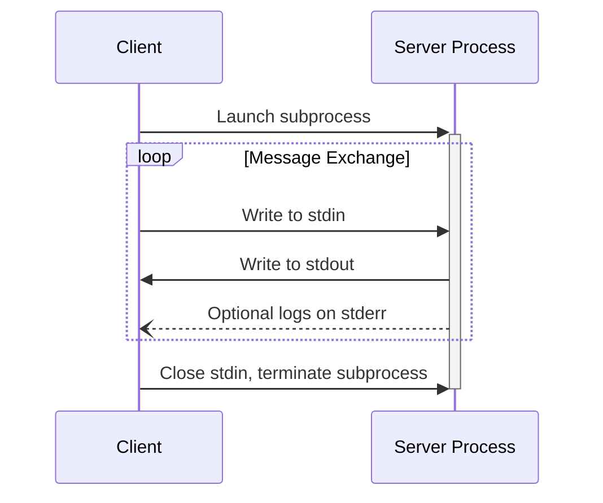
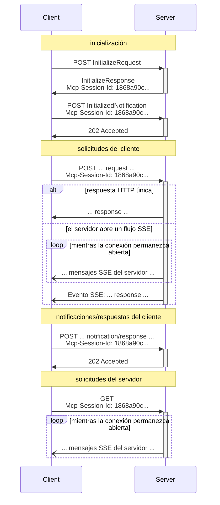

<Info>**Revisión del protocolo**: 2025-06-18</Info>

MCP utiliza JSON-RPC para codificar los mensajes. Los mensajes JSON-RPC **DEBEN** estar codificados en UTF-8.

Actualmente, el protocolo define dos mecanismos de transporte estándar para la comunicación entre cliente y servidor:

1. [stdio](#stdio), comunicación por la entrada y salida estándar
2. [HTTP transmitible](#streamable-http)

Los clientes **DEBERÍAN** ser compatibles con stdio siempre que sea posible.

También es posible que clientes y servidores implementen
[transportes personalizados](#custom-transports) de forma modular.

  ## stdio

En el transporte **stdio**:

* El cliente inicia el Servidor MCP como un subproceso.
* El servidor lee mensajes JSON-RPC de su entrada estándar (`stdin`) y envía mensajes
  a su salida estándar (`stdout`).
* Los mensajes son solicitudes, notificaciones o respuestas individuales de JSON-RPC.
* Los mensajes están delimitados por saltos de línea y **NO DEBEN** contener saltos de línea insertados.
* El servidor **PUEDE** escribir cadenas UTF-8 en su error estándar (`stderr`) con fines de
  registro. Los clientes **PUEDEN** capturar, reenviar o ignorar estos registros.
* El servidor **NO DEBE** escribir nada en su `stdout` que no sea un mensaje MCP válido.
* El cliente **NO DEBE** escribir nada en el `stdin` del servidor que no sea un
  mensaje MCP válido.

  ## HTTP transmitible

<Info>
  Esto sustituye el [transporte HTTP+SSE](/es/specification/2024-11-05/basic/transports#http-with-sse) de la versión del protocolo 2024-11-05. Consulta la guía de [compatibilidad con versiones anteriores](#backwards-compatibility) a continuación.
</Info>

En el transporte **HTTP transmitible**, el servidor se ejecuta como un proceso independiente que puede manejar múltiples conexiones de clientes. Este transporte utiliza solicitudes HTTP POST y GET. El servidor puede, opcionalmente, utilizar [eventos enviados por el servidor](https://en.wikipedia.org/wiki/Server-sent_events) (SSE) para transmitir múltiples mensajes desde el servidor. Esto permite tanto servidores MCP básicos como servidores más completos que admiten transmisión y notificaciones y solicitudes del servidor al cliente.

El servidor **DEBE** proporcionar una única ruta de endpoint HTTP (en adelante, el **endpoint MCP**) que admita los métodos POST y GET. Por ejemplo, podría ser una URL como `https://example.com/mcp`.

  #### Advertencia de seguridad

Al implementar el transporte HTTP transmitible:

1. Los servidores **DEBEN** validar el encabezado `Origin` en todas las conexiones entrantes para prevenir ataques de DNS rebinding
2. Cuando se ejecute localmente, los servidores **DEBERÍAN** vincularse solo a localhost (127.0.0.1) en lugar de a todas las interfaces de red (0.0.0.0)
3. Los servidores **DEBERÍAN** implementar una autenticación adecuada para todas las conexiones

Sin estas protecciones, los atacantes podrían usar DNS rebinding para interactuar con servidores MCP locales desde sitios web remotos.

  ### Enviar mensajes al servidor

Cada mensaje JSON-RPC enviado desde el cliente **DEBE** ser una nueva solicitud HTTP POST al
punto de conexión de MCP.

1. El cliente **DEBE** usar HTTP POST para enviar mensajes JSON-RPC al punto de conexión de MCP.
2. El cliente **DEBE** incluir un encabezado `Accept`, que liste `application/json` y
   `text/event-stream` como tipos de contenido admitidos.
3. El cuerpo de la solicitud POST **DEBE** ser una única *solicitud*, *notificación* o *respuesta* JSON-RPC.
4. Si la entrada es una *respuesta* o *notificación* JSON-RPC:
   * Si el servidor acepta la entrada, **DEBE** devolver el código de estado HTTP 202
     Accepted sin cuerpo.
   * Si el servidor no puede aceptar la entrada, **DEBE** devolver un código de estado de error HTTP
     (p. ej., 400 Bad Request). El cuerpo de la respuesta HTTP **PUEDE** consistir en una *respuesta
     de error* JSON-RPC sin `id`.
5. Si la entrada es una *solicitud* JSON-RPC, el servidor **DEBE** devolver
   `Content-Type: text/event-stream`, para iniciar un flujo SSE, o
   `Content-Type: application/json`, para devolver un objeto JSON. El cliente **DEBE**
   admitir ambos casos.
6. Si el servidor inicia un flujo SSE:
   * El flujo SSE **DEBERÍA** incluir eventualmente una *respuesta* JSON-RPC para la
     *solicitud* JSON-RPC enviada en el cuerpo del POST.
   * El servidor **PUEDE** enviar *solicitudes* y *notificaciones* JSON-RPC antes de enviar la
     *respuesta* JSON-RPC. Estos mensajes **DEBERÍAN** estar relacionados con la *solicitud*
     original del cliente.
   * El servidor **NO DEBERÍA** cerrar el flujo SSE antes de enviar la *respuesta* JSON-RPC
     para la *solicitud* JSON-RPC recibida, a menos que la [sesión](#session-management)
     expire.
   * Después de enviar la *respuesta* JSON-RPC, el servidor **DEBERÍA** cerrar el flujo
     SSE.
   * La desconexión **PUEDE** ocurrir en cualquier momento (p. ej., debido a condiciones de red).
     Por lo tanto:
     * La desconexión **NO DEBERÍA** interpretarse como que el cliente cancela su solicitud.
     * Para cancelar, el cliente **DEBERÍA** enviar explícitamente una `CancelledNotification` de MCP.
     * Para evitar la pérdida de mensajes debido a la desconexión, el servidor **PUEDE** hacer que el flujo sea
       [reanudable](#resumability-and-redelivery).

  ### Escuchar mensajes del servidor

1. El cliente **PUEDE** realizar un HTTP GET al endpoint de MCP. Esto puede usarse para abrir un
   flujo SSE, lo que permite que el servidor se comunique con el cliente sin que el cliente
   envíe primero datos mediante HTTP POST.
2. El cliente **DEBE** incluir un encabezado `Accept` que incluya `text/event-stream` como
   tipo de contenido admitido.
3. El servidor **DEBE** devolver `Content-Type: text/event-stream` en respuesta a
   este HTTP GET, o bien devolver HTTP 405 Method Not Allowed, lo que indica que el servidor
   no ofrece un flujo SSE en este endpoint.
4. Si el servidor inicia un flujo SSE:
   * El servidor **PUEDE** enviar *solicitudes* y *notificaciones* JSON-RPC en el flujo.
   * Estos mensajes **DEBERÍAN** ser independientes de cualquier *solicitud* JSON-RPC
     en ejecución concurrente desde el cliente.
   * El servidor **NO DEBE** enviar una *respuesta* JSON-RPC en el flujo **a menos que**
     [reanude](#resumability-and-redelivery) un flujo asociado con una solicitud previa del
     cliente.
   * El servidor **PUEDE** cerrar el flujo SSE en cualquier momento.
   * El cliente **PUEDE** cerrar el flujo SSE en cualquier momento.

  ### Conexiones múltiples

1. El cliente **PUEDE** permanecer conectado a varios flujos SSE simultáneamente.
2. El servidor **DEBE** enviar cada uno de sus mensajes JSON-RPC en un solo flujo de los
   conectados; es decir, **NO DEBE** retransmitir el mismo mensaje a través de varios flujos.
   * El riesgo de pérdida de mensajes **PUEDE** mitigarse haciendo que el flujo sea
     [reanudable](#resumability-and-redelivery).

  ### Reanudación y reentrega

Para admitir la reanudación de conexiones interrumpidas y la reentrega de mensajes que, de otro modo, podrían perderse:

1. Los servidores **PUEDEN** adjuntar un campo `id` a sus eventos SSE, como se describe en el
   [estándar SSE](https://html.spec.whatwg.org/multipage/server-sent-events.html#event-stream-interpretation).
   * Si está presente, el ID **DEBE** ser globalmente único en todos los flujos dentro de esa
     [sesión](#session-management), o en todos los flujos con ese cliente específico, si no se usa la gestión de sesiones.
2. Si el cliente desea reanudar tras una conexión interrumpida, **DEBERÍA** realizar una solicitud HTTP
   GET al endpoint de MCP e incluir la cabecera
   [`Last-Event-ID`](https://html.spec.whatwg.org/multipage/server-sent-events.html#the-last-event-id-header)
   para indicar el último ID de evento que recibió.
   * El servidor **PUEDE** usar esta cabecera para reproducir los mensajes que se habrían enviado
     después del último ID de evento, *en el flujo que se desconectó*, y reanudar el
     flujo desde ese punto.
   * El servidor **NO DEBE** reproducir mensajes que se habrían entregado en un
     flujo diferente.

En otras palabras, estos ID de evento deben ser asignados por los servidores por *flujo*, para actuar como un cursor dentro de ese flujo en particular.

  ### Gestión de sesiones

Una &quot;sesión&quot; de MCP consiste en interacciones lógicamente relacionadas entre un cliente y un
servidor, que comienzan con la [fase de inicialización](/es/specification/2025-06-18/basic/lifecycle). Para admitir
servidores que deseen establecer sesiones con estado:

1. Un servidor que use el transporte HTTP transmitible **PUEDE** asignar un ID de sesión en
   el momento de la inicialización, incluyéndolo en un encabezado `Mcp-Session-Id` en la
   respuesta HTTP que contiene el `InitializeResult`.
   * El ID de sesión **DEBERÍA** ser globalmente único y criptográficamente seguro (p. ej., un
     UUID generado de forma segura, un JWT o un hash criptográfico).
   * El ID de sesión **DEBE** contener solo caracteres ASCII visibles (en el rango de 0x21 a
     0x7E).
2. Si el servidor devuelve un `Mcp-Session-Id` durante la inicialización, los clientes que usen
   el transporte HTTP transmitible **DEBEN** incluirlo en el encabezado `Mcp-Session-Id` en
   todas sus solicitudes HTTP posteriores.
   * Los servidores que requieran un ID de sesión **DEBERÍAN** responder a las solicitudes sin
     el encabezado `Mcp-Session-Id` (distintas de la inicialización) con HTTP 400 Bad Request.
3. El servidor **PUEDE** terminar la sesión en cualquier momento, tras lo cual **DEBE** responder
   a las solicitudes que contengan ese ID de sesión con HTTP 404 Not Found.
4. Cuando un cliente reciba un HTTP 404 en respuesta a una solicitud que contenga un
   `Mcp-Session-Id`, **DEBE** iniciar una nueva sesión enviando un nuevo `InitializeRequest`
   sin adjuntar un ID de sesión.
5. Los clientes que ya no necesiten una sesión en particular (p. ej., porque el usuario está saliendo
   de la aplicación cliente) **DEBERÍAN** enviar un HTTP DELETE al endpoint de MCP con el
   encabezado `Mcp-Session-Id`, para terminar explícitamente la sesión.
   * El servidor **PUEDE** responder a esta solicitud con HTTP 405 Method Not Allowed,
     indicando que no permite que los clientes terminen sesiones.

  ### Diagrama de secuencia

  ### Encabezado de versión del protocolo

Si se utiliza HTTP, el cliente **DEBE** incluir el encabezado HTTP `MCP-Protocol-Version: <protocol-version>` en todas las solicitudes posteriores al servidor MCP, lo que permite que el servidor MCP responda según la versión del Protocolo MCP.

Por ejemplo: `MCP-Protocol-Version: 2025-06-18`

La versión del protocolo enviada por el cliente **DEBERÍA** ser la [negociada durante
la inicialización](/es/specification/2025-06-18/basic/lifecycle#version-negotiation).

Para mantener la compatibilidad retroactiva, si el servidor *no* recibe un encabezado `MCP-Protocol-Version`
y no tiene otra forma de identificar la versión —por ejemplo, basándose en la
versión del protocolo negociada durante la inicialización— el servidor **DEBERÍA** asumir la
versión del protocolo `2025-03-26`.

Si el servidor recibe una solicitud con un `MCP-Protocol-Version` no válido o no compatible,
**DEBE** responder con `400 Bad Request`.

  ### Compatibilidad con versiones anteriores

Los clientes y servidores pueden mantener compatibilidad con el [transporte HTTP+SSE
en desuso](/es/specification/2024-11-05/basic/transports#http-with-sse) (desde
la versión de protocolo 2024-11-05) de la siguiente manera:

**Servidores** que quieran admitir clientes anteriores deberían:

* Seguir publicando tanto los endpoints SSE como POST del transporte antiguo, junto con el
  nuevo &quot;endpoint MCP&quot; definido para el transporte HTTP transmitible.
  * También es posible combinar el endpoint POST antiguo y el nuevo endpoint MCP, pero
    esto puede introducir una complejidad innecesaria.

**Clientes** que quieran admitir servidores anteriores deberían:

1. Aceptar una URL de Servidor MCP proporcionada por el usuario, que puede apuntar a un servidor que use
   el transporte antiguo o el nuevo.
2. Intentar enviar mediante POST un `InitializeRequest` a la URL del servidor, con un encabezado `Accept` como
   se definió arriba:
   * Si tiene éxito, el cliente puede suponer que se trata de un servidor que admite el nuevo transporte
     HTTP transmitible.
   * Si falla con un código de estado HTTP 4xx (p. ej., 405 Method Not Allowed o 404 Not
     Found):
     * Hacer una solicitud GET a la URL del servidor, esperando que esto abra un flujo SSE
       y devuelva un evento `endpoint` como primer evento.
     * Cuando llegue el evento `endpoint`, el cliente puede suponer que se trata de un servidor que ejecuta
       el transporte HTTP+SSE antiguo y debería usar ese transporte para toda la comunicación
       posterior.

  ## Transportes personalizados

Los clientes y servidores **PUEDEN** implementar mecanismos de transporte personalizados adicionales para satisfacer sus necesidades específicas. El protocolo es agnóstico al transporte y puede implementarse sobre cualquier canal de comunicación que admita el intercambio bidireccional de mensajes.

Quienes opten por admitir transportes personalizados **DEBEN** asegurarse de preservar el formato de mensajes y los requisitos del ciclo de vida de JSON-RPC 2.0 definidos por el Protocolo de Contexto de Modelo (MCP). Los transportes personalizados **DEBERÍAN** documentar sus patrones específicos de establecimiento de conexión e intercambio de mensajes para facilitar la interoperabilidad.