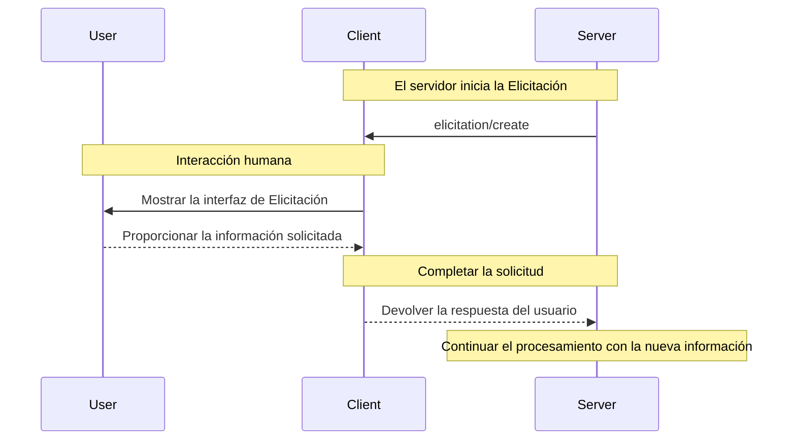

<div id="enable-section-numbers" />

<Info>**Revisión del protocolo**: 2025-06-18</Info>

<Note>
  Elicitación se introduce por primera vez en esta versión de la especificación de MCP y su diseño puede evolucionar en futuras versiones del protocolo.
</Note>

El Protocolo de Contexto de Modelo (MCP) proporciona una forma estandarizada para que los servidores soliciten información adicional a las personas usuarias a través del cliente durante las interacciones. Este flujo permite que los clientes mantengan el control sobre las interacciones y el intercambio de datos, a la vez que habilita a los servidores a recopilar dinámicamente la información necesaria.
Los servidores solicitan datos estructurados a las personas usuarias mediante esquemas JSON para validar las respuestas.

<div id="user-interaction-model">
  ## Modelo de interacción con el usuario
</div>

La Elicitación en MCP permite que los servidores implementen flujos de trabajo interactivos al habilitar que las solicitudes de entrada del usuario ocurran *de forma anidada* dentro de otras funciones del Servidor MCP.

Las implementaciones pueden exponer la elicitación mediante cualquier patrón de interfaz que se ajuste a sus necesidades; el protocolo en sí no exige ningún modelo específico de interacción con el usuario.

<Warning>
  Por motivos de confianza, seguridad y protección:

  * Los servidores **NO DEBEN** usar la elicitación para solicitar información sensible.

  Las aplicaciones **DEBERÍAN**:

  * Proporcionar una interfaz que deje claro qué servidor está solicitando información
  * Permitir a los usuarios revisar y modificar sus respuestas antes de enviarlas
  * Respetar la privacidad del usuario y ofrecer opciones claras para rechazar y cancelar
</Warning>

<div id="capabilities">
  ## Capacidades
</div>

Los clientes que admitan la Elicitación **DEBEN** declarar la capacidad `elicitation` durante la
[inicialización](/es/specification/2025-06-18/basic/lifecycle#initialization):

```json
{
  "capabilities": {
    "elicitation": {}
  }
}
```

<div id="protocol-messages">
  ## Mensajes del protocolo
</div>

<div id="creating-elicitation-requests">
  ### Creación de solicitudes de Elicitación
</div>

Para solicitar información a un usuario, los servidores envían una solicitud `elicitation/create`:

<div id="simple-text-request">
  #### Solicitud de texto simple
</div>

**Solicitud:**

```json
{
  "jsonrpc": "2.0",
  "id": 1,
  "method": "elicitation/create",
  "params": {
    "message": "Por favor, indica tu nombre de usuario de GitHub",
    "requestedSchema": {
      "type": "object",
      "properties": {
        "name": {
          "type": "string"
        }
      },
      "required": ["name"]
    }
  }
}
```

**Respuesta:**

```json
{
  "jsonrpc": "2.0",
  "id": 1,
  "result": {
    "action": "accept",
    "content": {
      "name": "octocat"
    }
  }
}
```

<div id="structured-data-request">
  #### Solicitud de datos estructurados
</div>

**Solicitud:**

```json
{
  "jsonrpc": "2.0",
  "id": 2,
  "method": "elicitation/create",
  "params": {
    "message": "Por favor, proporciona tu información de contacto",
    "requestedSchema": {
      "type": "object",
      "properties": {
        "name": {
          "type": "string",
          "description": "Tu nombre completo"
        },
        "email": {
          "type": "string",
          "format": "email",
          "description": "Tu dirección de correo electrónico"
        },
        "age": {
          "type": "number",
          "minimum": 18,
          "description": "Tu edad"
        }
      },
      "required": ["name", "email"]
    }
  }
}
```

**Respuesta:**

```json
{
  "jsonrpc": "2.0",
  "id": 2,
  "result": {
    "action": "accept",
    "content": {
      "name": "Monalisa Octocat",
      "email": "octocat@github.com",
      "age": 30
    }
  }
}
```

**Ejemplo de respuesta de rechazo:**

```json
{
  "jsonrpc": "2.0",
  "id": 2,
  "result": {
    "action": "decline"
  }
}
```

**Ejemplo de respuesta de cancelación:**

```json
{
  "jsonrpc": "2.0",
  "id": 2,
  "result": {
    "action": "cancel"
  }
}
```

<div id="message-flow">
  ## Flujo de mensajes
</div>



<div id="request-schema">
  ## Esquema de solicitud
</div>

El campo `requestedSchema` permite a los servidores definir la estructura de la respuesta esperada utilizando un subconjunto restringido de JSON Schema. Para simplificar la implementación en los clientes, los esquemas de Elicitación se limitan a objetos planos con propiedades primitivas únicamente:

```json
"requestedSchema": {
  "type": "object",
  "properties": {
    "propertyName": {
      "type": "string",
      "title": "Display Name",
      "description": "Description of the property"
    },
    "anotherProperty": {
      "type": "number",
      "minimum": 0,
      "maximum": 100
    }
  },
  "required": ["propertyName"]
}
```

<div id="supported-schema-types">
  ### Tipos de esquemas admitidos
</div>

El esquema se limita a estos tipos primitivos:

1. **Esquema de cadena**

   ```json
   {
     "type": "string",
     "title": "Display Name",
     "description": "Description text",
     "minLength": 3,
     "maxLength": 50,
     "format": "email" // Admitidos: "email", "uri", "date", "date-time"
   }
   ```

   Formatos admitidos: `email`, `uri`, `date`, `date-time`

2. **Esquema numérico**

   ```json
   {
     "type": "number", // o "integer"
     "title": "Display Name",
     "description": "Description text",
     "minimum": 0,
     "maximum": 100
   }
   ```

3. **Esquema booleano**

   ```json
   {
     "type": "boolean",
     "title": "Display Name",
     "description": "Description text",
     "default": false
   }
   ```

4. **Esquema de enumeración**
   ```json
   {
     "type": "string",
     "title": "Display Name",
     "description": "Description text",
     "enum": ["option1", "option2", "option3"],
     "enumNames": ["Option 1", "Option 2", "Option 3"]
   }
   ```

Los clientes pueden usar este esquema para:

1. Generar formularios de entrada adecuados
2. Validar la entrada del usuario antes de enviarla
3. Ofrecer una mejor orientación a los usuarios

Tenga en cuenta que las estructuras anidadas complejas, los arreglos de objetos y otras funciones avanzadas de JSON Schema no se admiten intencionadamente para simplificar la implementación del cliente.

<div id="response-actions">
  ## Acciones de respuesta
</div>

Las respuestas de Elicitación usan un modelo de tres acciones para distinguir claramente entre diferentes acciones del usuario:

```json
{
  "jsonrpc": "2.0",
  "id": 1,
  "result": {
    "action": "accept", // or "decline" or "cancel"
    "content": {
      "propertyName": "value",
      "anotherProperty": 42
    }
  }
}
```

Las tres acciones de respuesta son:

1. **Aceptar** (`action: "accept"`): El usuario aprobó explícitamente y envió datos
   * El campo `content` contiene los datos enviados que se ajustan al esquema solicitado
   * Ejemplo: El usuario hizo clic en &quot;Enviar&quot;, &quot;OK&quot;, &quot;Confirmar&quot;, etc.

2. **Rechazar** (`action: "decline"`): El usuario rechazó explícitamente la solicitud
   * El campo `content` normalmente se omite
   * Ejemplo: El usuario hizo clic en &quot;Rechazar&quot;, &quot;No&quot;, etc.

3. **Cancelar** (`action: "cancel"`): El usuario cerró/desechó sin tomar una decisión explícita
   * El campo `content` normalmente se omite
   * Ejemplo: El usuario cerró el cuadro de diálogo, hizo clic fuera, presionó Escape, etc.

Los servidores deben manejar cada estado adecuadamente:

* **Aceptar**: Procesar los datos enviados
* **Rechazar**: Manejar el rechazo explícito (p. ej., ofrecer alternativas)
* **Cancelar**: Manejar el descarte (p. ej., volver a solicitar más tarde)

<div id="security-considerations">
  ## Consideraciones de seguridad
</div>

1. Los servidores **NO DEBEN** solicitar información sensible mediante Elicitación
2. Los clientes **DEBERÍAN** implementar controles de aprobación del usuario
3. Ambas partes **DEBERÍAN** validar el contenido de la Elicitación frente al esquema proporcionado
4. Los clientes **DEBERÍAN** indicar claramente qué servidor está solicitando información
5. Los clientes **DEBERÍAN** permitir que los usuarios rechacen las solicitudes de Elicitación en cualquier momento
6. Los clientes **DEBERÍAN** implementar limitación de frecuencia
7. Los clientes **DEBERÍAN** presentar las solicitudes de Elicitación de una manera que deje claro qué información se solicita y por qué