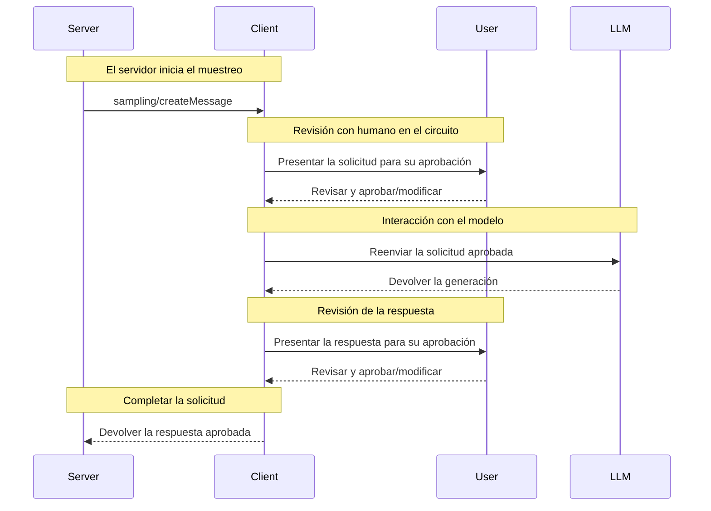

<div id="enable-section-numbers" />

<Info>**Revisión del protocolo**: 2025-06-18</Info>

El Protocolo de Contexto de Modelo (MCP) ofrece una forma estandarizada para que los servidores soliciten
muestreo de LLM (“completions” o “generations”) de modelos de lenguaje a través de los clientes. Este flujo
permite a los clientes mantener el control sobre el acceso al modelo, la selección y los permisos, a la vez
que permite a los servidores aprovechar capacidades de IA, sin necesidad de claves de API del servidor.
Los servidores pueden solicitar interacciones basadas en texto, audio o imagen y, opcionalmente, incluir
contexto de Servidores MCP en sus Indicaciones.

<div id="user-interaction-model">
  ## Modelo de interacción con el usuario
</div>

El muestreo en MCP permite que los servidores implementen comportamientos de agente, al habilitar que las llamadas de LLM ocurran de forma *anidada* dentro de otras funciones del Servidor MCP.

Las implementaciones pueden exponer el muestreo mediante cualquier patrón de interfaz que se ajuste a sus necesidades; el protocolo en sí no exige ningún modelo específico de interacción con el usuario.

<Warning>
  Por motivos de confianza y seguridad, **DEBERÍA** haber siempre
  una persona en el circuito con la capacidad de rechazar solicitudes de muestreo.

  Las aplicaciones **DEBERÍAN**:

  * Proporcionar una interfaz que haga fácil e intuitiva la revisión de las solicitudes de muestreo
  * Permitir que los usuarios vean y editen las indicaciones antes de enviarlas
  * Presentar las respuestas generadas para su revisión antes de entregarlas
</Warning>

<div id="capabilities">
  ## Capacidades
</div>

Los clientes que admitan Muestreo **DEBEN** declarar la capacidad `sampling` durante la
[inicialización](/es/specification/2025-06-18/basic/lifecycle#initialization):

```json
{
  "capabilities": {
    "sampling": {}
  }
}
```

<div id="protocol-messages">
  ## Mensajes del protocolo
</div>

<div id="creating-messages">
  ### Creación de mensajes
</div>

Para solicitar la generación por parte de un modelo de lenguaje, los servidores envían una solicitud `sampling/createMessage`:

**Solicitud:**

```json
{
  "jsonrpc": "2.0",
  "id": 1,
  "method": "sampling/createMessage",
  "params": {
    "messages": [
      {
        "role": "user",
        "content": {
          "type": "text",
          "text": "What is the capital of France?"
        }
      }
    ],
    "modelPreferences": {
      "hints": [
        {
          "name": "claude-3-sonnet"
        }
      ],
      "intelligencePriority": 0.8,
      "speedPriority": 0.5
    },
    "systemPrompt": "You are a helpful assistant.",
    "maxTokens": 100
  }
}
```

**Respuesta:**

```json
{
  "jsonrpc": "2.0",
  "id": 1,
  "result": {
    "role": "assistant",
    "content": {
      "type": "text",
      "text": "The capital of France is Paris."
    },
    "model": "claude-3-sonnet-20240307",
    "stopReason": "endTurn"
  }
}
```

<div id="message-flow">
  ## Flujo de mensajes
</div>



<div id="data-types">
  ## Tipos de datos
</div>

<div id="messages">
  ### Mensajes
</div>

Los mensajes de muestreo pueden contener:

<div id="text-content">
  #### Contenido de texto
</div>

```json
{
  "type": "text",
  "text": "El contenido del mensaje"
}
```

<div id="image-content">
  #### Contenido de la imagen
</div>

```json
{
  "type": "image",
  "data": "base64-encoded-image-data",
  "mimeType": "image/jpeg"
}
```

<div id="audio-content">
  #### Contenido de audio
</div>

```json
{
  "type": "audio",
  "data": "base64-encoded-audio-data",
  "mimeType": "audio/wav"
}
```

<div id="model-preferences">
  ### Preferencias de modelos
</div>

La selección de modelos en MCP requiere una abstracción cuidadosa, ya que servidores y clientes pueden usar
proveedores de IA distintos con ofertas de modelos diferentes. Un servidor no puede simplemente solicitar un
modelo específico por nombre, ya que el cliente puede no tener acceso a ese modelo exacto o podría
preferir usar el modelo equivalente de otro proveedor.

Para resolver esto, MCP implementa un sistema de preferencias que combina prioridades de
capacidades abstractas con sugerencias de modelos opcionales:

<div id="capability-priorities">
  #### Prioridades de capacidad
</div>

Los servidores expresan sus necesidades mediante tres valores de prioridad normalizados (0-1):

* `costPriority`: ¿Qué tan importante es minimizar los costos? Los valores más altos priorizan modelos más económicos.
* `speedPriority`: ¿Qué tan importante es la baja latencia? Los valores más altos priorizan modelos más rápidos.
* `intelligencePriority`: ¿Qué tan importantes son las capacidades avanzadas? Los valores más altos priorizan
  modelos más capaces.

<div id="model-hints">
  #### Sugerencias de modelo
</div>

Si bien las prioridades ayudan a seleccionar modelos según sus características, `hints` permiten que los servidores
sugieran modelos específicos o familias de modelos:

* Las sugerencias se tratan como subcadenas que pueden coincidir de forma flexible con nombres de modelos
* Se evalúan varias sugerencias en orden de preferencia
* Los clientes **PUEDEN** asignar sugerencias a modelos equivalentes de distintos proveedores
* Las sugerencias son orientativas—la selección final del modelo la realiza el cliente

Por ejemplo:

```json
{
  "hints": [
    { "name": "claude-3-sonnet" }, // Preferir modelos de la clase Sonnet
    { "name": "claude" } // En su defecto, cualquier modelo Claude
  ],
  "costPriority": 0.3, // El costo es menos importante
  "speedPriority": 0.8, // La velocidad es muy importante
  "intelligencePriority": 0.5, // Se necesitan capacidades moderadas
}
```

El cliente procesa estas preferencias para seleccionar un modelo adecuado entre sus opciones disponibles.
Por ejemplo, si el cliente no tiene acceso a modelos Claude pero sí a Gemini,
podría asignar la sugerencia sonnet a `gemini-1.5-pro` en función de capacidades similares.

<div id="error-handling">
  ## Manejo de errores
</div>

Los clientes **DEBERÍAN** devolver errores para casos comunes de fallo:

Ejemplo de error:

```json
{
  "jsonrpc": "2.0",
  "id": 1,
  "error": {
    "code": -1,
    "message": "El usuario rechazó la solicitud de muestreo"
  }
}
```

<div id="security-considerations">
  ## Consideraciones de seguridad
</div>

1. Los clientes **DEBERÍAN** implementar controles de aprobación por parte del usuario
2. Ambas partes **DEBERÍAN** validar el contenido de los mensajes
3. Los clientes **DEBERÍAN** respetar las preferencias sugeridas del modelo
4. Los clientes **DEBERÍAN** implementar limitación de tasa
5. Ambas partes **DEBEN** manejar los datos sensibles de manera adecuada