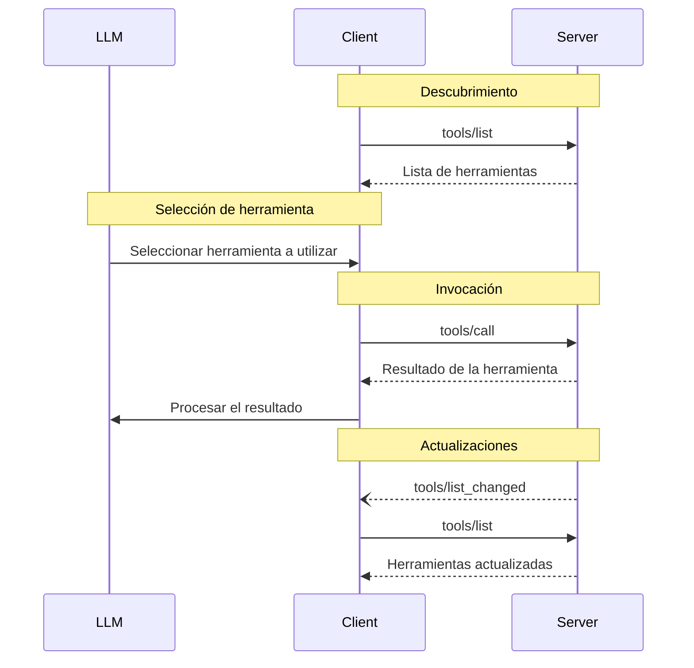

<div id="enable-section-numbers" />

<Info>**Revisión del protocolo**: 2025-06-18</Info>

El Protocolo de Contexto de Modelo (MCP) permite que los servidores expongan Herramientas que pueden ser invocadas por
modelos de lenguaje. Las Herramientas permiten que los modelos interactúen con sistemas externos, como consultar
bases de datos, llamar a APIs o realizar cálculos. Cada herramienta se identifica de forma única por
un nombre e incluye metadatos que describen su esquema.

<div id="user-interaction-model">
  ## Modelo de interacción con el usuario
</div>

Las Herramientas en MCP están diseñadas para ser **controladas por el modelo**, lo que significa que el modelo de lenguaje puede
descubrir e invocar herramientas automáticamente según su comprensión contextual y las
indicaciones del usuario.

Sin embargo, las implementaciones pueden exponer herramientas mediante cualquier patrón de interfaz que
se ajuste a sus necesidades—el protocolo en sí no impone ningún modelo específico de interacción
con el usuario.

<Warning>
  Por motivos de confianza y seguridad, **SIEMPRE DEBERÍA** haber
  una persona en el circuito con la capacidad de denegar invocaciones de herramientas.

  Las aplicaciones **DEBERÍAN**:

  * Proporcionar una interfaz que deje claro qué herramientas se exponen al modelo de IA
  * Insertar indicadores visuales claros cuando se invoquen herramientas
  * Presentar indicaciones de confirmación al usuario para las operaciones, a fin de asegurar que haya una persona en el
    circuito
</Warning>

<div id="capabilities">
  ## Capacidades
</div>

Los servidores que admitan Herramientas **DEBEN** declarar la capacidad `tools`:

```json
{
  "capabilities": {
    "tools": {
      "listChanged": true
    }
  }
}
```

`listChanged` indica si el servidor emitirá notificaciones cuando la lista de Herramientas disponibles cambie.

<div id="protocol-messages">
  ## Mensajes del protocolo
</div>

<div id="listing-tools">
  ### Listado de Herramientas
</div>

Para descubrir las Herramientas disponibles, los Clientes envían una solicitud `tools/list`. Esta operación admite
[paginación](/es/specification/2025-06-18/server/utilities/pagination).

**Solicitud:**

```json
{
  "jsonrpc": "2.0",
  "id": 1,
  "method": "tools/list",
  "params": {
    "cursor": "optional-cursor-value"
  }
}
```

**Respuesta:**

```json
{
  "jsonrpc": "2.0",
  "id": 1,
  "result": {
    "tools": [
      {
        "name": "get_weather",
        "title": "Proveedor de información meteorológica",
        "description": "Obtiene el tiempo actual para una ubicación",
        "inputSchema": {
          "type": "object",
          "properties": {
            "location": {
              "type": "string",
              "description": "Nombre de la ciudad o código postal"
            }
          },
          "required": ["location"]
        }
      }
    ],
    "nextCursor": "next-page-cursor"
  }
}
```

<div id="calling-tools">
  ### Llamar a Herramientas
</div>

Para invocar una Herramienta, los clientes envían una solicitud `tools/call`:

**Solicitud:**

```json
{
  "jsonrpc": "2.0",
  "id": 2,
  "method": "tools/call",
  "params": {
    "name": "get_weather",
    "arguments": {
      "location": "New York"
    }
  }
}
```

**Respuesta:**

```json
{
  "jsonrpc": "2.0",
  "id": 2,
  "result": {
    "content": [
      {
        "type": "text",
        "text": "Estado del tiempo actual en New York:\nTemperatura: 72 °F\nCondiciones: Parcialmente nublado"
      }
    ],
    "isError": false
  }
}
```

<div id="list-changed-notification">
  ### Notificación de cambio en la lista
</div>

Cuando cambie la lista de Herramientas disponibles, los servidores que hayan declarado la capacidad `listChanged` **DEBERÍAN** enviar una notificación:

```json
{
  "jsonrpc": "2.0",
  "method": "notifications/tools/list_changed"
}
```

<div id="message-flow">
  ## Flujo de mensajes
</div>



<div id="data-types">
  ## Tipos de datos
</div>

<div id="tool">
  ### Herramienta
</div>

Una definición de herramienta incluye:

* `name`: Identificador único de la herramienta
* `title`: Nombre opcional, legible por humanos, de la herramienta para fines de visualización
* `description`: Descripción legible por humanos de la funcionalidad
* `inputSchema`: JSON Schema que define los parámetros esperados
* `outputSchema`: JSON Schema opcional que define la estructura de salida esperada
* `annotations`: Propiedades opcionales que describen el comportamiento de la herramienta

<Warning>
  Por motivos de confianza y seguridad, los clientes **DEBEN** considerar
  las anotaciones de la herramienta como no confiables a menos que provengan de servidores de confianza.
</Warning>

<div id="tool-result">
  ### Resultado de la herramienta
</div>

Los resultados de las Herramientas pueden contener contenido [**estructurado**](#structured-content) o **no estructurado**.

El contenido **no estructurado** se devuelve en el campo `content` de un resultado y puede incluir varios elementos de contenido de diferentes tipos:

<Note>
  Todos los tipos de contenido (texto, imagen, audio, enlaces a recursos y recursos incrustados)
  admiten
  [anotaciones](/es/specification/2025-06-18/server/resources#annotations) opcionales que
  proporcionan metadatos sobre la audiencia, la prioridad y los tiempos de modificación. Es el
  mismo formato de anotaciones utilizado por los Recursos e Indicaciones.
</Note>

<div id="text-content">
  #### Contenido de texto
</div>

```json
{
  "type": "text",
  "text": "Texto de resultado de la herramienta"
}
```

<div id="image-content">
  #### Contenido de la imagen
</div>

```json
{
  "type": "image",
  "data": "base64-encoded-data",
  "mimeType": "image/png"
  "annotations": {
    "audience": ["user"],
    "priority": 0.9
  }

}
```

Este ejemplo muestra el uso de una anotación opcional.

<div id="audio-content">
  #### Contenido de audio
</div>

```json
{
  "type": "audio",
  "data": "base64-encoded-audio-data",
  "mimeType": "audio/wav"
}
```

<div id="resource-links">
  #### Enlaces de recursos
</div>

Una herramienta **PUEDE** devolver enlaces a [Recursos](/es/specification/2025-06-18/server/resources) para proporcionar contexto o datos adicionales. En este caso, la herramienta devolverá un URI al que el cliente puede suscribirse o que puede recuperar:

```json
{
  "type": "resource_link",
  "uri": "file:///project/src/main.rs",
  "name": "main.rs",
  "description": "Punto de entrada principal de la aplicación",
  "mimeType": "text/x-rust",
  "annotations": {
    "audience": ["assistant"],
    "priority": 0.9
  }
}
```

Los enlaces de recursos admiten las mismas [anotaciones de recursos](/es/specification/2025-06-18/server/resources#annotations) que los recursos normales para ayudar a los clientes a entender cómo utilizarlos.

<Info>
  No se garantiza que los enlaces de recursos devueltos por las herramientas aparezcan en los resultados
  de una solicitud `resources/list`.
</Info>

<div id="embedded-resources">
  #### Recursos integrados
</div>

[Recursos](/es/specification/2025-06-18/server/resources) **PUEDEN** integrarse para proporcionar contexto adicional
o datos usando un [esquema de URI](es/./resources#common-uri-schemes) adecuado. Los servidores que utilicen recursos integrados **DEBERÍAN** implementar la capacidad `resources`:

```json
{
  "type": "resource",
  "resource": {
    "uri": "file:///project/src/main.rs",
    "title": "Project Rust Main File",
    "mimeType": "text/x-rust",
    "text": "fn main() {\n    println!(\"Hello world!\");\n}",
    "annotations": {
      "audience": ["user", "assistant"],
      "priority": 0.7,
      "lastModified": "2025-05-03T14:30:00Z"
    }
  }
}
```

Los recursos integrados admiten las mismas [anotaciones de recursos](/es/specification/2025-06-18/server/resources#annotations) que los recursos normales para ayudar a los clientes a comprender cómo usarlos.

<div id="structured-content">
  #### Contenido estructurado
</div>

El contenido **estructurado** se devuelve como un objeto JSON en el campo `structuredContent` de un resultado.

Por compatibilidad con versiones anteriores, una herramienta que devuelva contenido estructurado también DEBERÍA devolver el JSON serializado en un bloque TextContent.

<div id="output-schema">
  #### Esquema de salida
</div>

Las Herramientas también pueden proporcionar un esquema de salida para validar resultados estructurados.
Si se proporciona un esquema de salida:

* Los Servidores **DEBEN** entregar resultados estructurados que cumplan con este esquema.
* Los Clientes **DEBERÍAN** validar los resultados estructurados frente a este esquema.

Ejemplo de Herramienta con esquema de salida:

```json
{
  "name": "get_weather_data",
  "title": "Weather Data Retriever",
  "description": "Get current weather data for a location",
  "inputSchema": {
    "type": "object",
    "properties": {
      "location": {
        "type": "string",
        "description": "City name or zip code"
      }
    },
    "required": ["location"]
  },
  "outputSchema": {
    "type": "object",
    "properties": {
      "temperature": {
        "type": "number",
        "description": "Temperature in celsius"
      },
      "conditions": {
        "type": "string",
        "description": "Weather conditions description"
      },
      "humidity": {
        "type": "number",
        "description": "Humidity percentage"
      }
    },
    "required": ["temperature", "conditions", "humidity"]
  }
}
```

Ejemplo de respuesta válida para esta Herramienta:

```json
{
  "jsonrpc": "2.0",
  "id": 5,
  "result": {
    "content": [
      {
        "type": "text",
        "text": "{\"temperature\": 22.5, \"conditions\": \"Partly cloudy\", \"humidity\": 65}"
      }
    ],
    "structuredContent": {
      "temperature": 22.5,
      "conditions": "Partly cloudy",
      "humidity": 65
    }
  }
}
```

Proporcionar un esquema de salida ayuda a los Clientes y a los LLM a comprender y manejar correctamente las salidas estructuradas de las Herramientas al:

* Habilitar la validación estricta de esquemas de las respuestas
* Proporcionar información de tipos para una mejor integración con lenguajes de programación
* Guiar a los Clientes y a los LLM para analizar y utilizar correctamente los datos devueltos
* Mejorar la documentación y la experiencia de desarrollador

<div id="error-handling">
  ## Manejo de errores
</div>

Las Herramientas usan dos mecanismos para informar errores:

1. **Errores de protocolo**: Errores estándar de JSON-RPC para problemas como:
   * Herramientas desconocidas
   * Argumentos no válidos
   * Errores del servidor

2. **Errores de ejecución de la herramienta**: Informados en los resultados de la herramienta con `isError: true`:
   * Fallos de la API
   * Datos de entrada no válidos
   * Errores de lógica empresarial

Ejemplo de error de protocolo:

```json
{
  "jsonrpc": "2.0",
  "id": 3,
  "error": {
    "code": -32602,
    "message": "Unknown tool: invalid_tool_name"
  }
}
```

Ejemplo de error de ejecución de la herramienta:

```json
{
  "jsonrpc": "2.0",
  "id": 4,
  "result": {
    "content": [
      {
        "type": "text",
        "text": "Failed to fetch weather data: API rate limit exceeded"
      }
    ],
    "isError": true
  }
}
```

<div id="security-considerations">
  ## Consideraciones de seguridad
</div>

1. Los servidores **DEBEN**:
   * Validar todas las entradas de las Herramientas
   * Implementar controles de acceso adecuados
   * Limitar la tasa de invocaciones de Herramientas
   * Depurar/sanitizar las salidas de las Herramientas

2. Los clientes **DEBERÍAN**:
   * Pedir confirmación del usuario para operaciones sensibles
   * Mostrar las entradas de la Herramienta al usuario antes de llamar al servidor, para evitar la exfiltración de datos maliciosa o
     accidental
   * Validar los resultados de la Herramienta antes de pasarlos al LLM
   * Implementar tiempos de espera para las llamadas a Herramientas
   * Registrar el uso de Herramientas con fines de auditoría