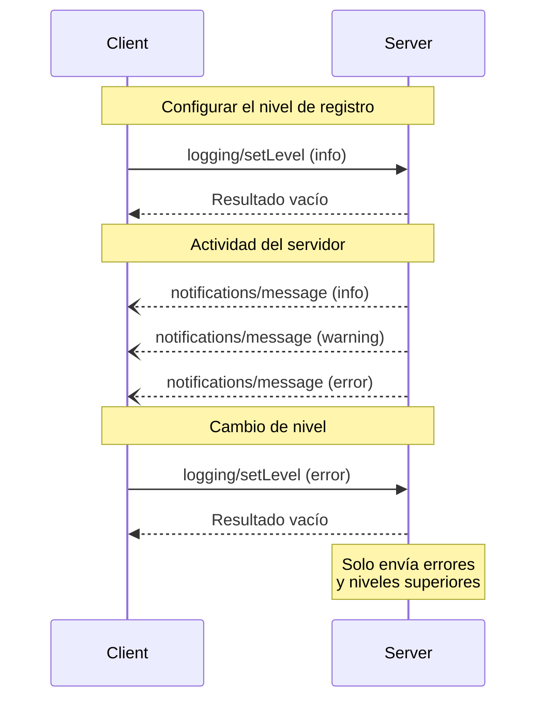

<div id="enable-section-numbers" />

<Info>**Revisión del protocolo**: 2025-06-18</Info>

El Protocolo de Contexto del Modelo (MCP) ofrece una forma estandarizada para que los servidores envíen
mensajes de registro estructurados a los clientes. Los clientes pueden controlar la verbosidad del registro estableciendo
niveles mínimos de registro, mientras que los servidores envían notificaciones que incluyen niveles de gravedad,
nombres opcionales del registrador y datos arbitrarios serializables en JSON.

<div id="user-interaction-model">
  ## Modelo de interacción con el usuario
</div>

Las implementaciones pueden exponer los registros mediante cualquier patrón de interfaz que se ajuste a sus necesidades; el protocolo en sí no impone ningún modelo específico de interacción con el usuario.

<div id="capabilities">
  ## Capacidades
</div>

Los servidores que emiten notificaciones de registros **DEBEN** declarar la capacidad `logging`:

```json
{
  "capabilities": {
    "logging": {}
  }
}
```

<div id="log-levels">
  ## Niveles de registro
</div>

El protocolo sigue los niveles estándar de gravedad de syslog especificados en
[RFC 5424](https://datatracker.ietf.org/doc/html/rfc5424#section-6.2.1):

| Nivel     | Descripción                        | Caso de uso de ejemplo       |
| --------- | ---------------------------------- | ---------------------------- |
| debug     | Información de depuración detallada | Puntos de entrada/salida de funciones |
| info      | Mensajes informativos generales     | Actualizaciones del progreso de la operación |
| notice    | Eventos normales pero significativos | Cambios de configuración     |
| warning   | Condiciones de advertencia          | Uso de funciones en desuso   |
| error     | Condiciones de error                | Fallos de operación          |
| critical  | Condiciones críticas                | Fallos de componentes del sistema |
| alert     | Debe actuarse de inmediato          | Corrupción de datos detectada |
| emergency | El sistema es inutilizable          | Fallo total del sistema      |

<div id="protocol-messages">
  ## Mensajes del protocolo
</div>

<div id="setting-log-level">
  ### Configuración del nivel de registro
</div>

Para establecer el nivel mínimo de registro, los clientes **PUEDEN** enviar una solicitud `logging/setLevel`:

**Solicitud:**

```json
{
  "jsonrpc": "2.0",
  "id": 1,
  "method": "logging/setLevel",
  "params": {
    "level": "info"
  }
}
```

<div id="log-message-notifications">
  ### Notificaciones de mensajes de registro
</div>

Los servidores envían mensajes de registro mediante notificaciones `notifications/message`:

```json
{
  "jsonrpc": "2.0",
  "method": "notifications/message",
  "params": {
    "level": "error",
    "logger": "database",
    "data": {
      "error": "Connection failed",
      "details": {
        "host": "localhost",
        "port": 5432
      }
    }
  }
}
```

<div id="message-flow">
  ## Flujo de mensajes
</div>



<div id="error-handling">
  ## Manejo de errores
</div>

Los servidores **DEBERÍAN** devolver errores estándar de JSON-RPC para casos de fallo comunes:

- Nivel de registro inválido: `-32602` (Parámetros inválidos)
- Errores de configuración: `-32603` (Error interno)

<div id="implementation-considerations">
  ## Consideraciones de implementación
</div>

1. Los servidores **DEBERÍAN**:
   - Limitar la frecuencia de los mensajes de registro
   - Incluir contexto relevante en el campo de datos
   - Usar nombres de registrador coherentes
   - Eliminar información confidencial

2. Los clientes **PUEDEN**:
   - Mostrar mensajes de registro en la interfaz de usuario
   - Implementar filtrado/búsqueda de registros
   - Indicar visualmente la gravedad
   - Conservar mensajes de registro

<div id="security">
  ## Seguridad
</div>

1. Los mensajes de registro **NO DEBEN** contener:
   - Credenciales o secretos
   - Información de identificación personal
   - Detalles internos del sistema que puedan facilitar ataques

2. Las implementaciones **DEBERÍAN**:
   - Limitar la frecuencia de los mensajes
   - Validar todos los campos de datos
   - Controlar el acceso a los registros
   - Supervisar la presencia de contenido sensible