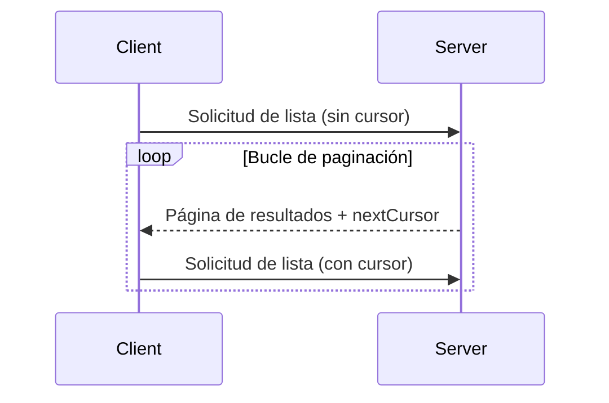

<div id="enable-section-numbers" />

<Info>**Revisión del protocolo**: 2025-06-18</Info>

El Protocolo de Contexto del Modelo (MCP) admite la paginación de operaciones de listado que pueden devolver conjuntos de resultados grandes. La paginación permite que los servidores entreguen resultados en partes más pequeñas en lugar de todo de una vez.

La paginación es especialmente importante al conectarse a servicios externos por internet, pero también es útil para integraciones locales a fin de evitar problemas de rendimiento con conjuntos de datos voluminosos.

<div id="pagination-model">
  ## Modelo de paginación
</div>

La paginación en el MCP utiliza un enfoque opaco basado en cursores, en lugar de páginas numeradas.

- El **cursor** es un token de cadena opaco que representa una posición en el conjunto de resultados
- El **tamaño de página** lo determina el servidor, y los clientes **NO DEBEN** asumir un tamaño de página fijo

<div id="response-format">
  ## Formato de respuesta
</div>

La paginación comienza cuando el servidor envía una **respuesta** que incluye:

- La página actual de resultados
- Un campo opcional `nextCursor` si hay más resultados

```json
{
  "jsonrpc": "2.0",
  "id": "123",
  "result": {
    "resources": [...],
    "nextCursor": "eyJwYWdlIjogM30="
  }
}
```

<div id="request-format">
  ## Formato de la solicitud
</div>

Después de recibir un cursor, el cliente puede _continuar_ la paginación enviando una solicitud que incluya ese cursor:

```json
{
  "jsonrpc": "2.0",
  "method": "resources/list",
  "params": {
    "cursor": "eyJwYWdlIjogMn0="
  }
}
```

<div id="pagination-flow">
  ## Flujo de paginación
</div>



<div id="operations-supporting-pagination">
  ## Operaciones que admiten paginación
</div>

Las siguientes operaciones del Protocolo de Contexto del Modelo (MCP) admiten paginación:

- `resources/list` - Lista los recursos disponibles
- `resources/templates/list` - Lista las plantillas de recursos
- `prompts/list` - Lista las indicaciones disponibles
- `tools/list` - Lista las herramientas disponibles

<div id="implementation-guidelines">
  ## Directrices de implementación
</div>

1. Los servidores **DEBERÍAN**:
   - Proporcionar cursores estables
   - Manejar los cursores inválidos de forma adecuada

2. Los clientes **DEBERÍAN**:
   - Tratar la ausencia de `nextCursor` como el final de los resultados
   - Compatibilizar flujos paginados y no paginados

3. Los clientes **DEBEN** tratar los cursores como tokens opacos:
   - No hacer suposiciones sobre el formato del cursor
   - No intentar interpretar ni modificar los cursores
   - No conservar los cursores entre sesiones

<div id="error-handling">
  ## Manejo de errores
</div>

Los cursores no válidos **DEBERÍAN** producir un error con el código -32602 (parámetros no válidos).