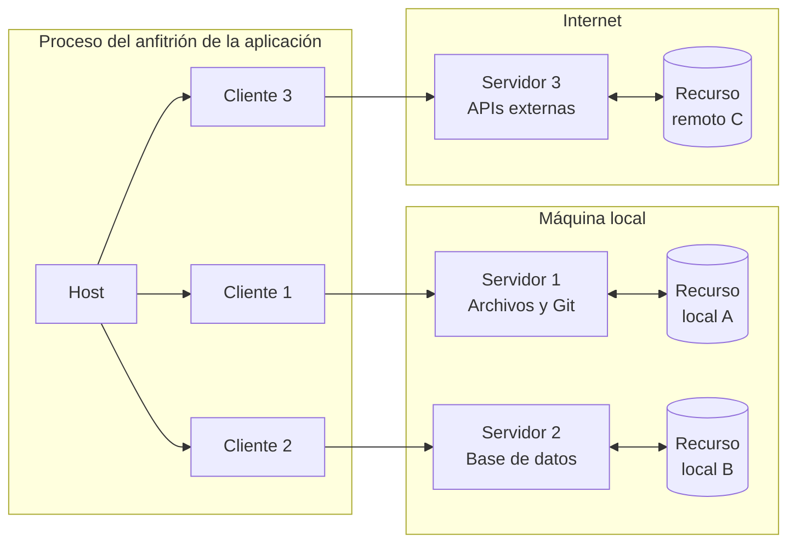
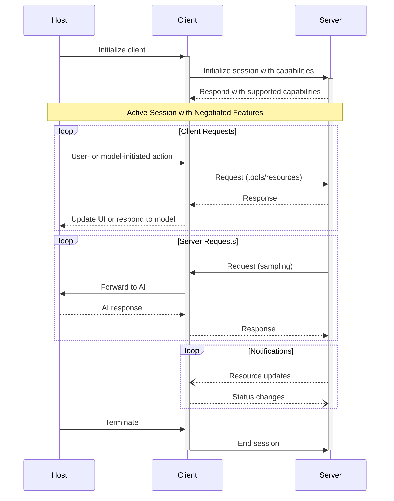

El Protocolo de Contexto de Modelo (MCP) sigue una arquitectura cliente-anfitrión-servidor en la que cada
anfitrión puede ejecutar múltiples instancias de cliente. Esta arquitectura permite a los usuarios integrar
capacidades de IA en distintas aplicaciones, a la vez que mantiene límites de seguridad claros y
aísla las distintas responsabilidades. Basado en JSON-RPC 2.0, MCP proporciona un protocolo de sesión con estado centrado
en el intercambio de contexto y la coordinación del muestreo entre clientes y servidores.

  ## Componentes fundamentales

  ### Anfitrión

El proceso del anfitrión actúa como contenedor y coordinador:

* Crea y gestiona múltiples instancias de clientes
* Controla los permisos de conexión de los clientes y su ciclo de vida
* Hace cumplir las políticas de seguridad y los requisitos de consentimiento
* Gestiona las decisiones de autorización de los usuarios
* Coordina la integración con IA/LLM y el muestreo
* Gestiona la agregación de contexto entre clientes

  ### Clientes

Cada cliente es creado por el Anfitrión MCP y mantiene una conexión aislada con un servidor:

* Establece una sesión con estado por servidor
* Gestiona la negociación del protocolo y el intercambio de capacidades
* Enruta mensajes del protocolo en ambos sentidos
* Gestiona suscripciones y notificaciones
* Mantiene límites de seguridad entre servidores

Una aplicación anfitriona crea y gestiona múltiples clientes, y cada cliente tiene una relación 1:1 con un servidor concreto.

  ### Servidores

Los servidores proporcionan contexto y capacidades especializadas:

* Exponen Recursos, Herramientas e Indicaciones mediante primitivas de MCP
* Operan de forma independiente con responsabilidades específicas
* Solicitan Muestreo a través de interfaces del cliente
* Deben respetar las restricciones de seguridad
* Pueden ser procesos locales o servicios remotos

  ## Principios de diseño

MCP se basa en varios principios de diseño clave que orientan su arquitectura e
implementación:

1. **Los servidores deben ser extremadamente fáciles de crear**
   * Las aplicaciones Anfitrión MCP asumen la orquestación compleja
   * Los servidores se enfocan en capacidades específicas y bien definidas
   * Interfaces simples minimizan el esfuerzo de implementación
   * Una separación clara permite mantener el código

2. **Los servidores deben ser altamente componibles**
   * Cada servidor proporciona funcionalidad enfocada de forma aislada
   * Varios servidores pueden combinarse sin fricción
   * Un protocolo compartido habilita la interoperabilidad
   * Un diseño modular favorece la extensibilidad

3. **Los servidores no deberían poder leer toda la conversación ni “ver dentro” de otros
   servidores**
   * Los servidores reciben solo la información contextual necesaria
   * El historial completo de la conversación permanece en el anfitrión
   * Cada conexión con un servidor mantiene el aislamiento
   * El anfitrión controla las interacciones entre servidores
   * El proceso del anfitrión aplica límites de seguridad

4. **Las funciones pueden añadirse a servidores y clientes de forma progresiva**
   * El protocolo base proporciona la funcionalidad mínima requerida
   * Pueden negociarse capacidades adicionales según sea necesario
   * Servidores y clientes evolucionan de forma independiente
   * El protocolo está diseñado para una extensibilidad futura
   * Se mantiene la compatibilidad retrocompatible

  ## Negociación de capacidades

El Protocolo de Contexto de Modelo (MCP) utiliza un sistema de negociación basado en capacidades, donde Clientes MCP y Servidores MCP declaran explícitamente sus funciones compatibles durante la inicialización. Las capacidades determinan qué funciones y primitivas del protocolo están disponibles durante una sesión.

* Los servidores declaran capacidades como suscripciones a Recursos, compatibilidad con Herramientas y plantillas de Indicaciones
* Los clientes declaran capacidades como compatibilidad con Muestreo y manejo de notificaciones
* Ambas partes deben respetar las capacidades declaradas durante toda la sesión
* Se pueden negociar capacidades adicionales mediante extensiones del protocolo

Cada capacidad habilita funciones específicas del protocolo para usarse durante la sesión. Por ejemplo:

* Las [funciones del servidor](/es/specification/draft/server) implementadas deben anunciarse en las capacidades del servidor
* Emitir notificaciones de suscripción a Recursos requiere que el servidor declare compatibilidad con suscripciones
* Invocar Herramientas requiere que el servidor declare capacidades de herramientas
* El [Muestreo](/es/specification/draft/client) requiere que el cliente declare compatibilidad en sus capacidades

Esta negociación de capacidades garantiza que clientes y servidores tengan una comprensión clara de la funcionalidad admitida, a la vez que se mantiene la extensibilidad del protocolo.