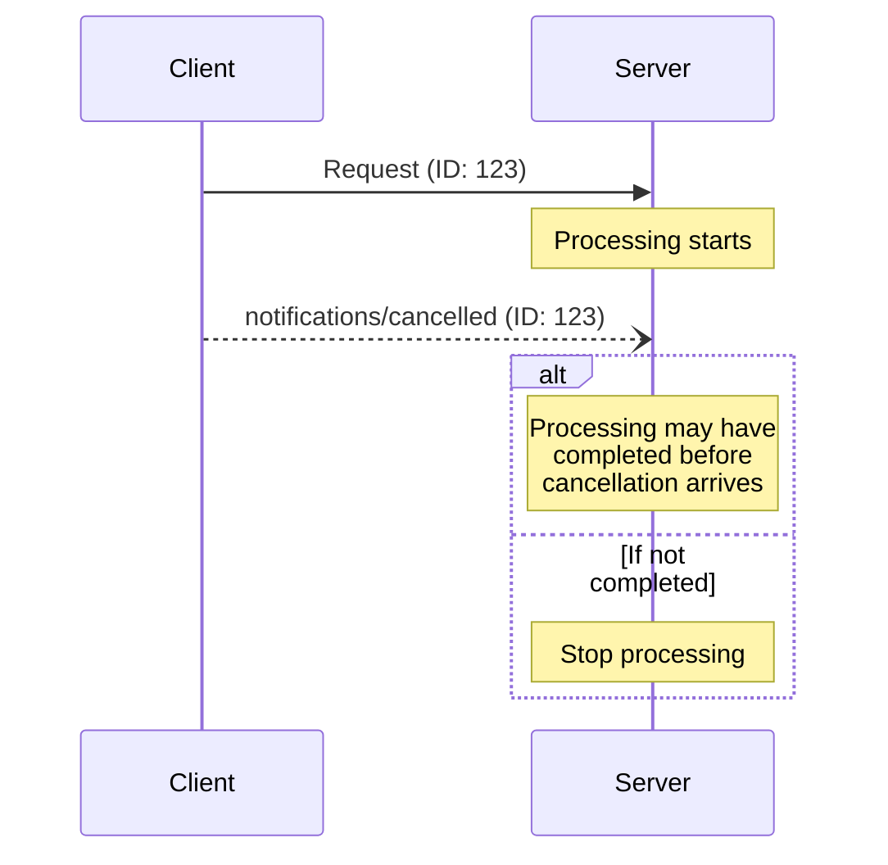

<div id="enable-section-numbers" />

<Info>**Revisión del protocolo**: borrador</Info>

El Protocolo de Contexto de Modelo (MCP) admite la cancelación opcional de solicitudes en curso mediante mensajes de notificación. Cualquiera de las partes puede enviar una notificación de cancelación para indicar que una solicitud previamente emitida debe darse por terminada.

<div id="cancellation-flow">
  ## Flujo de cancelación
</div>

Cuando una parte quiera cancelar una solicitud en curso, envía una notificación `notifications/cancelled`
que contiene:

- El ID de la solicitud que se desea cancelar
- Una cadena de motivo opcional que puede registrarse o mostrarse

```json
{
  "jsonrpc": "2.0",
  "method": "notifications/cancelled",
  "params": {
    "requestId": "123",
    "reason": "User requested cancellation"
  }
}
```

<div id="behavior-requirements">
  ## Requisitos de comportamiento
</div>

1. Las notificaciones de cancelación **DEBEN** referirse solo a solicitudes que:
   - Se hayan emitido previamente en la misma dirección
   - Se considere que aún están en curso
2. La solicitud `initialize` **NO DEBE** ser cancelada por los clientes
3. Los receptores de notificaciones de cancelación **DEBERÍAN**:
   - Detener el procesamiento de la solicitud cancelada
   - Liberar los recursos asociados
   - No enviar una respuesta a la solicitud cancelada
4. Los receptores **PUEDEN** ignorar las notificaciones de cancelación si:
   - La solicitud referenciada es desconocida
   - El procesamiento ya se ha completado
   - La solicitud no puede cancelarse
5. El remitente de la notificación de cancelación **DEBERÍA** ignorar cualquier respuesta a la
   solicitud que llegue posteriormente

<div id="timing-considerations">
  ## Consideraciones sobre el tiempo
</div>

Debido a la latencia de la red, las notificaciones de cancelación pueden llegar después de que el procesamiento de la solicitud
haya finalizado y, potencialmente, después de que ya se haya enviado una respuesta.

Ambas partes **DEBEN** manejar estas condiciones de carrera con elegancia:



<div id="implementation-notes">
  ## Notas de implementación
</div>

- Ambas partes **DEBERÍAN** registrar los motivos de cancelación para fines de depuración
- Las interfaces de usuario de la aplicación **DEBERÍAN** indicar cuando se haya solicitado la cancelación

<div id="error-handling">
  ## Manejo de errores
</div>

Las notificaciones de cancelación inválidas **DEBERÍAN** ignorarse:

- Identificadores de solicitud desconocidos
- Solicitudes ya completadas
- Notificaciones malformadas

Esto mantiene la naturaleza de "enviar y olvidar" de las notificaciones, a la vez que permite condiciones de carrera en la comunicación asíncrona.