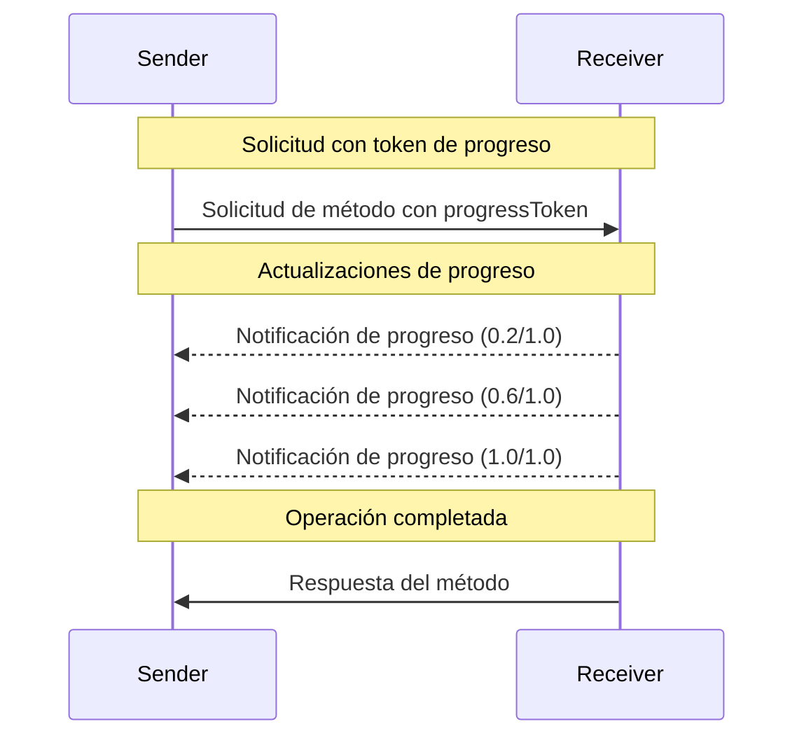

<div id="enable-section-numbers" />

<Info>**Revisión del protocolo**: borrador</Info>

El Protocolo de Contexto de Modelo (MCP) admite el seguimiento de progreso opcional para operaciones de larga duración mediante mensajes de notificación. Cualquiera de las partes puede enviar notificaciones de progreso para proporcionar actualizaciones sobre el estado de la operación.

<div id="progress-flow">
  ## Flujo de progreso
</div>

Cuando una parte desea _recibir_ actualizaciones de progreso de una solicitud, incluye un
`progressToken` en los metadatos de la solicitud.

- Los tokens de progreso **DEBEN** ser un valor de cadena o entero
- Los tokens de progreso pueden ser elegidos por el emisor por cualquier medio, pero **DEBEN** ser únicos
  entre todas las solicitudes activas.

```json
{
  "jsonrpc": "2.0",
  "id": 1,
  "method": "some_method",
  "params": {
    "_meta": {
      "progressToken": "abc123"
    }
  }
}
```

El receptor **PUEDE** entonces enviar notificaciones de progreso que contengan:

- El token de progreso original
- El valor de progreso actual hasta el momento
- Un valor "total" opcional
- Un valor "message" opcional

```json
{
  "jsonrpc": "2.0",
  "method": "notifications/progress",
  "params": {
    "progressToken": "abc123",
    "progress": 50,
    "total": 100,
    "message": "Reticulating splines..."
  }
}
```

- El valor de `progress` **DEBE** aumentar con cada notificación, incluso si el total es
  desconocido.
- Los valores de `progress` y `total` **PUEDEN** ser de punto flotante.
- El campo `message` **DEBERÍA** proporcionar información de progreso relevante y legible para personas.

<div id="behavior-requirements">
  ## Requisitos de comportamiento
</div>

1. Las notificaciones de progreso **DEBEN** hacer referencia únicamente a tokens que:
   - Fueron proporcionados en una solicitud activa
   - Están asociados con una operación en curso

2. Los receptores de solicitudes de progreso **PUEDEN**:
   - Optar por no enviar ninguna notificación de progreso
   - Enviar notificaciones con la frecuencia que consideren apropiada
   - Omitir el valor total si se desconoce



<div id="implementation-notes">
  ## Notas de implementación
</div>

- Emisores y receptores **DEBERÍAN** llevar un seguimiento de los tokens de progreso activos
- Ambas partes **DEBERÍAN** implementar limitación de velocidad para evitar saturación
- Las notificaciones de progreso **DEBEN** detenerse tras la finalización