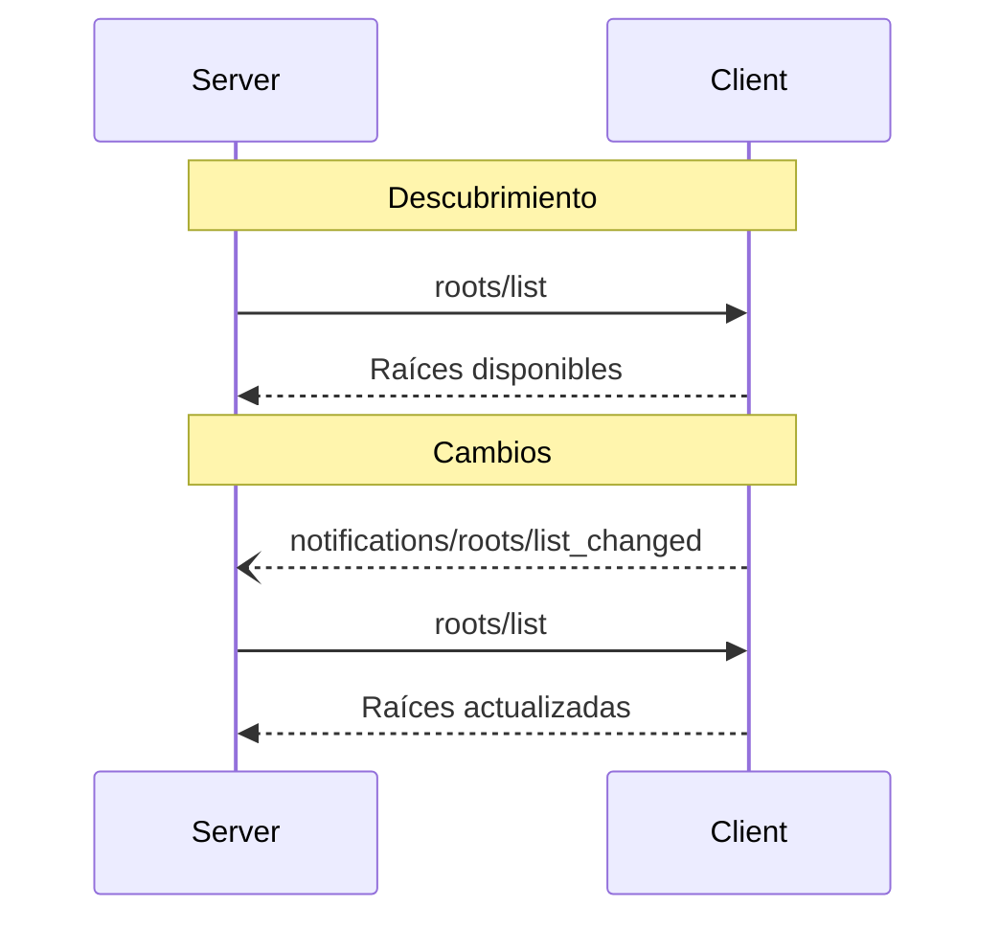

<div id="enable-section-numbers" />

<Info>**Revisión del protocolo**: borrador</Info>

El Protocolo de Contexto de Modelo (MCP) proporciona una forma estandarizada para que los clientes expongan
las “raíces” del sistema de archivos a los servidores. Las raíces definen los límites dentro de los cuales pueden operar los servidores
en el sistema de archivos, lo que les permite comprender a qué directorios y archivos tienen
acceso. Los servidores pueden solicitar la lista de raíces a los clientes compatibles y recibir
notificaciones cuando esa lista cambie.

<div id="user-interaction-model">
  ## Modelo de interacción con el usuario
</div>

Las Raíces en MCP suelen exponerse a través de interfaces de configuración del espacio de trabajo o del proyecto.

Por ejemplo, las implementaciones podrían ofrecer un selector de espacio de trabajo/proyecto que permita a los usuarios
elegir los directorios y archivos a los que el servidor debería tener acceso. Esto puede combinarse con
la detección automática del espacio de trabajo a partir de sistemas de control de versiones o archivos de proyecto.

No obstante, las implementaciones son libres de exponer las Raíces mediante cualquier patrón de interfaz que
se adapte a sus necesidades: el propio protocolo no exige ningún modelo específico de interacción con el usuario.

<div id="capabilities">
  ## Capacidades
</div>

Los clientes que admitan Raíces **DEBEN** declarar la capacidad `roots` durante la
[inicialización](/es/specification/draft/basic/lifecycle#initialization):

```json
{
  "capabilities": {
    "roots": {
      "listChanged": true
    }
  }
}
```

`listChanged` indica si el cliente enviará notificaciones cuando cambie la lista de Raíces.

<div id="protocol-messages">
  ## Mensajes del protocolo
</div>

<div id="listing-roots">
  ### Listar Raíces
</div>

Para obtener las Raíces, los Servidores envían una solicitud `roots/list`:

**Solicitud:**

```json
{
  "jsonrpc": "2.0",
  "id": 1,
  "method": "roots/list"
}
```

**Respuesta:**

```json
{
  "jsonrpc": "2.0",
  "id": 1,
  "result": {
    "roots": [
      {
        "uri": "file:///home/user/projects/myproject",
        "name": "My Project"
      }
    ]
  }
}
```

<div id="root-list-changes">
  ### Cambios en la lista de Raíces
</div>

Cuando cambien las raíces, los clientes que sean compatibles con `listChanged` **DEBEN** enviar una notificación:

```json
{
  "jsonrpc": "2.0",
  "method": "notifications/roots/list_changed"
}
```

<div id="message-flow">
  ## Flujo de mensajes
</div>



<div id="data-types">
  ## Tipos de datos
</div>

<div id="root">
  ### Raíz
</div>

Una definición de raíz incluye:

* `uri`: Identificador único de la raíz. Esto **DEBE** ser un URI `file://` en la
  especificación actual.
* `name`: Nombre opcional, legible por personas, para fines de visualización.

Ejemplos de raíces para diferentes casos de uso:

<div id="project-directory">
  #### Directorio del proyecto
</div>

```json
{
  "uri": "file:///home/user/projects/myproject",
  "name": "Mi proyecto"
}
```

<div id="multiple-repositories">
  #### Varios repositorios
</div>

```json
[
  {
    "uri": "file:///home/user/repos/frontend",
    "name": "Repositorio de frontend"
  },
  {
    "uri": "file:///home/user/repos/backend",
    "name": "Repositorio de backend"
  }
]
```

<div id="error-handling">
  ## Manejo de errores
</div>

Los clientes **DEBERÍAN** devolver errores estándar de JSON-RPC para casos comunes de fallo:

* El cliente no admite Raíces: `-32601` (Método no encontrado)
* Errores internos: `-32603`

Ejemplo de error:

```json
{
  "jsonrpc": "2.0",
  "id": 1,
  "error": {
    "code": -32601,
    "message": "Raíces no admitidas",
    "data": {
      "reason": "El cliente no cuenta con la capacidad de Raíces"
    }
  }
}
```

<div id="security-considerations">
  ## Consideraciones de seguridad
</div>

1. Los clientes **DEBEN**:
   * Exponer únicamente las Raíces con permisos adecuados
   * Validar todos los URI de Raíz para prevenir el traversal de rutas
   * Implementar controles de acceso adecuados
   * Supervisar la accesibilidad de las Raíces

2. Los servidores **DEBERÍAN**:
   * Manejar casos en los que las Raíces dejen de estar disponibles
   * Respetar los límites de las Raíces durante las operaciones
   * Validar todas las rutas con respecto a las Raíces proporcionadas

<div id="implementation-guidelines">
  ## Directrices de implementación
</div>

1. Los clientes **DEBERÍAN**:
   * Solicitar el consentimiento de los usuarios antes de exponer las Raíces a los servidores
   * Proporcionar interfaces de usuario claras para la gestión de Raíces
   * Validar la accesibilidad de las Raíces antes de exponerlas
   * Supervisar cambios en las Raíces

2. Los servidores **DEBERÍAN**:
   * Verificar la compatibilidad con Raíces antes de usarlas
   * Gestionar con solidez los cambios en la lista de Raíces
   * Respetar los límites de las Raíces en las operaciones
   * Almacenar en caché la información de las Raíces adecuadamente