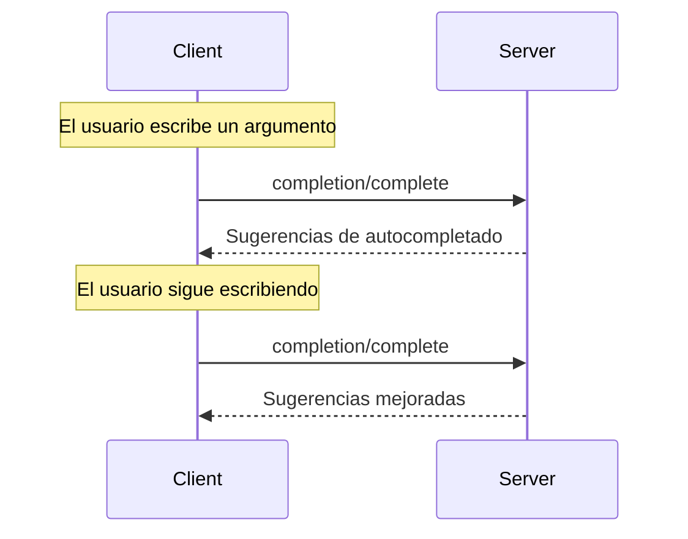

<div id="enable-section-numbers" />

<Info>**Revisión del protocolo**: borrador</Info>

El Protocolo de Contexto del Modelo (MCP) proporciona una forma estandarizada para que los servidores ofrezcan sugerencias de autocompletado de argumentos para Indicaciones y URI de Recursos. Esto permite experiencias ricas, similares a un IDE, donde los usuarios reciben sugerencias contextuales mientras introducen valores de argumentos.

<div id="user-interaction-model">
  ## Modelo de interacción con el usuario
</div>

La finalización en MCP está diseñada para admitir experiencias interactivas similares a la autocompletación de código en un IDE.

Por ejemplo, las aplicaciones pueden mostrar sugerencias de finalización en un menú desplegable o emergente mientras los usuarios escriben, con la posibilidad de filtrar y seleccionar entre las opciones disponibles.

Sin embargo, las implementaciones pueden exponer la finalización mediante cualquier patrón de interfaz que se ajuste a sus necesidades; el protocolo en sí no impone ningún modelo específico de interacción con el usuario.

<div id="capabilities">
  ## Capacidades
</div>

Los servidores que admitan completions **DEBEN** declarar la capacidad `completions`:

```json
{
  "capabilities": {
    "completions": {}
  }
}
```

<div id="protocol-messages">
  ## Mensajes del protocolo
</div>

<div id="requesting-completions">
  ### Solicitar completados
</div>

Para obtener sugerencias de completado, los clientes envían una solicitud `completion/complete` especificando qué se está completando mediante un tipo de referencia:

**Solicitud:**

```json
{
  "jsonrpc": "2.0",
  "id": 1,
  "method": "completion/complete",
  "params": {
    "ref": {
      "type": "ref/prompt",
      "name": "code_review"
    },
    "argument": {
      "name": "language",
      "value": "py"
    }
  }
}
```

**Respuesta:**

```json
{
  "jsonrpc": "2.0",
  "id": 1,
  "result": {
    "completion": {
      "values": ["python", "pytorch", "pyside"],
      "total": 10,
      "hasMore": true
    }
  }
}
```

Para las indicaciones o las plantillas de URI con varios argumentos, los clientes deben incluir los completados previos en el objeto `context.arguments` para aportar contexto a solicitudes posteriores.

**Solicitud:**

```json
{
  "jsonrpc": "2.0",
  "id": 1,
  "method": "completion/complete",
  "params": {
    "ref": {
      "type": "ref/prompt",
      "name": "code_review"
    },
    "argument": {
      "name": "framework",
      "value": "fla"
    },
    "context": {
      "arguments": {
        "language": "python"
      }
    }
  }
}
```

**Respuesta:**

```json
{
  "jsonrpc": "2.0",
  "id": 1,
  "result": {
    "completion": {
      "values": ["flask"],
      "total": 1,
      "hasMore": false
    }
  }
}
```

<div id="reference-types">
  ### Tipos de referencia
</div>

El protocolo admite dos tipos de referencias de finalización:

| Tipo           | Descripción                         | Ejemplo                                             |
| -------------- | ----------------------------------- | --------------------------------------------------- |
| `ref/prompt`   | Referencia una indicación por nombre | `{"type": "ref/prompt", "name": "code_review"}`     |
| `ref/resource` | Referencia un URI de recurso         | `{"type": "ref/resource", "uri": "file:///{path}"}` |

<div id="completion-results">
  ### Resultados de completado
</div>

Los servidores devuelven un arreglo de valores de completado ordenados por relevancia, con:

- Un máximo de 100 elementos por respuesta
- Número total opcional de coincidencias disponibles
- Un valor booleano que indica si existen resultados adicionales

<div id="message-flow">
  ## Flujo de mensajes
</div>



<div id="data-types">
  ## Tipos de datos
</div>

<div id="completerequest">
  ### CompleteRequest
</div>

- `ref`: Una `PromptReference` o `ResourceReference`
- `argument`: Objeto que contiene:
  - `name`: Nombre del argumento
  - `value`: Valor actual
- `context`: Objeto que contiene:
  - `arguments`: Un mapeo de nombres de argumentos ya resueltos a sus valores.

<div id="completeresult">
  ### CompleteResult
</div>

- `completion`: Objeto que contiene:
  - `values`: Lista de sugerencias (máx. 100)
  - `total`: Número total opcional de coincidencias
  - `hasMore`: Indicador de que hay más resultados

<div id="error-handling">
  ## Manejo de errores
</div>

Los servidores **DEBERÍAN** devolver errores estándar de JSON-RPC para casos de fallo comunes:

- Método no encontrado: `-32601` (Capacidad no admitida)
- Nombre de indicación no válido: `-32602` (Parámetros no válidos)
- Faltan argumentos obligatorios: `-32602` (Parámetros no válidos)
- Errores internos: `-32603` (Error interno)

<div id="implementation-considerations">
  ## Consideraciones de implementación
</div>

1. Los servidores **DEBERÍAN**:
   - Devolver sugerencias ordenadas por relevancia
   - Implementar coincidencias difusas cuando corresponda
   - Limitar la tasa de solicitudes de completado
   - Validar todas las entradas

2. Los clientes **DEBERÍAN**:
   - Desacoplar (debounce) las solicitudes de completado muy frecuentes
   - Almacenar en caché los resultados de completado cuando corresponda
   - Gestionar con elegancia los resultados faltantes o parciales

<div id="security">
  ## Seguridad
</div>

Las implementaciones **DEBEN**:

- Validar todas las entradas de completado
- Implementar una limitación de velocidad adecuada
- Controlar el acceso a sugerencias sensibles
- Prevenir la divulgación de información basada en completados