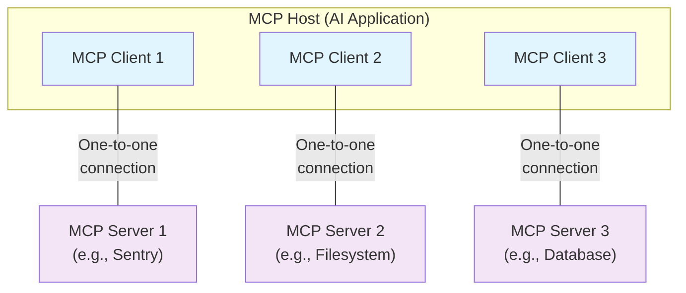

Cet aperçu du Model Context Protocol (MCP) présente sa [portée](#scope) et ses [concepts fondamentaux](#concepts-of-mcp), et fournit un [exemple](#example) illustrant chacun de ces concepts.

Comme les SDK MCP masquent bon nombre d’aspects, la plupart des développeurs trouveront sans doute la section sur le [protocole de la couche de données](#data-layer-protocol) la plus utile. Elle explique comment les Serveurs MCP peuvent fournir du contexte à une application d’IA.

Pour des détails précis sur l’implémentation, veuillez consulter la documentation de votre [SDK spécifique à un langage](/fr-CA/docs/sdk).

<div id="scope">
  ## Portée
</div>

Le Model Context Protocol comprend les projets suivants :

* [MCP Specification](https://modelcontextprotocol.io/specification/latest) : une spécification de MCP qui décrit les exigences de mise en œuvre pour les clients et les serveurs.
* [MCP SDKs](/fr-CA/docs/sdk) : des SDK pour différents langages de programmation qui implémentent MCP.
* **MCP Development Tools** : des outils pour développer des serveurs et des clients MCP, notamment le [MCP Inspector](https://github.com/modelcontextprotocol/inspector)
* [MCP Reference Server Implementations](https://github.com/modelcontextprotocol/servers) : des implémentations de référence de serveurs MCP.

<Note>
  MCP se concentre uniquement sur le protocole d’échange de contexte — il ne prescrit pas
  comment les applications d’IA utilisent les LLM ni comment elles gèrent le contexte fourni.
</Note>

<div id="concepts-of-mcp">
  ## Concepts de MCP
</div>

<div id="participants">
  ### Participants
</div>

Le MCP adopte une architecture client-serveur où un hôte MCP — une application d’IA comme [Claude Code](https://www.anthropic.com/claude-code) ou [Claude Desktop](https://www.claude.ai/download) — établit des connexions avec un ou plusieurs serveurs MCP. L’hôte MCP y parvient en créant un client MCP pour chaque serveur MCP. Chaque client MCP maintient une connexion dédiée un à un avec le serveur MCP correspondant.

Les principaux participants de l’architecture MCP sont :

* **Hôte MCP** : l’application d’IA qui coordonne et gère un ou plusieurs clients MCP
* **Client MCP** : un composant qui maintient une connexion à un serveur MCP et obtient du contexte d’un serveur MCP pour l’hôte MCP
* **Serveur MCP** : un programme qui fournit du contexte aux clients MCP

**Par exemple** : Visual Studio Code agit comme hôte MCP. Lorsque Visual Studio Code établit une connexion à un serveur MCP, comme le [serveur MCP Sentry](https://docs.sentry.io/product/sentry-mcp/), l’environnement d’exécution de Visual Studio Code instancie un objet client MCP qui maintient la connexion au serveur MCP Sentry.
Lorsque Visual Studio Code se connecte ensuite à un autre serveur MCP, comme le [serveur du système de fichiers local](https://github.com/modelcontextprotocol/servers/tree/main/src/filesystem), l’environnement d’exécution de Visual Studio Code instancie un objet client MCP supplémentaire pour maintenir cette connexion, conservant ainsi une relation un à un
entre les clients MCP et les serveurs MCP.



Notez que « serveur MCP » désigne le programme qui fournit des données de contexte, peu importe où il s’exécute. Les serveurs MCP peuvent s’exécuter localement ou à distance. Par exemple, lorsque Claude Desktop lance le [serveur du système de fichiers](https://github.com/modelcontextprotocol/servers/tree/main/src/filesystem), le serveur s’exécute localement sur la même machine parce qu’il utilise le transport STDIO. On parle couramment d’un serveur MCP « local ». Le [serveur MCP Sentry](https://docs.sentry.io/product/sentry-mcp/) officiel s’exécute sur la plateforme Sentry et utilise le transport HTTP diffusible. On parle couramment d’un serveur MCP « distant ».

<div id="layers">
  ### Couches
</div>

Le MCP se compose de deux couches :

* **Couche de données** : Définit le protocole fondé sur JSON-RPC 2.0 pour la communication client-serveur, y compris la gestion du cycle de vie et les primitives de base, telles que les Outils, les Ressources, les Invites et les notifications.
* **Couche de transport** : Définit les mécanismes et canaux de communication qui permettent l’échange de données entre les clients et les serveurs, y compris l’établissement de la connexion propre au transport, le découpage des messages et l’autorisation.

Conceptuellement, la couche de données est la couche interne, tandis que la couche de transport est la couche externe.

<div id="data-layer">
  #### Couche de données
</div>

La couche de données met en œuvre un protocole d’échange basé sur [JSON-RPC 2.0](https://www.jsonrpc.org/) qui définit la structure et la sémantique des messages.
Cette couche inclut :

* **Gestion du cycle de vie** : Gère l’initialisation de la connexion, la négociation des capacités et la fermeture de la connexion entre clients et serveurs
* **Fonctionnalités côté serveur** : Permet aux serveurs de fournir des fonctionnalités de base, notamment des Outils pour les actions d’IA, des Ressources pour les données de contexte et des Invites pour des gabarits d’interaction, vers et depuis le client
* **Fonctionnalités côté client** : Permet aux serveurs de demander au client d’effectuer l’Échantillonnage à partir de l’Hôte MCP, de solliciter l’utilisateur (Élicitation) et de consigner des messages côté client
* **Fonctionnalités utilitaires** : Prend en charge des capacités supplémentaires comme les notifications pour les mises à jour en temps réel et le suivi de la progression pour les opérations de longue durée

<div id="transport-layer">
  #### Couche de transport
</div>

La couche de transport gère les canaux de communication et l’authentification entre les clients et les serveurs. Elle s’occupe de l’établissement des connexions, de l’encapsulation des messages et des communications sécurisées entre les participants MCP.

MCP prend en charge deux mécanismes de transport :

* **Transport STDIO** : utilise les flux d’entrée/sortie standard pour une communication directe entre processus locaux sur la même machine, offrant des performances optimales sans surcharge réseau.
* **Transport HTTP diffusible** : utilise HTTP POST pour les messages du client vers le serveur, avec des Événements envoyés par le serveur (SSE) facultatifs pour la diffusion en continu. Ce transport permet la communication avec des serveurs distants et prend en charge les méthodes d’authentification HTTP standard, notamment les jetons Bearer, les clés API et les en-têtes personnalisés. MCP recommande d’utiliser OAuth pour obtenir des jetons d’authentification.

La couche de transport abstrait les détails de communication de la couche protocolaire, permettant d’utiliser le même format de message JSON-RPC 2.0 sur tous les mécanismes de transport.

<div id="data-layer-protocol">
  ### Protocole de couche de données
</div>

Un élément central de MCP consiste à définir le schéma et la sémantique entre les clients MCP et les serveurs MCP. Les développeurs trouveront probablement la couche de données — en particulier l’ensemble des [primitives](#primitives) — la partie la plus intéressante de MCP. C’est la partie de MCP qui définit les façons dont les développeurs peuvent partager le contexte des serveurs MCP vers les clients MCP.

MCP utilise [JSON-RPC 2.0](https://www.jsonrpc.org/) comme protocole RPC sous-jacent. Les clients et les serveurs s’envoient des requêtes et y répondent en conséquence. Les notifications peuvent être utilisées lorsqu’aucune réponse n’est requise.

<div id="lifecycle-management">
  #### Gestion du cycle de vie
</div>

MCP est un <Tooltip tip="Un sous-ensemble de MCP peut être rendu sans état à l'aide du transport HTTP diffusible">protocole à état</Tooltip> qui nécessite une gestion du cycle de vie. La gestion du cycle de vie vise à négocier les <Tooltip tip="Fonctionnalités et opérations prises en charge par un client ou un serveur, comme les outils, les ressources ou les invites">capacités</Tooltip> que le client et le serveur prennent en charge. Des informations détaillées figurent dans la [spécification](/fr-CA/specification/2025-06-18/basic/lifecycle), et l&#39;[exemple](#example) illustre la séquence d&#39;initialisation.

<div id="primitives">
  #### Primitives
</div>

Les primitives MCP sont le concept le plus important au sein de MCP. Elles définissent ce que les clients et les serveurs peuvent s’offrir mutuellement. Ces primitives précisent les types d’informations contextuelles qui peuvent être partagées avec les applications d’IA et l’éventail des actions qui peuvent être effectuées.

MCP définit trois primitives de base que les *serveurs* peuvent exposer :

* **Outils** : Fonctions exécutables que les applications d’IA peuvent invoquer pour effectuer des actions (p. ex., opérations sur des fichiers, appels d’API, requêtes de base de données)
* **Ressources** : Sources de données qui fournissent des informations contextuelles aux applications d’IA (p. ex., contenu de fichiers, enregistrements de base de données, réponses d’API)
* **Invites** : Modèles réutilisables qui aident à structurer les interactions avec les modèles de langage (p. ex., invites système, exemples few-shot)

Chaque type de primitive a des méthodes associées pour la découverte (`*/list`), la récupération (`*/get`) et, dans certains cas, l’exécution (`tools/call`).
Les clients MCP utilisent les méthodes `*/list` pour découvrir les primitives disponibles. Par exemple, un client peut d’abord répertorier tous les outils disponibles (`tools/list`), puis les exécuter. Cette conception permet des listes dynamiques.

À titre d’exemple concret, considérez un serveur MCP qui fournit du contexte à propos d’une base de données. Il peut exposer des outils pour interroger la base de données, une ressource qui contient le schéma de la base de données et une invite qui inclut des exemples few-shot pour interagir avec les outils.

Pour plus de détails sur les primitives côté serveur, voir [server concepts](fr-CA/./server-concepts).

MCP définit également des primitives que les *clients* peuvent exposer. Ces primitives permettent aux auteurs de serveurs MCP de créer des interactions plus riches.

* **Échantillonnage** : Permet aux serveurs de demander des complétions de modèle de langage à l’application d’IA du client. C’est utile lorsque les auteurs de serveurs veulent accéder à un modèle de langage, mais souhaitent rester indépendants du modèle et ne pas inclure un SDK de modèle de langage dans leur serveur MCP. Ils peuvent utiliser la méthode `sampling/complete` pour demander une complétion de modèle de langage à l’application d’IA du client.
* **Élicitation** : Permet aux serveurs de demander des renseignements supplémentaires aux utilisateurs. C’est utile lorsque les auteurs de serveurs veulent obtenir plus de renseignements de l’utilisateur ou demander la confirmation d’une action. Ils peuvent utiliser la méthode `elicitation/request` pour demander des renseignements supplémentaires à l’utilisateur.
* **Journalisation** : Permet aux serveurs d’envoyer des messages de journal aux clients à des fins de débogage et de surveillance.

Pour plus de détails sur les primitives côté client, voir [client concepts](fr-CA/./client-concepts).

<div id="notifications">
  #### Notifications
</div>

Le protocole prend en charge les notifications en temps réel afin de permettre des mises à jour dynamiques entre les serveurs et les clients. Par exemple, lorsque les outils disponibles d’un serveur changent — par exemple lorsque de nouvelles fonctionnalités deviennent disponibles ou que des outils existants sont modifiés — le serveur peut envoyer des notifications de mise à jour des outils pour informer les clients connectés de ces changements. Les notifications sont envoyées sous forme de messages de notification JSON-RPC 2.0 (sans attente de réponse) et permettent aux serveurs MCP de fournir des mises à jour en temps réel aux clients MCP connectés.

<div id="example">
  ## Exemple
</div>

<div id="data-layer">
  ### Couche de données
</div>

Cette section propose un guide étape par étape d’une interaction entre un Client MCP et un Serveur MCP, en mettant l’accent sur le protocole de la couche de données. Nous présenterons la séquence du cycle de vie, les opérations d’Outils et les notifications au moyen de messages JSON-RPC 2.0.

<Steps>
  <Step title="Initialization (Lifecycle Management)">
    Le MCP commence par la gestion du cycle de vie au moyen d’une négociation des capacités lors d’une poignée de main. Comme décrit dans la section [gestion du cycle de vie](#lifecycle-management), le client envoie une requête `initialize` pour établir la connexion et négocier les fonctionnalités prises en charge.

    <CodeGroup>
      ```json Initialize Request
      {
        "jsonrpc": "2.0",
        "id": 1,
        "method": "initialize",
        "params": {
          "protocolVersion": "2025-06-18",
          "capabilities": {
            "elicitation": {}
          },
          "clientInfo": {
            "name": "example-client",
            "version": "1.0.0"
          }
        }
      }
      ```

      ```json Initialize Response
      {
        "jsonrpc": "2.0",
        "id": 1,
        "result": {
          "protocolVersion": "2025-06-18",
          "capabilities": {
            "tools": {
              "listChanged": true
            },
            "resources": {}
          },
          "serverInfo": {
            "name": "example-server",
            "version": "1.0.0"
          }
        }
      }
      ```
    </CodeGroup>

    #### Comprendre l’échange d’initialisation

    Le processus d’initialisation est un élément clé de la gestion du cycle de vie du MCP et remplit plusieurs objectifs essentiels :

    1. **Négociation de la version du protocole** : Le champ `protocolVersion` (p. ex. « 2025-06-18 ») garantit que le client et le serveur utilisent des versions compatibles du protocole. Cela évite des erreurs de communication pouvant survenir lorsque différentes versions tentent d’interagir. Si aucune version mutuellement compatible n’est négociée, la connexion doit être interrompue.

    2. **Découverte des capacités** : L’objet `capabilities` permet à chaque partie d’indiquer les fonctionnalités qu’elle prend en charge, y compris les [primitives](#primitives) qu’elle peut gérer (outils, ressources, invites) et si elle prend en charge des fonctionnalités comme les [notifications](#notifications). Cela permet une communication efficace en évitant les opérations non prises en charge.

    3. **Échange d’identité** : Les objets `clientInfo` et `serverInfo` fournissent des renseignements d’identification et de version pour le débogage et l’assurance de compatibilité.

    Dans cet exemple, la négociation des capacités illustre comment les primitives MCP sont déclarées :

    **Capacités du client** :

    * `"elicitation": {}` - Le client déclare qu’il peut traiter des demandes d’interaction utilisateur (peut recevoir des appels de méthode `elicitation/create`)

    **Capacités du serveur** :

    * `"tools": {"listChanged": true}` - Le serveur prend en charge la primitive outils ET peut envoyer des notifications `tools/list_changed` lorsque sa liste d’outils change
    * `"resources": {}` - Le serveur prend aussi en charge la primitive ressources (peut traiter les méthodes `resources/list` et `resources/read`)

    Après une initialisation réussie, le client envoie une notification pour indiquer qu’il est prêt :

    ```json Notification
    {
      "jsonrpc": "2.0",
      "method": "notifications/initialized"
    }
    ```

    #### Fonctionnement dans les applications d’IA

    Pendant l’initialisation, le gestionnaire du Client MCP de l’application d’IA établit des connexions aux serveurs configurés et enregistre leurs capacités pour une utilisation ultérieure. L’application utilise ces renseignements pour déterminer quels serveurs peuvent fournir des types précis de fonctionnalités (outils, ressources, invites) et s’ils prennent en charge les mises à jour en temps réel.

    ```python Pseudo-code for AI application initialization
    # Pseudo Code
    async with stdio_client(server_config) as (read, write):
        async with ClientSession(read, write) as session:
            init_response = await session.initialize()
            if init_response.capabilities.tools:
                app.register_mcp_server(session, supports_tools=True)
            app.set_server_ready(session)
    ```
  </Step>

  <Step title="Tool Discovery (Primitives)">
    Maintenant que la connexion est établie, le client peut découvrir les Outils disponibles en envoyant une requête `tools/list`. Cette requête est fondamentale pour le mécanisme de découverte d’Outils de MCP — elle permet aux clients de connaître les Outils offerts par le serveur avant d’essayer de les utiliser.

    <CodeGroup>
      ```json Tools List Request
      {
        "jsonrpc": "2.0",
        "id": 2,
        "method": "tools/list"
      }
      ```

      ```json Tools List Response
      {
        "jsonrpc": "2.0",
        "id": 2,
        "result": {
          "tools": [
            {
              "name": "calculator_arithmetic",
              "title": "Calculator",
              "description": "Perform mathematical calculations including basic arithmetic, trigonometric functions, and algebraic operations",
              "inputSchema": {
                "type": "object",
                "properties": {
                  "expression": {
                    "type": "string",
                    "description": "Mathematical expression to evaluate (e.g., '2 + 3 * 4', 'sin(30)', 'sqrt(16)')"
                  }
                },
                "required": ["expression"]
              }
            },
            {
              "name": "weather_current",
              "title": "Weather Information",
              "description": "Get current weather information for any location worldwide",
              "inputSchema": {
                "type": "object",
                "properties": {
                  "location": {
                    "type": "string",
                    "description": "City name, address, or coordinates (latitude,longitude)"
                  },
                  "units": {
                    "type": "string",
                    "enum": ["metric", "imperial", "kelvin"],
                    "description": "Temperature units to use in response",
                    "default": "metric"
                  }
                },
                "required": ["location"]
              }
            }
          ]
        }
      }
      ```
    </CodeGroup>

    #### Comprendre la requête de découverte d’Outils

    La requête `tools/list` est simple et ne contient aucun paramètre.

    #### Comprendre la réponse de découverte d’Outils

    La réponse contient un tableau `tools` qui fournit des métadonnées complètes sur chaque Outil disponible. Cette structure en tableau permet aux serveurs d’exposer plusieurs Outils simultanément tout en maintenant des frontières claires entre les différentes fonctionnalités.

    Chaque objet Outil dans la réponse inclut plusieurs champs clés :

    * **`name`** : Identifiant unique de l’Outil dans l’espace de noms du serveur. Il sert de clé primaire pour l’exécution de l’Outil et doit suivre une convention de nommage claire (p. ex., `calculator_arithmetic` plutôt que simplement `calculate`).
    * **`title`** : Nom d’affichage lisible par l’humain que les clients peuvent montrer aux utilisateurs.
    * **`description`** : Explication détaillée de ce que fait l’Outil et quand l’utiliser.
    * **`inputSchema`** : Schéma JSON définissant les paramètres d’entrée attendus, permettant la validation des types et fournissant une documentation claire sur les paramètres obligatoires et facultatifs.

    #### Fonctionnement dans les applications d’IA

    L’application d’IA récupère les Outils disponibles auprès de tous les Serveurs MCP connectés et les combine dans un registre unifié d’Outils accessible par le modèle linguistique. Cela permet au LLM de comprendre les actions qu’il peut effectuer et de générer automatiquement les appels d’Outils appropriés durant les conversations.

    ```python Pseudo-code for AI application tool discovery
    # Pseudo-code using MCP Python SDK patterns
    available_tools = []
    for session in app.mcp_server_sessions():
        tools_response = await session.list_tools()
        available_tools.extend(tools_response.tools)
    conversation.register_available_tools(available_tools)
    ```
  </Step>

  <Step title="Tool Execution (Primitives)">
    Le client peut maintenant exécuter un outil à l’aide de la méthode `tools/call`. Cela illustre comment les primitives du MCP sont utilisées en pratique : après avoir découvert les Outils disponibles, le client peut les invoquer avec les arguments appropriés.

    #### Comprendre la requête d’exécution d’un outil

    La requête `tools/call` suit un format structuré qui assure la sécurité des types et une communication claire entre le client et le serveur. Notez que nous utilisons le nom exact de l’outil provenant de la réponse de découverte (`weather_current`) plutôt qu’un nom simplifié :

    <CodeGroup>
      ```json Tool Call Request
      {
        "jsonrpc": "2.0",
        "id": 3,
        "method": "tools/call",
        "params": {
          "name": "weather_current",
          "arguments": {
            "location": "San Francisco",
            "units": "imperial"
          }
        }
      }
      ```

      ```json Tool Call Response
      {
        "jsonrpc": "2.0",
        "id": 3,
        "result": {
          "content": [
            {
              "type": "text",
              "text": "Current weather in San Francisco: 68°F, partly cloudy with light winds from the west at 8 mph. Humidity: 65%"
            }
          ]
        }
      }
      ```
    </CodeGroup>

    #### Éléments clés de l’exécution d’un outil

    La structure de la requête comprend plusieurs éléments importants :

    1. **`name`** : Doit correspondre exactement au nom de l’outil indiqué dans la réponse de découverte (`weather_current`). Cela permet au serveur d’identifier correctement quel outil exécuter.

    2. **`arguments`** : Contient les paramètres d’entrée tels que définis par le `inputSchema` de l’outil. Dans cet exemple :
       * `location` : « San Francisco » (paramètre obligatoire)
       * `units` : « imperial » (paramètre facultatif; par défaut « metric » s’il n’est pas précisé)

    3. **Structure JSON-RPC** : Utilise le format standard JSON-RPC 2.0 avec un `id` unique pour la corrélation requête-réponse.

    #### Comprendre la réponse d’exécution d’un outil

    La réponse illustre le système de contenu flexible du MCP :

    1. **Tableau `content`** : Les réponses d’outils renvoient un tableau d’objets de contenu, permettant des réponses riches et multiformats (texte, images, Ressources, etc.).

    2. **Types de contenu** : Chaque objet de contenu possède un champ `type`. Dans cet exemple, `"type": "text"` indique du texte brut, mais le MCP prend en charge divers types de contenu selon les cas d’utilisation.

    3. **Sortie structurée** : La réponse fournit des informations exploitables que l’application d’IA peut utiliser comme contexte pour les interactions avec le modèle linguistique.

    Ce mode d’exécution permet aux applications d’IA d’invoquer dynamiquement des fonctionnalités du serveur et de recevoir des réponses structurées qui peuvent être intégrées aux conversations avec des modèles linguistiques.

    #### Fonctionnement dans les applications d’IA

    Lorsque le modèle linguistique décide d’utiliser un outil pendant une conversation, l’application d’IA intercepte l’appel d’outil, l’achemine vers le Serveur MCP approprié, l’exécute, puis retourne les résultats au LLM dans le cadre du flux de conversation. Cela permet au LLM d’accéder à des données en temps réel et d’effectuer des actions dans le monde réel.

    ```python
    # Pseudo-code pour l’exécution d’un outil dans une application d’IA
    async def handle_tool_call(conversation, tool_name, arguments):
        session = app.find_mcp_session_for_tool(tool_name)
        result = await session.call_tool(tool_name, arguments)
        conversation.add_tool_result(result.content)
    ```
  </Step>

  <Step title="Real-time Updates (Notifications)">
    MCP prend en charge des notifications en temps réel qui permettent aux serveurs d’informer les clients des changements sans demande explicite. Voici le système de notification, une fonctionnalité clé qui garde les connexions MCP synchronisées et réactives.

    #### Comprendre les notifications de modification de la liste d’Outils

    Lorsque les Outils disponibles du serveur changent — par exemple lorsque de nouvelles fonctionnalités deviennent disponibles, que des Outils existants sont modifiés ou que des Outils deviennent temporairement indisponibles — le serveur peut avertir de façon proactive les clients connectés :

    ```json Request
    {
      "jsonrpc": "2.0",
      "method": "notifications/tools/list_changed"
    }
    ```

    #### Caractéristiques clés des notifications MCP

    1. **Aucune réponse requise** : Remarquez l’absence du champ `id` dans la notification. Cela suit la sémantique des notifications JSON-RPC 2.0, où aucune réponse n’est attendue ni envoyée.

    2. **Fondé sur les capacités** : Cette notification est envoyée uniquement par les serveurs qui ont déclaré `"listChanged": true` dans leur capacité Outils lors de l’initialisation (comme montré à l’étape 1).

    3. **Axé sur les événements** : Le serveur décide quand envoyer des notifications selon ses changements d’état internes, ce qui rend les connexions MCP dynamiques et réactives.

    #### Réaction du client aux notifications

    À la réception de cette notification, le client réagit généralement en demandant la liste des Outils à jour. Cela crée un cycle d’actualisation qui maintient à jour la compréhension par le client des Outils disponibles :

    ```json Request
    {
      "jsonrpc": "2.0",
      "id": 4,
      "method": "tools/list"
    }
    ```

    #### Pourquoi les notifications sont importantes

    Ce système de notification est crucial pour plusieurs raisons :

    1. **Environnements dynamiques** : Les Outils peuvent apparaître ou disparaître selon l’état du serveur, les dépendances externes ou les permissions utilisateur
    2. **Efficacité** : Les clients n’ont pas besoin de sonder les changements en continu; ils sont avertis lorsque des mises à jour surviennent
    3. **Cohérence** : Assure que les clients disposent toujours d’informations exactes sur les capacités disponibles du serveur
    4. **Collaboration en temps réel** : Permet des applications d’IA réactives capables de s’adapter à des contextes changeants

    Ce modèle de notification s’étend au-delà des Outils à d’autres primitives MCP, permettant une synchronisation complète en temps réel entre clients et serveurs.

    #### Fonctionnement dans les applications d’IA

    Lorsque l’application d’IA reçoit une notification indiquant que des Outils ont changé, elle actualise immédiatement son registre d’Outils et met à jour les capacités disponibles du LLM. Cela garantit que les conversations en cours ont toujours accès à l’ensemble le plus récent d’Outils et que le LLM peut s’adapter dynamiquement aux nouvelles fonctionnalités dès qu’elles deviennent disponibles.

    ```python
    # Pseudo-code pour la gestion des notifications dans une application d’IA
    async def handle_tools_changed_notification(session):
        tools_response = await session.list_tools()
        app.update_available_tools(session, tools_response.tools)
        if app.conversation.is_active():
            app.conversation.notify_llm_of_new_capabilities()
    ```
  </Step>
</Steps>