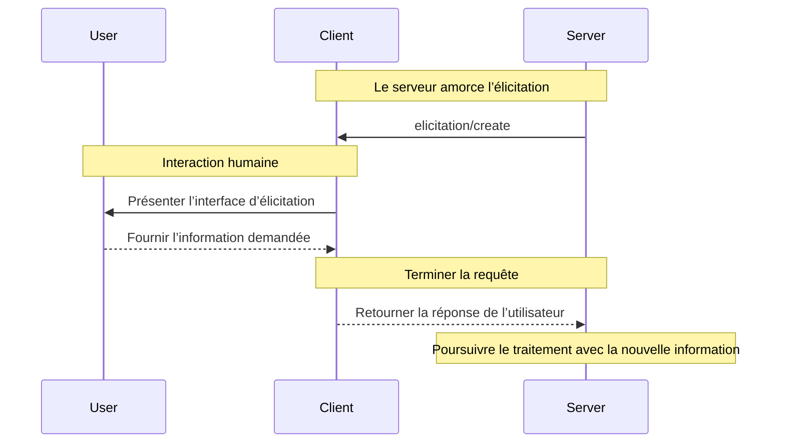
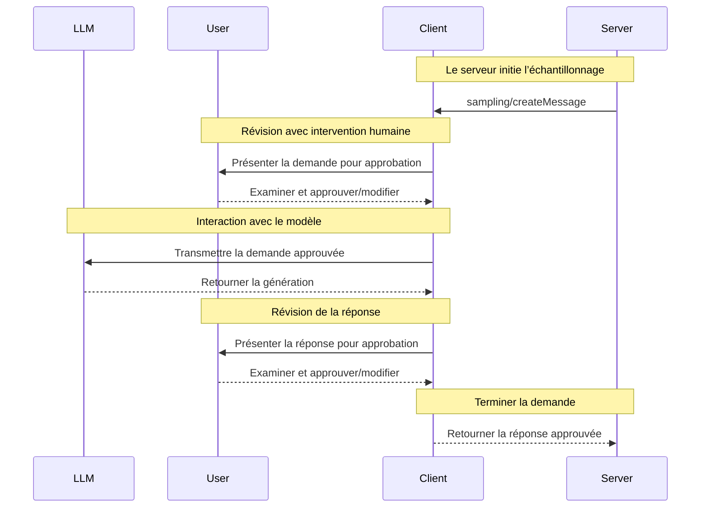

Les clients MCP sont instanciés par des applications hôtes pour communiquer avec des serveurs MCP particuliers. L’application hôte, comme Claude.ai ou un IDE, gère l’expérience utilisateur globale et coordonne plusieurs clients. Chaque client gère une communication directe avec un serveur.

Il est important de bien faire la distinction : l’hôte est l’application avec laquelle les utilisateurs interagissent, tandis que les clients sont les composants au niveau du protocole qui permettent les connexions aux serveurs.

<div id="core-client-features">
  ## Fonctionnalités principales du client
</div>

En plus d’exploiter le contexte fourni par les serveurs, les clients peuvent offrir plusieurs fonctionnalités aux serveurs. Ces fonctionnalités côté client permettent aux auteurs de serveurs de créer des interactions plus riches.

| Fonctionnalité  | Explication                                                                                                                                                                                        | Exemple                                                                                                                                 |
| --------------- | -------------------------------------------------------------------------------------------------------------------------------------------------------------------------------------------------- | ---------------------------------------------------------------------------------------------------------------------------------------- |
| **Échantillonnage**    | L’échantillonnage permet aux serveurs de demander des complétions LLM via le client, rendant possible un flux de travail agentique. Cette approche donne au client le contrôle complet des autorisations des utilisateurs et des mesures de sécurité. | Un serveur de réservation de voyages peut envoyer une liste de vols à un LLM et lui demander de choisir le meilleur vol pour l’utilisateur. |
| **Racines**       | Les Racines permettent aux clients de préciser à quels fichiers les serveurs peuvent accéder, en les orientant vers les répertoires pertinents tout en maintenant des limites de sécurité.                                                         | Un serveur de réservation de voyages peut recevoir l’accès à un répertoire précis, à partir duquel il peut lire le calendrier d’un utilisateur.  |
| **Élicitation** | L’Élicitation permet aux serveurs de demander des renseignements précis aux utilisateurs pendant les interactions, offrant une façon structurée de recueillir des informations sur demande.                                | Un serveur de réservation de voyages peut demander les préférences de l’utilisateur concernant les sièges d’avion, le type de chambre ou son numéro de téléphone pour finaliser une réservation. |

<div id="elicitation">
  ### Élicitation
</div>

L’élicitation permet aux serveurs de demander des renseignements précis aux utilisateurs durant les interactions, ce qui crée des flux de travail plus dynamiques et réactifs.

<div id="overview">
  #### Aperçu
</div>

L’élicitation offre une méthode structurée permettant aux serveurs de recueillir, au besoin, l’information nécessaire. Plutôt que d’exiger toutes les informations d’emblée ou d’échouer lorsque des données manquent, les serveurs peuvent suspendre leurs opérations pour demander des saisies précises aux utilisateurs. Cela favorise des interactions plus flexibles où les serveurs s’adaptent aux besoins des utilisateurs plutôt que de suivre des schémas rigides.

**Flux d’élicitation :**



Ce flux permet une collecte d’information dynamique. Les serveurs peuvent demander des données précises au besoin, les utilisateurs fournissent l’information par une interface appropriée, et les serveurs poursuivent le traitement avec le contexte nouvellement acquis.

**Exemple de composants d’élicitation :**

```typescript
{
  method: "elicitation/requestInput",
  params: {
    message: "Veuillez confirmer les détails de votre réservation de vacances à Barcelone :",
    schema: {
      type: "object",
      properties: {
        confirmBooking: {
          type: "boolean",
          description: "Confirmer la réservation (vols + hôtel = 3 000 $)"
        },
        seatPreference: {
          type: "string",
          enum: ["hublot", "couloir", "aucune préférence"],
          description: "Type de siège préféré pour les vols"
        },
        roomType: {
          type: "string",
          enum: ["vue sur la mer", "vue sur la ville", "vue sur le jardin"],
          description: "Type de chambre préféré à l’hôtel"
        },
        travelInsurance: {
          type: "boolean",
          default: false,
          description: "Ajouter une assurance voyage (150 $)"
        }
      },
      required: ["confirmBooking"]
    }
  }
}
```

<div id="example-holiday-booking-approval">
  #### Exemple : approbation de réservation de vacances
</div>

Un serveur de réservation de voyages illustre la puissance de l’élicitation lors du processus final de confirmation. Lorsqu’un utilisateur a choisi son forfait vacances idéal pour Barcelone, le serveur doit obtenir l’approbation finale et toute information manquante avant de continuer.

Le serveur sollicite la confirmation de la réservation au moyen d’une requête structurée qui comprend le résumé du voyage (vols pour Barcelone du 15 au 22 juin, hôtel en bord de mer, total de 3 000 $) ainsi que des champs pour toute préférence supplémentaire — comme le choix des sièges, le type de chambre ou les options d’assurance voyage.

À mesure que la réservation avance, le serveur recueille les coordonnées nécessaires pour finaliser l’achat. Il peut demander des renseignements sur les voyageurs pour les réservations de vol, des demandes particulières pour l’hôtel ou des coordonnées d’urgence.

<div id="user-interaction-model">
  #### Modèle d’interaction avec l’utilisateur
</div>

Les interactions d’élicitation sont conçues pour être claires, contextualisées et respectueuses de l’autonomie de l’utilisateur :

**Présentation de la demande** : Les clients affichent les demandes d’élicitation avec un contexte clair indiquant quel serveur les formule, pourquoi l’information est nécessaire et comment elle sera utilisée. Le message de demande explique l’objectif, tandis que le schéma fournit la structure et la validation.

**Options de réponse** : Les utilisateurs peuvent fournir l’information demandée au moyen de contrôles d’interface appropriés (champs de texte, menus déroulants, cases à cocher), refuser de la fournir avec une explication facultative ou annuler toute l’opération. Les clients valident les réponses selon le schéma fourni avant de les retourner aux serveurs.

**Considérations relatives à la vie privée** : L’élicitation ne demande jamais de mots de passe ni de clés d’API. Les clients avertissent en cas de demandes suspectes et permettent aux utilisateurs d’examiner les données avant l’envoi.

<div id="roots">
  ### Racines
</div>

Les racines définissent les limites du système de fichiers pour les opérations du serveur, permettant aux clients d’indiquer sur quels répertoires les serveurs doivent se concentrer.

<div id="overview">
  #### Aperçu
</div>

Les Racines sont un mécanisme permettant aux clients de communiquer aux serveurs les limites d’accès au système de fichiers. Elles se composent d’URI de fichiers qui indiquent les répertoires où les serveurs peuvent fonctionner, aidant ainsi les serveurs à comprendre la portée des fichiers et des dossiers disponibles. Plutôt que d’accorder aux serveurs un accès illimité au système de fichiers, les racines les orientent vers les répertoires de travail pertinents tout en maintenant des limites de sécurité.

**Structure d’une Racine :**

```json
{
  "uri": "file:///Users/agent/travel-planning",
  "name": "Travel Planning Workspace"
}
```

Les Racines sont exclusivement des chemins du système de fichiers et utilisent toujours le schéma d’URI `file://`. Elles aident les serveurs à comprendre les limites d’un projet, l’organisation de l’espace de travail et les répertoires accessibles. La liste des racines peut être mise à jour dynamiquement à mesure que les utilisateurs travaillent avec différents projets ou dossiers; les serveurs reçoivent des notifications via `roots/list_changed` lorsque ces limites changent.

Il est important de noter que, même si les racines indiquent aux serveurs où intervenir, le client conserve toujours le contrôle complet de l’accès aux fichiers. Les racines communiquent simplement les limites prévues — l’accès réel aux fichiers est toujours régi par les politiques de sécurité du client.

<div id="example-travel-planning-workspace">
  #### Exemple : Espace de travail pour la planification de voyages
</div>

Un agent de voyages qui gère plusieurs voyages pour des clients profite des Racines pour organiser l’accès au système de fichiers. Imaginez un espace de travail avec différents répertoires pour divers aspects de la planification.

Le client fournit des Racines de système de fichiers au serveur de planification de voyages :

- `file:///Users/agent/travel-planning` - Espace de travail principal contenant tous les fichiers de voyage
- `file:///Users/agent/travel-templates` - Modèles d’itinéraires réutilisables et Ressources
- `file:///Users/agent/client-documents` - Passeports des clients et documents de voyage

Lorsque l’agent crée un itinéraire pour Barcelone, le serveur travaille à l’intérieur de ces limites — accède aux modèles, enregistre le nouvel itinéraire et référence les documents des clients. Il ne peut pas accéder à des fichiers en dehors de ces Racines. Les serveurs accèdent généralement aux fichiers dans les Racines en utilisant des chemins relatifs à partir des répertoires racine ou en utilisant des outils de recherche de fichiers qui respectent les limites des Racines.

Si l’agent ouvre un dossier d’archives comme `file:///Users/agent/archive/2023-trips`, le client met à jour la liste des Racines via `roots/list_changed`.

<div id="user-interaction-model">
  #### Modèle d’interaction utilisateur
</div>

Les racines sont généralement gérées automatiquement par les applications hôtes en fonction des actions des utilisateurs, bien que certaines applications puissent proposer une gestion manuelle des racines :

**Détection automatique des racines** : Lorsque les utilisateurs ouvrent des dossiers, les clients les exposent automatiquement comme racines. Ouvrir un espace de travail de voyage donne aux serveurs accès aux itinéraires et aux documents de ce répertoire.

**Configuration manuelle des racines** : Les utilisateurs avancés peuvent définir des racines via la configuration. Par exemple, ajouter `/travel-templates` pour des ressources réutilisables tout en excluant les répertoires contenant des dossiers financiers.

<div id="sampling">
  ### Échantillonnage
</div>

L’échantillonnage permet aux serveurs de demander, via le client, des complétions générées par un modèle linguistique, ce qui active des comportements d’agent tout en préservant la sécurité et le contrôle de l’utilisateur.

<div id="overview">
  #### Aperçu
</div>

L’échantillonnage permet aux serveurs d’exécuter des tâches dépendantes de l’IA sans intégrer directement ni payer des modèles d’IA. Plutôt, les serveurs peuvent demander au client — qui a déjà accès aux modèles d’IA — de prendre ces tâches en charge en leur nom. Cette approche donne au client un contrôle complet sur les autorisations des utilisateurs et les mesures de sécurité. Comme les demandes d’échantillonnage surviennent dans le contexte d’autres opérations — par exemple lorsqu’un outil analyse des données — et qu’elles sont traitées comme des appels de modèle distincts, elles maintiennent des frontières claires entre différents contextes, ce qui permet une utilisation plus efficace de la fenêtre de contexte.

**Flux d’échantillonnage :**



Le flux assure la sécurité grâce à plusieurs points de contrôle avec intervention humaine. Les utilisateurs examinent et peuvent modifier tant la demande initiale que la réponse générée avant qu’elle soit renvoyée au serveur.

**Exemple de paramètres de requête :**

```typescript
{
  messages: [
    {
      role: "user",
      content: "Analyze these flight options and recommend the best choice:\n" +
               "[47 flights with prices, times, airlines, and layovers]\n" +
               "User preferences: morning departure, max 1 layover"
    }
  ],
  modelPreferences: {
    hints: [{
      name: "claude-3-5-sonnet"  // Suggested model
    }],
    costPriority: 0.3,      // Less concerned about API cost
    speedPriority: 0.2,     // Can wait for thorough analysis
    intelligencePriority: 0.9  // Need complex trade-off evaluation
  },
  systemPrompt: "You are a travel expert helping users find the best flights based on their preferences",
  maxTokens: 1500
}
```

<div id="example-flight-analysis-tool">
  #### Exemple : Outil d’analyse de vols
</div>

Imaginez un serveur de réservation de voyages avec un outil appelé `findBestFlight` qui utilise l’échantillonnage pour analyser les vols disponibles et recommander l’option optimale. Lorsqu’un utilisateur demande « Réserve-moi le meilleur vol pour Barcelone le mois prochain », l’outil a besoin de l’aide de l’IA pour évaluer des compromis complexes.

L’outil interroge les API des compagnies aériennes et recueille 47 options de vol. Il sollicite ensuite l’assistance de l’IA pour analyser ces options : « Analyse ces options de vol et recommande le meilleur choix : [47 vols avec prix, horaires, transporteurs et escales] Préférences de l’utilisateur : départ le matin, au plus 1 escale. »

Le client lance la demande d’échantillonnage, ce qui permet à l’IA d’évaluer les compromis — par exemple entre des vols de nuit moins chers et des départs matinaux plus pratiques. L’outil utilise cette analyse pour présenter les trois meilleures recommandations.

<div id="user-interaction-model">
  #### Modèle d’interaction utilisateur
</div>

Bien que cela ne soit pas obligatoire, l’échantillonnage est conçu pour permettre un contrôle avec intervention humaine. Les utilisateurs peuvent garder un œil sur le processus au moyen de plusieurs mécanismes :

**Contrôles d’approbation** : Les requêtes d’échantillonnage peuvent exiger le consentement explicite de l’utilisateur. Les clients peuvent afficher ce que le serveur souhaite analyser et pourquoi. Les utilisateurs peuvent approuver, refuser ou modifier les requêtes.

**Fonctionnalités de transparence** : Les clients peuvent afficher l’invite exacte, le modèle sélectionné et les limites de jetons, ce qui permet aux utilisateurs d’examiner les réponses de l’IA avant leur renvoi au serveur.

**Options de configuration** : Les utilisateurs peuvent définir des préférences de modèle, configurer l’approbation automatique pour les opérations de confiance ou exiger une approbation pour tout. Les clients peuvent offrir des options pour caviarder les informations sensibles.

**Considérations de sécurité** : Les clients et les serveurs doivent tous deux traiter correctement les données sensibles durant l’échantillonnage. Les clients devraient mettre en place une limitation du débit et valider tout le contenu des messages. La conception avec intervention humaine garantit que les interactions IA amorcées par le serveur ne peuvent pas compromettre la sécurité ni accéder à des données sensibles sans le consentement explicite de l’utilisateur.