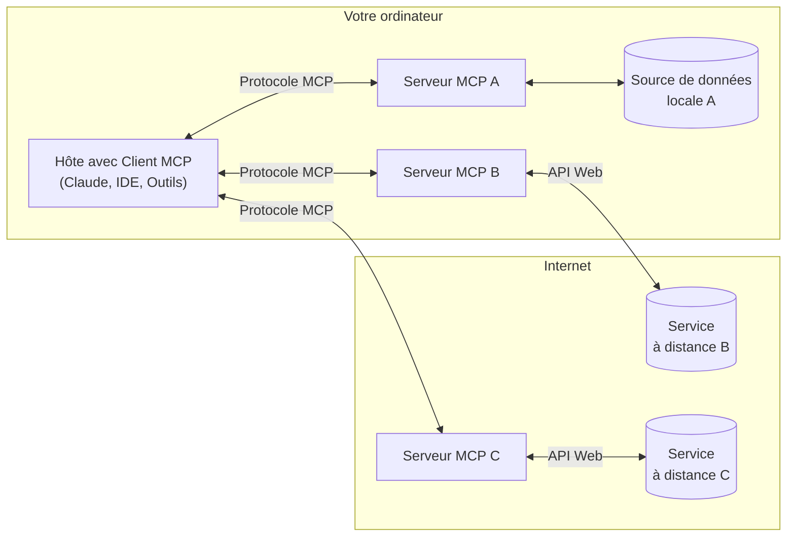

MCP est un protocole ouvert qui uniformise la façon dont les applications fournissent du contexte aux LLM. Pensez à MCP comme à un port USB‑C pour les applications d’IA. Tout comme l’USB‑C offre une façon standardisée de connecter vos appareils à divers périphériques et accessoires, MCP offre une façon standardisée de connecter les modèles d’IA à différentes sources de données et à des Outils.

  ## Pourquoi MCP?

MCP vous aide à créer des agents et des flux de travail complexes au-dessus des LLM. Les LLM doivent souvent s’intégrer à des données et à des outils, et MCP offre :

* Une liste grandissante d’intégrations prêtes à l’emploi auxquelles votre LLM peut se connecter directement
* La souplesse de passer d’un fournisseur de LLM à un autre
* Des pratiques exemplaires pour sécuriser vos données au sein de votre infrastructure

  ### Architecture générale

Au cœur du système, le MCP adopte une architecture client-serveur où une application hôte peut se connecter à plusieurs serveurs :

* **Hôtes MCP** : Programmes comme Claude Desktop, des IDE ou des outils d’IA qui souhaitent accéder aux données via le MCP
* **Clients MCP** : Clients du protocole qui maintiennent des connexions 1:1 avec des serveurs
* **Serveurs MCP** : Programmes légers qui exposent chacun des capacités spécifiques via le Model Context Protocol normalisé
* **Sources de données locales** : Les fichiers, bases de données et services de votre ordinateur auxquels les serveurs MCP peuvent accéder de façon sécurisée
* **Services à distance** : Systèmes externes disponibles sur Internet (p. ex., via des API) auxquels les serveurs MCP peuvent se connecter

  ## Mise en route

Choisissez le parcours qui correspond le mieux à vos besoins :

  ### Démarrage rapide

<CardGroup cols={2}>
  <Card title="Pour les développeurs de serveurs" icon="bolt" href="/fr-CA/quickstart/server">
    Commencez à créer votre propre serveur pour l’utiliser dans Claude pour ordinateur et dans d’autres
    clients
  </Card>

  <Card title="Pour les développeurs de clients" icon="bolt" href="/fr-CA/quickstart/client">
    Commencez à créer votre propre client pouvant s’intégrer à tous les serveurs MCP
  </Card>

  <Card title="Pour les utilisateurs de Claude pour ordinateur" icon="bolt" href="/fr-CA/docs/develop/connect-local-servers">
    Commencez à utiliser des serveurs prêts à l’emploi dans Claude pour ordinateur
  </Card>
</CardGroup>

  ### Exemples

<CardGroup cols={2}>
  <Card title="Serveurs d’exemple" icon="grid" href="/fr-CA/examples">
    Découvrez notre galerie de serveurs MCP officiels et d’implémentations
  </Card>

  <Card title="Clients d’exemple" icon="cubes" href="/fr-CA/clients">
    Consultez la liste des clients qui prennent en charge les intégrations MCP
  </Card>
</CardGroup>

  ## Tutoriels

<CardGroup cols={2}>
  <Card title="Créer un MCP avec des LLM" icon="comments" href="/fr-CA/tutorials/building-mcp-with-llms">
    Découvrez comment utiliser des LLM comme Claude pour accélérer votre développement MCP
  </Card>

  <Card title="Guide de débogage" icon="bug" href="/fr-CA/legacy/tools/debugging">
    Apprenez à déboguer efficacement des serveurs MCP et des intégrations
  </Card>

  <Card title="MCP Inspector" icon="magnifying-glass" href="/fr-CA/legacy/tools/inspector">
    Testez et inspectez vos serveurs MCP avec notre outil de débogage interactif
  </Card>

  <Card title="Atelier MCP (vidéo, 2 h)" icon="person-chalkboard" href="https://www.youtube.com/watch?v=kQmXtrmQ5Zg">
    <iframe src="https://www.youtube.com/embed/kQmXtrmQ5Zg" />
  </Card>
</CardGroup>

  ## Explorer MCP

Approfondissez les concepts et les fonctionnalités clés de MCP :

<CardGroup cols={2}>
  <Card title="Architecture de base" icon="sitemap" href="/fr-CA/legacy/concepts/architecture">
    Comprenez comment MCP relie les clients, les serveurs et les LLM
  </Card>

  <Card title="Ressources" icon="database" href="/fr-CA/legacy/concepts/resources">
    Exposez des données et du contenu de vos serveurs aux LLM
  </Card>

  <Card title="Invités" icon="message" href="/fr-CA/legacy/concepts/prompts">
    Créez des gabarits d’invite réutilisables et des flux de travail
  </Card>

  <Card title="Outils" icon="wrench" href="/fr-CA/legacy/concepts/tools">
    Permettez aux LLM d’exécuter des actions par l’entremise de votre serveur
  </Card>

  <Card title="Échantillonnage" icon="robot" href="/fr-CA/legacy/concepts/sampling">
    Autorisez vos serveurs à demander des complétions aux LLM
  </Card>

  <Card title="Transports" icon="network-wired" href="/fr-CA/legacy/concepts/transports">
    Découvrez le mécanisme de communication de MCP
  </Card>
</CardGroup>

  ## Contribution

Vous souhaitez contribuer? Consultez notre [guide de contribution](/fr-CA/development/contributing) pour savoir comment vous pouvez aider à améliorer le Model Context Protocol (MCP).

  ## Soutien et commentaires

Voici comment obtenir de l’aide ou transmettre des commentaires :

* Pour signaler des bogues et proposer des améliorations liés à la spécification MCP, aux SDK ou à la documentation (open source), veuillez [créer un billet GitHub](https://github.com/modelcontextprotocol)
* Pour les discussions ou les questions-réponses concernant la spécification MCP, utilisez les [discussions sur la spécification](https://github.com/modelcontextprotocol/specification/discussions)
* Pour les discussions ou les questions-réponses concernant d’autres composants open source de MCP, utilisez les [discussions de l’organisation](https://github.com/orgs/modelcontextprotocol/discussions)
* Pour signaler des bogues, proposer des améliorations et poser des questions à propos de l’intégration MCP de Claude.app et de claude.ai, veuillez consulter le guide d’Anthropic sur [Comment obtenir du soutien](https://support.anthropic.com/en/articles/9015913-how-to-get-support)