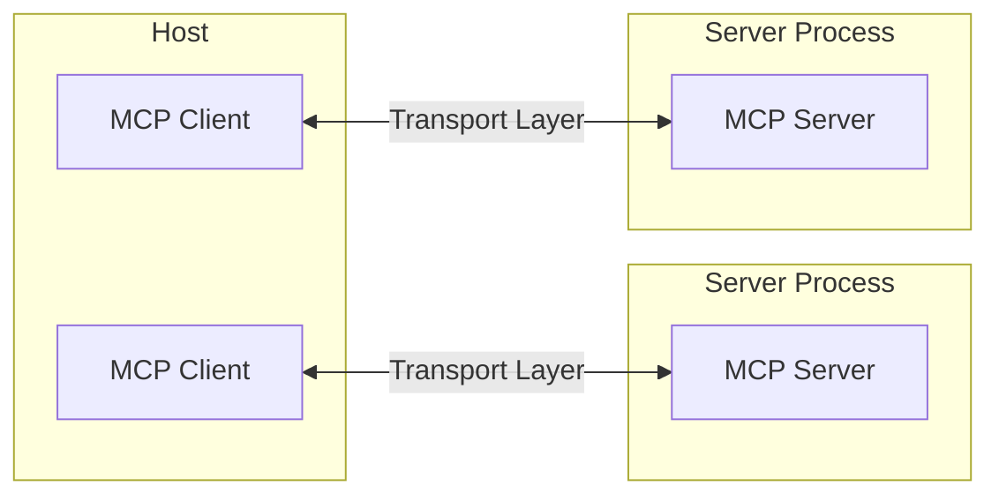
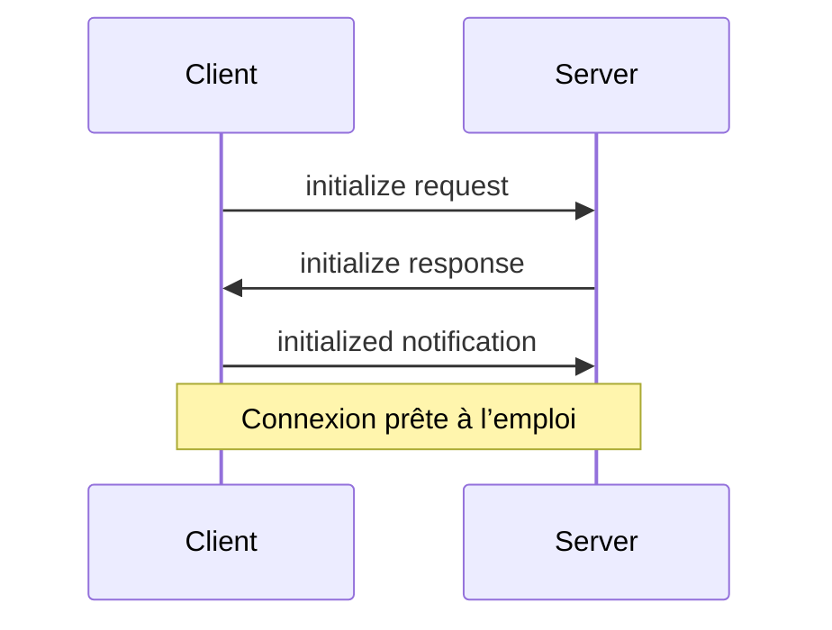

Le Model Context Protocol (MCP) repose sur une architecture souple et extensible qui permet une communication transparente entre les applications LLM et leurs intégrations. Ce document présente les composantes et concepts architecturaux fondamentaux.

<div id="overview">
  ## Aperçu
</div>

Le Model Context Protocol (MCP) adopte une architecture client‑serveur où :

* Les **hôtes** sont des applications LLM (comme Claude Desktop ou des IDE) qui initient les connexions
* Les **clients** maintiennent des connexions 1:1 avec des serveurs, à l’intérieur de l’application hôte
* Les **serveurs** fournissent du contexte, des Outils et des Invites de commande aux clients



<div id="core-components">
  ## Composants essentiels
</div>

<div id="protocol-layer">
  ### Couche protocolaire
</div>

La couche protocolaire gère l’encapsulation des messages, l’association requête/réponse et les modèles de communication de haut niveau.

<CodeGroup>
  ```typescript TypeScript
  class Protocol<Request, Notification, Result> {
    // Gérer les requêtes entrantes
    setRequestHandler<T>(
      schema: T,
      handler: (request: T, extra: RequestHandlerExtra) => Promise<Result>,
    ): void;

    // Gérer les notifications entrantes
    setNotificationHandler<T>(
      schema: T,
      handler: (notification: T) => Promise<void>,
    ): void;

    // Envoyer des requêtes et attendre les réponses
    request<T>(request: Request, schema: T, options?: RequestOptions): Promise<T>;

    // Envoyer des notifications unidirectionnelles
    notification(notification: Notification): Promise<void>;
  }
  ```

  ```python Python
  class Session(BaseSession[RequestT, NotificationT, ResultT]):
      async def send_request(
          self,
          request: RequestT,
          result_type: type[Result]
      ) -> Result:
          """Envoyer une requête et attendre la réponse. Lève McpError si la réponse contient une erreur."""
          # Implémentation de la gestion des requêtes

      async def send_notification(
          self,
          notification: NotificationT
      ) -> None:
          """Envoyer une notification unidirectionnelle qui n’attend pas de réponse."""
          # Implémentation de la gestion des notifications

      async def _received_request(
          self,
          responder: RequestResponder[ReceiveRequestT, ResultT]
      ) -> None:
          """Traiter une requête entrante provenant de l’autre côté."""
          # Implémentation de la gestion des requêtes

      async def _received_notification(
          self,
          notification: ReceiveNotificationT
      ) -> None:
          """Traiter une notification entrante provenant de l’autre côté."""
          # Implémentation de la gestion des notifications
  ```
</CodeGroup>

Les principales classes sont :

* `Protocol`
* `Client`
* `Server`

<div id="transport-layer">
  ### Couche de transport
</div>

La couche de transport gère la communication entre les clients et les serveurs. Le Model Context Protocol (MCP) prend en charge plusieurs mécanismes de transport :

1. **Transport STDIO**
   * Utilise l’entrée/sortie standard pour la communication
   * Idéal pour les processus locaux

2. **Transport HTTP diffusable**
   * Utilise HTTP avec des événements envoyés par le serveur (SSE) optionnels pour la diffusion en continu
   * HTTP POST pour les messages du client vers le serveur

Tous les transports utilisent [JSON-RPC](https://www.jsonrpc.org/) 2.0 pour échanger des messages. Consultez la [spécification](/fr-CA/specification/) pour des informations détaillées sur le format des messages du Model Context Protocol.

<div id="message-types">
  ### Types de messages
</div>

Le MCP comporte les types de messages principaux suivants :

1. Les **requêtes** attendent une réponse de l’autre partie :

   ```typescript
   interface Request {
     method: string;
     params?: { ... };
   }
   ```

2. Les **résultats** sont des réponses réussies aux requêtes :

   ```typescript
   interface Result {
     [key: string]: unknown;
   }
   ```

3. Les **erreurs** indiquent qu’une requête a échoué :

   ```typescript
   interface Error {
     code: number;
     message: string;
     data?: unknown;
   }
   ```

4. Les **notifications** sont des messages unidirectionnels qui n’attendent pas de réponse :
   ```typescript
   interface Notification {
     method: string;
     params?: { ... };
   }
   ```

<div id="connection-lifecycle">
  ## Cycle de vie de la connexion
</div>

<div id="1-initialization">
  ### 1. Initialisation
</div>



1. Le client envoie une requête `initialize` avec la version du protocole et les capacités
2. Le serveur répond avec sa version du protocole et ses capacités
3. Le client envoie la notification `initialized` en guise d’accusé de réception
4. L’échange normal de messages commence

<div id="2-message-exchange">
  ### 2. Échange de messages
</div>

Après l’initialisation, les schémas suivants sont pris en charge :

* **Requête-réponse** : Le client ou le serveur envoie des requêtes, l’autre répond
* **Notifications** : L’une ou l’autre des parties envoie des messages unidirectionnels

<div id="3-termination">
  ### 3. Résiliation
</div>

Chaque partie peut mettre fin à la connexion :

* Arrêt propre avec `close()`
* Déconnexion du transport
* Conditions d’erreur

<div id="error-handling">
  ## Gestion des erreurs
</div>

MCP définit les codes d’erreur standard suivants :

```typescript
enum ErrorCode {
  // Standard JSON-RPC error codes
  ParseError = -32700,
  InvalidRequest = -32600,
  MethodNotFound = -32601,
  InvalidParams = -32602,
  InternalError = -32603,
}
```

Les SDK et les applications peuvent définir leurs propres codes d’erreur supérieurs à -32000.

Les erreurs sont propagées par :

* Des réponses d’erreur aux requêtes
* Des événements d’erreur sur les transports
* Des gestionnaires d’erreurs au niveau du protocole

<div id="implementation-example">
  ## Exemple d’implémentation
</div>

Voici un exemple de base d’implémentation d’un Serveur MCP :

<CodeGroup>
  ```typescript TypeScript
  import { Server } from "@modelcontextprotocol/sdk/server/index.js";
  import { StdioServerTransport } from "@modelcontextprotocol/sdk/server/stdio.js";

  const server = new Server(
    {
      name: "example-server",
      version: "1.0.0",
    },
    {
      capabilities: {
        resources: {},
      },
    },
  );

  // Gestion des requêtes
  server.setRequestHandler(ListResourcesRequestSchema, async () => {
    return {
      resources: [
        {
          uri: "example://resource",
          name: "Example Resource",
        },
      ],
    };
  });

  // Connexion du transport
  const transport = new StdioServerTransport();
  await server.connect(transport);
  ```

  ```python Python
  import asyncio
  import mcp.types as types
  from mcp.server import Server
  from mcp.server.stdio import stdio_server

  app = Server("example-server")

  @app.list_resources()
  async def list_resources() -> list[types.Resource]:
      return [
          types.Resource(
              uri="example://resource",
              name="Example Resource"
          )
      ]

  async def main():
      async with stdio_server() as streams:
          await app.run(
              streams[0],
              streams[1],
              app.create_initialization_options()
          )

  if __name__ == "__main__":
      asyncio.run(main())
  ```
</CodeGroup>

<div id="best-practices">
  ## Bonnes pratiques
</div>

<div id="transport-selection">
  ### Sélection du transport
</div>

1. **Communication locale**
   * Utilisez le transport STDIO pour les processus locaux
   * Efficace pour la communication sur une même machine
   * Gestion des processus simplifiée

2. **Communication à distance**
   * Utilisez HTTP diffusable pour les scénarios nécessitant une compatibilité HTTP
   * Tenez compte des considérations de sécurité, notamment l’authentification et l’autorisation

<div id="message-handling">
  ### Gestion des messages
</div>

1. **Traitement des requêtes**
   * Valider soigneusement les entrées
   * Utiliser des schémas sûrs et typés
   * Gérer les erreurs avec souplesse
   * Mettre en place des délais d’expiration

2. **Suivi de l’avancement**
   * Utiliser des jetons de progression pour les opérations longues
   * Rendre compte de l’avancement de façon incrémentale
   * Indiquer la progression totale lorsqu’elle est connue

3. **Gestion des erreurs**
   * Utiliser des codes d’erreur appropriés
   * Fournir des messages d’erreur utiles
   * Libérer les ressources en cas d’erreur

<div id="security-considerations">
  ## Considérations de sécurité
</div>

1. **Sécurité du transport**
   * Utiliser TLS pour les connexions à distance
   * Valider l’origine des connexions
   * Mettre en place une authentification au besoin

2. **Validation des messages**
   * Valider tous les messages entrants
   * Assainir les entrées
   * Vérifier les limites de taille des messages
   * Vérifier le format JSON-RPC

3. **Protection des ressources**
   * Mettre en place des contrôles d’accès
   * Valider les chemins d’accès aux ressources
   * Surveiller l’utilisation des ressources
   * Limiter le débit des requêtes

4. **Gestion des erreurs**
   * Ne pas divulguer d’informations sensibles
   * Consigner les erreurs pertinentes à la sécurité
   * Mettre en place un nettoyage approprié
   * Gérer les scénarios de type DoS

<div id="debugging-and-monitoring">
  ## Débogage et surveillance
</div>

1. **Journalisation**
   * Consigner les événements du protocole
   * Suivre le flux de messages
   * Surveiller les performances
   * Consigner les erreurs

2. **Diagnostics**
   * Mettre en place des vérifications d’intégrité
   * Surveiller l’état de la connexion
   * Suivre l’utilisation des ressources
   * Analyser les performances

3. **Tests**
   * Tester différents transports
   * Vérifier la gestion des erreurs
   * Tester les cas limites
   * Effectuer des tests de charge sur les serveurs