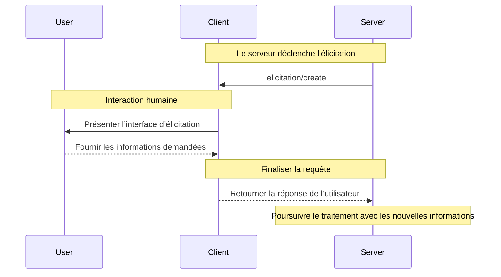

L’élicitation est une fonctionnalité puissante de MCP qui permet aux serveurs de demander des informations supplémentaires aux utilisateurs pendant les interactions. Elle permet des flux de travail dynamiques où les serveurs peuvent recueillir, au besoin, les données nécessaires tout en préservant le contrôle et la confidentialité des utilisateurs.

<Info>
  L’élicitation a été nouvellement introduite dans la spécification MCP [révision
  2025-06-18](/fr-CA/specification/2025-06-18/client/elicitation).
</Info>

<div id="what-is-elicitation">
  ## Qu’est-ce que l’Élicitation?
</div>

L’Élicitation offre une façon standardisée pour les serveurs MCP de demander des informations structurées aux utilisateurs par l’entremise du client. Plutôt que d’exiger toutes les informations d’emblée, les serveurs peuvent solliciter des données précises exactement au moment opportun, rendant les interactions plus naturelles et flexibles.

Par exemple, un serveur pourrait :

* Demander un nom d’utilisateur lors de la connexion à un service
* Demander des préférences de configuration pendant la configuration
* Recueillir des détails sur le projet lors de la création de nouvelles ressources

<div id="how-elicitation-works">
  ## Fonctionnement de l’élicitation
</div>

Le déroulement de l’élicitation est simple :

1. Le serveur envoie une demande d’élicitation avec un message et une structure de données attendue
2. Le client présente la demande à l’utilisateur au moyen d’une interface appropriée
3. L’utilisateur accepte, refuse ou annule la demande
4. Le client valide et renvoie la réponse au serveur
5. Le serveur poursuit le traitement avec les informations fournies

<div id="request-structure">
  ## Structure de la requête
</div>

Les requêtes d’élicitation comportent deux éléments clés :

<div id="message">
  ### Message
</div>

Une explication claire, compréhensible par l’humain, indiquant quelles informations sont nécessaires et pourquoi.

<div id="schema">
  ### Schéma
</div>

Un schéma JSON qui définit la structure attendue de la réponse. Le schéma est volontairement limité à des objets plats avec des types primitifs afin de simplifier l’implémentation du client.

Exemple de requête :

```json
{
  "message": "Please provide your GitHub username",
  "requestedSchema": {
    "type": "object",
    "properties": {
      "username": {
        "type": "string",
        "title": "Nom d’utilisateur GitHub",
        "description": "Votre nom d’utilisateur GitHub (p. ex., octocat)"
      }
    },
    "required": ["username"]
  }
}
```

<div id="supported-data-types">
  ## Types de données pris en charge
</div>

L’élicitation prend en charge les types primitifs suivants :

<div id="text-input">
  ### Saisie de texte
</div>

```json
{
  "type": "string",
  "title": "Nom du projet",
  "description": "Nom de votre nouveau projet",
  "minLength": 3,
  "maxLength": 50,
  "default": "mon-projet"
}
```

<div id="numbers">
  ### Nombres
</div>

```json
{
  "type": "number",
  "title": "Numéro de port",
  "description": "Port sur lequel le serveur doit s’exécuter",
  "minimum": 1024,
  "maximum": 65535,
  "default": 3000
}
```

<div id="boolean-choices">
  ### Choix booléens
</div>

```json
{
  "type": "boolean",
  "title": "Activer l’analytique",
  "description": "Envoyer des statistiques d’utilisation anonymes",
  "default": false
}
```

<div id="selection-lists">
  ### Listes de sélection
</div>

```json
{
  "type": "string",
  "title": "Environnement",
  "enum": ["development", "staging", "production"],
  "enumNames": ["Développement", "Préproduction", "Production"],
  "default": "development"
}
```

<div id="user-response-actions">
  ## Actions de réponse des utilisateurs
</div>

Les utilisateurs peuvent répondre aux demandes d’élicitation de trois façons :

1. **Accepter** : L’utilisateur fournit les informations demandées
2. **Refuser** : L’utilisateur refuse explicitement de fournir les informations
3. **Annuler** : L’utilisateur quitte sans faire de choix (p. ex., ferme la boîte de dialogue)

Les serveurs devraient traiter chaque réponse de manière appropriée :

* Accepter → Traiter les données fournies
* Refuser → Proposer des solutions de rechange ou ajuster le flux de travail
* Annuler → Envisager de réessayer plus tard ou d’utiliser des valeurs par défaut

<div id="best-practices">
  ## Bonnes pratiques
</div>

Lors de la mise en œuvre de l’élicitation :

<div id="for-servers">
  ### Pour les serveurs
</div>

1. **Soyez clair** : Rédigez des messages descriptifs expliquant pourquoi l’information est nécessaire
2. **Soyez minimaliste** : Ne demandez que l’information essentielle
3. **Soyez flexible** : Prévoyez des solutions de repli pour les demandes refusées ou annulées
4. **Soyez opportun** : Demandez l’information au moment où elle est réellement nécessaire, et non de façon préventive
5. **Soyez respectueux** : Ne demandez jamais d’informations sensibles comme des mots de passe ou des jetons

<div id="for-clients">
  ### Pour les clients
</div>

1. **Soyez transparent** : Indiquez clairement quel serveur demande des informations
2. **Soyez protecteur** : Permettez aux utilisateurs d’examiner et de modifier les réponses
3. **Soyez rigoureux** : Validez les réponses selon le schéma fourni
4. **Soyez responsabilisant** : Mettez bien en vue les options Refuser et Annuler
5. **Soyez restrictif** : Mettez en place une limitation du débit pour prévenir le pourriel

<div id="common-use-cases">
  ## Cas d’utilisation courants
</div>

L’Élicitation excelle dans des scénarios comme :

* **Configuration initiale** : Collecte des paramètres lors de la première configuration
* **Flux de travail dynamiques** : Demande d’informations propres au contexte
* **Préférences de l’utilisateur** : Collecte de réglages et de préférences facultatifs
* **Détails du projet** : Collecte de métadonnées sur les Ressources en cours de création
* **Intégration de services** : Demande de noms d’utilisateur ou d’identifiants pour des services externes

<div id="example-workflow">
  ## Exemple de flux de travail
</div>

Voici une interaction d’élicitation typique :



<div id="security-considerations">
  ## Considérations de sécurité
</div>

<Warning>
  Les serveurs ne doivent jamais utiliser l’élicitation pour demander des mots de passe, des clés d’API, des jetons ou
  d’autres justificatifs sensibles. Utilisez plutôt des parcours d’authentification appropriés.
</Warning>

Principales lignes directrices en matière de sécurité :

1. Les serveurs ne devraient demander que des informations non sensibles
2. Les clients devraient indiquer clairement quel serveur sollicite les données
3. Les utilisateurs devraient toujours avoir la possibilité de refuser
4. Les réponses devraient être validées par rapport au schéma
5. La limitation du débit devrait prévenir l’inondation de requêtes

<div id="implementation-example">
  ## Exemple d’implémentation
</div>

Voici comment un serveur pourrait utiliser l’élicitation pour recueillir des informations sur un projet :

```typescript
// Le serveur demande des détails sur le projet
const response = await client.request("elicitation/create", {
  message: "Configurons votre nouveau projet",
  requestedSchema: {
    type: "object",
    properties: {
      name: {
        type: "string",
        title: "Nom du projet",
        description: "Un nom évocateur pour votre projet",
      },
      framework: {
        type: "string",
        title: "Cadriciel",
        enum: ["react", "vue", "angular", "none"],
        enumNames: ["React", "Vue", "Angular", "Aucun"],
      },
      useTypeScript: {
        type: "boolean",
        title: "Utiliser TypeScript",
        default: true,
      },
      port: {
        type: "number",
        title: "Port de développement",
        description: "Numéro de port pour le serveur de développement",
        default: 3000,
      },
    },
    required: ["name", "framework"],
  },
});

// Traiter la réponse
if (response.action === "accept") {
  // Créer le projet avec les détails fournis
  await createProject(response.content);
} else if (response.action === "decline") {
  // Utiliser les valeurs par défaut ou proposer des solutions de rechange
  await createDefaultProject();
} else {
  // L’utilisateur a annulé — vous pouvez réessayer plus tard
  console.log("Création du projet annulée");
}
```

Cette approche offre une expérience fluide et interactive tout en respectant le contrôle et la confidentialité de l’utilisateur.