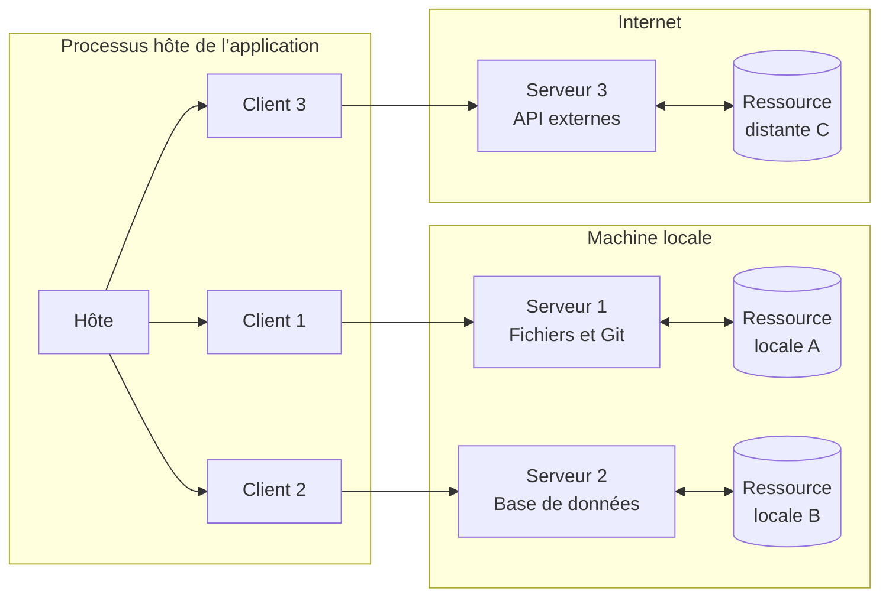
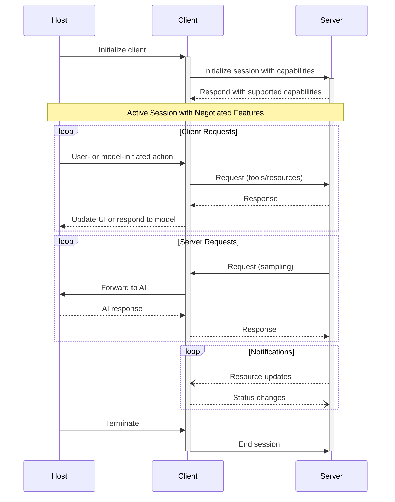

Le Model Context Protocol (MCP) adopte une architecture client-hôte-serveur où chaque hôte peut exécuter plusieurs instances de client. Cette architecture permet aux utilisateurs d’intégrer des capacités d’IA dans diverses applications tout en maintenant des limites de sécurité claires et en isolant les responsabilités. Basé sur JSON-RPC 2.0, MCP fournit un protocole de session avec état, centré sur l’échange de contexte et la coordination de l’échantillonnage entre clients et serveurs.

  ## Composants principaux

  ### Hôte

Le processus hôte agit comme conteneur et coordonnateur :

* Crée et gère plusieurs instances de clients
* Contrôle les autorisations de connexion des clients et leur cycle de vie
* Applique les politiques de sécurité et les exigences de consentement
* Gère les décisions d’autorisation des utilisateurs
* Coordonne l’intégration de l’IA/LLM et l’échantillonnage
* Gère l’agrégation du contexte entre les clients

  ### Clients

Chaque client est créé par l’hôte et maintient une connexion à un serveur isolée :

* Établit une session avec état par serveur
* Gère la négociation du protocole et l’échange de capacités
* Route les messages du protocole dans les deux sens
* Gère les abonnements et les notifications
* Maintient des frontières de sécurité entre les serveurs

Une application hôte crée et gère plusieurs clients, chacun ayant une relation 1:1
avec un serveur donné.

  ### Serveurs

Les serveurs fournissent un contexte et des fonctionnalités spécialisés :

* Exposent des Ressources, des Outils et des Invites via les primitives MCP
* Fonctionnent de manière indépendante avec des responsabilités ciblées
* Demandent un Échantillonnage via des interfaces client
* Doivent respecter les contraintes de sécurité
* Peuvent être des processus locaux ou des services distants

  ## Principes de conception

MCP repose sur plusieurs principes de conception clés qui guident son architecture et
sa mise en œuvre :

1. **Les serveurs devraient être extrêmement faciles à créer**
   * Les applications hôtes prennent en charge une orchestration complexe
   * Les serveurs se concentrent sur des capacités spécifiques et bien définies
   * Des interfaces simples réduisent la charge d’implémentation
   * Une séparation claire facilite la maintenance du code

2. **Les serveurs devraient être hautement composables**
   * Chaque serveur fournit une fonctionnalité ciblée, de manière isolée
   * Plusieurs serveurs peuvent être combinés sans friction
   * Un protocole partagé permet l’interopérabilité
   * Une conception modulaire favorise l’extensibilité

3. **Les serveurs ne devraient pas pouvoir lire toute la conversation ni « voir » dans d’autres
   serveurs**
   * Les serveurs reçoivent uniquement l’information contextuelle nécessaire
   * L’historique complet de la conversation demeure chez l’hôte
   * Chaque connexion de serveur reste isolée
   * Les interactions entre serveurs sont contrôlées par l’hôte
   * Le processus hôte impose des limites de sécurité

4. **Les fonctionnalités peuvent être ajoutées aux serveurs et aux clients progressivement**
   * Le protocole de base fournit le minimum fonctionnel requis
   * Des capacités supplémentaires peuvent être négociées au besoin
   * Les serveurs et les clients évoluent indépendamment
   * Le protocole est conçu pour une extensibilité future
   * La rétrocompatibilité est préservée

  ## Types de messages

Le MCP définit trois types de messages fondamentaux basés sur
[JSON-RPC 2.0](https://www.jsonrpc.org/specification) :

* **Requêtes** : messages bidirectionnels avec méthode et paramètres, qui attendent une réponse
* **Réponses** : résultats ou erreurs correspondant à des identifiants de requête précis
* **Notifications** : messages unidirectionnels ne nécessitant aucune réponse

Chaque type de message respecte la spécification JSON-RPC 2.0 pour la structure et les
sémantiques de livraison.

  ## Négociation des capacités

Le Model Context Protocol utilise un système de négociation fondé sur les capacités, où les clients et
les serveurs déclarent explicitement les fonctionnalités qu’ils prennent en charge lors de l’initialisation. Les capacités
déterminent quelles fonctionnalités et primitives du protocole sont disponibles pendant une session.

* Les serveurs déclarent des capacités comme les abonnements aux ressources, la prise en charge des outils et les modèles
  d’invites
* Les clients déclarent des capacités comme la prise en charge de l’échantillonnage et la gestion des notifications
* Les deux parties doivent respecter les capacités déclarées tout au long de la session
* Des capacités supplémentaires peuvent être négociées au moyen d’extensions au protocole

Chaque capacité déverrouille des fonctionnalités précises du protocole à utiliser pendant la session. Par
exemple :

* Les [fonctionnalités du serveur](/fr-CA/specification/2024-11-05/server) mises en œuvre doivent être
  annoncées dans les capacités du serveur
* L’émission de notifications d’abonnement aux ressources exige que le serveur déclare
  la prise en charge des abonnements
* L’invocation d’outils exige que le serveur déclare des capacités d’outils
* L’[échantillonnage](/fr-CA/specification/2024-11-05/client) exige que le client
  déclare la prise en charge dans ses capacités

Cette négociation des capacités garantit que les clients et les serveurs ont une compréhension claire des
fonctionnalités prises en charge, tout en maintenant l’extensibilité du protocole.