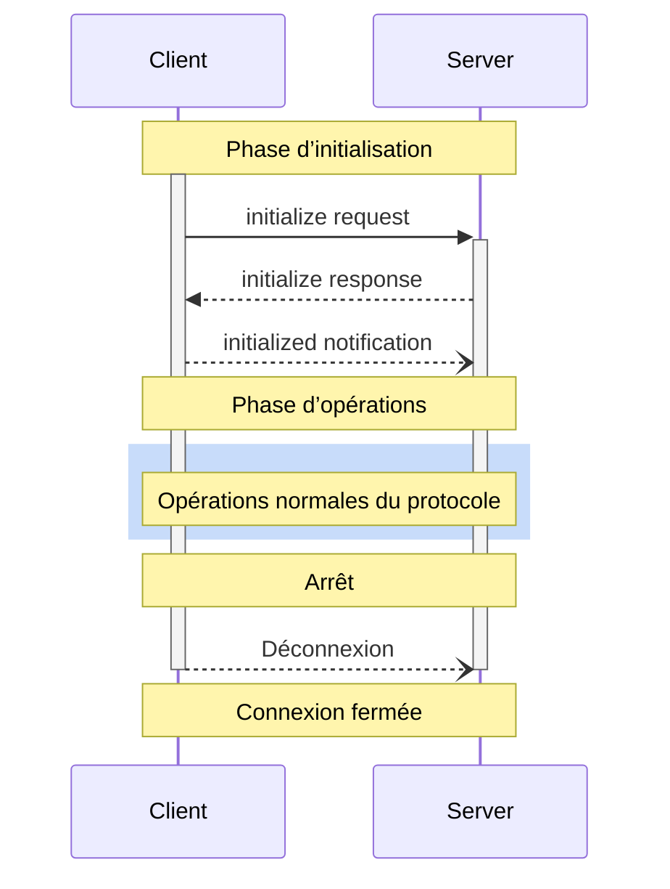

<Info>**Révision du protocole** : 2024-11-05</Info>

Le Model Context Protocol (MCP) définit un cycle de vie rigoureux pour les connexions client-serveur qui garantit une négociation des capacités adéquate et une gestion de l’état appropriée.

1. **Initialisation** : Négociation des capacités et accord sur la version du protocole
2. **Opérations** : Communication normale du protocole
3. **Arrêt** : Fermeture gracieuse de la connexion



<div id="lifecycle-phases">
  ## Phases du cycle de vie
</div>

<div id="initialization">
  ### Initialisation
</div>

La phase d’initialisation DOIT être la première interaction entre le client et le serveur.
Pendant cette phase, le client et le serveur :

* Établissent la compatibilité de version du protocole
* Échangent et négocient les capacités
* Partagent des détails d’implémentation

Le client DOIT amorcer cette phase en envoyant une requête `initialize` contenant :

* Version du protocole prise en charge
* Capacités du client
* Renseignements sur l’implémentation du client

```json
{
  "jsonrpc": "2.0",
  "id": 1,
  "method": "initialize",
  "params": {
    "protocolVersion": "2024-11-05",
    "capabilities": {
      "roots": {
        "listChanged": true
      },
      "sampling": {}
    },
    "clientInfo": {
      "name": "ExampleClient",
      "version": "1.0.0"
    }
  }
}
```

Le serveur DOIT répondre avec ses propres capacités et renseignements :

```json
{
  "jsonrpc": "2.0",
  "id": 1,
  "result": {
    "protocolVersion": "2024-11-05",
    "capabilities": {
      "logging": {},
      "prompts": {
        "listChanged": true
      },
      "resources": {
        "subscribe": true,
        "listChanged": true
      },
      "tools": {
        "listChanged": true
      }
    },
    "serverInfo": {
      "name": "ExampleServer",
      "version": "1.0.0"
    }
  }
}
```

Après une initialisation réussie, le client DOIT envoyer une notification `initialized`
pour indiquer qu’il est prêt à commencer les opérations normales :

```json
{
  "jsonrpc": "2.0",
  "method": "notifications/initialized"
}
```

* Le client NE DEVRAIT PAS envoyer d’autres requêtes que des
  [pings](/fr-CA/specification/2024-11-05/basic/utilities/ping) avant que le serveur
  ait répondu à la requête `initialize`.
* Le serveur NE DEVRAIT PAS envoyer d’autres requêtes que des
  [pings](/fr-CA/specification/2024-11-05/basic/utilities/ping) et
  des [journaux](/fr-CA/specification/2024-11-05/server/utilities/logging) avant
  de recevoir la notification `initialized`.

<div id="version-negotiation">
  #### Négociation de version
</div>

Dans la requête `initialize`, le client DOIT envoyer une version du protocole qu’il prend en charge.
Il DEVRAIT s’agir de la version la plus récente prise en charge par le client.

Si le serveur prend en charge la version du protocole demandée, il DOIT répondre avec la même
version. Sinon, le serveur DOIT répondre avec une autre version du protocole qu’il
prend en charge. Il DEVRAIT s’agir de la version la plus récente prise en charge par le serveur.

Si le client ne prend pas en charge la version indiquée dans la réponse du serveur, il DEVRAIT
se déconnecter.

<div id="capability-negotiation">
  #### Négociation des capacités
</div>

Les capacités du client et du serveur déterminent quelles fonctionnalités optionnelles du protocole seront
disponibles pendant la session.

Capacités clés :

| Catégorie | Capacité       | Description                                                                          |
| --------- | -------------- | ------------------------------------------------------------------------------------ |
| Client    | `roots`        | Possibilité de fournir des [Racines](/fr-CA/specification/2024-11-05/client/roots) du système de fichiers |
| Client    | `sampling`     | Prise en charge des requêtes d&#39;[Échantillonnage](/fr-CA/specification/2024-11-05/client/sampling) pour les LLM |
| Client    | `experimental` | Décrit la prise en charge de fonctionnalités expérimentales non standard            |
| Serveur   | `prompts`      | Propose des [modèles d&#39;Invite](/fr-CA/specification/2024-11-05/server/prompts)            |
| Serveur   | `resources`    | Fournit des [Ressources](/fr-CA/specification/2024-11-05/server/resources) consultables   |
| Serveur   | `tools`        | Met à disposition des [Outils](/fr-CA/specification/2024-11-05/server/tools) appelables   |
| Serveur   | `logging`      | Émet des [messages de journalisation](/fr-CA/specification/2024-11-05/server/utilities/logging) structurés |
| Serveur   | `experimental` | Décrit la prise en charge de fonctionnalités expérimentales non standard            |

Les objets de capacité peuvent décrire des sous-capacités, par exemple :

* `listChanged`: Prise en charge des notifications de modification de liste (pour les invites, ressources et
  outils)
* `subscribe`: Prise en charge de l’abonnement aux modifications d’éléments individuels (ressources uniquement)

<div id="operation">
  ### Fonctionnement
</div>

Pendant la phase de fonctionnement, le client et le serveur échangent des messages selon les
capacités négociées.

Les deux parties **DEVRAIENT** :

* Respecter la version du protocole convenue
* N’utiliser que les capacités négociées avec succès

<div id="shutdown">
  ### Arrêt
</div>

Pendant la phase d’arrêt, l’une des parties (habituellement le client) met fin proprement à la connexion du protocole. Aucun message d’arrêt spécifique n’est défini — il faut plutôt utiliser le mécanisme de transport sous-jacent pour signaler la fin de la connexion :

<div id="stdio">
  #### stdio
</div>

Pour le [transport](/fr-CA/specification/2024-11-05/basic/transports) stdio, le
client **DEVRAIT** amorcer l’arrêt en :

1. Fermant d’abord le flux d’entrée vers le processus enfant (le serveur)
2. Attendant que le serveur se termine, ou en envoyant `SIGTERM` si le serveur ne se termine pas
   dans un délai raisonnable
3. Envoyant `SIGKILL` si le serveur ne se termine pas dans un délai raisonnable après `SIGTERM`

Le serveur **PEUT** amorcer l’arrêt en fermant son flux de sortie vers le client et
en quittant.

<div id="http">
  #### HTTP
</div>

Pour les [transports](/fr-CA/specification/2024-11-05/basic/transports) HTTP, l’arrêt
est signalé par la fermeture des connexions HTTP associées.

<div id="error-handling">
  ## Gestion des erreurs
</div>

Les implémentations **DEVRAIENT** être prêtes à gérer les cas d’erreur suivants :

* Incompatibilité de version du protocole
* Échec de négociation des capacités requises
* Délai d’expiration de la requête d’initialisation
* Délai d’expiration à l’arrêt

Les implémentations **DEVRAIENT** définir des délais d’expiration appropriés pour toutes les requêtes afin d’éviter
les connexions bloquées et l’épuisement des ressources.

Exemple d’erreur à l’initialisation :

```json
{
  "jsonrpc": "2.0",
  "id": 1,
  "error": {
    "code": -32602,
    "message": "Unsupported protocol version",
    "data": {
      "supported": ["2024-11-05"],
      "requested": "1.0.0"
    }
  }
}
```