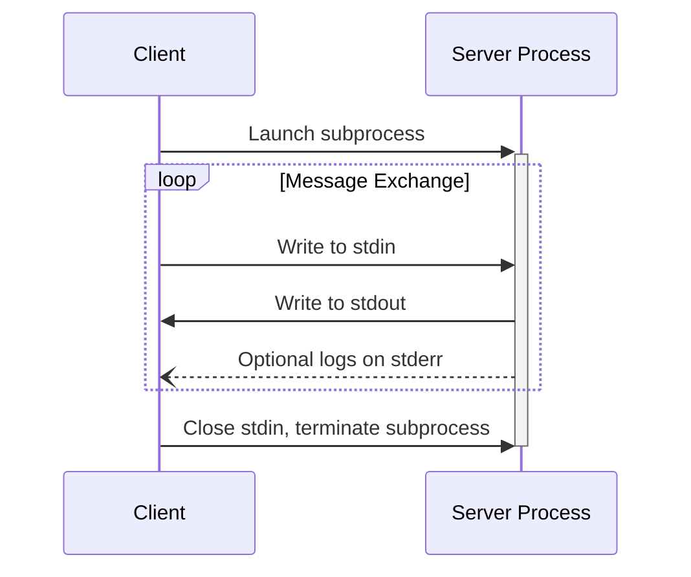
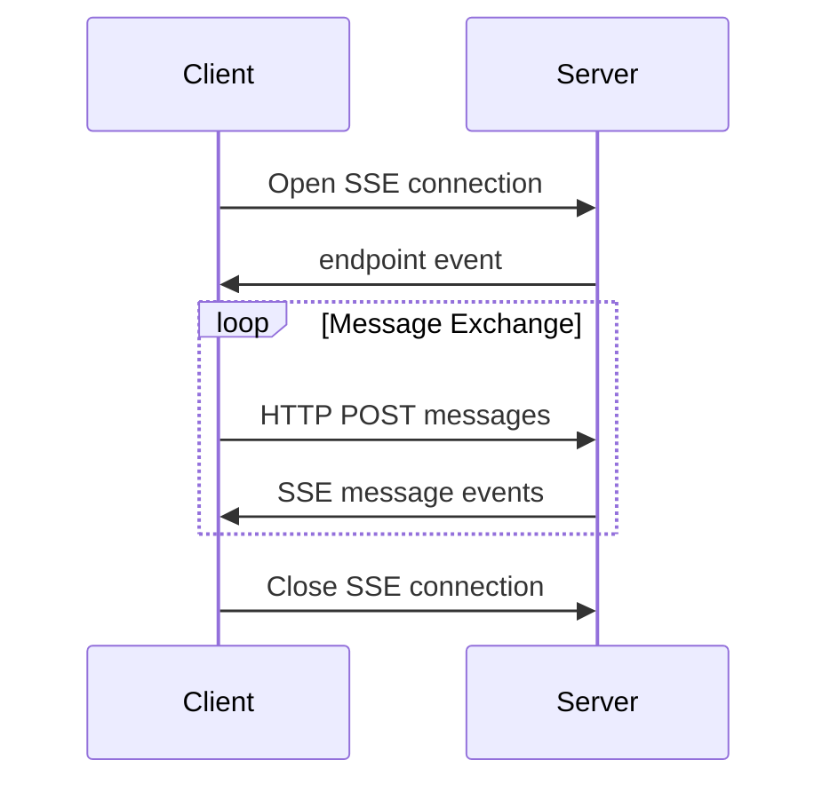

<Info>**Révision du protocole** : 2024-11-05</Info>

Le MCP définit actuellement deux mécanismes de transport standard pour la communication client-serveur :

1. [stdio](#stdio), communication via l’entrée et la sortie standard
2. [HTTP avec événements envoyés par le serveur](#http-with-sse) (SSE)

Les Clients MCP **DEVRAIENT** prendre en charge stdio lorsque c’est possible.

Il est également possible pour les clients et les serveurs d’implémenter
[des transports personnalisés](#custom-transports) de manière modulaire.

  ## stdio

Dans le transport **stdio** :

- Le client lance le Serveur MCP en tant que sous-processus.
- Le serveur reçoit des messages JSON-RPC sur son entrée standard (`stdin`) et écrit
  les réponses sur sa sortie standard (`stdout`).
- Les messages sont délimités par des retours à la ligne et **NE DOIVENT PAS** contenir de retours à la ligne intégrés.
- Le serveur **PEUT** écrire des chaînes UTF-8 sur sa sortie d’erreurs (`stderr`) à des fins de journalisation.
  Les clients **PEUVENT** capturer, relayer ou ignorer ces journaux.
- Le serveur **NE DOIT PAS** écrire quoi que ce soit sur son `stdout` qui ne soit pas un message MCP valide.
- Le client **NE DOIT PAS** écrire quoi que ce soit sur le `stdin` du serveur qui ne soit pas un
  message MCP valide.

  ## HTTP avec SSE

Dans le transport **SSE**, le serveur s’exécute comme un processus autonome pouvant gérer plusieurs connexions de clients.

  #### Avertissement de sécurité

Lors de l’implémentation de HTTP avec le transport SSE :

1. Les serveurs **DOIVENT** valider l’en-tête `Origin` pour toutes les connexions entrantes afin de prévenir les attaques de rebinding DNS
2. En local, les serveurs **DEVRAIENT** n’écouter que sur localhost (127.0.0.1) plutôt que sur toutes les interfaces réseau (0.0.0.0)
3. Les serveurs **DEVRAIENT** mettre en place une authentification adéquate pour toutes les connexions

Sans ces protections, des attaquants pourraient utiliser le rebinding DNS pour interagir avec des serveurs MCP locaux depuis des sites Web distants.

Le serveur **DOIT** fournir deux points de terminaison :

1. Un point de terminaison SSE, permettant aux clients d’établir une connexion et de recevoir des messages du
   serveur
2. Un point de terminaison HTTP POST standard pour que les clients envoient des messages au serveur

Lorsqu’un client se connecte, le serveur **DOIT** envoyer un événement `endpoint` contenant un URI que
le client doit utiliser pour envoyer des messages. Tous les messages ultérieurs du client **DOIVENT** être envoyés
sous forme de requêtes HTTP POST vers ce point de terminaison.

Les messages du serveur sont envoyés sous forme d’événements SSE de type `message`, avec le contenu du message encodé en
JSON dans les données de l’événement.

  ## Transports personnalisés

Les clients et les serveurs **PEUVENT** implémenter des mécanismes de transport personnalisés supplémentaires afin de répondre à leurs besoins spécifiques. Le protocole est agnostique au transport et peut être implémenté sur n’importe quel canal de communication qui prend en charge l’échange bidirectionnel de messages.

Les responsables de l’implémentation qui choisissent de prendre en charge des transports personnalisés **DOIVENT** s’assurer de préserver le format des messages JSON-RPC 2.0 et les exigences liées au cycle de vie définies par le Model Context Protocol (MCP). Les transports personnalisés **DEVRAIENT** documenter leurs modalités spécifiques d’établissement de la connexion et leurs modèles d’échange de messages afin de favoriser l’interopérabilité.