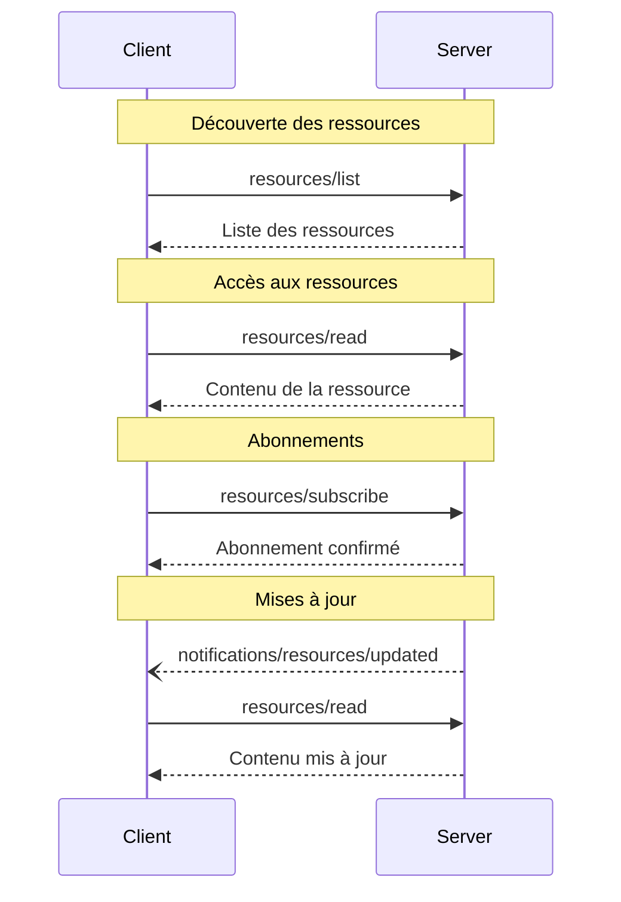

<Info>**Révision du protocole** : 2024-11-05</Info>

Le Protocole de contexte de modèle (MCP) fournit une manière standardisée pour les serveurs d’exposer des
ressources aux clients. Les ressources permettent aux serveurs de partager des données qui fournissent du contexte aux
modèles de langue, comme des fichiers, des schémas de bases de données ou des informations propres à une application.
Chaque ressource est identifiée de façon unique par un
[URI](https://datatracker.ietf.org/doc/html/rfc3986).

<div id="user-interaction-model">
  ## Modèle d’interaction utilisateur
</div>

Les Ressources dans le MCP sont conçues pour être **pilotées par l’application**, les applications hôtes
déterminant comment intégrer le contexte selon leurs besoins.

Par exemple, les applications pourraient :

* Exposer des ressources au moyen d’éléments d’interface pour une sélection explicite, sous forme d’arborescence ou de liste
* Permettre à l’utilisateur de rechercher et de filtrer les ressources disponibles
* Mettre en place l’inclusion automatique du contexte, fondée sur des heuristiques ou sur la sélection du modèle d’IA


Cependant, les implémentations sont libres d’exposer des ressources selon tout modèle d’interface qui
répond à leurs besoins—le protocole lui-même n’impose aucun modèle d’interaction
utilisateur spécifique.

<div id="capabilities">
  ## Capacités
</div>

Les serveurs qui prennent en charge les Ressources **DOIVENT** déclarer la capacité `resources` :

```json
{
  "capabilities": {
    "resources": {
      "subscribe": true,
      "listChanged": true
    }
  }
}
```

Cette capacité prend en charge deux fonctionnalités optionnelles :

* `subscribe` : indique si le client peut s’abonner pour être informé des modifications apportées à des
  Ressources individuelles.
* `listChanged` : indique si le serveur émettra des notifications lorsque la liste des Ressources
  disponibles est modifiée.

`subscribe` et `listChanged` sont tous deux optionnels — les serveurs peuvent ne prendre en charge
ni l’une ni l’autre, l’une ou les deux :

```json
{
  "capabilities": {
    "resources": {} // Neither feature supported
  }
}
```

```json
{
  "capabilities": {
    "resources": {
      "subscribe": true // Only subscriptions supported
    }
  }
}
```

```json
{
  "capabilities": {
    "resources": {
      "listChanged": true // Only list change notifications supported
    }
  }
}
```

<div id="protocol-messages">
  ## Messages du protocole
</div>

<div id="listing-resources">
  ### Répertorier les ressources
</div>

Pour découvrir les ressources disponibles, les clients envoient une requête `resources/list`. Cette opération prend en charge la
[pagination](/fr-CA/specification/2024-11-05/server/utilities/pagination).

**Requête :**

```json
{
  "jsonrpc": "2.0",
  "id": 1,
  "method": "resources/list",
  "params": {
    "cursor": "optional-cursor-value"
  }
}
```

**Réponse :**

```json
{
  "jsonrpc": "2.0",
  "id": 1,
  "result": {
    "resources": [
      {
        "uri": "file:///project/src/main.rs",
        "name": "main.rs",
        "description": "Point d’entrée principal de l’application",
        "mimeType": "text/x-rust"
      }
    ],
    "nextCursor": "next-page-cursor"
  }
}
```

<div id="reading-resources">
  ### Lecture des ressources
</div>

Pour récupérer le contenu d’une ressource, les clients envoient une requête `resources/read` :

**Requête :**

```json
{
  "jsonrpc": "2.0",
  "id": 2,
  "method": "resources/read",
  "params": {
    "uri": "file:///project/src/main.rs"
  }
}
```

**Réponse :**

```json
{
  "jsonrpc": "2.0",
  "id": 2,
  "result": {
    "contents": [
      {
        "uri": "file:///project/src/main.rs",
        "mimeType": "text/x-rust",
        "text": "fn main() {\n    println!(\"Hello world!\");\n}"
      }
    ]
  }
}
```

<div id="resource-templates">
  ### Modèles de ressources
</div>

Les modèles de ressources permettent aux serveurs d’exposer des ressources paramétrées à l’aide de
[modèles d’URI](https://datatracker.ietf.org/doc/html/rfc6570). Les arguments peuvent être
complétés automatiquement grâce à [l’API de complétion](/fr-CA/specification/2024-11-05/server/utilities/completion).

**Requête :**

```json
{
  "jsonrpc": "2.0",
  "id": 3,
  "method": "resources/templates/list"
}
```

**Réponse :**

```json
{
  "jsonrpc": "2.0",
  "id": 3,
  "result": {
    "resourceTemplates": [
      {
        "uriTemplate": "file:///{path}",
        "name": "Fichiers du projet",
        "description": "Accéder aux fichiers du répertoire du projet",
        "mimeType": "application/octet-stream"
      }
    ]
  }
}
```

<div id="list-changed-notification">
  ### Notification de modification de la liste
</div>

Lorsque la liste des Ressources disponibles change, les serveurs ayant déclaré la capacité `listChanged` **DEVRAIENT** envoyer une notification :

```json
{
  "jsonrpc": "2.0",
  "method": "notifications/resources/list_changed"
}
```

<div id="subscriptions">
  ### Abonnements
</div>

Le protocole prend en charge des abonnements facultatifs aux modifications de Ressources. Les clients peuvent s’abonner
à des Ressources précises et recevoir des notifications lorsqu’elles sont modifiées :

**Requête d’abonnement :**

```json
{
  "jsonrpc": "2.0",
  "id": 4,
  "method": "resources/subscribe",
  "params": {
    "uri": "file:///project/src/main.rs"
  }
}
```

**Notification de mise à jour :**

```json
{
  "jsonrpc": "2.0",
  "method": "notifications/resources/updated",
  "params": {
    "uri": "file:///project/src/main.rs"
  }
}
```

<div id="message-flow">
  ## Flux des messages
</div>



<div id="data-types">
  ## Types de données
</div>

<div id="resource">
  ### Ressource
</div>

Une définition de ressource comprend :

* `uri` : Identifiant unique de la ressource
* `name` : Nom lisible par un humain
* `description` : Description facultative
* `mimeType` : Type MIME facultatif

<div id="resource-contents">
  ### Contenu des Ressources
</div>

Les Ressources peuvent contenir du texte ou des données binaires :

<div id="text-content">
  #### Contenu textuel
</div>

```json
{
  "uri": "file:///example.txt",
  "mimeType": "text/plain",
  "text": "Contenu de la ressource"
}
```

<div id="binary-content">
  #### Contenu binaire
</div>

```json
{
  "uri": "file:///example.png",
  "mimeType": "image/png",
  "blob": "base64-encoded-data"
}
```

<div id="common-uri-schemes">
  ## Schémas d’URI courants
</div>

Le protocole définit plusieurs schémas d’URI standard. Cette liste n’est pas exhaustive—les implémentations sont libres d’utiliser d’autres schémas d’URI, y compris personnalisés.

<div id="https">
  ### https://
</div>

Utilisé pour représenter une ressource disponible sur le Web.

Les serveurs **DEVRAIENT** utiliser ce schéma uniquement lorsque le client est en mesure de récupérer et de charger la ressource directement depuis le Web, de manière autonome — c’est-à-dire qu’il n’a pas besoin de lire la ressource via le Serveur MCP.

Pour d’autres cas d’utilisation, les serveurs **DEVRAIENT** privilégier un autre schéma d’URI, ou en définir un personnalisé, même si le serveur télécharge lui-même le contenu de la ressource sur Internet.

<div id="file">
  ### file://
</div>

Utilisé pour identifier des ressources qui se comportent comme un système de fichiers. Toutefois, ces ressources n’ont pas besoin de correspondre à un système de fichiers physique réel.

Les serveurs MCP **PEUVENT** identifier les ressources file:// avec un
[type MIME XDG](https://specifications.freedesktop.org/shared-mime-info-spec/0.14/ar01s02.html#id-1.3.14),
comme `inode/directory`, pour représenter des fichiers non réguliers (comme des répertoires) qui n’ont
pas de type MIME standard par ailleurs.

<div id="git">
  ### git://
</div>

Intégration avec le système de contrôle de version Git.

<div id="error-handling">
  ## Gestion des erreurs
</div>

Les serveurs **DEVRAIENT** renvoyer des erreurs JSON-RPC standard pour les cas d’échec courants :

* Ressource introuvable : `-32002`
* Erreurs internes : `-32603`

Exemple d’erreur :

```json
{
  "jsonrpc": "2.0",
  "id": 5,
  "error": {
    "code": -32002,
    "message": "Resource not found",
    "data": {
      "uri": "file:///nonexistent.txt"
    }
  }
}
```

<div id="security-considerations">
  ## Considérations de sécurité
</div>

1. Les serveurs **DOIVENT** valider tous les URI de ressource
2. Des contrôles d’accès **DEVRAIENT** être mis en place pour les ressources sensibles
3. Les données binaires **DOIVENT** être correctement codées
4. Les autorisations d’accès aux ressources **DEVRAIENT** être vérifiées avant toute opération