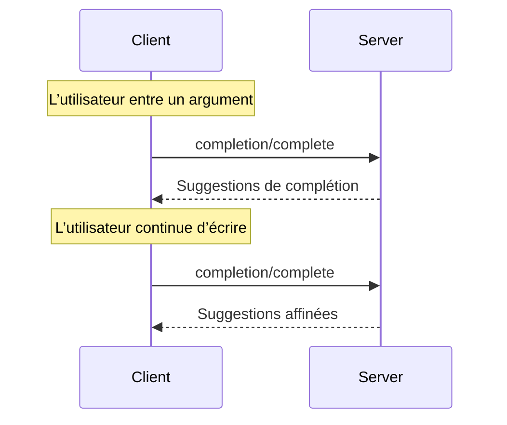

<Info>**Révision du protocole** : 2024-11-05</Info>

Le Protocole de contexte de modèle (MCP) offre une façon normalisée pour que les serveurs proposent
des suggestions de saisie semi-automatique des arguments pour les Invites et les URI de Ressources. Cela permet des expériences riches,
de type IDE, où les utilisateurs reçoivent des suggestions contextuelles pendant la saisie des valeurs
d’arguments.

<div id="user-interaction-model">
  ## Modèle d’interaction utilisateur
</div>

La complétion dans MCP est conçue pour prendre en charge des expériences utilisateur interactives semblables à l’auto-complétion de code dans un IDE.

Par exemple, les applications peuvent afficher des suggestions de complétion dans un menu déroulant ou une fenêtre contextuelle au fur et à mesure que les utilisateurs saisissent du texte, avec la possibilité de filtrer et de sélectionner parmi les options disponibles.

Cependant, les implémentations sont libres d’exposer la complétion par n’importe quel modèle d’interface qui répond à leurs besoins — le protocole en lui-même n’impose aucun modèle d’interaction utilisateur spécifique.

<div id="protocol-messages">
  ## Messages de protocole
</div>

<div id="requesting-completions">
  ### Demander des suggestions de complétion
</div>

Pour obtenir des suggestions de complétion, les clients envoient une requête `completion/complete` qui précise
ce qui doit être complété à l’aide d’un type de référence :

**Requête :**

```json
{
  "jsonrpc": "2.0",
  "id": 1,
  "method": "completion/complete",
  "params": {
    "ref": {
      "type": "ref/prompt",
      "name": "code_review"
    },
    "argument": {
      "name": "language",
      "value": "py"
    }
  }
}
```

**Réponse :**

```json
{
  "jsonrpc": "2.0",
  "id": 1,
  "result": {
    "completion": {
      "values": ["python", "pytorch", "pyside"],
      "total": 10,
      "hasMore": true
    }
  }
}
```

<div id="reference-types">
  ### Types de référence
</div>

Le protocole prend en charge deux types de références de complétion :

| Type           | Description                         | Exemple                                             |
| -------------- | ----------------------------------- | --------------------------------------------------- |
| `ref/prompt`   | Fait référence à une invite par nom | `{"type": "ref/prompt", "name": "code_review"}`     |
| `ref/resource` | Fait référence à l’URI d’une ressource | `{"type": "ref/resource", "uri": "file:///{path}"}` |

<div id="completion-results">
  ### Résultats de complétion
</div>

Les serveurs retournent un tableau de valeurs de complétion classées par pertinence, avec :

- Un maximum de 100 éléments par réponse
- Le nombre total de correspondances disponibles (facultatif)
- Un booléen indiquant si d’autres résultats sont disponibles

<div id="message-flow">
  ## Flux de messages
</div>



<div id="data-types">
  ## Types de données
</div>

<div id="completerequest">
  ### CompleteRequest
</div>

- `ref`: Une `PromptReference` ou `ResourceReference`
- `argument`: Objet contenant :
  - `name`: Nom de l’argument
  - `value`: Valeur actuelle

<div id="completeresult">
  ### CompleteResult
</div>

- `completion`: Objet contenant :
  - `values`: Tableau de suggestions (max 100)
  - `total`: Nombre total de correspondances (optionnel)
  - `hasMore`: Indicateur de résultats supplémentaires

<div id="implementation-considerations">
  ## Considérations de mise en œuvre
</div>

1. Les serveurs **DEVRAIENT** :
   - Renvoyer des suggestions triées par pertinence
   - Mettre en œuvre une correspondance floue lorsque pertinent
   - Limiter le débit des requêtes de complétion
   - Valider toutes les entrées

2. Les clients **DEVRAIENT** :
   - “Debouncer” les requêtes de complétion rapides
   - Mettre en cache les résultats de complétion lorsque pertinent
   - Gérer avec élégance les résultats manquants ou partiels

<div id="security">
  ## Sécurité
</div>

Les implémentations DOIVENT :

- Valider toutes les entrées de complétion
- Mettre en place une limitation de débit appropriée
- Contrôler l’accès aux suggestions sensibles
- Empêcher la divulgation d’informations fondée sur la complétion