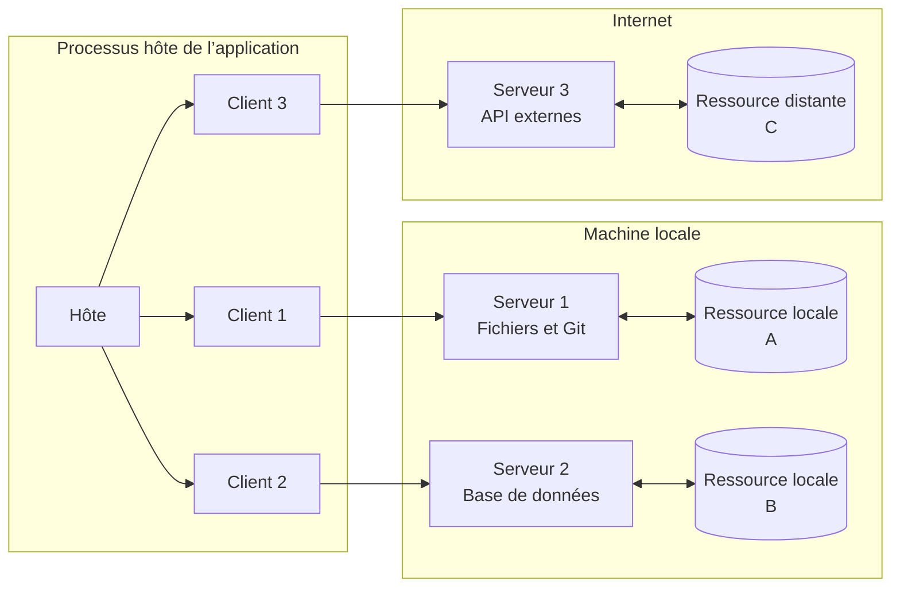
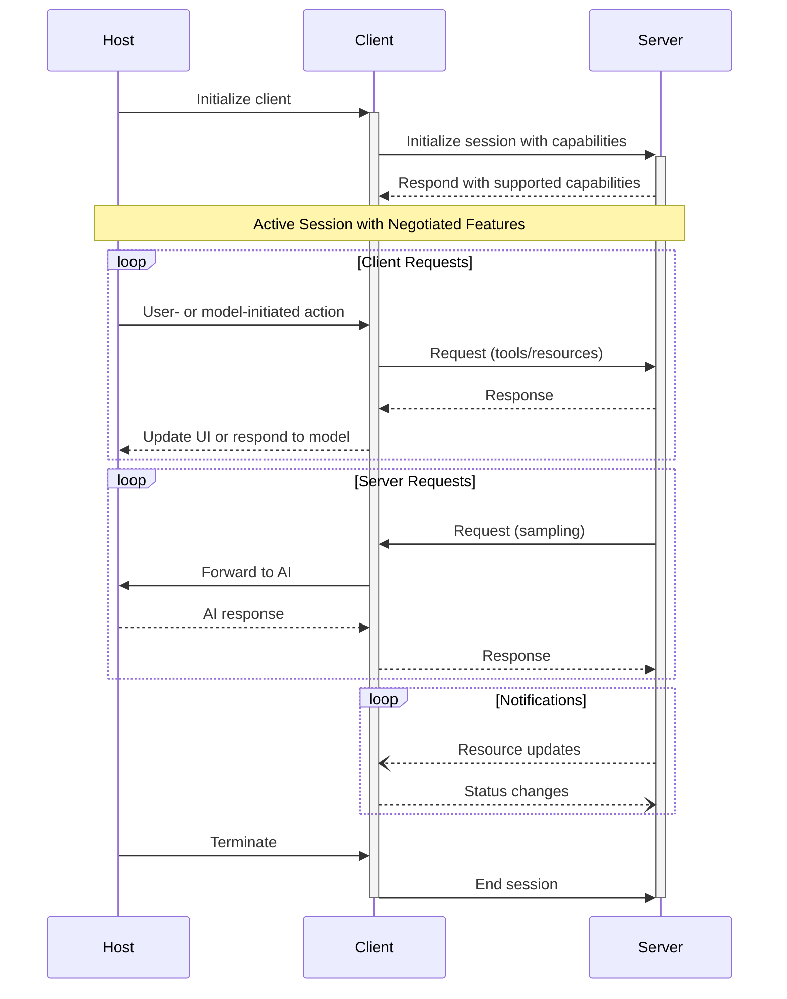

Le Model Context Protocol (MCP) adopte une architecture client-hôte-serveur où chaque hôte peut exécuter plusieurs instances de client. Cette architecture permet aux utilisateurs d’intégrer des capacités d’IA dans diverses applications tout en maintenant des frontières de sécurité claires et en isolant les responsabilités. Construit sur JSON-RPC, MCP fournit un protocole de session avec état, axé sur l’échange de contexte et la coordination de l’échantillonnage entre clients et serveurs.

  ## Composants principaux

  ### Hôte

Le processus hôte agit comme conteneur et coordonnateur :

* Crée et gère plusieurs instances de client
* Contrôle les autorisations de connexion des clients et leur cycle de vie
* Fait respecter les politiques de sécurité et les exigences de consentement
* Gère les décisions d’autorisation des utilisateurs
* Coordonne l’intégration de l’IA/LLM et l’échantillonnage
* Gère l’agrégation de contexte entre les clients

  ### Clients

Chaque client est créé par l’hôte et maintient une connexion au serveur isolée :

* Établit une session avec état par serveur
* Gère la négociation du protocole et l’échange de capacités
* Route les messages du protocole dans les deux sens
* Gère les abonnements et les notifications
* Maintient des frontières de sécurité entre les serveurs

Une application hôte crée et gère plusieurs clients, chacun entretenant une relation 1:1 avec un serveur particulier.

  ### Serveurs

Les serveurs fournissent un contexte et des capacités spécialisés :

* Exposer des Ressources, des Outils et des Invites via les primitives du Model Context Protocol (MCP)
* Fonctionner de manière indépendante avec des responsabilités ciblées
* Demander l’Échantillonnage via des interfaces du Client MCP
* Respecter les contraintes de sécurité
* Être des processus locaux ou des services à distance

  ## Principes de conception

MCP repose sur plusieurs principes de conception clés qui orientent son architecture et
sa mise en œuvre :

1. **Les serveurs devraient être extrêmement faciles à créer**
   * Les applications hôtes prennent en charge une orchestration complexe
   * Les serveurs se concentrent sur des capacités spécifiques et bien définies
   * Des interfaces simples réduisent les coûts de mise en œuvre
   * Une séparation claire favorise un code facile à maintenir

2. **Les serveurs devraient être hautement composables**
   * Chaque serveur fournit une fonctionnalité ciblée, isolément
   * Plusieurs serveurs peuvent être combinés de manière transparente
   * Un protocole commun permet l’interopérabilité
   * Une conception modulaire facilite l’extensibilité

3. **Les serveurs ne devraient ni lire l’ensemble de la conversation ni “voir à l’intérieur” d’autres
   serveurs**
   * Les serveurs ne reçoivent que l’information contextuelle nécessaire
   * L’historique complet de la conversation demeure chez l’hôte
   * Chaque connexion de serveur reste isolée
   * Les interactions entre serveurs sont contrôlées par l’hôte
   * Le processus hôte applique les périmètres de sécurité

4. **Les fonctionnalités peuvent être ajoutées aux serveurs et aux clients de façon progressive**
   * Le protocole de base fournit les fonctionnalités minimales requises
   * Des capacités supplémentaires peuvent être négociées au besoin
   * Les serveurs et les clients évoluent de façon indépendante
   * Le protocole est conçu pour une extensibilité future
   * La rétrocompatibilité est préservée

  ## Négociation des capacités

Le Model Context Protocol utilise un système de négociation basé sur les capacités, où les clients et
les serveurs déclarent explicitement les fonctionnalités qu’ils prennent en charge lors de l’initialisation. Les capacités
déterminent quelles fonctionnalités et primitives du protocole sont disponibles durant une session.

* Les serveurs déclarent des capacités comme les abonnements aux ressources, la prise en charge des outils et les
  modèles d’invites
* Les clients déclarent des capacités comme la prise en charge de l’échantillonnage et la gestion des notifications
* Les deux parties doivent respecter les capacités déclarées tout au long de la session
* Des capacités supplémentaires peuvent être négociées au moyen d’extensions du protocole

Chaque capacité active des fonctionnalités spécifiques du protocole pour la session. Par
exemple :

* Les [fonctionnalités du serveur](/fr-CA/specification/2025-03-26/server) mises en œuvre doivent être annoncées dans les
  capacités du serveur
* Émettre des notifications d’abonnement aux ressources exige que le serveur déclare
  la prise en charge des abonnements
* L’appel des outils exige que le serveur déclare des capacités liées aux outils
* L’[échantillonnage](/fr-CA/specification/2025-03-26/client) exige que le client déclare la prise en charge dans ses
  capacités

Cette négociation des capacités garantit que les clients et les serveurs partagent une compréhension claire des
fonctionnalités prises en charge, tout en préservant l’extensibilité du protocole.