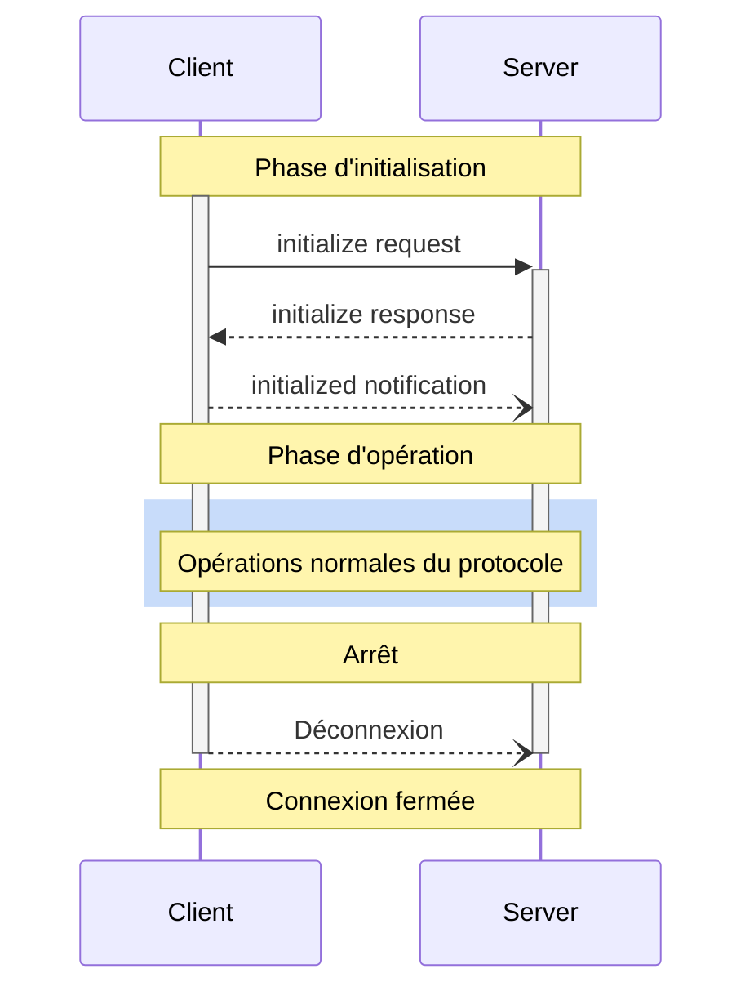

<Info>**Révision du protocole** : 2025-03-26</Info>

Le Model Context Protocol (MCP) définit un cycle de vie rigoureux pour les connexions client-serveur qui assure une négociation adéquate des capacités et une gestion de l’état.

1. **Initialisation** : Négociation des capacités et entente sur la version du protocole
2. **Opération** : Communication normale du protocole
3. **Arrêt** : Fermeture de la connexion en douceur



<div id="lifecycle-phases">
  ## Phases du cycle de vie
</div>

<div id="initialization">
  ### Initialisation
</div>

La phase d’initialisation DOIT être la première interaction entre le client et le serveur.
Pendant cette phase, le client et le serveur :

* Établissent la compatibilité de la version du protocole
* Échangent et négocient leurs capacités
* Partagent des détails d’implémentation

Le client DOIT entamer cette phase en envoyant une requête `initialize` contenant :

* La version du protocole prise en charge
* Les capacités du client
* Les informations sur l’implémentation du client

```json
{
  "jsonrpc": "2.0",
  "id": 1,
  "method": "initialize",
  "params": {
    "protocolVersion": "2025-03-26",
    "capabilities": {
      "roots": {
        "listChanged": true
      },
      "sampling": {}
    },
    "clientInfo": {
      "name": "ExampleClient",
      "version": "1.0.0"
    }
  }
}
```

La requête initialize NE DOIT PAS faire partie d’un lot
[JSON-RPC](https://www.jsonrpc.org/specification#batch), puisque d’autres requêtes et notifications
ne sont pas possibles avant la fin de l’initialisation. Cela permet également la rétrocompatibilité
avec les versions antérieures du protocole qui ne prennent pas explicitement en charge les lots
JSON-RPC.

Le serveur DOIT répondre avec ses propres capacités et informations :

```json
{
  "jsonrpc": "2.0",
  "id": 1,
  "result": {
    "protocolVersion": "2025-03-26",
    "capabilities": {
      "logging": {},
      "prompts": {
        "listChanged": true
      },
      "resources": {
        "subscribe": true,
        "listChanged": true
      },
      "tools": {
        "listChanged": true
      }
    },
    "serverInfo": {
      "name": "ExampleServer",
      "version": "1.0.0"
    },
    "instructions": "Optional instructions for the client"
  }
}
```

Après une initialisation réussie, le client DOIT envoyer une notification `initialized`
pour indiquer qu’il est prêt à commencer les opérations normales :

```json
{
  "jsonrpc": "2.0",
  "method": "notifications/initialized"
}
```

* Le client NE DEVRAIT PAS envoyer d’autres requêtes que des
  [pings](/fr-CA/specification/2025-03-26/basic/utilities/ping) avant que le serveur ait répondu à la requête
  `initialize`.
* Le serveur NE DEVRAIT PAS envoyer d’autres requêtes que des
  [pings](/fr-CA/specification/2025-03-26/basic/utilities/ping) et
  [journaux](/fr-CA/specification/2025-03-26/server/utilities/logging) avant de recevoir la notification
  `initialized`.

<div id="version-negotiation">
  #### Négociation de version
</div>

Dans la requête `initialize`, le client DOIT envoyer une version du protocole qu’il prend en charge.
Il DEVRAIT s’agir de la plus récente version prise en charge par le client.

Si le serveur prend en charge la version du protocole demandée, il DOIT répondre avec la même
version. Sinon, le serveur DOIT répondre avec une autre version du protocole qu’il
prend en charge. Il DEVRAIT s’agir de la plus récente version prise en charge par le serveur.

Si le client ne prend pas en charge la version indiquée dans la réponse du serveur, il DEVRAIT
se déconnecter.

<div id="capability-negotiation">
  #### Négociation des capacités
</div>

Les capacités du client et du serveur déterminent quelles fonctionnalités optionnelles du protocole seront
disponibles durant la session.

Capacités clés :

| Catégorie | Capacité      | Description                                                                                 |
| --------- | ------------- | ------------------------------------------------------------------------------------------- |
| Client    | `roots`       | Capacité de fournir des [Racines](/fr-CA/specification/2025-03-26/client/roots) du système de fichiers |
| Client    | `sampling`    | Prise en charge des requêtes d&#39;[Échantillonnage](/fr-CA/specification/2025-03-26/client/sampling) pour LLM |
| Client    | `experimental` | Décrit la prise en charge de fonctionnalités expérimentales non standard                    |
| Serveur   | `prompts`     | Offre des [modèles d’invites](/fr-CA/specification/2025-03-26/server/prompts)                      |
| Serveur   | `resources`   | Fournit des [Ressources](/fr-CA/specification/2025-03-26/server/resources) lisibles                 |
| Serveur   | `tools`       | Expose des [Outils](/fr-CA/specification/2025-03-26/server/tools) appelables                        |
| Serveur   | `logging`     | Émet des [messages de journalisation](/fr-CA/specification/2025-03-26/server/utilities/logging) structurés |
| Serveur   | `completions` | Prend en charge la [suggestion automatique](/fr-CA/specification/2025-03-26/server/utilities/completion) des arguments |
| Serveur   | `experimental` | Décrit la prise en charge de fonctionnalités expérimentales non standard                    |

Les objets de capacité peuvent décrire des sous-capacités comme :

* `listChanged` : Prise en charge des notifications de modification de liste (pour les invites, les ressources et
  les outils)
* `subscribe` : Prise en charge de l’abonnement aux changements d’éléments individuels (ressources uniquement)

<div id="operation">
  ### Opération
</div>

Pendant la phase d’exploitation, le client et le serveur échangent des messages en fonction des
capacités négociées.

Les deux parties **DEVRAIENT** :

* Respecter la version négociée du protocole
* N’utiliser que les capacités ayant été négociées avec succès

<div id="shutdown">
  ### Arrêt
</div>

Pendant la phase d’arrêt, une des parties (généralement le client) met fin proprement à la connexion du protocole. Aucun message d’arrêt spécifique n’est défini; on utilise plutôt le mécanisme de transport sous-jacent pour signaler la fin de la connexion :

<div id="stdio">
  #### stdio
</div>

Pour le [transport](/fr-CA/specification/2025-03-26/basic/transports) stdio, le client **DEVRAIT** amorcer
l’arrêt en :

1. D’abord, en fermant le flux d’entrée vers le processus enfant (le serveur)
2. En attendant que le serveur se termine, ou en envoyant `SIGTERM` si le serveur ne se termine pas
   dans un délai raisonnable
3. En envoyant `SIGKILL` si le serveur ne se termine pas dans un délai raisonnable après `SIGTERM`

Le serveur **PEUT** amorcer l’arrêt en fermant son flux de sortie vers le client et
en quittant.

<div id="http">
  #### HTTP
</div>

Pour les [transports](/fr-CA/specification/2025-03-26/basic/transports) HTTP, l’arrêt est signalé par la fermeture de la ou des connexions HTTP associées.

<div id="timeouts">
  ## Délais d’attente
</div>

Les implémentations DEVRAIENT établir des délais d’attente pour toutes les requêtes envoyées, afin d’éviter les connexions bloquées et l’épuisement des ressources. Si aucune réponse — de succès ou d’erreur — n’est reçue avant l’expiration du délai, l’émetteur DEVRAIT envoyer une [notification d’annulation](/fr-CA/specification/2025-03-26/basic/utilities/cancellation) pour cette requête et cesser d’attendre une réponse.

Les SDK et autres intergiciels DEVRAIENT permettre de configurer ces délais d’attente requête par requête.

Les implémentations PEUVENT choisir de réinitialiser le compteur de délai d’attente à la réception d’une [notification de progression](/fr-CA/specification/2025-03-26/basic/utilities/progress) correspondant à la requête, car cela indique qu’un traitement est effectivement en cours. Toutefois, les implémentations DEVRAIENT toujours faire respecter un délai d’attente maximal, indépendamment des notifications de progression, afin de limiter l’impact d’un client ou d’un serveur défaillant.

<div id="error-handling">
  ## Gestion des erreurs
</div>

Les implémentations DEVRAIENT être prêtes à gérer les cas d’erreur suivants :

* Incompatibilité de version du protocole
* Échec de la négociation des capacités requises
* [Expiration](#timeouts) de la requête

Exemple d’erreur d’initialisation :

```json
{
  "jsonrpc": "2.0",
  "id": 1,
  "error": {
    "code": -32602,
    "message": "Unsupported protocol version",
    "data": {
      "supported": ["2024-11-05"],
      "requested": "1.0.0"
    }
  }
}
```