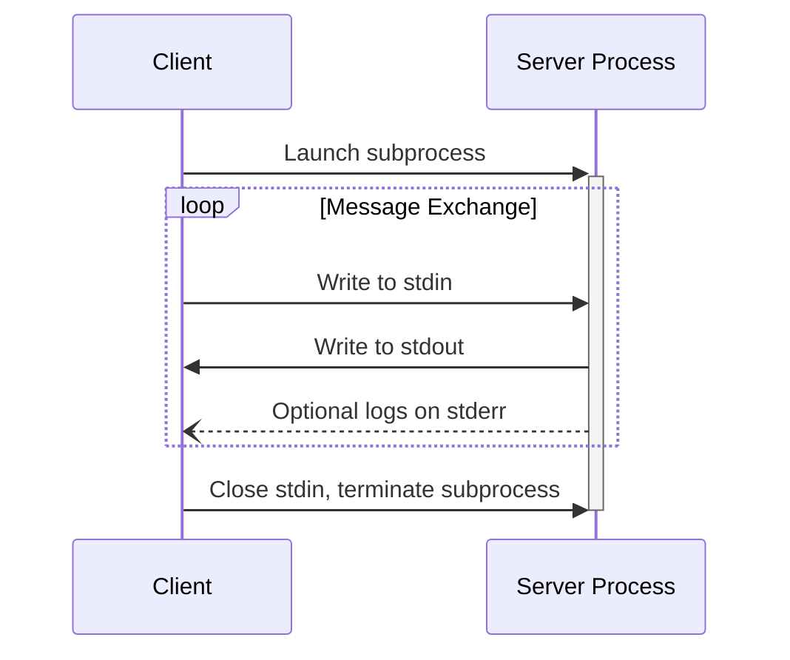
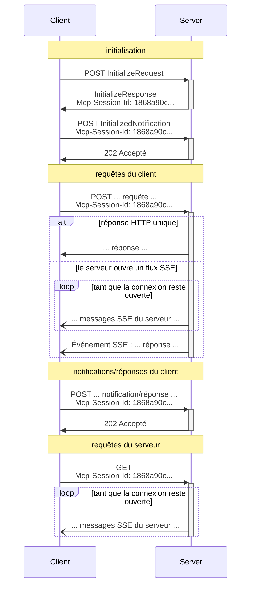

<Info>**Révision du protocole** : 2025-03-26</Info>

Le MCP utilise JSON-RPC pour encoder les messages. Les messages JSON-RPC **DOIVENT** être encodés en UTF-8.

Le protocole définit actuellement deux mécanismes de transport standard pour la communication client-serveur :

1. [stdio](#stdio), communication via l’entrée standard et la sortie standard
2. [HTTP diffusible](#streamable-http)

Les clients **DEVRAIENT** prendre en charge stdio lorsque c’est possible.

Il est également possible pour les clients et les serveurs d’implémenter des
[transports personnalisés](#custom-transports) de manière modulaire.

  ## stdio

Dans le transport **stdio** :

* Le client lance le Serveur MCP comme sous-processus.
* Le serveur lit les messages JSON-RPC à partir de son entrée standard (`stdin`) et envoie des messages
  vers sa sortie standard (`stdout`).
* Les messages peuvent être des requêtes, des notifications ou des réponses JSON-RPC — ou un
  [lot](https://www.jsonrpc.org/specification#batch) JSON-RPC contenant une ou plusieurs requêtes
  et/ou notifications.
* Les messages sont délimités par des sauts de ligne et **NE DOIVENT PAS** contenir de sauts de ligne intégrés.
* Le serveur **PEUT** écrire des chaînes UTF-8 sur sa sortie d’erreur (`stderr`) à des fins de journalisation. Les clients **PEUVENT** capturer, transférer ou ignorer ces journaux.
* Le serveur **NE DOIT PAS** écrire quoi que ce soit sur son `stdout` qui ne soit pas un message MCP valide.
* Le client **NE DOIT PAS** écrire quoi que ce soit dans le `stdin` du serveur qui ne soit pas un message MCP valide.

  ## HTTP diffusible

<Info>
  Ce mécanisme remplace le [transport HTTP+SSE](/fr-CA/specification/2024-11-05/basic/transports#http-with-sse) de la version du protocole 2024-11-05. Consultez le guide de [rétrocompatibilité](#backwards-compatibility) ci-dessous.
</Info>

Avec le transport **HTTP diffusible**, le serveur s’exécute comme un processus indépendant capable de gérer plusieurs connexions de clients. Ce transport utilise des requêtes HTTP POST et GET. Le serveur peut, au besoin, utiliser les [événements envoyés par le serveur](https://en.wikipedia.org/wiki/Server-sent_events) (SSE) pour diffuser plusieurs messages émis par le serveur. Cela permet à la fois des serveurs MCP de base et des serveurs plus riches en fonctionnalités, prenant en charge la diffusion en continu ainsi que les notifications et requêtes du serveur vers le client.

Le serveur **DOIT** exposer un seul chemin d’endpoint HTTP (ci-après, le **point de terminaison MCP**) qui prend en charge les méthodes POST et GET. Par exemple, il peut s’agir d’une URL comme `https://example.com/mcp`.

  #### Avertissement de sécurité

Lors de la mise en œuvre du transport HTTP diffusible :

1. Les serveurs **DOIVENT** valider l’en-tête `Origin` pour toutes les connexions entrantes afin de prévenir les attaques de réaffectation DNS
2. En local, les serveurs **DEVRAIENT** n’écouter que sur localhost (127.0.0.1) plutôt que sur toutes les interfaces réseau (0.0.0.0)
3. Les serveurs **DEVRAIENT** mettre en place une authentification adéquate pour toutes les connexions

Sans ces protections, des attaquants pourraient utiliser la réaffectation DNS pour interagir avec des serveurs MCP locaux depuis des sites Web distants.

  ### Envoi de messages au serveur

Chaque message JSON-RPC envoyé par le client **DOIT** être une nouvelle requête HTTP POST vers le point de terminaison MCP.

1. Le client **DOIT** utiliser HTTP POST pour envoyer des messages JSON-RPC au point de terminaison MCP.
2. Le client **DOIT** inclure un en-tête `Accept`, énumérant `application/json` et
   `text/event-stream` comme types de contenu pris en charge.
3. Le corps de la requête POST **DOIT** être l’un des éléments suivants :
   * Une seule *requête*, *notification* ou *réponse* JSON-RPC
   * Un tableau [regroupant](https://www.jsonrpc.org/specification#batch) une ou plusieurs
     *requêtes et/ou notifications*
   * Un tableau [regroupant](https://www.jsonrpc.org/specification#batch) une ou plusieurs
     *réponses*
4. Si l’entrée se compose uniquement de (n’importe quel nombre de) *réponses* ou
   *notifications* JSON-RPC :
   * Si le serveur accepte l’entrée, il **DOIT** retourner le code d’état HTTP 202
     Accepted sans corps.
   * Si le serveur ne peut pas accepter l’entrée, il **DOIT** retourner un code d’état d’erreur HTTP
     (p. ex., 400 Bad Request). Le corps de la réponse HTTP **PEUT** contenir une *réponse d’erreur*
     JSON-RPC sans `id`.
5. Si l’entrée contient un nombre quelconque de *requêtes* JSON-RPC, le serveur **DOIT** soit
   retourner `Content-Type: text/event-stream`, pour initier un flux SSE, soit
   `Content-Type: application/json`, pour retourner un objet JSON unique. Le client **DOIT**
   prendre en charge ces deux cas.
6. Si le serveur initie un flux SSE :
   * Le flux SSE **DEVRAIT** éventuellement inclure une *réponse* JSON-RPC pour chaque
     *requête* JSON-RPC envoyée dans le corps du POST. Ces *réponses* **PEUVENT** être
     [regroupées](https://www.jsonrpc.org/specification#batch).
   * Le serveur **PEUT** envoyer des *requêtes* et des *notifications* JSON-RPC avant d’envoyer une
     *réponse* JSON-RPC. Ces messages **DEVRAIENT** se rapporter à la *requête* du client
     d’origine. Ces *requêtes* et *notifications* **PEUVENT** être
     [regroupées](https://www.jsonrpc.org/specification#batch).
   * Le serveur **NE DEVRAIT PAS** fermer le flux SSE avant d’envoyer une *réponse* JSON-RPC
     pour chaque *requête* JSON-RPC reçue, à moins que la [session](#session-management)
     n’expire.
   * Une fois toutes les *réponses* JSON-RPC envoyées, le serveur **DEVRAIT** fermer le
     flux SSE.
   * Une déconnexion **PEUT** survenir à tout moment (p. ex., en raison des conditions réseau).
     Par conséquent :
     * La déconnexion **NE DEVRAIT PAS** être interprétée comme l’annulation de la requête par le client.
     * Pour annuler, le client **DEVRAIT** envoyer explicitement une `CancelledNotification` MCP.
     * Pour éviter la perte de messages due à une déconnexion, le serveur **PEUT** rendre le flux
       [reprise](#resumability-and-redelivery).

  ### Écoute des messages du serveur

1. Le client **PEUT** effectuer une requête HTTP GET vers le point de terminaison MCP. Cela peut servir à ouvrir un flux SSE, permettant au serveur de communiquer avec le client sans que le client envoie d’abord des données via HTTP POST.
2. Le client **DOIT** inclure un en-tête `Accept` indiquant `text/event-stream` comme type de contenu pris en charge.
3. Le serveur **DOIT** soit renvoyer `Content-Type: text/event-stream` en réponse à ce HTTP GET, soit renvoyer HTTP 405 Method Not Allowed, indiquant que le serveur n’offre pas de flux SSE à ce point de terminaison.
4. Si le serveur amorce un flux SSE :
   * Le serveur **PEUT** envoyer des *requêtes* et des *notifications* JSON-RPC sur le flux. Ces *requêtes* et *notifications* **PEUVENT** être
     [groupées](https://www.jsonrpc.org/specification#batch).
   * Ces messages **DEVRAIENT** être sans lien avec toute *requête* JSON-RPC en cours provenant du client.
   * Le serveur **NE DOIT PAS** envoyer de *réponse* JSON-RPC sur le flux **à moins de**
     [reprendre](#resumability-and-redelivery) un flux associé à une requête antérieure du client.
   * Le serveur **PEUT** fermer le flux SSE à tout moment.
   * Le client **PEUT** fermer le flux SSE à tout moment.

  ### Connexions multiples

1. Le client **PEUT** demeurer connecté à plusieurs flux SSE simultanément.
2. Le serveur **DOIT** envoyer chacun de ses messages JSON-RPC sur un seul des flux connectés; c’est-à-dire qu’il **NE DOIT PAS** diffuser le même message sur plusieurs flux.
   * Le risque de perte de messages **PEUT** être atténué en rendant le flux
     [repriseable](#resumability-and-redelivery).

  ### Reprise et nouvelle livraison

Pour permettre la reprise des connexions interrompues et la nouvelle livraison de messages qui pourraient autrement être
perdus :

1. Les serveurs **PEUVENT** ajouter un champ `id` à leurs événements SSE, comme décrit dans la
   [norme SSE](https://html.spec.whatwg.org/multipage/server-sent-events.html#event-stream-interpretation).
   * Le cas échéant, l’ID **DOIT** être globalement unique pour tous les flux au sein de cette
     [session](#session-management) — ou pour tous les flux avec ce client précis, si la gestion de
     session n’est pas utilisée.
2. Si le client souhaite reprendre après une connexion interrompue, il **DEVRAIT** effectuer une requête HTTP
   GET vers le point de terminaison MCP et inclure l’en-tête
   [`Last-Event-ID`](https://html.spec.whatwg.org/multipage/server-sent-events.html#the-last-event-id-header)
   pour indiquer l’ID du dernier événement reçu.
   * Le serveur **PEUT** utiliser cet en-tête pour rejouer les messages qui auraient été envoyés
     après le dernier ID d’événement, *sur le flux qui a été déconnecté*, et reprendre le
     flux à partir de ce point.
   * Le serveur **NE DOIT PAS** rejouer des messages qui auraient été livrés sur un
     autre flux.

En d’autres termes, ces ID d’événement devraient être attribués par les serveurs *par flux*, afin
de servir de curseur au sein de ce flux particulier.

  ### Gestion des sessions

Une « session » MCP consiste en des interactions logiquement liées entre un client et un
serveur, qui commencent par la [phase d’initiation](/fr-CA/specification/2025-03-26/basic/lifecycle). Pour prendre en charge
les serveurs qui veulent établir des sessions avec état :

1. Un serveur utilisant le transport HTTP diffusible **PEUT** attribuer un ID de session au
   moment de l’initiation, en l’incluant dans un en-tête `Mcp-Session-Id` de la réponse
   HTTP contenant le `InitializeResult`.
   * L’ID de session **DEVRAIT** être globalement unique et sécurisé sur le plan cryptographique (p. ex., un
     UUID généré de façon sécurisée, un JWT ou un hachage cryptographique).
   * L’ID de session **DOIT** uniquement contenir des caractères ASCII visibles (de 0x21 à
     0x7E).
2. Si un `Mcp-Session-Id` est renvoyé par le serveur lors de l’initiation, les clients utilisant
   le transport HTTP diffusible **DOIVENT** l’inclure dans l’en-tête `Mcp-Session-Id` de
   toutes leurs requêtes HTTP subséquentes.
   * Les serveurs qui exigent un ID de session **DEVRAIENT** répondre aux requêtes sans
     en-tête `Mcp-Session-Id` (autres que l’initiation) par HTTP 400 Bad Request.
3. Le serveur **PEUT** mettre fin à la session en tout temps, après quoi il **DOIT** répondre
   aux requêtes contenant cet ID de session par HTTP 404 Not Found.
4. Lorsqu’un client reçoit un HTTP 404 en réponse à une requête contenant un
   `Mcp-Session-Id`, il **DOIT** démarrer une nouvelle session en envoyant un nouveau `InitializeRequest`
   sans ID de session.
5. Les clients qui n’ont plus besoin d’une session donnée (p. ex., parce que l’utilisateur quitte
   l’application cliente) **DEVRAIENT** envoyer une requête HTTP DELETE au point de terminaison MCP avec l’en-tête
   `Mcp-Session-Id`, afin de mettre fin explicitement à la session.
   * Le serveur **PEUT** répondre à cette requête par HTTP 405 Method Not Allowed,
     indiquant que le serveur n’autorise pas les clients à mettre fin aux sessions.

  ### Diagramme de séquence

  ### Rétrocompatibilité

Les clients et les serveurs peuvent rester rétrocompatibles avec le [transport HTTP+SSE
déprécié](/fr-CA/specification/2024-11-05/basic/transports#http-with-sse) (depuis
la version du protocole 2024-11-05) comme suit :

**Serveurs** souhaitant prendre en charge des clients plus anciens :

* Continuer d’héberger à la fois les points de terminaison SSE et POST de l’ancien transport, en plus du
  nouveau « point de terminaison MCP » défini pour le transport HTTP diffusible.
  * Il est également possible de combiner l’ancien point de terminaison POST et le nouveau point de terminaison MCP, mais
    cela peut introduire une complexité inutile.

**Clients** souhaitant prendre en charge des serveurs plus anciens :

1. Accepter une URL de serveur MCP fournie par l’utilisateur, qui peut pointer vers un serveur utilisant
   l’ancien transport ou le nouveau.
2. Tenter d’envoyer une requête POST `InitializeRequest` à l’URL du serveur, avec un en-tête `Accept` tel que
   défini ci-dessus :
   * En cas de succès, le client peut supposer qu’il s’agit d’un serveur prenant en charge le nouveau transport HTTP
     diffusible.
   * En cas d’échec avec un code d’état HTTP 4xx (p. ex., 405 Method Not Allowed ou 404 Not
     Found) :
     * Émettre une requête GET à l’URL du serveur, en s’attendant à ce que cela ouvre un flux SSE
       et renvoie un événement `endpoint` comme premier événement.
     * Lorsque l’événement `endpoint` arrive, le client peut supposer qu’il s’agit d’un serveur exécutant
       l’ancien transport HTTP+SSE et devrait utiliser ce transport pour toutes les communications
       ultérieures.

  ## Transports personnalisés

Les clients et les serveurs **PEUVENT** implémenter des mécanismes de transport personnalisés supplémentaires afin de répondre à leurs besoins spécifiques. Le protocole est agnostique au transport et peut être implémenté sur tout canal de communication qui prend en charge l’échange bidirectionnel de messages.

Les responsables de l’implémentation qui choisissent de prendre en charge des transports personnalisés **DOIVENT** veiller à préserver le format de message JSON-RPC et les exigences de cycle de vie définies par le MCP. Les transports personnalisés **DEVRAIENT** documenter leurs modalités spécifiques d’établissement de la connexion et d’échange de messages afin de faciliter l’interopérabilité.