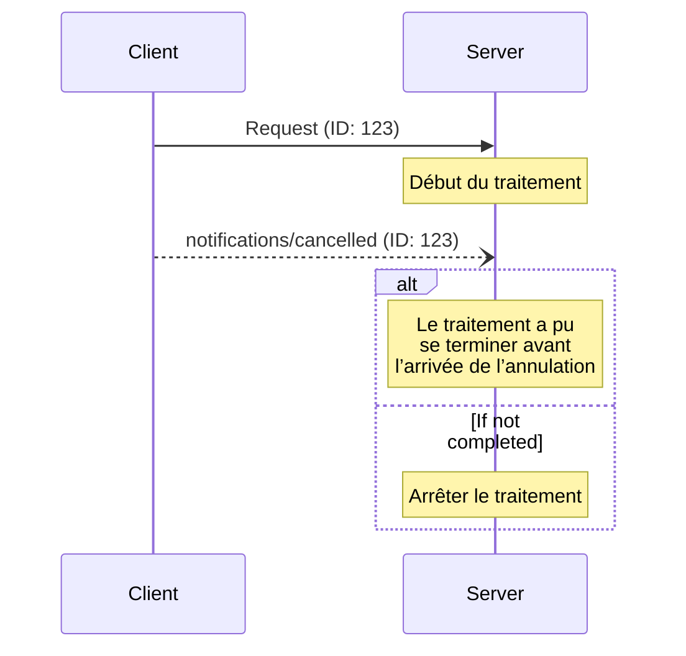

<Info>**Révision du protocole** : 2025-03-26</Info>

Le Protocole de contexte de modèle (MCP) prend en charge l’annulation facultative des requêtes en cours
au moyen de messages de notification. Chaque partie peut envoyer une notification d’annulation pour
indiquer qu’une requête précédemment envoyée doit être interrompue.

<div id="cancellation-flow">
  ## Flux d’annulation
</div>

Lorsqu’une partie souhaite annuler une requête en cours, elle envoie une notification `notifications/cancelled`
contenant :

- L’ID de la requête à annuler
- Une chaîne de caractères facultative indiquant la raison, qui peut être consignée ou affichée

```json
{
  "jsonrpc": "2.0",
  "method": "notifications/cancelled",
  "params": {
    "requestId": "123",
    "reason": "Annulation demandée par l’utilisateur"
  }
}
```

<div id="behavior-requirements">
  ## Exigences de comportement
</div>

1. Les notifications d’annulation **DOIVENT** uniquement faire référence à des requêtes qui :
   - Ont déjà été émises dans la même direction
   - Sont réputées toujours en cours
2. La requête `initialize` **NE DOIT PAS** être annulée par les clients
3. Les destinataires des notifications d’annulation **DEVRAIENT** :
   - Cesser le traitement de la requête annulée
   - Libérer les ressources associées
   - Ne pas envoyer de réponse pour la requête annulée
4. Les destinataires **PEUVENT** ignorer les notifications d’annulation si :
   - La requête visée est inconnue
   - Le traitement est déjà terminé
   - La requête ne peut pas être annulée
5. L’expéditeur de la notification d’annulation **DEVRAIT** ignorer toute réponse à la
   requête qui arriverait par la suite

<div id="timing-considerations">
  ## Considérations de temporisation
</div>

En raison de la latence réseau, les notifications d’annulation peuvent arriver après la fin du traitement
de la requête et, possiblement, après qu’une réponse a déjà été envoyée.

Les deux parties DOIVENT gérer ces conditions de course de façon robuste :



<div id="implementation-notes">
  ## Notes de mise en œuvre
</div>

- Les deux parties **DEVRAIENT** consigner les raisons d’annulation à des fins de débogage
- Les interfaces utilisateur des applications **DEVRAIENT** indiquer lorsqu’une annulation est demandée

<div id="error-handling">
  ## Gestion des erreurs
</div>

Les notifications d’annulation invalides **DEVRAIENT** être ignorées :

- Identifiants de requête inconnus
- Requêtes déjà terminées
- Notifications malformées

Cela préserve la nature « envoyer et oublier » des notifications tout en tenant compte des conditions de concurrence dans les communications asynchrones.