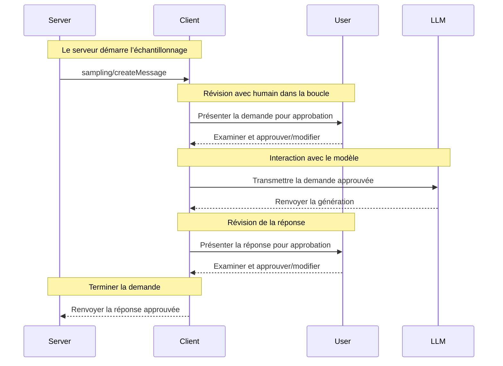

<Info>**Révision du protocole** : 2025-03-26</Info>

Le Model Context Protocol (MCP) propose une méthode normalisée permettant aux serveurs de demander l’échantillonnage LLM (« complétions » ou « générations ») à partir de modèles linguistiques via des clients. Ce flux permet aux clients de garder le contrôle sur l’accès aux modèles, leur sélection et les autorisations, tout en permettant aux serveurs de tirer parti des capacités d’IA — sans clés d’API côté serveur. Les serveurs peuvent demander des interactions textuelles, audio ou image, et inclure au besoin du contexte provenant de serveurs MCP dans leurs invites.

<div id="user-interaction-model">
  ## Modèle d’interaction utilisateur
</div>

L’échantillonnage dans le MCP permet aux serveurs de mettre en œuvre des comportements agentiques, en autorisant des appels LLM *imbriqués* à l’intérieur d’autres fonctionnalités du serveur MCP.

Les implémentations sont libres d’exposer l’échantillonnage par tout modèle d’interface qui leur convient — le protocole lui-même n’impose aucun modèle d’interaction utilisateur spécifique.

<Warning>
  Pour des raisons de confiance et de sécurité, il **FAUT** toujours qu’un humain soit dans la boucle, avec la capacité de refuser les demandes d’échantillonnage.

  Les applications **DOIVENT** :

  * Fournir une interface utilisateur qui rende l’examen des demandes d’échantillonnage simple et intuitif
  * Permettre aux utilisateurs d’afficher et de modifier les invites avant l’envoi
  * Présenter les réponses générées pour examen avant la livraison
</Warning>

<div id="capabilities">
  ## Capacités
</div>

Les clients qui prennent en charge l’échantillonnage **DOIVENT** déclarer la capacité `sampling` lors de
l’[initialisation](/fr-CA/specification/2025-03-26/basic/lifecycle#initialization) :

```json
{
  "capabilities": {
    "sampling": {}
  }
}
```

<div id="protocol-messages">
  ## Messages du protocole
</div>

<div id="creating-messages">
  ### Création de messages
</div>

Pour demander une génération par un modèle de langage, les serveurs envoient une requête `sampling/createMessage` :

**Requête :**

```json
{
  "jsonrpc": "2.0",
  "id": 1,
  "method": "sampling/createMessage",
  "params": {
    "messages": [
      {
        "role": "user",
        "content": {
          "type": "text",
          "text": "What is the capital of France?"
        }
      }
    ],
    "modelPreferences": {
      "hints": [
        {
          "name": "claude-3-sonnet"
        }
      ],
      "intelligencePriority": 0.8,
      "speedPriority": 0.5
    },
    "systemPrompt": "You are a helpful assistant.",
    "maxTokens": 100
  }
}
```

**Réponse :**

```json
{
  "jsonrpc": "2.0",
  "id": 1,
  "result": {
    "role": "assistant",
    "content": {
      "type": "text",
      "text": "The capital of France is Paris."
    },
    "model": "claude-3-sonnet-20240307",
    "stopReason": "endTurn"
  }
}
```

<div id="message-flow">
  ## Flux des messages
</div>



<div id="data-types">
  ## Types de données
</div>

<div id="messages">
  ### Messages
</div>

Les messages d’échantillonnage peuvent contenir :

<div id="text-content">
  #### Contenu textuel
</div>

```json
{
  "type": "text",
  "text": "Contenu du message"
}
```

<div id="image-content">
  #### Contenu de l’image
</div>

```json
{
  "type": "image",
  "data": "base64-encoded-image-data",
  "mimeType": "image/jpeg"
}
```

<div id="audio-content">
  #### Contenu audio
</div>

```json
{
  "type": "audio",
  "data": "base64-encoded-audio-data",
  "mimeType": "audio/wav"
}
```

<div id="model-preferences">
  ### Préférences de modèle
</div>

La sélection de modèles dans le MCP exige une abstraction soignée, car les serveurs et les clients peuvent utiliser
différents fournisseurs d’IA offrant des modèles distincts. Un serveur ne peut pas simplement demander un
modèle précis par son nom, car le client pourrait ne pas avoir accès à ce modèle exact ou préférer utiliser un modèle équivalent d’un autre fournisseur.

Pour résoudre ce problème, le MCP implémente un système de préférences qui combine des priorités de capacités abstraites
avec des indices de modèles facultatifs :

<div id="capability-priorities">
  #### Priorités de capacités
</div>

Les serveurs expriment leurs besoins au moyen de trois valeurs de priorité normalisées (0 à 1) :

* `costPriority` : Quelle est l’importance de minimiser les coûts? Des valeurs plus élevées favorisent des modèles moins coûteux.
* `speedPriority` : Quelle est l’importance d’une faible latence? Des valeurs plus élevées favorisent des modèles plus rapides.
* `intelligencePriority` : Quelle est l’importance des capacités avancées? Des valeurs plus élevées favorisent des
  modèles plus performants.

<div id="model-hints">
  #### Indications de modèle
</div>

Bien que les priorités aident à sélectionner des modèles selon leurs caractéristiques, les « hints » permettent aux serveurs de
suggérer des modèles ou des familles de modèles spécifiques :

* Les indications sont traitées comme des sous-chaînes pouvant correspondre de manière flexible aux noms de modèles
* Plusieurs indications sont évaluées selon l’ordre de préférence
* Les clients **PEUVENT** mapper les indications à des modèles équivalents provenant de différents fournisseurs
* Les indications sont consultatives — les clients effectuent la sélection finale du modèle

Par exemple :

```json
{
  "hints": [
    { "name": "claude-3-sonnet" }, // Privilégier les modèles de la classe Sonnet
    { "name": "claude" } // Repli sur n’importe quel modèle Claude
  ],
  "costPriority": 0.3, // Le coût est moins important
  "speedPriority": 0.8, // La vitesse est très importante
  "intelligencePriority": 0.5 // Besoins de capacité modérés
}
```

Le client traite ces préférences pour sélectionner un modèle approprié parmi les options disponibles. Par exemple, si le client n’a pas accès aux modèles Claude mais dispose de Gemini,
il pourrait mapper l’indication « sonnet » à `gemini-1.5-pro` en se basant sur des capacités similaires.

<div id="error-handling">
  ## Gestion des erreurs
</div>

Les clients **DEVRAIENT** renvoyer des erreurs pour les cas d’échec courants :

Exemple d’erreur :

```json
{
  "jsonrpc": "2.0",
  "id": 1,
  "error": {
    "code": -1,
    "message": "User rejected sampling request"
  }
}
```

<div id="security-considerations">
  ## Considérations de sécurité
</div>

1. Les clients **DEVRAIENT** mettre en place des contrôles d’approbation de l’utilisateur
2. Les deux parties **DEVRAIENT** valider le contenu des messages
3. Les clients **DEVRAIENT** respecter les indications de préférence du modèle
4. Les clients **DEVRAIENT** mettre en place une limitation du débit
5. Les deux parties **DOIVENT** traiter les données sensibles de manière appropriée