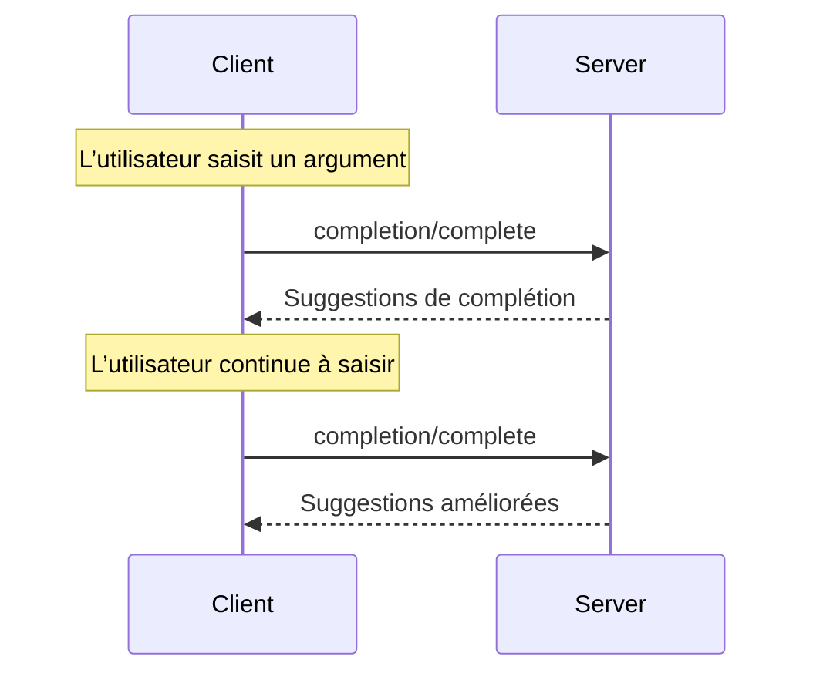

<Info>**Révision du protocole** : 2025-03-26</Info>

Le Protocole de contexte de modèle (MCP) offre une méthode normalisée permettant aux serveurs de proposer
des suggestions de saisie semi-automatique des arguments pour les invites et les URI de ressources. Cela permet
des expériences riches, de type IDE, où les utilisateurs reçoivent des suggestions contextuelles pendant la saisie
des valeurs d’arguments.

<div id="user-interaction-model">
  ## Modèle d’interaction utilisateur
</div>

La complétion dans le Protocole de contexte de modèle (MCP) est conçue pour offrir des expériences utilisateur interactives similaires à la complétion de code dans un IDE.

Par exemple, les applications peuvent afficher des suggestions de complétion dans un menu déroulant ou une fenêtre contextuelle au fur et à mesure que l’utilisateur tape, avec la possibilité de filtrer et de choisir parmi les options disponibles.

Cependant, les implémentations sont libres d’exposer la complétion par n’importe quel modèle d’interface qui répond à leurs besoins — le protocole en soi n’impose aucun modèle d’interaction utilisateur particulier.

<div id="capabilities">
  ## Capacités
</div>

Les serveurs qui prennent en charge les complétions **DOIVENT** déclarer la capacité `completions` :

```json
{
  "capabilities": {
    "completions": {}
  }
}
```

<div id="protocol-messages">
  ## Messages du protocole
</div>

<div id="requesting-completions">
  ### Demander des complétions
</div>

Pour obtenir des suggestions de complétion, les clients envoient une requête `completion/complete` indiquant
ce qui doit être complété au moyen d’un type de référence :

**Requête :**

```json
{
  "jsonrpc": "2.0",
  "id": 1,
  "method": "completion/complete",
  "params": {
    "ref": {
      "type": "ref/prompt",
      "name": "code_review"
    },
    "argument": {
      "name": "language",
      "value": "py"
    }
  }
}
```

**Réponse :**

```json
{
  "jsonrpc": "2.0",
  "id": 1,
  "result": {
    "completion": {
      "values": ["python", "pytorch", "pyside"],
      "total": 10,
      "hasMore": true
    }
  }
}
```

<div id="reference-types">
  ### Types de références
</div>

Le protocole prend en charge deux types de références de complétion :

| Type           | Description                         | Exemple                                             |
| -------------- | ----------------------------------- | --------------------------------------------------- |
| `ref/prompt`   | Fait référence à une invite par nom | `{"type": "ref/prompt", "name": "code_review"}`     |
| `ref/resource` | Fait référence à l’URI d’une ressource | `{"type": "ref/resource", "uri": "file:///{path}"}` |

<div id="completion-results">
  ### Résultats de complétion
</div>

Les serveurs renvoient un tableau de valeurs de complétion classées par pertinence, avec :

- Un maximum de 100 éléments par réponse
- Un nombre total facultatif de correspondances disponibles
- Un booléen indiquant si d’autres résultats sont disponibles

<div id="message-flow">
  ## Flux des messages
</div>



<div id="data-types">
  ## Types de données
</div>

<div id="completerequest">
  ### CompleteRequest
</div>

- `ref`: Une `PromptReference` ou une `ResourceReference`
- `argument`: Objet contenant :
  - `name`: Nom de l’argument
  - `value`: Valeur actuelle

<div id="completeresult">
  ### CompleteResult
</div>

- `completion`: Objet contenant :
  - `values`: Tableau de suggestions (max. 100)
  - `total`: Nombre total de correspondances (optionnel)
  - `hasMore`: Indicateur de résultats additionnels

<div id="error-handling">
  ## Gestion des erreurs
</div>

Les serveurs **DEVRAIENT** renvoyer des erreurs JSON-RPC standard pour les cas d’échec courants :

- Méthode introuvable : `-32601` (Fonctionnalité non prise en charge)
- Nom d’invite non valide : `-32602` (Paramètres non valides)
- Arguments requis manquants : `-32602` (Paramètres non valides)
- Erreurs internes : `-32603` (Erreur interne)

<div id="implementation-considerations">
  ## Considérations de mise en œuvre
</div>

1. Les serveurs **DEVRAIENT** :
   - Renvoyer des suggestions triées par pertinence
   - Implémenter une correspondance approximative, au besoin
   - Limiter le débit des requêtes de complétion
   - Valider toutes les entrées

2. Les clients **DEVRAIENT** :
   - Déclencher un anti-rebond (debounce) pour les requêtes de complétion rapides
   - Mettre en cache les résultats de complétion, au besoin
   - Gérer avec souplesse les résultats manquants ou partiels

<div id="security">
  ## Sécurité
</div>

Les implémentations DOIVENT :

- Valider toutes les entrées de complétion
- Mettre en œuvre une limitation de fréquence appropriée
- Contrôler l’accès aux suggestions sensibles
- Empêcher la divulgation d’informations liée aux complétions