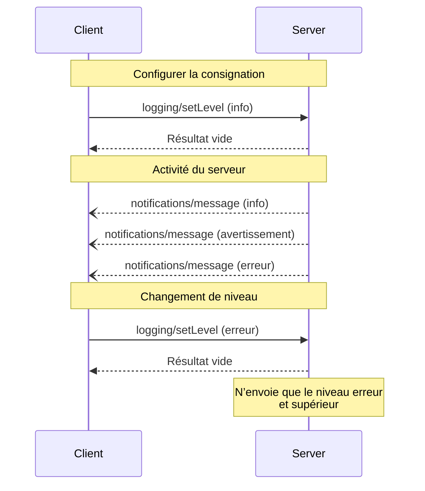

<Info>**Révision du protocole** : 2025-03-26</Info>

Le Protocole de contexte de modèle (MCP) fournit une façon standardisée pour les serveurs d’envoyer
des messages de journal structurés aux clients. Les clients peuvent contrôler la verbosité en définissant
des niveaux minimaux, tandis que les serveurs envoient des notifications indiquant le niveau de gravité,
un nom de journal facultatif et des données arbitraires sérialisables en JSON.

<div id="user-interaction-model">
  ## Modèle d’interaction utilisateur
</div>

Les implémentations sont libres d’exposer la journalisation par l’entremise de tout modèle d’interface qui répond à leurs besoins&mdash;le protocole en soi n’impose aucun modèle d’interaction utilisateur spécifique.

<div id="capabilities">
  ## Capacités
</div>

Les serveurs qui émettent des notifications de messages de journal **DOIVENT** déclarer la capacité `logging` :

```json
{
  "capabilities": {
    "logging": {}
  }
}
```

<div id="log-levels">
  ## Niveaux de journalisation
</div>

Le protocole suit les niveaux de gravité syslog standard définis dans
[RFC 5424](https://datatracker.ietf.org/doc/html/rfc5424#section-6.2.1) :

| Niveau    | Description                         | Exemple d’utilisation      |
| --------- | ----------------------------------- | -------------------------- |
| debug     | Informations détaillées de débogage | Points d’entrée/sortie de fonctions |
| info      | Messages d’information généraux     | Mises à jour de l’avancement d’une opération |
| notice    | Événements normaux mais importants  | Modifications de la configuration |
| warning   | Conditions d’avertissement          | Utilisation d’une fonctionnalité obsolète |
| error     | Conditions d’erreur                 | Échecs d’opération         |
| critical  | Conditions critiques                | Pannes de composants du système |
| alert     | Action requise immédiatement        | Corruption de données détectée |
| emergency | Système inutilisable                | Panne complète du système  |

<div id="protocol-messages">
  ## Messages du protocole
</div>

<div id="setting-log-level">
  ### Configurer le niveau de journalisation
</div>

Pour définir le niveau minimal de journalisation, les clients **PEUVENT** envoyer une requête `logging/setLevel` :

**Requête :**

```json
{
  "jsonrpc": "2.0",
  "id": 1,
  "method": "logging/setLevel",
  "params": {
    "level": "info"
  }
}
```

<div id="log-message-notifications">
  ### Notifications des messages de journal
</div>

Les serveurs envoient des messages de journal au moyen des notifications `notifications/message` :

```json
{
  "jsonrpc": "2.0",
  "method": "notifications/message",
  "params": {
    "level": "error",
    "logger": "database",
    "data": {
      "error": "Connection failed",
      "details": {
        "host": "localhost",
        "port": 5432
      }
    }
  }
}
```

<div id="message-flow">
  ## Flux des messages
</div>



<div id="error-handling">
  ## Gestion des erreurs
</div>

Les serveurs DOIVENT renvoyer des erreurs JSON-RPC standard pour les cas d’échec courants :

- Niveau de journalisation invalide : `-32602` (Paramètres invalides)
- Erreurs de configuration : `-32603` (Erreur interne)

<div id="implementation-considerations">
  ## Considérations d’implantation
</div>

1. Les serveurs **DEVRAIENT** :
   - Limiter la fréquence des messages de journalisation
   - Inclure le contexte pertinent dans le champ de données
   - Utiliser des noms de journalisation cohérents
   - Retirer les informations sensibles

2. Les clients **PEUVENT** :
   - Afficher les messages de journalisation dans l’interface utilisateur
   - Mettre en place le filtrage/la recherche des journaux
   - Représenter visuellement le niveau de sévérité
   - Conserver les messages de journalisation

<div id="security">
  ## Sécurité
</div>

1. Les messages de journalisation **NE DOIVENT PAS** contenir :
   - Identifiants ou secrets
   - Renseignements personnels identificatoires
   - Détails internes du système pouvant faciliter des attaques

2. Les implémentations **DEVRAIENT** :
   - Limiter le débit des messages
   - Valider tous les champs de données
   - Contrôler l’accès aux journaux
   - Surveiller la présence de contenu sensible