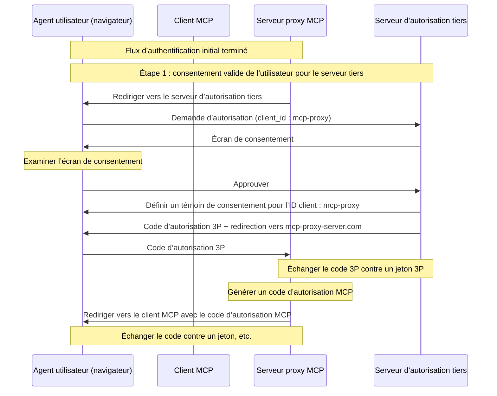
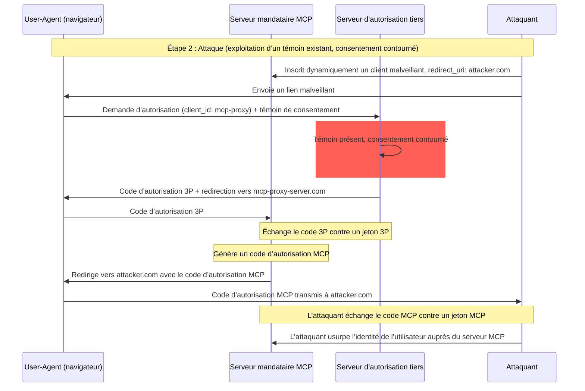
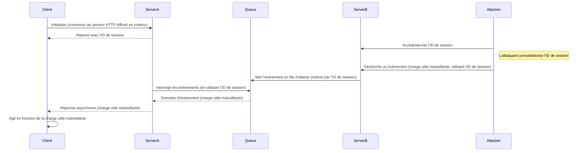
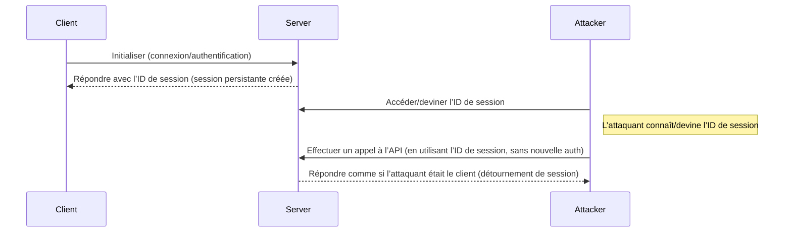

  ## Introduction

  ### Objectif et portée

Ce document présente des considérations de sécurité pour le Model Context Protocol (MCP), en complément de la spécification d’autorisation MCP. Il identifie les risques de sécurité, les vecteurs d’attaque et les pratiques exemplaires propres aux implémentations MCP.

Le principal public visé par ce document comprend les développeurs qui mettent en œuvre des flux d’autorisation MCP, les opérateurs de Serveur MCP et les professionnels de la sécurité qui évaluent des systèmes basés sur MCP. Ce document doit être lu conjointement avec la spécification d’autorisation MCP et les [meilleures pratiques de sécurité OAuth 2.0](https://datatracker.ietf.org/doc/html/rfc9700).

  ## Attaques et mesures d’atténuation

Cette section présente en détail les attaques visant les implémentations du MCP, ainsi que des contre-mesures potentielles.

  ### Problème du délégué confus

Des attaquants peuvent exploiter des serveurs MCP jouant le rôle de proxy pour d’autres serveurs de ressources, créant des vulnérabilités de type « [délégué confus](https://en.wikipedia.org/wiki/Confused_deputy_problem) ».

  #### Terminologie

**Serveur mandataire MCP**
: Un serveur MCP qui connecte des clients MCP à des API tierces, offrant des fonctionnalités MCP tout en déléguant certaines opérations et en agissant comme un client OAuth unique auprès du serveur d’API tiers.

**Serveur d’autorisation tiers**
: Serveur d’autorisation qui protège l’API tierce. Il peut ne pas prendre en charge l’enregistrement dynamique de client, obligeant le mandataire MCP à utiliser un identifiant client statique pour toutes les requêtes.

**API tierce**
: Le serveur de ressources protégé qui fournit les fonctionnalités réelles de l’API. L’accès à cette API nécessite des jetons émis par le serveur d’autorisation tiers.

**Identifiant client statique**
: Un identifiant de client OAuth 2.0 fixe utilisé par le serveur mandataire MCP lorsqu’il communique avec le serveur d’autorisation tiers. Cet identifiant client renvoie au serveur MCP agissant comme client de l’API tierce. C’est la même valeur pour toutes les interactions du serveur MCP avec l’API tierce, peu importe quel client MCP a initié la requête.

  #### Architecture et vecteurs d’attaque

  ##### Utilisation normale d’un proxy OAuth (préserve le consentement de l’utilisateur)

  ##### Utilisation malveillante d’un mandataire OAuth (contourne le consentement de l’utilisateur)

  #### Description de l’attaque

Lorsqu’un serveur mandataire MCP utilise un identifiant client statique pour s’authentifier auprès d’un serveur d’autorisation tiers qui ne prend pas en charge l’enregistrement dynamique de client, l’attaque suivante devient possible :

1. Un utilisateur s’authentifie normalement par l’entremise du serveur mandataire MCP pour accéder à l’API tierce
2. Durant ce processus, le serveur d’autorisation tiers place un témoin dans l’agent utilisateur indiquant le consentement pour l’identifiant client statique
3. Un attaquant envoie ensuite à l’utilisateur un lien malveillant contenant une requête d’autorisation conçue sur mesure, qui inclut un URI de redirection malveillant ainsi qu’un nouvel identifiant client enregistré dynamiquement
4. Lorsque l’utilisateur clique sur le lien, son navigateur détient toujours le témoin de consentement de la requête légitime précédente
5. Le serveur d’autorisation tiers détecte le témoin et saute l’écran de consentement
6. Le code d’autorisation MCP est redirigé vers le serveur de l’attaquant (spécifié dans le redirect_uri forgé lors de l’enregistrement dynamique du client)
7. L’attaquant échange le code d’autorisation volé contre des jetons d’accès pour le serveur MCP sans l’approbation explicite de l’utilisateur
8. L’attaquant a maintenant accès à l’API tierce en tant qu’utilisateur compromis

  #### Atténuation

Les serveurs mandataires MCP qui utilisent des identifiants de client statiques **DOIVENT** obtenir le consentement de l’utilisateur pour chaque client enregistré dynamiquement avant de l’acheminer vers des serveurs d’autorisation tiers (qui peuvent exiger un consentement supplémentaire).

  ### Transmission directe de jetons

La « transmission directe de jetons » est un anti-modèle dans lequel un Serveur MCP accepte des jetons d’un Client MCP sans vérifier que les jetons ont été correctement émis au Serveur MCP, puis les « transmet » à l’API en aval.

  #### Risques

Le passage direct de jetons est explicitement interdit dans la [spécification d’autorisation](/fr-CA/specification/2025-06-18/basic/authorization), car il présente plusieurs risques pour la sécurité, notamment :

* **Contournement des contrôles de sécurité**
  * Le Serveur MCP ou les API en aval peuvent mettre en place des contrôles de sécurité importants comme la limitation du débit, la validation des requêtes ou la surveillance du trafic, qui dépendent du public cible du jeton ou d’autres contraintes d’identification. Si les clients peuvent obtenir et utiliser des jetons directement avec les API en aval sans que le Serveur MCP les valide correctement ni s’assure que les jetons sont émis pour le bon service, ils contournent ces contrôles.
* **Problèmes d’imputabilité et de traçabilité**
  * Le Serveur MCP sera incapable d’identifier ou de distinguer les Clients MCP lorsque ceux-ci appellent avec un jeton d’accès émis en amont, qui peut être opaque pour le Serveur MCP.
  * Les journaux du Serveur de ressources en aval peuvent afficher des requêtes semblant provenir d’une source différente avec une autre identité, plutôt que du Serveur MCP qui transfère effectivement les jetons.
  * Ces deux facteurs compliquent les enquêtes d’incident, les contrôles et l’audit.
  * Si le Serveur MCP transmet des jetons sans valider leurs attributs (p. ex., rôles, privilèges ou public cible) ou autres métadonnées, un acteur malveillant en possession d’un jeton volé peut utiliser le serveur comme proxy pour exfiltrer des données.
* **Problèmes de frontière de confiance**
  * Le Serveur de ressources en aval accorde sa confiance à des entités spécifiques. Cette confiance peut inclure des hypothèses sur l’origine ou sur les schémas de comportement du client. Briser cette frontière de confiance pourrait entraîner des problèmes inattendus.
  * Si le jeton est accepté par plusieurs services sans validation adéquate, un attaquant qui compromet un service peut utiliser le jeton pour accéder à d’autres services connectés.
* **Risque de compatibilité future**
  * Même si un Serveur MCP commence aujourd’hui comme un « pur proxy », il pourrait devoir ajouter des contrôles de sécurité plus tard. Mettre en place dès le départ une séparation appropriée du public cible des jetons facilite l’évolution du modèle de sécurité.

  #### Atténuation

Les serveurs MCP **NE DOIVENT PAS** accepter de jetons qui n’ont pas été explicitement émis pour le serveur MCP.

  ### Détournement de session

Le détournement de session est un vecteur d’attaque dans lequel le serveur attribue un identifiant de session à un client, puis une personne non autorisée parvient à obtenir et à utiliser ce même identifiant pour se faire passer pour le client d’origine et effectuer des actions non autorisées en son nom.

  #### Injection d’invite par détournement de session

  #### Usurpation de session (usurpation d’identité)

  #### Description de l’attaque

Lorsque vous avez plusieurs serveurs HTTP avec état qui traitent des requêtes MCP, les vecteurs d’attaque suivants sont possibles :

**Injection d’invite par détournement de session**

1. Le client se connecte à **Server A** et reçoit un ID de session.

2. L’attaquant obtient un ID de session existant et envoie un événement malveillant à **Server B** avec ledit ID de session.
   * Lorsqu’un serveur prend en charge la [retransmission/les flux reprenables](/fr-CA/specification/2025-06-18/basic/transports#resumability-and-redelivery), interrompre délibérément la requête avant de recevoir la réponse peut amener celle-ci à être reprise par le client d’origine via la requête GET pour des événements envoyés par le serveur.
   * Si un serveur particulier initie des événements envoyés par le serveur à la suite d’un appel d’outil tel que `notifications/tools/list_changed`, où il est possible d’influencer les outils offerts par le serveur, un client pourrait se retrouver avec des outils dont il ne savait pas qu’ils étaient activés.

3. **Server B** met en file d’attente l’événement (associé à l’ID de session) dans une file partagée.

4. **Server A** interroge la file pour des événements à l’aide de l’ID de session et récupère la charge utile malveillante.

5. **Server A** envoie la charge utile malveillante au client comme réponse asynchrone ou reprise.

6. Le client reçoit et exécute la charge utile malveillante, ce qui peut entraîner une compromission.

**Usurpation par détournement de session**

1. Le client MCP s’authentifie auprès du serveur MCP, créant un ID de session persistant.
2. L’attaquant obtient l’ID de session.
3. L’attaquant effectue des appels au serveur MCP en utilisant l’ID de session.
4. Le serveur MCP ne vérifie pas d’autorisations supplémentaires et traite l’attaquant comme un utilisateur légitime, permettant un accès ou des actions non autorisés.

  #### Atténuation

Pour prévenir le détournement de session et les attaques d’injection d’événements, les mesures suivantes devraient être mises en œuvre :

Les serveurs MCP qui implémentent l’autorisation DOIVENT vérifier toutes les requêtes entrantes.
Les serveurs MCP NE DOIVENT PAS utiliser des sessions pour l’authentification.

Les serveurs MCP DOIVENT utiliser des identifiants de session sécurisés et non déterministes.
Les identifiants de session générés (p. ex., UUID) DEVRAIENT utiliser des générateurs de nombres aléatoires sécurisés. Évitez les identifiants de session prévisibles ou séquentiels qui pourraient être devinés par un attaquant. La rotation ou l’expiration des identifiants de session peut également réduire le risque.

Les serveurs MCP DEVRAIENT lier les identifiants de session à des informations propres à l’utilisateur.
Lors de l’entreposage ou de la transmission de données liées à la session (p. ex., dans une file d’attente), combinez l’identifiant de session avec des informations uniques à l’utilisateur autorisé, comme son identifiant interne d’utilisateur. Utilisez un format de clé comme `<user_id>:<session_id>`. Cela garantit que même si un attaquant devine un identifiant de session, il ne pourra pas se faire passer pour un autre utilisateur, puisque l’identifiant d’utilisateur est dérivé du jeton de l’utilisateur et n’est pas fourni par le client.

Les serveurs MCP peuvent, au besoin, tirer parti d’identifiants uniques supplémentaires.