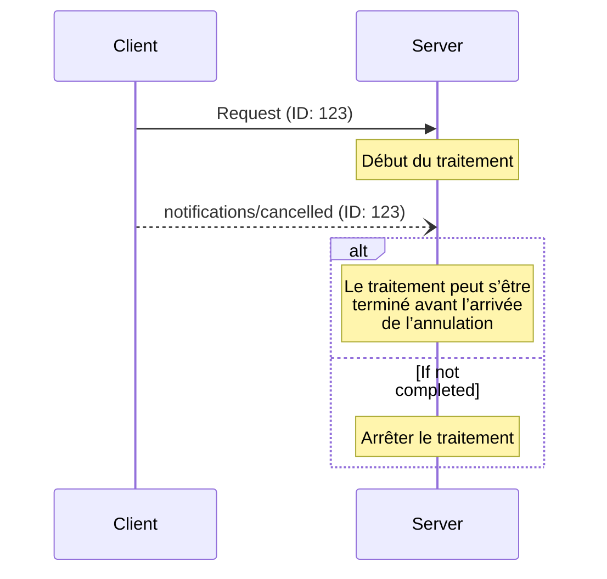

<div id="enable-section-numbers" />

<Info>**Révision du protocole** : 2025-06-18</Info>

Le Protocole de contexte de modèle (MCP) permet l’annulation facultative des requêtes en cours
au moyen de messages de notification. Chacun des deux côtés peut envoyer une notification d’annulation pour
indiquer qu’une requête précédemment émise doit être interrompue.

<div id="cancellation-flow">
  ## Flux d’annulation
</div>

Lorsqu’une partie souhaite annuler une requête en cours, elle envoie une notification `notifications/cancelled`
contenant :

- L’ID de la requête à annuler
- Une chaîne de caractères facultative pour la raison, qui peut être consignée ou affichée

```json
{
  "jsonrpc": "2.0",
  "method": "notifications/cancelled",
  "params": {
    "requestId": "123",
    "reason": "User requested cancellation"
  }
}
```

<div id="behavior-requirements">
  ## Exigences de comportement
</div>

1. Les avis d’annulation **DOIVENT** uniquement faire référence à des requêtes qui :
   - Ont été émises précédemment dans la même direction
   - Sont présumées encore en cours
2. La requête `initialize` **NE DOIT PAS** être annulée par les clients
3. Les destinataires des avis d’annulation **DEVRAIENT** :
   - Arrêter le traitement de la requête annulée
   - Libérer les ressources associées
   - Ne pas envoyer de réponse pour la requête annulée
4. Les destinataires **PEUVENT** ignorer les avis d’annulation si :
   - La requête référencée est inconnue
   - Le traitement est déjà terminé
   - La requête ne peut pas être annulée
5. L’expéditeur de l’avis d’annulation **DEVRAIT** ignorer toute réponse à la
   requête qui arrive ensuite

<div id="timing-considerations">
  ## Considérations de minutage
</div>

En raison de la latence réseau, il est possible que les notifications d’annulation arrivent après la fin du traitement
de la requête, et potentiellement après l’envoi d’une réponse.

Les deux parties **DOIVENT** gérer ces conditions de course de manière robuste :



<div id="implementation-notes">
  ## Notes d’implémentation
</div>

- Les deux parties **DEVRAIENT** consigner les motifs d’annulation à des fins de débogage
- Les interfaces utilisateur des applications **DEVRAIENT** indiquer lorsqu’une annulation est demandée

<div id="error-handling">
  ## Gestion des erreurs
</div>

Les notifications d’annulation invalides **DEVRAIENT** être ignorées :

- Identifiants de requête inconnus
- Requêtes déjà terminées
- Notifications mal formées

Cela préserve la nature « lancer et oublier » des notifications tout en permettant les conditions de course dans une communication asynchrone.