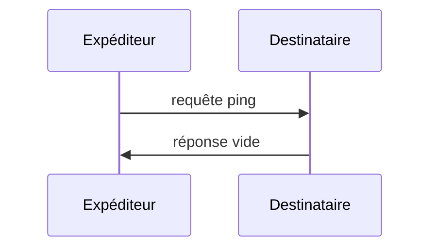

<div id="enable-section-numbers" />

<Info>**Révision du protocole** : 2025-06-18</Info>

Le Protocole de contexte de modèle (MCP) comprend un mécanisme de ping optionnel qui permet à l’une ou l’autre des parties de vérifier que son homologue est toujours réactif et que la connexion est active.

<div id="overview">
  ## Aperçu
</div>

La fonctionnalité de ping est implémentée selon un simple modèle requête-réponse. Le client comme le serveur peut initier un ping en envoyant une requête `ping`.

<div id="message-format">
  ## Format du message
</div>

Une requête ping est une requête JSON-RPC standard sans paramètres :

```json
{
  "jsonrpc": "2.0",
  "id": "123",
  "method": "ping"
}
```

<div id="behavior-requirements">
  ## Exigences de comportement
</div>

1. Le récepteur DOIT répondre rapidement par une réponse vide :

```json
{
  "jsonrpc": "2.0",
  "id": "123",
  "result": {}
}
```

2. Si aucune réponse n’est reçue dans un délai raisonnable, l’expéditeur PEUT :
   - Considérer que la connexion est expirée
   - Mettre fin à la connexion
   - Tenter une reconnexion

<div id="usage-patterns">
  ## Modèles d’utilisation
</div>



<div id="implementation-considerations">
  ## Considérations de mise en œuvre
</div>

- Les implémentations **DEVRAIENT** envoyer périodiquement des pings pour vérifier l’état de la connexion
- La fréquence des pings **DEVRAIT** être configurable
- Les délais d’attente **DEVRAIENT** être adaptés à l’environnement réseau
- Il faut éviter les pings excessifs afin de réduire la surcharge du réseau

<div id="error-handling">
  ## Gestion des erreurs
</div>

- Les délais d’attente **DEVRAIENT** être traités comme des échecs de connexion
- Plusieurs échecs de ping **PEUVENT** entraîner une réinitialisation de la connexion
- Les implémentations **DEVRAIENT** consigner les échecs de ping à des fins de diagnostic