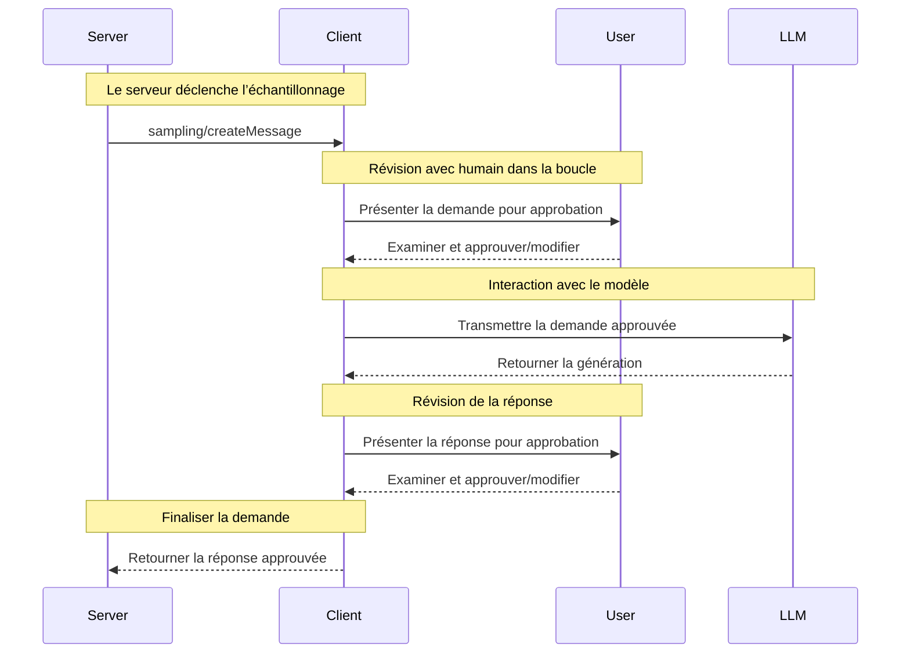

<div id="enable-section-numbers" />

<Info>**Révision du protocole** : 2025-06-18</Info>

Le Model Context Protocol (MCP) fournit un moyen standardisé permettant aux serveurs de demander l’échantillonnage des LLM (« complétions » ou « générations ») auprès de modèles linguistiques via des clients. Ce flux permet aux clients de garder le contrôle de l’accès aux modèles, de leur sélection et des autorisations, tout en permettant aux serveurs de tirer parti des capacités d’IA, sans nécessiter de clés d’API côté serveur. Les serveurs peuvent demander des interactions textuelles, audio ou image, et, au besoin, inclure du contexte provenant de serveurs MCP dans leurs invites.

<div id="user-interaction-model">
  ## Modèle d’interaction avec l’utilisateur
</div>

L’échantillonnage dans le MCP permet aux serveurs de mettre en œuvre des comportements d’agent, en autorisant des appels LLM *imbriqués* dans d’autres fonctionnalités du Serveur MCP.

Les implémentations sont libres d’exposer l’échantillonnage via tout modèle d’interface qui leur convient — le protocole lui-même n’impose aucun modèle d’interaction avec l’utilisateur.

<Warning>
  Pour des raisons de confiance, de sûreté et de sécurité, il **FAUT** toujours
  qu’un humain soit dans la boucle et ait la capacité de refuser les demandes d’échantillonnage.

  Les applications **DEVRAIENT** :

  * Fournir une interface utilisateur qui rende facile et intuitive l’examen des demandes d’échantillonnage
  * Permettre aux utilisateurs de voir et de modifier les Invités avant l’envoi
  * Présenter les réponses générées pour examen avant la livraison
</Warning>

<div id="capabilities">
  ## Capacités
</div>

Les clients qui prennent en charge l’échantillonnage **DOIVENT** déclarer la capacité `sampling` lors de
[l’initialisation](/fr-CA/specification/2025-06-18/basic/lifecycle#initialization) :

```json
{
  "capabilities": {
    "sampling": {}
  }
}
```

<div id="protocol-messages">
  ## Messages du protocole
</div>

<div id="creating-messages">
  ### Création de messages
</div>

Pour demander une génération par un modèle de langage, les serveurs envoient une requête `sampling/createMessage` :

**Requête :**

```json
{
  "jsonrpc": "2.0",
  "id": 1,
  "method": "sampling/createMessage",
  "params": {
    "messages": [
      {
        "role": "user",
        "content": {
          "type": "text",
          "text": "What is the capital of France?"
        }
      }
    ],
    "modelPreferences": {
      "hints": [
        {
          "name": "claude-3-sonnet"
        }
      ],
      "intelligencePriority": 0.8,
      "speedPriority": 0.5
    },
    "systemPrompt": "You are a helpful assistant.",
    "maxTokens": 100
  }
}
```

**Réponse :**

```json
{
  "jsonrpc": "2.0",
  "id": 1,
  "result": {
    "role": "assistant",
    "content": {
      "type": "text",
      "text": "The capital of France is Paris."
    },
    "model": "claude-3-sonnet-20240307",
    "stopReason": "endTurn"
  }
}
```

<div id="message-flow">
  ## Flux des messages
</div>



<div id="data-types">
  ## Types de données
</div>

<div id="messages">
  ### Messages
</div>

Les messages d’échantillonnage peuvent inclure :

<div id="text-content">
  #### Contenu textuel
</div>

```json
{
  "type": "text",
  "text": "Contenu du message"
}
```

<div id="image-content">
  #### Contenu de l’image
</div>

```json
{
  "type": "image",
  "data": "base64-encoded-image-data",
  "mimeType": "image/jpeg"
}
```

<div id="audio-content">
  #### Contenu audio
</div>

```json
{
  "type": "audio",
  "data": "base64-encoded-audio-data",
  "mimeType": "audio/wav"
}
```

<div id="model-preferences">
  ### Préférences de modèles
</div>

La sélection de modèles dans le MCP nécessite une abstraction soignée, puisque les serveurs et les clients peuvent utiliser
différents fournisseurs d’IA avec des offres de modèles distinctes. Un serveur ne peut pas simplement demander un
modèle précis par son nom, car le client pourrait ne pas avoir accès à ce modèle exact ou préférer utiliser un modèle équivalent d’un autre fournisseur.

Pour résoudre ce problème, le MCP met en place un système de préférences qui combine des priorités de capacités abstraites
avec des suggestions de modèles facultatives :

<div id="capability-priorities">
  #### Priorités de capacités
</div>

Les serveurs expriment leurs besoins au moyen de trois valeurs de priorité normalisées (0 à 1) :

* `costPriority`: Quelle est l’importance de réduire les coûts? Des valeurs plus élevées privilégient les modèles moins coûteux.
* `speedPriority`: Quelle est l’importance d’une faible latence? Des valeurs plus élevées privilégient les modèles plus rapides.
* `intelligencePriority`: Quelle est l’importance des capacités avancées? Des valeurs plus élevées privilégient
  des modèles plus performants.

<div id="model-hints">
  #### Indications de modèle
</div>

Alors que les priorités aident à choisir des modèles en fonction de leurs caractéristiques, les `hints` permettent aux serveurs de
suggérer des modèles précis ou des familles de modèles :

* Les indications sont traitées comme des sous-chaînes pouvant correspondre de façon flexible aux noms de modèles
* Plusieurs indications sont évaluées selon l’ordre de préférence
* Les clients **PEUVENT** associer les indications à des modèles équivalents provenant de différents fournisseurs
* Les indications sont à titre informatif—les clients effectuent la sélection finale du modèle

Par exemple :

```json
{
  "hints": [
    { "name": "claude-3-sonnet" }, // Privilégier les modèles de la classe Sonnet
    { "name": "claude" } // Se rabattre sur n'importe quel modèle Claude
  ],
  "costPriority": 0.3, // Le coût est moins important
  "speedPriority": 0.8, // La vitesse est très importante
  "intelligencePriority": 0.5 // Capacités requises modérées
}
```

Le client traite ces préférences pour sélectionner un modèle approprié parmi les options disponibles.
Par exemple, si le client n’a pas accès aux modèles Claude mais dispose de Gemini,
il pourrait associer l’indication sonnet à `gemini-1.5-pro` en raison de capacités similaires.

<div id="error-handling">
  ## Gestion des erreurs
</div>

Les clients **DEVRAIENT** renvoyer des erreurs pour les cas d’échec courants :

Exemple d’erreur :

```json
{
  "jsonrpc": "2.0",
  "id": 1,
  "error": {
    "code": -1,
    "message": "User rejected sampling request"
  }
}
```

<div id="security-considerations">
  ## Considérations de sécurité
</div>

1. Les clients **DEVRAIENT** mettre en place des contrôles d’approbation par l’utilisateur
2. Les deux parties **DEVRAIENT** valider le contenu des messages
3. Les clients **DEVRAIENT** respecter les indications de préférence du modèle
4. Les clients **DEVRAIENT** mettre en place une limitation du débit
5. Les deux parties **DOIVENT** traiter les données sensibles de manière appropriée