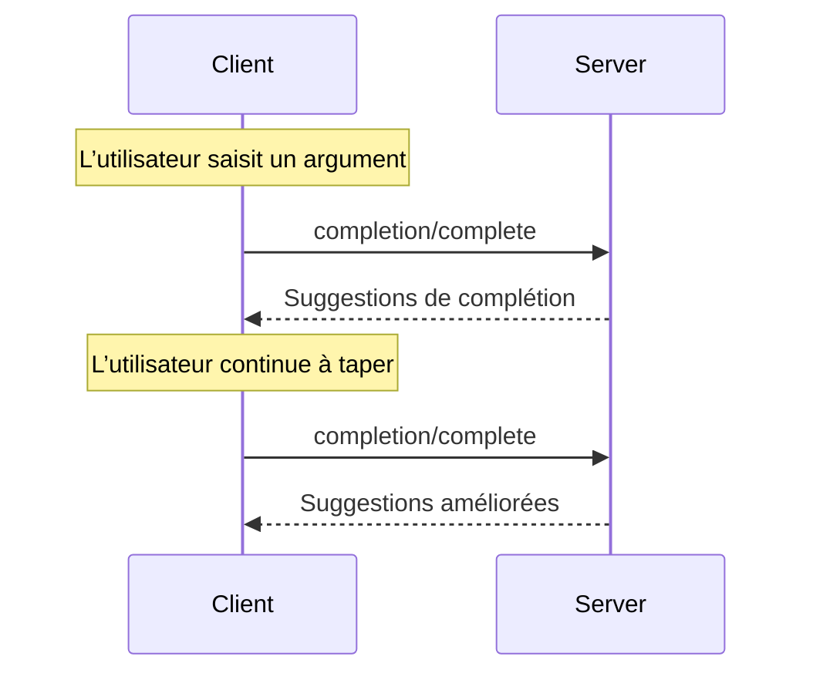

<div id="enable-section-numbers" />

<Info>**Révision du protocole** : 2025-06-18</Info>

Le Protocole de contexte de modèle (MCP) offre une méthode normalisée pour que les serveurs proposent
des suggestions de saisie semi-automatique des arguments pour les Invites et les URI de Ressources. Cela permet des expériences
riches, de type IDE, où les utilisateurs reçoivent des suggestions contextuelles lors de la saisie des valeurs
d’arguments.

<div id="user-interaction-model">
  ## Modèle d’interaction avec l’utilisateur
</div>

La complétion dans le MCP est conçue pour prendre en charge des expériences utilisateur interactives semblables à la complétion de code dans un IDE.

Par exemple, les applications peuvent afficher des suggestions de complétion dans un menu déroulant ou une fenêtre contextuelle à mesure que les utilisateurs saisissent du texte, avec la possibilité de filtrer et de sélectionner parmi les options disponibles.

Cependant, les implémentations sont libres d’exposer la complétion par n’importe quel modèle d’interface qui répond à leurs besoins&mdash;le protocole lui-même n’impose aucun modèle d’interaction avec l’utilisateur spécifique.

<div id="capabilities">
  ## Capacités
</div>

Les serveurs qui prennent en charge les complétions DOIVENT déclarer la capacité « completions » :

```json
{
  "capabilities": {
    "completions": {}
  }
}
```

<div id="protocol-messages">
  ## Messages du protocole
</div>

<div id="requesting-completions">
  ### Demander des complétions
</div>

Pour obtenir des suggestions de complétion, les clients envoient une requête `completion/complete` précisant
ce qui doit être complété au moyen d’un type de référence :

**Requête :**

```json
{
  "jsonrpc": "2.0",
  "id": 1,
  "method": "completion/complete",
  "params": {
    "ref": {
      "type": "ref/prompt",
      "name": "code_review"
    },
    "argument": {
      "name": "language",
      "value": "py"
    }
  }
}
```

**Réponse :**

```json
{
  "jsonrpc": "2.0",
  "id": 1,
  "result": {
    "completion": {
      "values": ["python", "pytorch", "pyside"],
      "total": 10,
      "hasMore": true
    }
  }
}
```

Pour les invites ou les modèles d’URI avec plusieurs arguments, les clients doivent inclure les complétions précédentes dans l’objet `context.arguments` afin de fournir du contexte pour les requêtes suivantes.

**Requête :**

```json
{
  "jsonrpc": "2.0",
  "id": 1,
  "method": "completion/complete",
  "params": {
    "ref": {
      "type": "ref/prompt",
      "name": "code_review"
    },
    "argument": {
      "name": "framework",
      "value": "fla"
    },
    "context": {
      "arguments": {
        "language": "python"
      }
    }
  }
}
```

**Réponse :**

```json
{
  "jsonrpc": "2.0",
  "id": 1,
  "result": {
    "completion": {
      "values": ["flask"],
      "total": 1,
      "hasMore": false
    }
  }
}
```

<div id="reference-types">
  ### Types de références
</div>

Le protocole prend en charge deux types de références de complétion :

| Type           | Description                      | Exemple                                             |
| -------------- | -------------------------------- | --------------------------------------------------- |
| `ref/prompt`   | Fait référence à une invite par nom | `{"type": "ref/prompt", "name": "code_review"}`     |
| `ref/resource` | Fait référence à l’URI d’une ressource | `{"type": "ref/resource", "uri": "file:///{path}"}` |

<div id="completion-results">
  ### Résultats de complétion
</div>

Les serveurs renvoient un tableau de valeurs de complétion classées par pertinence, avec :

- Un maximum de 100 éléments par réponse
- Le nombre total de correspondances disponibles (facultatif)
- Un booléen indiquant si d’autres résultats sont disponibles

<div id="message-flow">
  ## Flux des messages
</div>



<div id="data-types">
  ## Types de données
</div>

<div id="completerequest">
  ### CompleteRequest
</div>

- `ref`: Un `PromptReference` ou `ResourceReference`
- `argument`: Objet contenant :
  - `name`: Nom de l’argument
  - `value`: Valeur actuelle
- `context`: Objet contenant :
  - `arguments`: Un mapping des noms d’arguments déjà résolus vers leurs valeurs.

<div id="completeresult">
  ### CompleteResult
</div>

- `completion`: Objet contenant :
  - `values`: Tableau de suggestions (max : 100)
  - `total`: Nombre total facultatif de correspondances
  - `hasMore`: Indicateur de résultats supplémentaires

<div id="error-handling">
  ## Gestion des erreurs
</div>

Les serveurs DEVRAIENT renvoyer des erreurs JSON-RPC standard pour les échecs courants :

- Méthode introuvable : `-32601` (Fonctionnalité non prise en charge)
- Nom d’invite invalide : `-32602` (Paramètres invalides)
- Arguments requis manquants : `-32602` (Paramètres invalides)
- Erreurs internes : `-32603` (Erreur interne)

<div id="implementation-considerations">
  ## Considérations d’implémentation
</div>

1. Les serveurs **DEVRAIENT** :
   - Renvoyer des suggestions classées par pertinence
   - Implémenter une correspondance floue lorsque pertinent
   - Limiter le débit des requêtes de complétion
   - Valider toutes les entrées

2. Les clients **DEVRAIENT** :
   - Éliminer les rebonds pour les requêtes de complétion rapides (debounce)
   - Mettre en cache les résultats de complétion lorsque pertinent
   - Gérer avec souplesse les résultats manquants ou partiels

<div id="security">
  ## Sécurité
</div>

Les implémentations DOIVENT :

- Valider toutes les entrées de complétion
- Mettre en place une limitation de débit appropriée
- Contrôler l’accès aux suggestions sensibles
- Empêcher les fuites d’informations liées aux complétions