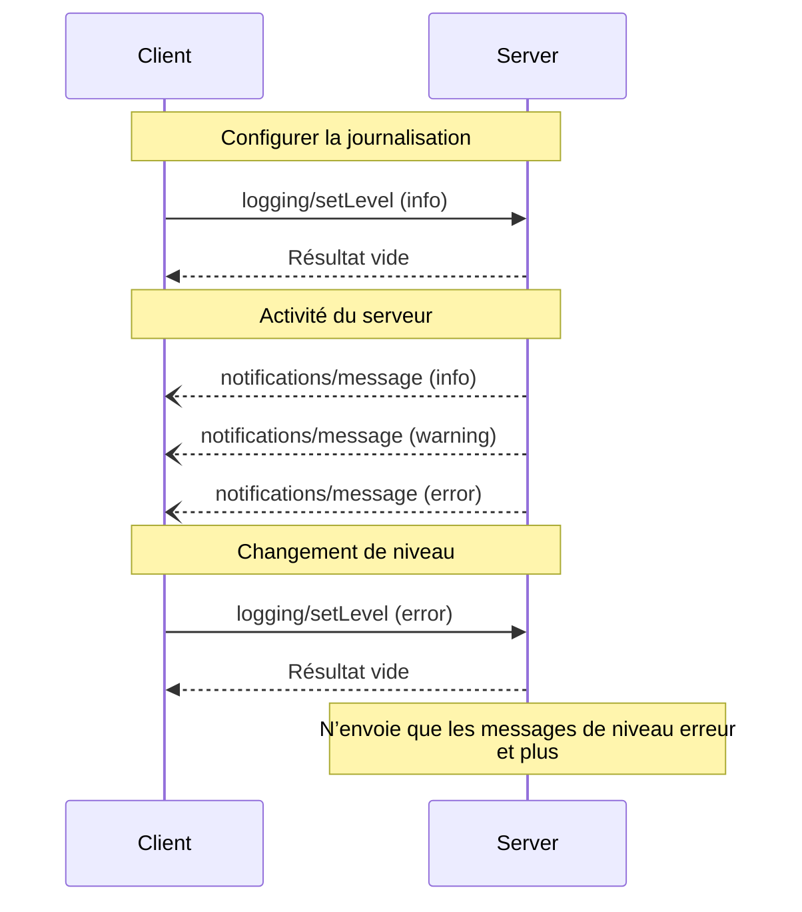

<div id="enable-section-numbers" />

<Info>**Révision du protocole** : 2025-06-18</Info>

Le Protocole de contexte de modèle (MCP) offre une méthode normalisée permettant aux serveurs d’envoyer des messages de journal structurés aux clients. Les clients peuvent ajuster le niveau de détail de la journalisation en définissant des seuils minimaux, tandis que les serveurs envoient des notifications indiquant le niveau de gravité, un nom de journal facultatif et des données arbitraires sérialisables en JSON.

<div id="user-interaction-model">
  ## Modèle d’interaction avec l’utilisateur
</div>

Les implémentations peuvent exposer la journalisation par n’importe quel type d’interface qui répond à leurs besoins — le protocole en soi n’impose aucun modèle d’interaction avec l’utilisateur.

<div id="capabilities">
  ## Capacités
</div>

Les serveurs qui émettent des notifications de messages de journal **DOIVENT** déclarer la capacité `logging` :

```json
{
  "capabilities": {
    "logging": {}
  }
}
```

<div id="log-levels">
  ## Niveaux de journalisation
</div>

Le protocole suit les niveaux de gravité syslog standard spécifiés dans
[RFC 5424](https://datatracker.ietf.org/doc/html/rfc5424#section-6.2.1) :

| Niveau    | Description                          | Exemple d’utilisation             |
| --------- | ------------------------------------ | --------------------------------- |
| debug     | Informations détaillées de débogage  | Points d’entrée/sortie de fonctions |
| info      | Messages d’information généraux      | Mises à jour de l’avancement des opérations |
| notice    | Événements normaux mais significatifs | Modifications de configuration    |
| warning   | Conditions d’avertissement           | Utilisation d’une fonctionnalité obsolète |
| error     | Conditions d’erreur                  | Échecs d’opération                |
| critical  | Conditions critiques                 | Pannes de composants du système   |
| alert     | Action requise immédiatement         | Corruption de données détectée    |
| emergency | Système inutilisable                 | Panne totale du système           |

<div id="protocol-messages">
  ## Messages du protocole
</div>

<div id="setting-log-level">
  ### Configuration du niveau de journalisation
</div>

Pour définir le niveau minimal de journalisation, les clients PEUVENT envoyer une requête `logging/setLevel` :

**Requête :**

```json
{
  "jsonrpc": "2.0",
  "id": 1,
  "method": "logging/setLevel",
  "params": {
    "level": "info"
  }
}
```

<div id="log-message-notifications">
  ### Notifications de messages de journalisation
</div>

Les serveurs envoient des messages de journalisation au moyen des notifications `notifications/message` :

```json
{
  "jsonrpc": "2.0",
  "method": "notifications/message",
  "params": {
    "level": "error",
    "logger": "database",
    "data": {
      "error": "Connection failed",
      "details": {
        "host": "localhost",
        "port": 5432
      }
    }
  }
}
```

<div id="message-flow">
  ## Flux de messages
</div>



<div id="error-handling">
  ## Gestion des erreurs
</div>

Les serveurs **DEVRAIENT** renvoyer des erreurs JSON-RPC standard pour les cas d’échec courants :

- Niveau de journalisation non valide : `-32602` (Paramètres non valides)
- Erreurs de configuration : `-32603` (Erreur interne)

<div id="implementation-considerations">
  ## Considérations de mise en œuvre
</div>

1. Les serveurs **DEVRAIENT** :
   - Limiter le débit des messages de journal
   - Inclure le contexte pertinent dans le champ de données
   - Utiliser des noms de journalisation cohérents
   - Supprimer les informations sensibles

2. Les clients **PEUVENT** :
   - Afficher les messages de journal dans l’interface utilisateur
   - Mettre en place le filtrage et la recherche des journaux
   - Représenter visuellement le niveau de gravité
   - Conserver les messages de journal

<div id="security">
  ## Sécurité
</div>

1. Les messages de journalisation **NE DOIVENT PAS** contenir :
   - Des identifiants ou des secrets
   - Des renseignements personnels identifiables
   - Des détails internes du système pouvant faciliter des attaques

2. Les implémentations **DEVRAIENT** :
   - Limiter le débit des messages
   - Valider tous les champs de données
   - Contrôler l’accès aux journaux
   - Surveiller la présence de contenu sensible