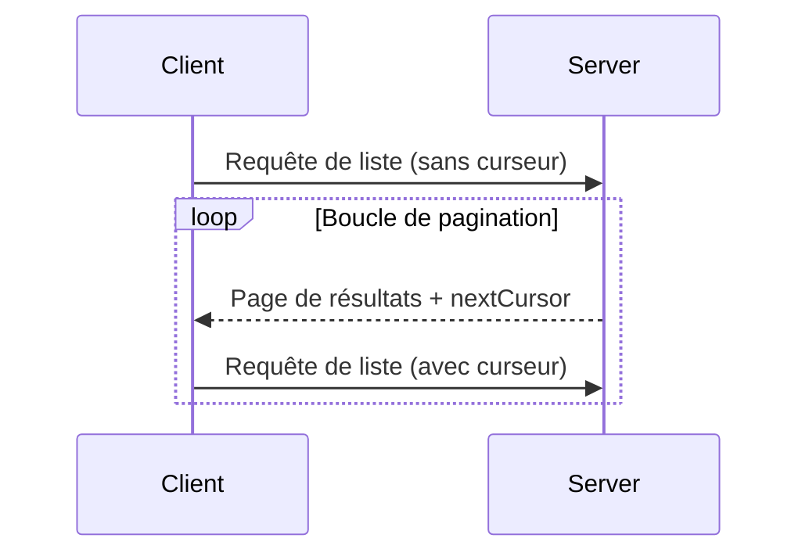

<div id="enable-section-numbers" />

<Info>**Révision du protocole** : 2025-06-18</Info>

Le Protocole de contexte de modèle (MCP) prend en charge la pagination des opérations de liste qui peuvent renvoyer de grands ensembles de résultats. La pagination permet aux serveurs de livrer les résultats en plus petits blocs plutôt que tous d’un coup.

La pagination est particulièrement importante lors de la connexion à des services externes sur Internet, mais elle est aussi utile pour les intégrations locales afin d’éviter des problèmes de performance avec de grands ensembles de données.

<div id="pagination-model">
  ## Modèle de pagination
</div>

La pagination dans le MCP utilise une approche opaque basée sur un curseur, plutôt que sur des pages numérotées.

- Le **curseur** est un jeton de chaîne opaque qui représente une position dans l’ensemble de résultats
- La **taille de page** est déterminée par le serveur, et les clients **NE DOIVENT PAS** présumer une taille de page fixe

<div id="response-format">
  ## Format de la réponse
</div>

La pagination commence lorsque le serveur envoie une **réponse** qui contient :

- La page courante des résultats
- Un champ facultatif `nextCursor` s’il reste d’autres résultats

```json
{
  "jsonrpc": "2.0",
  "id": "123",
  "result": {
    "resources": [...],
    "nextCursor": "eyJwYWdlIjogM30="
  }
}
```

<div id="request-format">
  ## Format de la requête
</div>

Après avoir reçu un curseur, le client peut _continuer_ la pagination en envoyant une requête
qui inclut ce curseur :

```json
{
  "jsonrpc": "2.0",
  "method": "resources/list",
  "params": {
    "cursor": "eyJwYWdlIjogMn0="
  }
}
```

<div id="pagination-flow">
  ## Flux de pagination
</div>



<div id="operations-supporting-pagination">
  ## Opérations compatibles avec la pagination
</div>

Les opérations MCP suivantes sont compatibles avec la pagination :

- `resources/list` - Lister les ressources disponibles
- `resources/templates/list` - Lister les modèles de ressources
- `prompts/list` - Lister les invites disponibles
- `tools/list` - Lister les outils disponibles

<div id="implementation-guidelines">
  ## Directives de mise en œuvre
</div>

1. Les serveurs **DEVRAIENT** :
   - Fournir des curseurs stables
   - Gérer correctement les curseurs invalides

2. Les clients **DEVRAIENT** :
   - Considérer l’absence de `nextCursor` comme la fin des résultats
   - Prendre en charge les parcours avec ou sans pagination

3. Les clients **DOIVENT** traiter les curseurs comme des jetons opaques :
   - Ne pas faire d’hypothèses sur le format des curseurs
   - Ne pas tenter de lire, d’interpréter ni de modifier les curseurs
   - Ne pas conserver les curseurs d’une session à l’autre

<div id="error-handling">
  ## Gestion des erreurs
</div>

Des curseurs invalides **DEVRAIENT** entraîner une erreur avec le code -32602 (paramètres invalides).