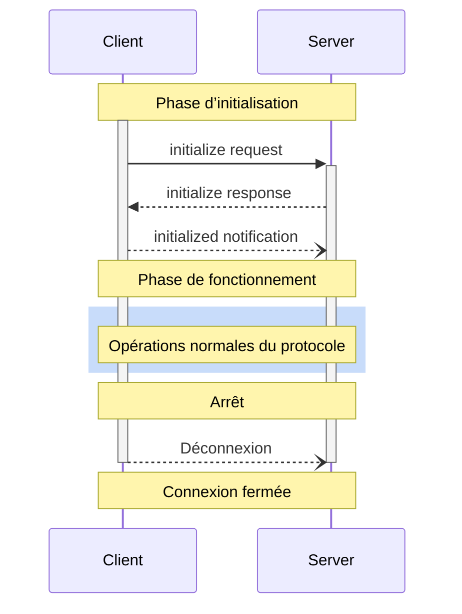

<div id="enable-section-numbers" />

<Info>**Révision du protocole** : ébauche</Info>

Le Protocole de contexte de modèle (MCP) définit un cycle de vie rigoureux pour les connexions client-serveur qui assure une négociation adéquate des capacités et une gestion appropriée de l’état.

1. **Initialisation** : Négociation des capacités et entente sur la version du protocole
2. **Fonctionnement** : Communication normale du protocole
3. **Arrêt** : Fin de connexion en douceur



<div id="lifecycle-phases">
  ## Phases du cycle de vie
</div>

<div id="initialization">
  ### Initialisation
</div>

La phase d’initialisation DOIT être la première interaction entre le client et le serveur.
Pendant cette phase, le client et le serveur :

* Établissent la compatibilité de version du protocole
* Échangent et négocient leurs capacités
* Partagent des détails d’implémentation

Le client DOIT amorcer cette phase en envoyant une requête `initialize` contenant :

* La version du protocole prise en charge
* Les capacités du client
* Les informations sur l’implémentation du client

```json
{
  "jsonrpc": "2.0",
  "id": 1,
  "method": "initialize",
  "params": {
    "protocolVersion": "2024-11-05",
    "capabilities": {
      "roots": {
        "listChanged": true
      },
      "sampling": {},
      "elicitation": {}
    },
    "clientInfo": {
      "name": "ExampleClient",
      "title": "Example Client Display Name",
      "version": "1.0.0",
      "icons": [
        {
          "src": "https://example.com/icon.png",
          "mimeType": "image/png",
          "sizes": "48x48"
        }
      ],
      "websiteUrl": "https://example.com"
    }
  }
}
```

Le serveur DOIT répondre avec ses propres capacités et informations :

```json
{
  "jsonrpc": "2.0",
  "id": 1,
  "result": {
    "protocolVersion": "2024-11-05",
    "capabilities": {
      "logging": {},
      "prompts": {
        "listChanged": true
      },
      "resources": {
        "subscribe": true,
        "listChanged": true
      },
      "tools": {
        "listChanged": true
      }
    },
    "serverInfo": {
      "name": "ExampleServer",
      "title": "Example Server Display Name",
      "version": "1.0.0",
      "icons": [
        {
          "src": "https://example.com/server-icon.svg",
          "mimeType": "image/svg+xml",
          "sizes": "any"
        }
      ],
      "websiteUrl": "https://example.com/server"
    },
    "instructions": "Instructions facultatives pour le client"
  }
}
```

Après une initialisation réussie, le client DOIT envoyer une notification `initialized`
pour indiquer qu’il est prêt à commencer les opérations normales :

```json
{
  "jsonrpc": "2.0",
  "method": "notifications/initialized"
}
```

* Le client NE DEVRAIT PAS envoyer d’autres requêtes que les
  [pings](/fr-CA/specification/draft/basic/utilities/ping) avant que le serveur ait répondu à la
  requête `initialize`.
* Le serveur NE DEVRAIT PAS envoyer d’autres requêtes que les
  [pings](/fr-CA/specification/draft/basic/utilities/ping) et la
  [journalisation](/fr-CA/specification/draft/server/utilities/logging) avant de recevoir la
  notification `initialized`.

<div id="version-negotiation">
  #### Négociation de version
</div>

Dans la requête `initialize`, le client DOIT envoyer une version du protocole qu’il prend en charge.
Il DEVRAIT s’agir de la version la plus récente prise en charge par le client.

Si le serveur prend en charge la version du protocole demandée, il DOIT répondre avec la même
version. Sinon, le serveur DOIT répondre avec une autre version du protocole qu’il
prend en charge. Il DEVRAIT s’agir de la version la plus récente prise en charge par le serveur.

Si le client ne prend pas en charge la version indiquée dans la réponse du serveur, il DEVRAIT
se déconnecter.

<Note>
  Si vous utilisez HTTP, le client DOIT inclure l’en-tête HTTP `MCP-Protocol-Version: <protocol-version>` dans toutes les requêtes subséquentes vers le serveur MCP.
  Pour plus de détails, consultez [la section En-tête de version du protocole dans Transports](/fr-CA/specification/draft/basic/transports#protocol-version-header).
</Note>

<div id="capability-negotiation">
  #### Négociation des capacités
</div>

Les capacités du client et du serveur déterminent quelles fonctionnalités optionnelles du protocole seront disponibles pendant la session.

Les principales capacités incluent :

| Catégorie | Capacité       | Description                                                                                 |
| --------- | -------------- | ------------------------------------------------------------------------------------------- |
| Client    | `roots`        | Capacité à fournir des [Racines](/fr-CA/specification/draft/client/roots) du système de fichiers  |
| Client    | `sampling`     | Prise en charge des requêtes d&#39;[Échantillonnage](/fr-CA/specification/draft/client/sampling) LLM  |
| Client    | `elicitation`  | Prise en charge des requêtes d&#39;[Élicitation](/fr-CA/specification/draft/client/elicitation) du serveur |
| Client    | `experimental` | Décrit la prise en charge de fonctionnalités expérimentales non standard                    |
| Serveur   | `prompts`      | Propose des [Invites](/fr-CA/specification/draft/server/prompts)                                  |
| Serveur   | `resources`    | Fournit des [Ressources](/fr-CA/specification/draft/server/resources) lisibles                   |
| Serveur   | `tools`        | Expose des [Outils](/fr-CA/specification/draft/server/tools) appelables                          |
| Serveur   | `logging`      | Émet des [messages structurés de journalisation](/fr-CA/specification/draft/server/utilities/logging) |
| Serveur   | `completions`  | Prend en charge la [saisie semi-automatique](/fr-CA/specification/draft/server/utilities/completion) des arguments |
| Serveur   | `experimental` | Décrit la prise en charge de fonctionnalités expérimentales non standard                    |

Les objets de capacité peuvent décrire des sous-capacités, comme :

* `listChanged`: Prise en charge des notifications de modification de liste (pour les Invites, les Ressources et les Outils)
* `subscribe`: Prise en charge de l’abonnement aux modifications d’éléments individuels (Ressources seulement)

<div id="operation">
  ### Opération
</div>

Pendant la phase d’opération, le client et le serveur échangent des messages en fonction des
capacités négociées.

Les deux parties DOIVENT :

* Respecter la version du protocole convenue
* N’utiliser que les capacités qui ont été négociées avec succès

<div id="shutdown">
  ### Arrêt
</div>

Pendant la phase d’arrêt, une des parties (habituellement le client) met fin proprement à la connexion au protocole. Aucun message d’arrêt spécifique n’est défini; on utilise plutôt le mécanisme de transport sous-jacent pour signaler la fin de la connexion :

<div id="stdio">
  #### stdio
</div>

Pour le [transport](/fr-CA/specification/draft/basic/transports) stdio, le client **DEVRAIT** amorcer
l’arrêt en :

1. Fermant d’abord le flux d’entrée vers le processus enfant (le serveur)
2. Attendant la fin du serveur, ou en envoyant `SIGTERM` si le serveur ne se termine pas
   dans un délai raisonnable
3. Envoyant `SIGKILL` si le serveur ne se termine pas dans un délai raisonnable après `SIGTERM`

Le serveur **PEUT** amorcer l’arrêt en fermant son flux de sortie vers le client et
en quittant.

<div id="http">
  #### HTTP
</div>

Pour les [transports](/fr-CA/specification/draft/basic/transports) HTTP, l’arrêt est signalé par la fermeture de la ou des connexions HTTP associées.

<div id="timeouts">
  ## Délai d’attente
</div>

Les implémentations DEVRAIENT établir des délais d’attente pour toutes les requêtes envoyées, afin d’éviter les connexions bloquées et l’épuisement des ressources. Lorsque la requête n’a pas reçu de réponse, qu’elle soit de succès ou d’erreur, dans le délai imparti, l’expéditeur DEVRAIT émettre une [notification d’annulation](/fr-CA/specification/draft/basic/utilities/cancellation) pour cette requête et cesser d’attendre une réponse.

Les SDK et autres intergiciels DEVRAIENT permettre de configurer ces délais d’attente au cas par cas.

Les implémentations PEUVENT choisir de réinitialiser le chronomètre du délai d’attente lorsqu’elles reçoivent une [notification de progression](/fr-CA/specification/draft/basic/utilities/progress) correspondant à la requête, car cela indique qu’un traitement est effectivement en cours. Cependant, les implémentations DEVRAIENT toujours appliquer un délai d’attente maximal, indépendamment des notifications de progression, afin de limiter l’impact d’un client ou d’un serveur défaillant.

<div id="error-handling">
  ## Gestion des erreurs
</div>

Les implémentations **DEVRAIENT** être prêtes à gérer les cas d’erreur suivants :

* Incompatibilité de la version du protocole
* Échec de la négociation des capacités requises
* [Expiration](#timeouts) de la requête

Exemple d’erreur lors de l’initialisation :

```json
{
  "jsonrpc": "2.0",
  "id": 1,
  "error": {
    "code": -32602,
    "message": "Unsupported protocol version",
    "data": {
      "supported": ["2024-11-05"],
      "requested": "1.0.0"
    }
  }
}
```